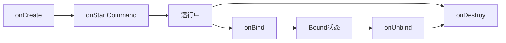

---
tags:
  - Android
  - service
  - 四大组件
---
Service 是 Android 四大组件之一，用于在后台执行长时间运行的操作，无需用户界面。它适用于不需要用户交互的操作，如播放音乐、下载文件、处理网络请求等。

**核心特点**：
- 无用户界面，可在后台独立运行
- 优先级高于普通后台进程
- 可与其他组件交互

**Service** 与线程的区别

| 特性         | Service       | Thread      |
| ---------- | ------------- | ----------- |
| **组件类型**   | Android 系统组件  | Java 并发机制   |
| **生命周期**   | 由系统管理         | 由开发者管理      |
| **优先级**    | 较高，不易被系统回收    | 较低，易被回收     |
| **跨进程通信**  | 支持（通过 Binder） | 不支持         |
| **系统资源管理** | 系统统一管理        | 需开发者手动管理    |
| **使用场景**   | 后台任务、跨进程通信    | 界面异步更新、耗时操作 |
#### 一、Service 类型

#### 1.1 Started Service

通过 `startService()` 启动，会一直运行直到调用 `stopSelf()` 或被系统停止。

**生命周期**：


**关键方法**：

```kotlin
class MyService : Service() {
    override fun onCreate() {
        // 服务创建时调用
    }
    
    override fun onStartCommand(intent: Intent?, flags: Int, startId: Int): Int {
        // 每次通过 startService() 启动时调用
        return START_STICKY // 定义服务被杀死后的行为
    }
    
    override fun onDestroy() {
        // 服务销毁时调用
    }
}
```

**启动模式返回值**：
- `START_STICKY`：服务被杀死后自动重建
- `START_NOT_STICKY`：服务被杀死后不会重建
- `START_REDELIVER_INTENT`：服务被杀死后重建并重发最后一个Intent

#### 1.2 Bound Service
通过 `bindService()` 启动，允许多个组件绑定到同一个服务。

**生命周期**：


**实现方式**：
```kotlin
class BoundService : Service() {
    private val binder = LocalBinder()

    inner class LocalBinder : Binder() {
        fun getService(): BoundService = this@BoundService
    }

    override fun onBind(intent: Intent?): IBinder {
        return binder
    }

    // 自定义服务方法
    fun calculate(a: Int, b: Int): Int {
        return a + b
    }
}
```

**客户端绑定**：
```kotlin
private val connection = object : ServiceConnection {
    override fun onServiceConnected(name: ComponentName?, service: IBinder?) {
        val binder = service as? BoundService.LocalBinder
        boundService = binder?.getService()
        isBound = true
    }

    override fun onServiceDisconnected(name: ComponentName?) {
        isBound = false
    }
}

// 绑定服务
val intent = Intent(this, BoundService::class.java)
bindService(intent, connection, Context.BIND_AUTO_CREATE)

// 解绑服务
unbindService(connection)
```

#### 1.3 Foreground Service

Android 8.0 (Oreo) 及以上版本要求长时间运行的服务必须设置为前台服务。

**实现步骤**：
1. 在 AndroidManifest.xml 添加权限：
   ```xml
   <uses-permission android:name="android.permission.FOREGROUND_SERVICE" />
   ```
   
2. 创建通知并启动前台服务：
   ```kotlin
   class MyForegroundService : Service() {
       override fun onCreate() {
           super.onCreate()
           startForeground()
       }
       
       private fun startForeground() {
           // 创建通知渠道（Android 8.0+）
           if (Build.VERSION.SDK_INT >= Build.VERSION_CODES.O) {
               val channel = NotificationChannel(
                   "channel_id", 
                   "Foreground Service", 
                   NotificationManager.IMPORTANCE_LOW
               )
               val manager = getSystemService(NotificationManager::class.java)
               manager.createNotificationChannel(channel)
           }
           
           // 创建通知
           val notification = NotificationCompat.Builder(this, "channel_id")
               .setContentTitle("服务运行中")
               .setContentText("正在执行后台任务...")
               .setSmallIcon(R.drawable.ic_notification)
               .build()
           
           // 启动前台服务
           startForeground(1, notification)
       }
   }
   ```

> **注**：从 Android 8.0（API 26）开始，前台 Service 必须通过 `startForegroundService()` 启动

#### 1.4 JobIntent Service 

IntentService 是 Service 的子类，用于异步处理请求

在 Android 8.0 后已过时，改为使用JobIntentService

```kotlin
// 使用 JobIntentService (兼容方案)
class MyJobIntentService : JobIntentService() {
    companion object {
        private const val JOB_ID = 1001

        fun enqueueWork(context: Context, work: Intent) {
            enqueueWork(context, MyJobIntentService::class.java, JOB_ID, work)
        }
    }

    override fun onHandleWork(intent: Intent) {
        // 执行后台任务
    }
}

// 启动服务
MyJobIntentService.enqueueWork(context, Intent())
```
### 二、Service 生命周期详解

**完整生命周期**



| 方法                 | 调用时机                  | 是否必须实现 | 可否执行耗时操作 |
| ------------------ | --------------------- | ------ | -------- |
| `onCreate()`       | 服务首次创建时调用             | 可选     | 否        |
| `onStartCommand()` | 每次通过startService()启动时 | 必须     | 是（需开线程）  |
| `onBind()`         | 通过bindService()绑定时    | 必须     | 否        |
| `onUnbind()`       | 所有客户端解绑时              | 可选     | 否        |
| `onRebind()`       | 客户端重新绑定时              | 可选     | 否        |
| `onDestroy()`      | 服务销毁前                 | 可选     | 否        |

