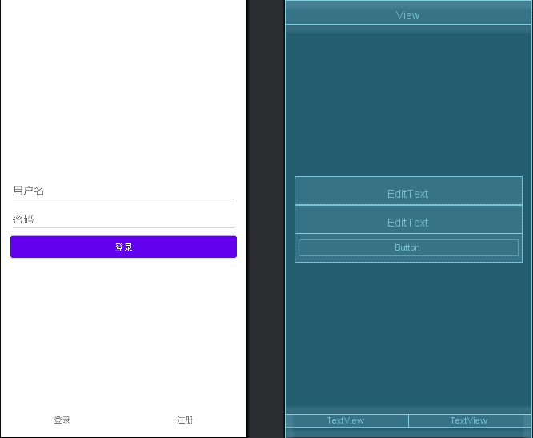
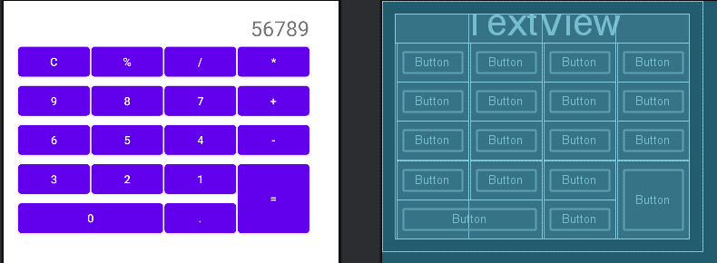
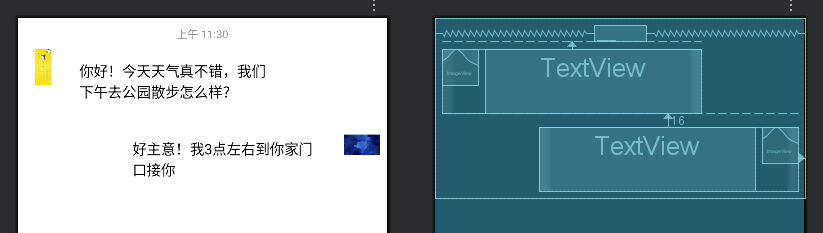

## 一、线性布局 (LinearLayout)

**线性布局 (LinearLayout)**是 Android 开发中最基础、最常用的布局管理器之一，核心思想是将其包含的**子视图 (View)** 在**单一方向（水平或垂直）** 上依次排列。

### 核心概念

1.  **排列方向 (Orientation):** 这是线性布局最关键的属性。
    *   `android:orientation="vertical"`： 子视图从上到下**垂直**排列。每个子视图占据一行。
    *   `android:orientation="horizontal"`： 子视图从左到右**水平**排列。每个子视图占据一列。
    *   **必须指定** `orientation` 属性，否则布局行为可能不符合预期（默认为 `horizontal`，但显式声明是良好实践）。

2.  **权重 (Weight):** 一个非常强大的特性，用于在父布局剩余空间中按比例分配子视图的大小。
    *   属性：`android:layout_weight`
    *   作用于子视图上（属于 `android:layout_` 属性）。
    *   **工作原理:**
        *   线性布局会先计算所有**未使用权重 (`layout_weight="0"` 或未设置)** 的子视图所需的空间总和。
        *   然后，将父布局的**剩余空间**按照各子视图的 `layout_weight` 值进行**比例分配**。
        *   值可以是任意正数（浮点数）。比例关系基于所有权重值的总和。
        *   例如：三个按钮的 `layout_weight` 分别是 1, 2, 1。那么剩余空间将被分成 4 份 (1+2+1)，第一个和第三个按钮各占 1/4，第二个按钮占 2/4 (即 1/2)。
    *   **与尺寸配合：** 通常需要将子视图在权重分配方向上的尺寸设置为 `0dp` (`android:layout_width="0dp"` 用于水平方向权重，`android:layout_height="0dp"` 用于垂直方向权重)，表示“我希望这个视图的尺寸完全由权重计算出来的剩余空间决定”。如果不设置为 `0dp`，系统会先分配视图声明的尺寸，然后再按权重分配剩余空间，这有时会导致复杂或非预期的结果。

3.  **布局参数 (LayoutParams):** 每个子视图可以设置特定的属性来控制其在线性布局中的位置和大小。这些属性通常以 `android:layout_` 开头：
    *   `android:layout_width` / `android:layout_height`： 必需！定义视图的宽度和高度。常用值：
        *   `match_parent` / `fill_parent`： 填满父容器（线性布局）在相应方向上的可用空间。
        *   `wrap_content`： 视图大小刚好包裹其内容所需的空间。
        *   `固定值 (e.g., 50dp)`： 指定精确尺寸（通常用 `dp` 单位，确保不同屏幕密度下尺寸相对一致）。
    *   `android:layout_weight`： 如上所述，分配剩余空间的权重。
    *   `android:layout_gravity`： 控制**子视图本身**在其**父容器 (LinearLayout) 分配给它空间**内的对齐方式。例如：
        *   `center`, `center_vertical`, `center_horizontal`
        *   `left` / `start`, `right` / `end`, `top`, `bottom`
        *   组合使用：`left|center_vertical`
    *   `android:gravity`： **(设置在 LinearLayout 本身上！)** 控制**所有子视图的内容**在其**自身边界**内的对齐方式。例如，让一个 `TextView` 内的文字居中显示。
    *   `android:layout_margin` / `android:layout_marginLeft` / `android:layout_marginTop` / etc： 设置子视图**外部**的边距（与其他视图或父容器边缘的距离）。
    *   `android:padding` / `android:paddingLeft` / `android:paddingTop` / etc： **(设置在 View 本身上或 LinearLayout 上)** 设置视图**内部**的填充（内容与视图边界之间的距离）。设置在 `LinearLayout` 上会影响其所有子视图的“容器”空间。


### 示例

```xml
<?xml version="1.0" encoding="utf-8"?>
<LinearLayout xmlns:android="http://schemas.android.com/apk/res/android"
    android:layout_width="match_parent"
    android:layout_height="match_parent"
    android:orientation="vertical">

    <View
        android:layout_width="match_parent"
        android:layout_height="40dp">

    </View>

    <LinearLayout
        android:layout_width="match_parent"
        android:layout_height="0dp"
        android:layout_weight="1"
        android:gravity="center"
        android:orientation="vertical"
        android:padding="16dp">

        <EditText
            android:layout_width="match_parent"
            android:layout_height="wrap_content"
            android:hint="用户名"/>


        <EditText
            android:layout_width="match_parent"
            android:layout_height="wrap_content"
            android:hint="密码"
            android:inputType="textPassword"/>

        <Button
            android:layout_width="match_parent"
            android:layout_height="wrap_content"
            android:text="登录"/>
    </LinearLayout>

    <LinearLayout
        android:layout_width="match_parent"
        android:layout_height="40dp"
        android:orientation="horizontal">

        <TextView
            android:layout_width="0dp"
            android:layout_height="wrap_content"
            android:gravity="center"
            android:layout_weight="1"
            android:text="登录"/>

        <TextView
            android:layout_width="0dp"
            android:layout_height="wrap_content"
            android:layout_weight="1"
            android:gravity="center"
            android:text="注册"/>
    </LinearLayout>

</LinearLayout>
```

**效果如下所示：**

  

### 优缺点

*   **优点:**
    *   **简单直观：** 概念清晰，易于理解和实现。
    *   **权重分配：** `layout_weight` 是实现按比例分配空间的利器。
    *   **性能较好：** 在视图层次不太深的情况下，测量和布局速度较快（比 `RelativeLayout` 简单）。
    *   **广泛适用：** 适合构建列表式、工具栏、表单等常见界面元素。
*   **缺点:**
    *   **单一方向：** 只能在一个方向上排列子视图。构建复杂网格或重叠视图需要**嵌套**多个 `LinearLayout` 或使用其他布局（如 `RelativeLayout`, `ConstraintLayout`, `GridLayout`）。
    *   **嵌套过深：** 为了实现复杂布局而嵌套多层 `LinearLayout` 会显著**降低性能**（增加测量/布局的层级和时间），并可能导致卡顿。
    *   **灵活性有限：** 不如 `ConstraintLayout` 或 `RelativeLayout` 那样可以灵活地定义视图之间的相对位置关系。


## 二、网格布局（GridLayout）

**网格布局 (GridLayout)**是 Android 4.0 (API Level 14) 引入的一种强大且灵活的布局管理器，专门用于将子视图排列在**行 (Row)** 和 **列 (Column)** 组成的网格中。

### 核心概念与优势

1.  **网格结构：** 布局被划分为不可见的行和列，形成一个个网格单元 (Cell)。子视图可以占据一个或多个连续的单元格（通过 **行跨度 (rowSpan)** 和 **列跨度 (columnSpan)** 控制）。
2.  **无嵌套行：** 不需要像 `TableLayout` 那样显式定义 `TableRow`，所有子视图直接作为 `GridLayout` 的子元素添加。布局根据指定的列数和子视图的放置自动确定行数。
3.  **灵活定位：**
    *   通过指定子视图所在的行索引 (`layout_row`) 和列索引 (`layout_column`) 来精确放置。
    *   如果没有指定行列索引，子视图会按照添加顺序自动填充网格（从左到右，从上到下）。
4.  **智能尺寸管理：**
    *   **均等分配 (默认)：** `GridLayout` 默认会尝试将每一列（或行）的宽度（或高度）设置为该列（或行）中最宽（或最高）子视图的尺寸，然后所有相同索引的列（行）拥有相同的尺寸。这确保了网格的规整性。
    *   **权重分配：** 类似于 `LinearLayout`，可以为列 (`android:columnWeight`) 或行 (`android:rowWeight`) 设置权重。权重定义了该列或行在父布局 **剩余空间** 中所占的比例。
    *   **Gravity：** 使用 `layout_gravity` 控制子视图在它所占单元格区域内的对齐方式（如居中、靠左、靠右、靠上、靠下等）。
5.  **高效性：** 由于没有 `TableRow` 的嵌套层级，视图层次更扁平，测量和布局过程通常比 `TableLayout` 更高效。
6.  **支持跨度：** 子视图可以通过 `layout_rowSpan` 和 `layout_columnSpan` 属性跨越多个行或列，非常适合创建复杂的、非均等大小的网格项目（如图库中的特色大图、仪表盘中的宽控件等）。

### 关键属性

**设置在 `GridLayout` 本身：**

*   `android:rowCount`: 明确指定网格的行数（可选）。如果不指定，行数会根据添加的子视图和列数自动计算。
*   `android:columnCount`: **非常重要！** 指定网格的列数。这是定义网格结构的基础，通常需要明确设置。
*   `android:orientation`: 影响未指定行列索引的子视图的填充顺序。
    *   `horizontal` (默认)：从左到右填充一行，填满后换到下一行。
    *   `vertical`：从上到下填充一列，填满后换到下一列。(较少使用)
*   `android:alignmentMode`: 控制网格线的对齐方式。
    *   `alignBounds` (默认)：网格线沿着子视图的边界对齐。
    *   `alignMargins`：网格线沿着子视图的外边距 (margin) 对齐。这会在单元格之间创建一致的间隙。
*   `android:columnOrderPreserved`: 设置为 `true` 时，列索引严格按照 `columnCount` 定义，即使某列是空的（默认 `false`，空列会被压缩）。
*   `android:useDefaultMargins`: 设置为 `true` 时，自动为没有设置边距的子视图应用默认边距（默认 `false`）。
*   `android:rowWeights` / `android:columnWeights`: (API 21+) 数组，定义行或列的权重。例如 `android:columnWeights="1,2,1"` 表示三列，中间列的宽度是两侧列的两倍（在分配完固定尺寸后的剩余空间中）。

**设置在子视图 (`GridLayout.LayoutParams`):**

*   `android:layout_row`: 指定子视图起始行索引 (从 0 开始)。
*   `android:layout_column`: 指定子视图起始列索引 (从 0 开始)。
*   `android:layout_rowSpan`: 指定子视图垂直方向跨越的行数 (默认为 1)。
*   `android:layout_columnSpan`: 指定子视图水平方向跨越的列数 (默认为 1)。
*   `android:layout_gravity`: 指定子视图在它所占的**单元格区域**内的对齐方式。这是控制子视图在网格单元中位置的关键属性！常用值：
    *   `left` / `start`， `right` / `end`， `top`， `bottom`
    *   `center`， `center_vertical`， `center_horizontal`
    *   `fill`， `fill_vertical`， `fill_horizontal` (让子视图填满分配的单元格区域)
    *   组合：`left|center_vertical`， `center`， `fill_horizontal|top` 等。
*   `android:layout_width` / `android:layout_height`： 虽然可以设置，但在 `GridLayout` 中通常设置为：
    *   `wrap_content`：视图大小由其内容决定（注意：如果单元格空间不足可能被截断）。
    *   `0dp` (推荐)：**告诉 `GridLayout` 这个视图的尺寸应由其所在的行/列约束（或权重）决定。** 这是最常用且最符合网格布局理念的设置，让布局管理器完全控制尺寸。避免使用 `match_parent`，它在 `GridLayout` 中行为可能不符合预期。

### 示例

```xml
<?xml version="1.0" encoding="utf-8"?>
<GridLayout xmlns:android="http://schemas.android.com/apk/res/android"
    android:layout_width="wrap_content"
    android:layout_height="wrap_content"
    android:columnCount="4"
    android:rowCount="5"
    android:padding="16dp">

    <TextView
        android:layout_width="match_parent"
        android:layout_height="wrap_content"
        android:layout_columnSpan="4"
        android:layout_gravity="fill_horizontal"
        android:gravity="end"
        android:textSize="26sp"
        android:text="56789"/>

    <Button android:text="C" android:layout_marginStart="2dp"/>
    <Button android:text="%" android:layout_marginStart="2dp"/>
    <Button android:text="/" android:layout_marginStart="2dp"/>
    <Button android:text="*" android:layout_marginStart="2dp"/>

    <Button android:text="9" android:layout_marginStart="2dp"/>
    <Button android:text="8" android:layout_marginStart="2dp"/>
    <Button android:text="7" android:layout_marginStart="2dp"/>
    <Button android:text="+" android:layout_marginStart="2dp"/>

    <Button android:text="6" android:layout_marginStart="2dp"/>
    <Button android:text="5" android:layout_marginStart="2dp"/>
    <Button android:text="4" android:layout_marginStart="2dp"/>
    <Button android:text="-" android:layout_marginStart="2dp"/>

    <Button android:text="3" android:layout_marginStart="2dp"/>
    <Button android:text="2" android:layout_marginStart="2dp"/>
    <Button android:text="1" android:layout_marginStart="2dp"/>
    <Button
        android:text="="
        android:layout_rowSpan="2"
        android:layout_gravity="fill_vertical"
        android:layout_marginStart="2dp"/>

    <Button
        android:text="0"
        android:layout_columnSpan="2"
        android:layout_gravity="fill_horizontal"
        android:layout_marginStart="2dp"/>
    <Button android:text="."  android:layout_marginStart="2dp"/>

</GridLayout>
```

**运行效果如下：**

  


## 三、相对布局（RelativeLayout）

**相对布局 (RelativeLayout)**是 Android 开发中另一种极其重要的布局管理器，其核心思想是允许你通过指定**子视图相对于父容器或其他兄弟视图的位置关系**来排列界面元素。它提供了极大的灵活性，特别适合构建不规则或元素间存在复杂位置依赖的界面。

### 核心概念：相对定位

在 `RelativeLayout` 中，每个子视图的位置不是由单一方向（如 `LinearLayout`）或固定网格（如 `GridLayout`）决定的，而是通过设置一系列以 `layout_` 开头的属性来定义它相对于以下参考点的位置：

1.  **父容器 (`RelativeLayout` 本身)：**
    *   `android:layout_alignParentTop`: 与父容器顶部对齐
    *   `android:layout_alignParentBottom`: 与父容器底部对齐
    *   `android:layout_alignParentLeft`: 与父容器左侧对齐
    *   `android:layout_alignParentStart`: 与父容器起始边对齐 (考虑 RTL 布局)
    *   `android:layout_alignParentRight`: 与父容器右侧对齐
    *   `android:layout_alignParentEnd`: 与父容器结束边对齐 (考虑 RTL 布局)
    *   `android:layout_centerHorizontal`: 在父容器中水平居中
    *   `android:layout_centerVertical`: 在父容器中垂直居中
    *   `android:layout_centerInParent`: 在父容器中水平和垂直都居中
2.  **其他兄弟视图 (通过 `@id/+id` 引用)：**
    *   `android:layout_above`: 位于指定视图 ID **之上**
    *   `android:layout_below`: 位于指定视图 ID **之下**
    *   `android:layout_toLeftOf`: 位于指定视图 ID **左侧**
    *   `android:layout_toStartOf`: 位于指定视图 ID **起始边左侧** (考虑 RTL 布局)
    *   `android:layout_toRightOf`: 位于指定视图 ID **右侧**
    *   `android:layout_toEndOf`: 位于指定视图 ID **结束边右侧** (考虑 RTL 布局)
    *   `android:layout_alignTop`: **顶部**与指定视图 ID 的顶部对齐
    *   `android:layout_alignBottom`: **底部**与指定视图 ID 的底部对齐
    *   `android:layout_alignLeft`: **左侧**与指定视图 ID 的左侧对齐
    *   `android:layout_alignStart`: **起始边**与指定视图 ID 的起始边对齐 (考虑 RTL 布局)
    *   `android:layout_alignRight`: **右侧**与指定视图 ID 的右侧对齐
    *   `android:layout_alignEnd`: **结束边**与指定视图 ID 的结束边对齐 (考虑 RTL 布局)
    *   `android:layout_alignBaseline`: **文本基线**与指定视图 ID 的文本基线对齐 (常用于对齐不同大小的 `TextView`)
3.  **自身尺寸：**
    *   `android:layout_width`: **必需**。常用值：`match_parent`, `wrap_content`, 固定值 (e.g., `100dp`)。在 `RelativeLayout` 中，`match_parent` 行为需谨慎，它会让视图填满父容器在相应方向上的**可用空间**，但可能受相对定位约束影响。
    *   `android:layout_height`: **必需**。常用值同上。

### 关键特点与优势

1.  **极高的灵活性：** 可以创建非常复杂的布局，视图可以任意堆叠、偏移、对齐，不受行或列的限制。
2.  **减少嵌套：** 理论上，一个设计良好的 `RelativeLayout` 可以替代多个嵌套的 `LinearLayout`，从而简化视图层次，**提升性能**（减少测量和布局的层级）。这是它相对于过度嵌套 `LinearLayout` 的主要优势。
3.  **直观的位置描述：** 对于某些布局（如“标题栏在顶部，按钮在右下角，内容在它们之间”），使用相对关系描述比用线性或网格布局嵌套更直观。
4.  **重叠视图：** 通过相对定位和负边距 (`android:layout_margin...`)，可以轻松实现视图的重叠效果。

### 示例：实现简单的聊天气泡

```xml
<?xml version="1.0" encoding="utf-8"?>
<RelativeLayout xmlns:android="http://schemas.android.com/apk/res/android"
    android:layout_width="match_parent"
    android:layout_height="wrap_content"
    android:padding="8dp">

    <!-- 时间戳 (顶部居中显示) -->
    <TextView
        android:id="@+id/tvTimestamp"
        android:layout_width="wrap_content"
        android:layout_height="wrap_content"
        android:layout_centerHorizontal="true"
        android:text="上午 11:30"
        android:textColor="#999999"
        android:textSize="12sp"
        android:layout_marginBottom="8dp"/>

    <!-- 接收者消息布局 -->
    <LinearLayout
        android:id="@+id/llReceiverMessage"
        android:layout_width="wrap_content"
        android:layout_height="wrap_content"
        android:layout_below="@id/tvTimestamp"
        android:orientation="horizontal">

        <!-- 接收者头像 (左侧) -->
        <ImageView
            android:id="@+id/ivReceiverAvatar"
            android:layout_width="40dp"
            android:layout_height="40dp"
            android:src="@drawable/lb"
            android:contentDescription="对方头像"
            android:layout_marginEnd="8dp"/>

        <!-- 接收者消息气泡 -->
        <TextView
            android:id="@+id/tvReceiverMessage"
            android:layout_width="wrap_content"
            android:layout_height="wrap_content"
            android:maxWidth="240dp"
            android:text="你好！今天天气真不错，我们下午去公园散步怎么样？"
            android:textColor="@android:color/black"
            android:padding="12dp"
            android:textSize="16sp"/>
    </LinearLayout>

    <!-- 发送者消息布局 -->
    <LinearLayout
        android:id="@+id/llSenderMessage"
        android:layout_width="wrap_content"
        android:layout_height="wrap_content"
        android:layout_below="@id/llReceiverMessage"
        android:layout_marginTop="16dp"
        android:layout_alignParentEnd="true"
        android:orientation="horizontal">

        <!-- 发送者消息气泡 -->
        <TextView
            android:id="@+id/tvSenderMessage"
            android:layout_width="wrap_content"
            android:layout_height="wrap_content"
            android:maxWidth="240dp"
            android:text="好主意！我3点左右到你家门口接你"
            android:textColor="@android:color/black"
            android:padding="12dp"
            android:textSize="16sp"/>

        <!-- 发送者头像 (右侧) -->
        <ImageView
            android:id="@+id/ivSenderAvatar"
            android:layout_width="40dp"
            android:layout_height="40dp"
            android:src="@drawable/a"
            android:contentDescription="我的头像"
            android:layout_marginStart="8dp"/>
    </LinearLayout>

</RelativeLayout>
```

**效果如下所示：**

  


### 注意事项

1.  **循环依赖：** 这是最常见的错误。例如：视图 A 在视图 B 下方 (`layout_below="@id/B"`)，视图 B 又在视图 A 下方 (`layout_below="@id/A"`)。系统无法解析这种循环依赖，会导致布局错误或运行时崩溃。**务必避免！**
2.  **未解决的依赖：** 如果一个视图设置了相对兄弟视图的约束（如 `layout_toRightOf="@id/someView"`），但 `someView` 不存在或尚未定义（XML 顺序靠后且没有 ID），布局可能不会按预期显示。**确保引用的视图存在且有 ID。**
3.  **ID 的重要性：**几乎所有相对兄弟视图的定位都依赖于被引用视图的 `android:id`，务必为需要被其他视图引用的视图设置唯一的 ID (`@+id/your_id`)。
4.  **XML 顺序：** 在 XML 中，后定义的视图可以引用先定义的视图的 ID，但反之不行（除非使用 `@id/` 而不是 `@+id/`，但通常推荐使用 `@+id/` 来创建或引用）。设计视图通常会自动处理 ID 创建和引用。
5.  **性能考量：**
    *   **优势：** 减少不必要的视图嵌套可以提升性能。
    *   **劣势：** `RelativeLayout` 内部需要两次测量过程来确定子视图的位置和大小（第一次测量所有视图以收集依赖信息，第二次进行实际布局）。对于**非常复杂**的 `RelativeLayout`（包含大量相互依赖的子视图），其性能可能低于结构简单但嵌套的 `LinearLayout`，甚至远低于 `ConstraintLayout`。
    *   **建议：** 避免在一个 `RelativeLayout` 中放置过多视图（尤其是存在复杂依赖时）。考虑拆分成多个 `RelativeLayout` 或使用 `ConstraintLayout`。
6.  **`match_parent` 的陷阱：** 在 `RelativeLayout` 中使用 `match_parent` 需要小心。例如，一个视图设置了 `layout_alignParentLeft="true"` 和 `layout_alignParentRight="true"`，那么它的宽度会被拉伸到填满父容器宽度（相当于 `match_parent`），此时再设置 `layout_width="match_parent"` 是多余的，甚至可能产生冲突。


## 四、帧布局（FrameLayout）

**帧布局 (FrameLayout)** 是 Android 开发中一种非常基础且常用的布局容器，其主要特点是将所有子视图堆叠在一起，每个子视图都基于父容器的左上角进行定位。它非常适合用于显示单一视图或实现视图的简单叠加效果，比如作为 Fragment 的容器或需要在同一位置显示多个叠加内容时使用。

### 核心概念：视图堆叠与对齐

在帧布局中，所有子视图默认都被放置在父容器的左上角，因此它们会按照在 XML 文件中出现的顺序依次堆叠（后面的视图会绘制在先前视图之上）。利用属性配置，可以实现简单的对齐和内边距调整：

1. **默认定位：**
   - 子视图默认放置于左上角。如果不设置额外属性，多个子视图将相互重叠，从而实现叠加效果。

2. **布局属性：**
   - `android:layout_width`和`android:layout_height`：
     * 这两个属性与其他布局容器类似，常用取值有 `match_parent`、`wrap_content` 或固定尺寸（如`100dp`）。
   - `android:layout_gravity`：
     * 该属性用于设置单个子视图在帧布局中的对齐方式，可以指定视图居中、居底、居右等对齐效果。例如，将子视图水平居中或垂直居中。
   - `android:foreground`：
     * 可用于在所有子视图之上绘制一个前景内容（如点击效果、阴影等）。

3. **子视图的堆叠顺序：**
   - XML 中后定义的视图会覆盖在前一个定义的视图之上，可以利用这一特点实现简单的视图叠加或遮罩效果。

### 关键特点与优势

1. **简单高效：** 
   - 帧布局结构简单，仅有单层布局，因此其测量和绘制过程非常高效，适用于对性能有要求的场景。

2. **叠加显示：**
   - 由于子视图默认重叠排列，帧布局非常适合实现遮罩、背景与前景分离显示、以及动态切换（例如引导页、弹出层等）。
   
3. **灵活定位：**
   - 通过 `android:layout_gravity` 可以方便地改变单个子视图在父容器内的位置，例如实现居中显示、底部对齐等。

### 示例：实现简单的图片与文本叠加

假设我们需要在一张图片之上加一个半透明的文本说明，可以采用帧布局来实现：

-------------------------------------------------------

<?xml version="1.0" encoding="utf-8"?>
<FrameLayout xmlns:android="http://schemas.android.com/apk/res/android"
    android:layout_width="match_parent"
    android:layout_height="200dp"
    android:padding="8dp">

    <!-- 背景图片 -->
    <ImageView
        android:id="@+id/ivBackground"
        android:layout_width="match_parent"
        android:layout_height="match_parent"
        android:src="@drawable/sample_image"
        android:scaleType="centerCrop"
        android:contentDescription="背景图片" />

    <!-- 叠加的文本说明 -->
    <TextView
        android:id="@+id/tvOverlayText"
        android:layout_width="wrap_content"
        android:layout_height="wrap_content"
        android:text="半透明文本说明"
        android:textColor="#FFFFFF"
        android:textSize="18sp"
        android:background="#66000000"
        android:padding="8dp"
        android:layout_gravity="center" />

</FrameLayout>

-------------------------------------------------------

**效果说明：**  
在上述示例中，背景图片先绘制，占满整个 `FrameLayout`；而后定义的文本视图通过设置 `android:layout_gravity="center"` 实现了居中对齐，并利用半透明背景色实现了叠加遮罩效果。

### 注意事项

1. **子视图过多导致混乱：**  
   - 由于帧布局内所有视图默认重叠，若在其中放置大量视图且未合理设置 `layout_gravity` 或边距，容易导致视图混乱，不易管理。建议仅将其作为简化叠加效果或单一视图容器使用。

2. **测量与绘制效率：**  
   - 尽管帧布局性能较高，但当子视图数量有限时，使用其他更专用的布局容器（如 `ConstraintLayout`）在复杂布局中可能更具有灵活性，因此需根据实际需求权衡选择。

3. **层级关系管理：**  
   - 为保证绘制顺序符合逻辑，建议在编辑 XML 布局时注意子视图的先后顺序（最后绘制的视图位于顶层）。

4. **与其他布局混用：**  
   - 帧布局通常用于承载单一视图或实现局部叠加效果，但在复杂布局中可以作为其他布局容器的一部分，合理搭配使用以降低布局嵌套层级，提升渲染效率。

帧布局的简单高效与透明叠加特点，使得它在需要快速布局和动态展示的场景下具有独特优势。理解它的工作原理和使用方法，可以使开发者在构建用户界面时更加灵活、高效。