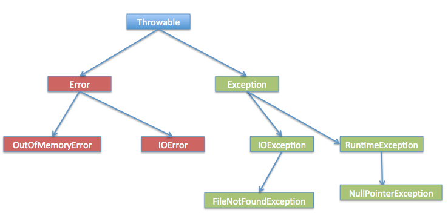

# Java 异常
---


### 1. 异常的定义
异常（Exception）是Java中用来表示程序在执行过程中发生的错误或意外事件的机制。当程序遇到无法正常处理的情况时，会抛出一个异常对象，程序的控制流会转移到异常处理代码中。异常的目的是让程序能够优雅地处理错误，而不是直接崩溃。

### 2. 异常的层次结构
Java中的所有异常都继承自`Throwable`类。`Throwable`有两个直接子类：

- **Error**  
  表示严重的系统级错误，通常由JVM抛出，例如`OutOfMemoryError`（内存溢出）或`StackOverflowError`（栈溢出）。这类错误通常是应用程序无法处理的，开发者不建议尝试捕获它们。

- **Exception**  
  表示程序可能需要捕获和处理的异常情况。`Exception`类进一步分为两类：
  - **受检异常（Checked Exception）**  
    直接继承自`Exception`但不继承自`RuntimeException`的异常，例如`IOException`（输入输出异常）或`SQLException`（数据库异常）。这类异常在编写代码时必须通过`try-catch`块捕获，或者在方法签名中使用`throws`关键字声明。
  - **非受检异常（Unchecked Exception）**  
    继承自`RuntimeException`的异常，例如`NullPointerException`（空指针异常）或`ArrayIndexOutOfBoundsException`（数组越界异常）。这类异常不需要强制捕获或声明，通常由程序员的代码错误引起。

  

| **分类**          | **系统错误（Error）**                          | **编译时异常（Checked Exception）**          | **运行时异常（Runtime Exception）**          |
|-------------------|-----------------------------------------------|---------------------------------------------|---------------------------------------------|
| **类别**          | 属于 `java.lang.Error` 及其子类               | 属于 `java.lang.Exception` 的子类，但 **不是** `RuntimeException` 的子类 | 属于 `java.lang.RuntimeException` 及其子类  |
| **继承关系**      | 直接继承自 `Throwable`                        | 继承自 `Exception`，但不在 `RuntimeException` 分支 | 继承自 `RuntimeException`（间接继承自 `Exception`） |
| **发生时机**      | **运行时**（但通常由系统或 JVM 引发，无法恢复） | **编译阶段**（必须处理才能通过编译）          | **运行时**（无需编译时处理，由 JVM 自动检测） |
| **是否必须处理**  | **不需要**（通常无法处理，会导致程序崩溃）      | **必须**（需 `try-catch` 或 `throws` 声明）   | **不需要**（可选择处理，但无需编译时强制）    |
| **常见例子**      | `OutOfMemoryError`（内存不足）<br>`VirtualMachineError`（JVM 错误）<br>`NoClassDefFoundError`（类未找到） | `IOException`（文件操作错误）<br>`SQLException`（数据库错误）<br>`FileNotFoundException`（文件未找到） | `NullPointerException`（空指针）<br>`ArrayIndexOutOfBoundsException`（数组越界）<br>`ClassCastException`（类型转换错误） |
| **处理方式**      | 通常不处理，程序终止                           | 必须用 `try-catch` 捕获或用 `throws` 声明抛出 | 可用 `try-catch` 捕获，或在开发阶段修复逻辑错误 |
| **设计意图**      | 标识 **系统级严重错误**，开发者无法控制         | 强制开发者处理 **外部因素引发的异常**（如资源缺失） | 提示 **程序逻辑错误**，鼓励在开发阶段修复问题 |
| **典型场景**      | 内存溢出、JVM 内部错误、类加载失败            | 文件读写失败、网络连接中断、数据库操作失败     | 空指针调用、数组越界访问、非法类型转换        |
| **是否可恢复**    | **难以恢复**（通常需重启程序或系统）           | **可恢复**（通过异常处理逻辑）                | **可恢复或需修复代码**（如调试逻辑错误）      |
| **JVM 处理行为**  | 直接终止程序，输出错误信息                    | 若未处理，编译失败                            | 若未捕获，程序终止并抛出堆栈跟踪             |


1. **系统错误（Error）**  
   - **系统级问题**：由 JVM 或硬件资源引发（如内存不足、类加载失败）。  
   - **不可恢复**：通常无法通过代码处理，需外部干预（如重启程序）。  
   - **无需捕获**：编译器不强制处理，但程序会崩溃。

2. **编译时异常（Checked Exception）**  
   - **外部因素导致**：如文件不存在、网络中断等可预见的外部错误。  
   - **强制处理**：必须在编译阶段通过 `try-catch` 或 `throws` 处理。  
   - **可恢复**：通过异常处理逻辑（如重试、提示用户）恢复程序。

3. **运行时异常（Runtime Exception）**  
   - **程序逻辑错误**：由代码缺陷（如空指针、越界访问）引发。  
   - **无需强制处理**：但鼓励在开发阶段通过调试修复。  
   - **提高代码健壮性**：若未处理，程序会终止，但可通过单元测试提前发现。


### 3. 异常的处理
Java中处理异常的主要方式是使用`try-catch-finally`块：

- **`try`块**  
  包含可能抛出异常的代码。如果`try`块中的代码抛出异常，程序会立即跳转到对应的`catch`块。

- **`catch`块**  
  捕获并处理`try`块中抛出的异常。可以有多个`catch`块来分别处理不同类型的异常。

- **`finally`块**  
  无论是否抛出异常，`finally`块中的代码都会执行，通常用于清理资源（如关闭文件或数据库连接）。


### 4. 手动抛出异常
开发者可以使用`throw`关键字手动抛出异常，用于在程序逻辑中检测到错误时主动通知调用者。例如：

```java
public void setAge(int age) {
    if (age < 0) {
        throw new IllegalArgumentException("年龄不能为负数");
    }
    System.out.println("年龄设置为：" + age);
}
```
在这个例子中，如果传入的`age`为负数，程序会抛出`IllegalArgumentException`，中断正常执行。


### 5. 异常处理的最佳实践
在实际开发中，遵循以下最佳实践可以提高代码的可读性和健壮性：

- **捕获具体异常**  
  尽量捕获具体的异常类型（如`FileNotFoundException`），而不是笼统地捕获`Exception`类。这样可以更精确地处理错误，便于调试。

- **避免使用异常控制流程**  
  异常应该用于处理真正的错误情况，而不是作为程序的正常逻辑控制。例如，不要用异常来检查循环是否结束。

- **合理使用`finally`**  
  在`finally`块中释放资源（如关闭文件流或网络连接），确保资源不会泄露。

- **不要忽略异常**  
  捕获异常后，应进行适当处理（如记录日志、提示用户），而不是简单地留空或打印堆栈信息。

