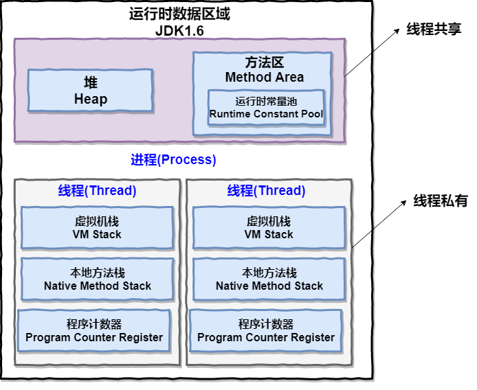
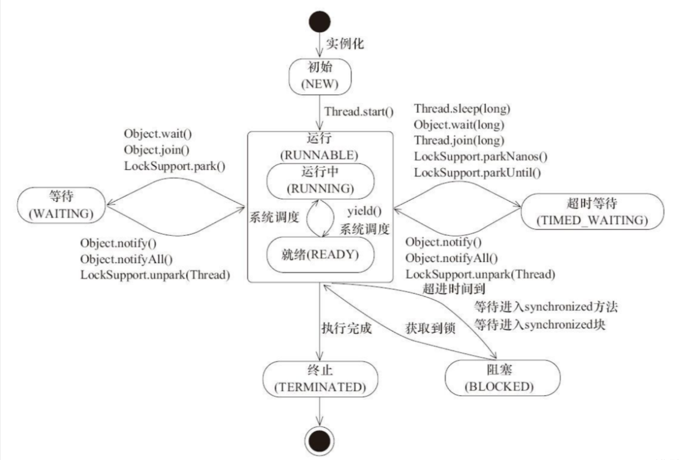
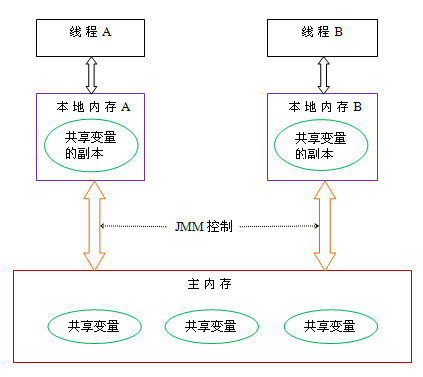
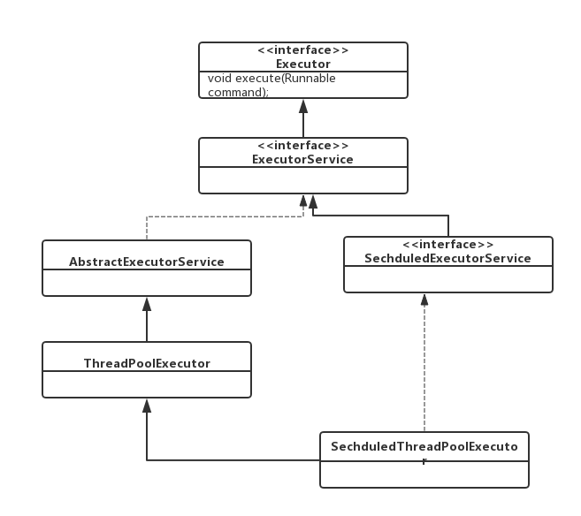
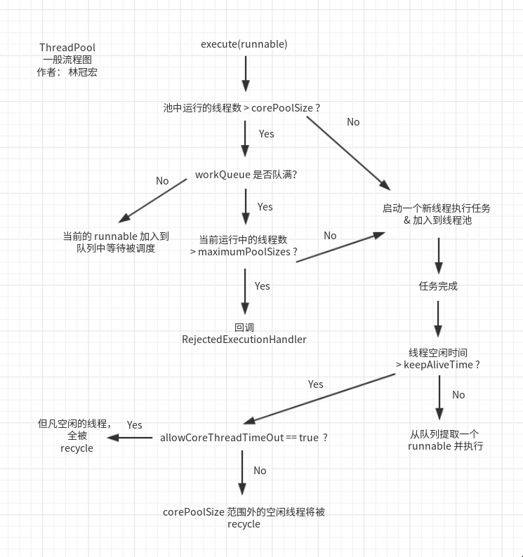

# Java 多线程编程
---

- [Java 多线程编程](#java-多线程编程)
  - [线程概述](#线程概述)
  - [创建线程的方法](#创建线程的方法)
    - [继承Thread类](#继承thread类)
    - [实现Runnable接口](#实现runnable接口)
    - [匿名内部类创建](#匿名内部类创建)
    - [lambda表达式创建Runnable子类对象](#lambda表达式创建runnable子类对象)
  - [Thread类](#thread类)
    - [常见的构造方法](#常见的构造方法)
    - [常用属性](#常用属性)
    - [常用方法](#常用方法)
  - [线程状态](#线程状态)
      - [线程的状态](#线程的状态)
      - [状态转移](#状态转移)
      - [获取线程状态](#获取线程状态)
      - [wait()](#wait)
      - [设置优先级](#设置优先级)
    - [守护线程（Daemon Thread）](#守护线程daemon-thread)
  - [Java 内存模型（JMM）](#java-内存模型jmm)
    - [原子性](#原子性)
    - [可见性](#可见性)
    - [有序性](#有序性)
    - [volatile底层机制——java内存屏障](#volatile底层机制java内存屏障)
      - [内存屏障](#内存屏障)
      - [java内存屏障](#java内存屏障)
  - [无锁](#无锁)
      - [悲观锁与乐观锁](#悲观锁与乐观锁)
      - [CAS](#cas)
  - [线程池](#线程池)
      - [线程池概述](#线程池概述)
      - [ThreadPoolExecutor类](#threadpoolexecutor类)
        - [创建线程池](#创建线程池)
        - [提交任务](#提交任务)
        - [任务队列](#任务队列)
        - [拒绝策略](#拒绝策略)


## 线程概述

**Java中的线程**
- 基于操作系统原生线程实现（1:1线程模型）
- 通过java.lang.Thread类实现线程控制

**与操作系统中线程概念的区别**
- 实现模型：
  - Java线程通过JVM映射到OS线程
  - 早期Green Threads模型（用户级线程）已弃用
- 调度方式：
  - Java线程优先级建议（1-10）最终映射到OS优先级（通常1-5）
  - 实际调度仍由操作系统决定
- 资源分配：
  - OS线程直接分配CPU时间片
  - Java线程通过JVM分配内存资源（堆/方法区）


**进程和线程的区别**
- 进程是包含线程的. 每个进程至少有⼀个线程存在，即主线程。
- 进程和进程之间不共享内存空间. 同⼀个进程的线程之间共享同⼀个内存空间.
- 进程是系统分配资源的最小单位，线程是系统调度的最小单位。
- ⼀个进程挂了⼀般不会影响到其他进程. 但是⼀个线程挂了, 可能把同进程内的其他线程⼀起带走(整个进程崩溃)

  

## 创建线程的方法

### 继承Thread类
- 继承Thread类，并重写run方法
- 创建子类对象，调用start方法启动线程
- 注意：
  - 线程启动后，会自动调用run方法
  - 线程启动后，不能再次调用start方法

```java
public class threadPr extends Thread  {
	@Override
	public void run() {
		System.out.println("这是一个新建的线程");
	}

	public static void main(String[] args) {
		System.out.println("这是主线程");
		threadPr t = new threadPr();
		t.start();
	}
}
```

### 实现Runnable接口
- 实现Runnable接口，并重写run方法
- 创建实现类对象，将实现类对象作为参数传递给Thread类的构造方法
- 创建Thread类对象，调用start方法启动线程

```java
public class MyRunnable implements Runnable  {
    @Override
    public void run() {
        System.out.println("这是一个新建的线程");
    }


    public static void main(String[] args) {
        System.out.println("这是主线程");
        MyRunnable myRunnable = new MyRunnable();
        Thread thread = new Thread(myRunnable);
        thread.start();
    }
}
```
实现Runnable更灵活，避免单继承限制，适合资源共享。

### 匿名内部类创建

```java
public class Iner {
    public static void main(String[] args) {
        Thread t1 = new Thread() {
            @Override
            public void run() {
                System.out.println("这是新建的线程");
            }
        };
        Thread t2 = new Thread(new Runnable()  {
            @Override
            public void run() {
                System.out.println("这是新建的线程");
            }
        });
        t2.start();
        System.out.println("这是主线程");
        t1.start(); 
    } 
}
```

### lambda表达式创建Runnable子类对象

```java
public class Lambda {
    public static void main(String[] args) {
        System.out.println("这是主线程");
        Thread t = new Thread(() -> {
            System.out.println("这是新建的线程");
        });
        t.start();
    }
}
```

## Thread类
### 常见的构造方法
- `Thread()`：创建一个新的线程对象。
- `Thread(Runnable target)`：使用Runnable对象创建一个新的线程对象。
- `Thread(String name)`：创建一个新的线程对象，并指定线程名称。
- `Thread(Runnable target, String name)`：使用Runnable对象创建一个新的线程对象，并指定线程名称。

### 常用属性
- `String : getName()`：获取线程名称。
- `long : getId()`：获取线程ID。
- `int : getPriority()`：获取线程优先级。
- `boolean : isAlive()`：检查线程是否处于活动状态。
- `boolean : isDaemon()`：检查线程是否为守护线程。
- `boolean : isInterrupted()`：检查线程是否被中断。

### 常用方法

**`start()`与`run()`的区别**
- `start()`：启动新线程，JVM调用`run()`方法。
- 直接调用`run()`：不会创建新线程，代码在当前线程执行。

```java
public static void main(String[] args) {
    Thread thread = new Thread(() -> {
        System.out.println("当前线程: " + Thread.currentThread().getName());
    });
    thread.start(); // 输出：当前线程: Thread-0
    thread.run();   // 输出：当前线程: main
}
```

**`sleep()`方法**

让线程休眠指定时间（毫秒），期间线程处于`TIMED_WAITING`状态。

```java
class SleepExample extends Thread {
    @Override
    public void run() {
        try {
            for (int i = 3; i > 0; i--) {
                System.out.println(i);
                Thread.sleep(1000); // 暂停1秒
            }
        } catch (InterruptedException e) {
            e.printStackTrace();
        }
    }
}
```

**`join()`方法**

等待线程终止。例如，主线程等待子线程完成：

```java
public class Main {
    public static void main(String[] args) throws InterruptedException {
        Thread thread = new Thread(() -> {
            try {
                Thread.sleep(2000);
                System.out.println("子线程完成");
            } catch (InterruptedException e) {
                e.printStackTrace();
            }
        });
        thread.start();
        thread.join(); // 主线程等待子线程结束
        System.out.println("主线程继续执行");
    }
}
```

**`interrupt()`中断线程**

通过中断标志位终止线程。若线程在阻塞状态（如`sleep()`），会抛出`InterruptedException`。

```java
class InterruptExample extends Thread {
    @Override
    public void run() {
        try {
            while (!isInterrupted()) {
                System.out.println("运行中...");
                Thread.sleep(1000);
            }
        } catch (InterruptedException e) {
            System.out.println("线程被中断");
        }
    }
}

public class Main {
    public static void main(String[] args) throws InterruptedException {
        InterruptExample thread = new InterruptExample();
        thread.start();
        Thread.sleep(3000);
        thread.interrupt(); // 中断线程
    }
}
```
**`yield()` 让出CPU**

yield 不会改变线程的状态，但会使当前线程让出CPU资源，让其他具有相同或更高优先级的线程运行，让当前线程重新去排队
调用 yield() 方法并不会释放锁或者阻塞当前线程，它只是暂停当前线程的执行，并允许其他线程获得执行。当当前线程被重新调度时，它将继续执行，但并不能保证它会立即被调度。

但是，调用 yield() 方法并不能保证其他线程会获得执行，因为调度器可以选择忽略 yield() 方法的调用。过度使用 yield() 方法可能会导致性能问题，因为频繁的调用 yield() 方法可能会导致线程频繁地切换，从而降低系统的性能。

```java
public class YieldExample {
    public static void main(String[] args) throws InterruptedException {
        Thread t1 = new Thread(new Runnable() {
            @Override
            public void run() {
                while (true) {
                      System.out.println("张三");
                      Thread.yield();
              }
            }
        }, "t1");
        
        t1.start();
        
        Thread t2 = new Thread(new Runnable() {
          @Override
            public void run() {
                while (true) {
                      System.out.println("李四");
                }
            }
        }, "t2");
        t2.start();
    }
}
```

## 线程状态

#### 线程的状态

- **NEW**：系统中的线程还没创建出来，只是有了一个 Thread 对象（已经安排好了工作，但是还未开始行动）。
- **TERMINATED**：系统中的线程已经执行完了，但 Thread 对象还在（工作已经完成了）。
- **RUNNABLE**：就绪状态，有两种可能的情况
  - 线程正在CPU上运行
  - 线程已经准备好随时可以去CPU上运行
 （表示“可工作的”状态；又可以分成正在工作中和即将开始工作）。
- **TIMED_WAITING**：线程正在“指定时间等待”，表示线程在有限时地等待唤醒（等待其它线程发来通知）。一个典型的状况就是线程正在休眠sleep()。
- **BLOCKED**：表示等待获取锁的状态。
- **WAITING**：使用 `wait()` 方法出现，表示线程在无限时等待唤醒（等待其它线程发来通知）。

#### 状态转移

  


#### 获取线程状态

通过`getState()`方法获取线程状态。

```java
Thread thread = new Thread(() -> {
    try {
        Thread.sleep(1000);
    } catch (InterruptedException e) {
        e.printStackTrace();
    }
});
System.out.println(thread.getState()); // NEW
thread.start();
System.out.println(thread.getState()); // RUNNABLE
Thread.sleep(500);
System.out.println(thread.getState()); // TIMED_WAITING
```

#### wait()

在Java中，线程必须持有对象的锁才能调用 wait() 方法。当线程调用 wait() 方法时，它会释放当前持有的锁，并将自己挂起，直到被其他线程唤醒。一旦线程调用了 wait() 方法并释放了锁，其他线程就可以获取该对象的锁并继续执行同步块中的代码。当该线程被唤醒（notify）时，它会重新尝试获取对象的锁并恢复执行。但是，在其它线程未释放锁之前该线程仍然会被阻塞。一旦它获得了对象的锁，它才可以继续执行同步块中的代码。

#### 设置优先级
优先级范围：1（最低）~10（最高），默认5。

```java
Thread thread1 = new Thread(() -> System.out.println("低优先级"));
Thread thread2 = new Thread(() -> System.out.println("高优先级"));
thread1.setPriority(Thread.MIN_PRIORITY); // 1
thread2.setPriority(Thread.MAX_PRIORITY); // 10
thread1.start();
thread2.start();
```

### 守护线程（Daemon Thread）
守护线程在后台运行，JVM在所有非守护线程结束后自动退出。

```java
Thread daemonThread = new Thread(() -> {
    while (true) {
        System.out.println("守护线程运行中...");
    }
});
daemonThread.setDaemon(true); // 设置为守护线程
daemonThread.start();
// 主线程结束后，守护线程自动终止
```

## Java 内存模型（JMM）

Java虚拟机规范中定义的，来屏蔽各个硬件平台和操作系统的内存访问差异，以实现让Java程序在各种平台下都能达到一致的内存访问效果的一种规范。

  

Java内存模型规定所有的变量都是存在主存当中，每个线程都有自己的工作内存。线程的工作内存中保存了该线程中使用到的变量的主内存副本拷贝，线程对变量的所有操作都必须在工作内存中进行，而不能直接对主存进行操作。并且每个线程不能访问其他线程的工作内存，线程之间的通信递需要经过主内存。

和内存模型一样，java内存模型中同样存在原子性，可见性，有序性等问题

### 原子性

在Java中，对基本数据类型的变量的读取和赋值操作是原子性操作，即这些操作是不可被中断的，要么执行，要么不执行

```java
x = 1; // 原子性操作
x = y; // 非原子性操作（读y + 赋值）
```
如果要实现更大范围操作的原子性，可以通过synchronized和Lock来实现

### 可见性

Java提供了 **`volatile`** 关键字来保证可见性。

当一个共享变量被`volatile`修饰时，它会保证修改的值会立即被更新到主存，当有其他线程需要读取时，它会去内存中读取新值，并且会让其它线程对于该变量的缓存失效。

在对volatile修饰的变量做写操作时，jvm会给CPU发送lock前缀指令，强制要求在写操作结束后将修改的值写回主存，然后根据缓存一致性协议，其他线程的工作内存中该变量的缓存失效，从而保证了可见性。

### 有序性

Java内存模型具备一些先天的“有序性”，即不需要通过任何手段就能够得到保证的有序性，这个通常也称为 happens-before（先行发生） 原则。如果两个操作的执行次序无法从happens-before原则推导出来，那么它们就不能保证它们的有序性，虚拟机可以随意地对它们进行重排序。

注意：A happens-before B并不要求A操作一定要在B操作之前，而是说A操作后的结果对B操作是可见的，即如果A操作将a的值修改为1，那么B操作在用到a的值的时候已经知道了a的值为1。


### volatile底层机制——java内存屏障

#### 内存屏障

内存屏障（Memory Barrier）是一种CPU指令，用于控制特定条件下的重排序和内存可见性问题。

**分类**

读屏障（Load Barrier）：
   在指令前插入Load Barrier，可以让高速缓存中的数据失效，强制从新从主内存加载数据。

写屏障（Store Barrier）：
  在指令后插入Store Barrier，能让写入缓存中的最新数据更新写入主内存，让其他线程可见。

**作用**：

- 阻止屏障两侧的指令重排序。

- 强制把写缓冲区/高速缓存中的脏数据等写回主内存，让缓存中相应的数据失效。

#### java内存屏障

同样，Java虚拟机为java程序运行时提供了java内存屏障。

java内存屏障有四种类型

- **LoadLoad屏障**：对于这样的语句Load1； LoadLoad；Load2，在Load2及后续读取操作要读取的数据被访问前，保证Load1要读取的数据被读取完毕。
- **StoreStore屏障**：对于这样的语句Store1；StoreStore；Store2，在Store2及后续写入操作执行前，保证Store1的写入操作对其它处理器可见。
- **LoadStore屏障**：对于这样的语句Load1；LoadStore；Store2，在Store2及后续写入操作被刷出前，保证Load1要读取的数据被读取完毕。
- **StoreLoad屏障**：对于这样的语句Store1；StoreLoad；Load2，在Load2及后续所有读取操作执行前，保证Store1的写入对所有处理器可见。它的开销是四种屏障中最大的。在大多数处理器的实现中，这个屏障是个万能屏障，兼具其它三种内存屏障的功能。

**volatile语义中的内存屏障**：

- 在每个volatile写操作前插入StoreStore屏障，在写操作后插入StoreLoad屏障；

- 在每个volatile读操作前插入LoadLoad屏障，在读操作后插入LoadStore屏障；

## 无锁
#### 悲观锁与乐观锁

**悲观锁**

一种悲观的思想，总是假设最坏的情况，每次去拿数据的时候都认为别人会修改

每次在拿数据的时候都会上锁，这样别人想拿这个数据就会阻塞直到它拿到锁

**乐观锁**

一种乐观的的思想，每次取数据都假设别人不会修改，所以不会上锁。

当需要更新数据时，会检测这个数据是否已经被其他人更新了，如果已经被别人更新过了，就返回让用户自己选择怎么处理。乐观锁适用于读多写少的场景。

**java解决临界区代码安全问题的办法**：

- 阻塞式方法：使用synchronized或者Lock进行加锁。这其实就是一种悲观锁的思想。

- 非阻塞式方法：使用原子变量的方法。这就是一种乐观锁的思想。

#### CAS

java中乐观锁是通过CAS（compare and swap）方式实现的。

**算法思想**

CAS算法有三个操作数，内存地址V，旧值A，新值B。

CAS算法的思想：当需要更新值时，先将旧值A与内存地址V中的值进行比较，如果相同，就说明没有其他人对这个值作更新，此时就可以执行更新操作；如果发现旧值A与内存地址V中的值不同，说明有其他人更新过这个值，此时将旧值A换成别人修改过的值，继续进行检测，直到检测到内存地址V中的值和A的值一样时，就执行更新操作。下面代码来模拟CAS算法。

```java
gradle
public class CAS {

    private int value;  //代表内存地址中的值

    public synchronized int compareAndSwap(int A, int B){    
        //java中实际上没有使用synchronized关键字，而是通过操作硬件实现的
        int oldValue = value;
        if(oldValue == A){  //如果A的值和内存地址中的值相同就进行更新
            value = B;
        }
        return oldValue;   //返回上次内存地址中的值，在更新失败时将此值赋给A
    }
}
```

**CAS的优点**：
- 没有使用锁，不存在死锁的情况。
- 在读多写少的情况下不需要每次都加锁，不会使其他线程阻塞。

**CAS的缺点**：
- 如果线程读写频繁，则循环检测会浪费CPU很多资源。
- 只能保证一个共享变量的原子操作。
- 存在ABA问题

从Java1.5开始JDK提供了AtomicReference类来保证引用对象之间的原子性，可以把多个变量放在一个对象里来进行CAS操作。


**ABA问题**：

如果线程1将A修改为B，线程2又将B修改为A，这时线程C想要修改这个值，他看到的还是A，操作可以顺利进行，但是却不知道A->B->A的这个变化

解决ABA问题可以在CAS方法中加入版本号，每次修改都使版本号加1，这样只要做了修改，版本号就会有变化。


## 线程池

#### 线程池概述

**什么是线程池**

如果同一时刻有大量的任务需要执行，而这些任务又比较简单，那么每次都创建一个新的线程肯定会耗费很多时间。

为了减少创建线程所花费的时间，人们想出了线程池的办法。线程池中预先创建了一定数量的线程，当需要线程执行任务时就从线程池中取，当任务执行完后，线程不会消亡，而是继续执行其它任务。

**优点**
- 减少资源开销：不会每次都创建新线程，而是从线程池中取。
- 提高响应速度：线程已经提前创建好了，需要执行任务时直接用就可以了。
- 便于管理：线程是一种稀缺资源，如果不加以控制，不仅会浪费大量资源，而且可能影响系统的稳定性。使用线程池可以对线程的创建和停止，线程的数量加以控制，使线程处在可控的范围内，不仅便于管理，而且方便调优。

**线程池的构成**：
- 核心线程：已经创建好的并处在运行状态的一定数量的线程，它们不断从阻塞队列中获取任务并执行。
- 阻塞队列：用来存储工作线程来不及处理的任务，当所有的工作线程都被占用后，之后的任务就会进入阻塞队列，等待某个线程执行完后才有机会被处理。

#### ThreadPoolExecutor类

**Excutor接口**

ThreadPoolExecutor的顶层接口是 Excutor，位于 java.util.concurrent 包下

该接口中只提供了一个用于接收Runnable类型参数的方法excute(Runnabel task)，用于接收一个任务

```java
public class Demo implements Executor{

    @Override
    public void execute(Runnable r) {
        r.run();   //既可以在execute方法中直接执行任务
        new Thread(r).start();   //也可以新建一个线程去执行任务
    }
}
```

**ExcutorService接口**

ExcutorService 是一个比 Excutor 使用更广泛的子接口，提供了线程生命周期管理的方法。

Excutor 中只有一个用于接收任务的excute方法，该方法没有返回值。而 ExcutorService 的submit()方法可以返回一个Future对象，用来获取任务的执行结果。ExcutorService 拓展了 Excutor，在开发中使用的更多。


下面是两者的区别：

|                 **Executor**                  |                 **ExecutorService**                 |
| :-------------------------------------------: | :-------------------------------------------------: |
| Java 线程池的核心接口，用于并发执行提交的任务 | Executor 接口的扩展，提供异步执行和关闭线程池的方法 |
|    提供 execute() 方法提交任务（无返回值）    |   提供 submit() 方法提交任务（返回 Future 对象）    |
|                 不能取消任务                  |    可通过 Future.cancel() 取消 pending 中的任务     |
|             没有关闭线程池的方法              |      提供 shutdown()/shutdownNow() 关闭线程池       |


**ThreadPoolExecutor**

  

从上面的类图我们看到 ExcutorService 接口的实现类是 AbstractExecutorService，这是一个抽象类，而这个类的子类就是ThreadPoolExecutor

##### 创建线程池

```java
    /**
     * Creates a new {@code ThreadPoolExecutor} with the given initial
     * parameters.
     *
     * @param corePoolSize the number of threads to keep in the pool, even
     *        if they are idle, unless {@code allowCoreThreadTimeOut} is set
     * @param maximumPoolSize the maximum number of threads to allow in the
     *        pool
     * @param keepAliveTime when the number of threads is greater than
     *        the core, this is the maximum time that excess idle threads
     *        will wait for new tasks before terminating.
     * @param unit the time unit for the {@code keepAliveTime} argument
     * @param workQueue the queue to use for holding tasks before they are
     *        executed.  This queue will hold only the {@code Runnable}
     *        tasks submitted by the {@code execute} method.
     * @param threadFactory the factory to use when the executor
     *        creates a new thread
     * @param handler the handler to use when execution is blocked
     *        because the thread bounds and queue capacities are reached
     * @throws IllegalArgumentException if one of the following holds:<br>
     *         {@code corePoolSize < 0}<br>
     *         {@code keepAliveTime < 0}<br>
     *         {@code maximumPoolSize <= 0}<br>
     *         {@code maximumPoolSize < corePoolSize}
     * @throws NullPointerException if {@code workQueue}
     *         or {@code threadFactory} or {@code handler} is null
     */
    public ThreadPoolExecutor(int corePoolSize,
                              int maximumPoolSize,
                              long keepAliveTime,
                              TimeUnit unit,
                              BlockingQueue<Runnable> workQueue,
                              ThreadFactory threadFactory,
                              RejectedExecutionHandler handler) {
        if (corePoolSize < 0 ||
            maximumPoolSize <= 0 ||
            maximumPoolSize < corePoolSize ||
            keepAliveTime < 0)
            throw new IllegalArgumentException();
        if (workQueue == null || threadFactory == null || handler == null)
            throw new NullPointerException();
        this.corePoolSize = corePoolSize;
        this.maximumPoolSize = maximumPoolSize;
        this.workQueue = workQueue;
        this.keepAliveTime = unit.toNanos(keepAliveTime);
        this.threadFactory = threadFactory;
        this.handler = handler;

        String name = Objects.toIdentityString(this);
        this.container = SharedThreadContainer.create(name);
    }
```

其构造函数可以有七个参数：

- corePoolSize：线程池中核心线程的数目。
- maximumPoolSize：线程池允许创建的最大线程数。如果队列满了，并且已创建的线程数小于最大线程数，则线程池会再创建新的救急线程执行任务。
- keepAliveTime：救急线程空闲后存活的时间。
- unit：救急线程存活的时间单位。
- workQueue：任务队列。用来保存等待执行的任务的阻塞队列。
- threadFactory：用于设置创建线程的工厂，可以通过线程工厂给每个创建出来的线程设置更有意义的名字。
- handler：饱和策略。

  

##### 提交任务

通过构造方法创建了线程池之后，可以使用execute()和submit()向线程池中提交任务，这两个方法都是接收 Runnabel 类型的参数


**返回值处理**

- `execute()`
  ```java
  executor.execute(() -> {
      System.out.println("任务执行");
  });
  ```
  - 没有返回值，无法直接获取任务执行结果  
  - 适用于 **不需要返回结果** 的异步任务

- `submit()`
  ```java
  Future<String> future = executor.submit(() -> {
      return "任务结果";
  });
  String result = future.get(); // 阻塞获取结果
  ```
  - 返回 `Future` 对象，可获取任务返回值或异常  
  - 适用于 **需要处理返回值或异常** 的任务

**异常处理**

- `execute()`
  ```java
  executor.execute(() -> {
      try {
          // 业务代码
      } catch (Exception e) {
          // 必须手动处理异常
          e.printStackTrace();
      }
  });
  ```
  - 任务中的未捕获异常会导致线程终止  
  - 必须手动在任务内部处理异常

- `submit()`
  ```java
  Future<?> future = executor.submit(() -> {
      throw new RuntimeException("测试异常");
  });

  try {
      future.get(); // 会抛出 ExecutionException
  } catch (InterruptedException | ExecutionException e) {
      System.out.println("捕获异常: " + e.getCause());
  }
  ```
  - 异常会被封装到 `Future` 中，调用 `future.get()` 时抛出 `ExecutionException`  
  - 可通过 `Future` 统一管理异常

**具体使用示例**

**场景 1：简单异步任务（无返回值）**

```java
// 使用 execute()
executor.execute(() -> {
    System.out.println(Thread.currentThread().getName() + " 执行任务");
});

// 使用 submit() 等效写法
executor.submit(() -> {
    System.out.println(Thread.currentThread().getName() + " 执行任务");
});
```

**场景 2：需要获取任务结果**

```java
// 使用 submit() + Callable
Future<Integer> future = executor.submit(() -> {
    TimeUnit.SECONDS.sleep(1);
    return 42;
});

// 阻塞等待结果
try {
    int result = future.get(); 
    System.out.println("计算结果: " + result);
} catch (InterruptedException | ExecutionException e) {
    e.printStackTrace();
}
```

**异常处理**

```java
// execute() 的异常处理
executor.execute(() -> {
    try {
        throw new RuntimeException("execute() 异常");
    } catch (Exception e) {
        System.out.println("execute() 内部捕获异常");
    }
});

// submit() 的异常处理
Future<?> future = executor.submit(() -> {
    throw new RuntimeException("submit() 异常");
});

try {
    future.get();
} catch (Exception e) {
    System.out.println("通过 Future 捕获异常: " + e.getCause());
}
```

---

**关键特性对比表**

| **特性**               | `execute()`                  | `submit()`                   |
|:------------------------:|:------------------------------:|:------------------------------:|
| 返回值                 | 无                           | 返回 `Future` 对象           |
| 支持的任务类型         | 仅 `Runnable`                | `Runnable` 和 `Callable`     |
| 异常传播方式           | 直接抛出导致线程终止         | 封装到 `Future` 中           |
| 结果获取               | 无法直接获取                 | 通过 `Future.get()` 获取     |
| 是否阻塞               | 非阻塞                       | `Future.get()` 会阻塞        |
| 适用场景               | 简单异步任务                 | 需要结果/异常管理的复杂任务  |


**基础使用示例----场景：处理 10 个任务**
```java
public class BasicExample {
    public static void main(String[] args) {
        // 创建线程池（核心2线程，最大4线程，队列容量2）
        ThreadPoolExecutor executor = new ThreadPoolExecutor(
            2, 
            4,
            60, TimeUnit.SECONDS,
            new ArrayBlockingQueue<>(2),
            new ThreadPoolExecutor.CallerRunsPolicy()
        );

        // 提交10个任务
        for (int i = 1; i <= 10; i++) {
            final int taskId = i;
            executor.execute(() -> {
                System.out.println(Thread.currentThread().getName() 
                    + " 执行任务 " + taskId);
                try {
                    Thread.sleep(1000); // 模拟任务耗时
                } catch (InterruptedException e) {
                    e.printStackTrace();
                }
            });
        }

        executor.shutdown(); // 关闭线程池
    }
}
```
```plaintext
运行结果分析：
pool-1-thread-1 执行任务 1
pool-1-thread-2 执行任务 2
pool-1-thread-3 执行任务 5  // 当队列满时创建新线程
pool-1-thread-4 执行任务 6  // 达到最大线程数4
main 执行任务 9            // 触发拒绝策略（CallerRunsPolicy）
pool-1-thread-1 执行任务 7  // 核心线程复用
```

##### 任务队列

在 Java 的 `ThreadPoolExecutor` 中，任务队列（`BlockingQueue<Runnable>`）是决定线程池行为和性能的关键组件之一。不同的队列类型会影响任务的排队策略、线程池的扩展机制以及资源管理方式。

**`ArrayBlockingQueue`（数组实现的有界队列）**

**特性：**
- **基于数组**的固定容量队列，需指定队列容量（如 `new ArrayBlockingQueue<>(100)`）。
- **先进先出（FIFO）** 顺序处理任务。
- 队列满时，新提交的任务会触发线程池的 **拒绝策略**（如抛出异常或创建新线程）。

```java
    new ArrayBlockingQueue<>(2), // 容量为2
```

**适用场景：**
- **资源受限环境**：需严格控制队列长度，避免内存溢出（OOM）。
- **稳定负载场景**：任务提交速率可预测，队列容量能覆盖短期峰值。
- **需要显式拒绝策略**：当队列满时，希望立即触发拒绝策略，而不是无限制堆积任务。

**缺点：**
- 容量固定，可能因队列过小导致频繁触发拒绝策略。

**`LinkedBlockingQueue`（链表实现的无界/有界队列）**

**特性：**
- **基于链表**，默认无界（容量为 `Integer.MAX_VALUE`，约21亿），也可通过构造函数指定容量。
- **先进先出（FIFO）** 顺序处理任务。
- 无界队列时，新任务会无限堆积，直到内存耗尽；有界队列满时触发拒绝策略。

```java
// 无界队列（默认）
BlockingQueue<Runnable> unboundedQueue = new LinkedBlockingQueue<>();

// 有界队列（容量100）
BlockingQueue<Runnable> boundedQueue = new LinkedBlockingQueue<>(100);
```

**适用场景：**
- **高吞吐场景**：任务处理速度快，队列仅用于短期缓冲。
- **突发流量**：需要临时缓冲大量任务（如秒杀活动）。
- **无需严格拒绝策略**：允许任务在队列中等待较长时间。

**缺点：**
- 无界队列可能导致内存溢出
  
**`SynchronousQueue`（同步移交队列）**

**特性：**
- **不存储元素**，每个插入操作必须等待另一个线程的移除操作。
- 提交的任务直接交给空闲线程处理，若无线程空闲且未达最大线程数，则创建新线程。
- 队列“容量”始终为0，任务无法排队。

```java
ThreadPoolExecutor executor = new ThreadPoolExecutor(
    2, 4, 60, TimeUnit.SECONDS,
    new SynchronousQueue<>(),
    new ThreadPoolExecutor.AbortPolicy()
);
```

**适用场景：**
- **高响应需求**：任务需立即执行，拒绝排队延迟。
- **线程池快速扩展**：希望尽快创建新线程处理任务（如 `newCachedThreadPool` 使用此队列）。
- **短任务场景**：任务执行时间短，避免线程频繁创建销毁的开销。

**缺点：**
- 任务无法缓冲，若线程数已达最大值且无空闲线程，立即触发拒绝策略。

---

**`PriorityBlockingQueue`（优先级无界队列）**

**特性：**
- **无界队列**，任务按优先级排序（需实现 `Comparable` 或提供 `Comparator`）。
- 优先级高的任务先执行，同优先级按 FIFO 处理。
- 可能导致内存溢出，需谨慎使用。

```java
BlockingQueue<Runnable> priorityQueue = new PriorityBlockingQueue<>(
    10, // 初始容量
    Comparator.comparing(Task::getPriority) // 自定义优先级规则
);
```

**适用场景：**
- **任务优先级区分**：需按优先级处理任务（如 VIP 用户请求优先处理）。
- **动态调整执行顺序**：任务优先级可能在队列中动态变化。

**缺点：**
- 无界队列可能导致内存溢出。
- 实现复杂，需自定义比较逻辑。

**`DelayedWorkQueue`（延迟队列，用于 `ScheduledThreadPoolExecutor`）**

**特性：**
- 专用于延迟执行或周期性任务（如 `ScheduledThreadPoolExecutor`）。
- 任务按延迟时间排序，到期后才会被取出执行。
- 内部基于堆结构实现，保证延迟最短的任务优先执行。

```java
ScheduledThreadPoolExecutor scheduler = new ScheduledThreadPoolExecutor(2);
scheduler.schedule(
    () -> System.out.println("延迟5秒执行"),
    5, TimeUnit.SECONDS
);
```

**适用场景：**
- **定时任务**：如延迟执行、周期性任务（心跳检测、缓存刷新）。


| **队列类型**          | **核心线程满时行为**       | **队列满时行为**             | **最大线程满时行为**       |
|:-----------------------:|:---------------------------:|:-----------------------------:|:---------------------------:|
| `ArrayBlockingQueue`  | 任务入队                  | 创建新线程（直到最大线程数） | 触发拒绝策略              |
| `LinkedBlockingQueue` | 任务入队                  | 创建新线程（仅当有界队列满） | 触发拒绝策略（仅当有界）  |
| `SynchronousQueue`    | 直接创建新线程（若未达最大）| 队列始终“满”，触发拒绝策略   | 触发拒绝策略              |
| `PriorityBlockingQueue` | 任务按优先级入队         | 无界队列永不触发拒绝策略     | 无界队列永不触发拒绝策略  |


**生产环境建议**
- **避免无界队列**：优先使用有界队列（如 `ArrayBlockingQueue` 或指定容量的 `LinkedBlockingQueue`），防止内存溢出。
- **结合拒绝策略**：队列满时，合理选择拒绝策略（如记录日志、降级处理）。
-  **监控队列大小**：通过 `executor.getQueue().size()` 实时监控，调整队列容量和线程数。
-  **优先级队列慎用**：仅在明确需要优先级调度时使用，避免复杂度增加。

##### 拒绝策略

**拒绝策略对比**

| 策略类                           | 行为                                  |
|----------------------------------|---------------------------------------|
| `AbortPolicy`（默认）           | 抛出RejectedExecutionException       |
| `CallerRunsPolicy`              | 由调用者线程直接执行任务              |
| `DiscardPolicy`                 | 静默丢弃被拒绝的任务                  |
| `DiscardOldestPolicy`           | 丢弃队列最旧的任务，尝试重新提交      |

---

**监控线程池状态**

```java
// 在任务执行过程中添加监控
System.out.println("活跃线程数: " + executor.getActiveCount());
System.out.println("已完成任务数: " + executor.getCompletedTaskCount());
System.out.println("队列大小: " + executor.getQueue().size());
```

**合理设置线程数**
   ```java
   // 根据任务类型设置
   int corePoolSize = Runtime.getRuntime().availableProcessors();
   // CPU密集型：N+1
   // IO密集型：2N
   ```

**优雅关闭**
   ```java
   executor.shutdown(); // 平缓关闭
   if (!executor.awaitTermination(60, TimeUnit.SECONDS)) {
       executor.shutdownNow(); // 强制关闭
   }
   ```

**使用ThreadFactory命名线程**
   ```java
   ThreadFactory factory = r -> {
       Thread t = new Thread(r);
       t.setName("订单处理线程-" + t.getId());
       return t;
   };
   ```

**自定义拒绝策略**

```java
// 自定义日志记录+重试机制
class CustomRejectionHandler implements RejectedExecutionHandler {
    @Override
    public void rejectedExecution(Runnable r, ThreadPoolExecutor executor) {
        System.out.println("任务被拒绝，尝试重新提交...");
        if (!executor.isShutdown()) {
            try {
                executor.getQueue().put(r); // 阻塞直到有空间
            } catch (InterruptedException e) {
                Thread.currentThread().interrupt();
            }
        }
    }
}
```
