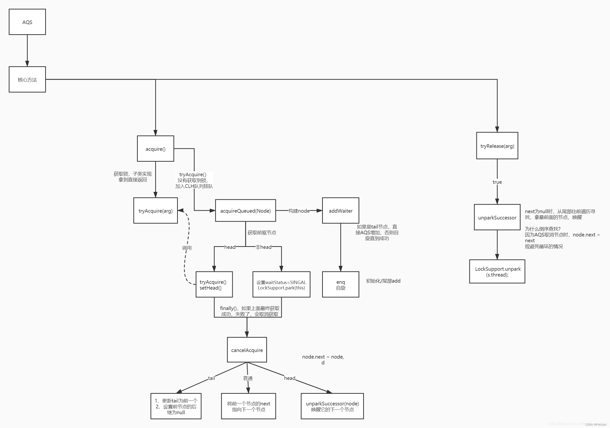
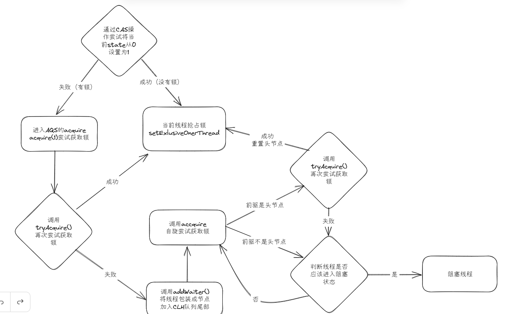

# ReentrantLock
---

- [ReentrantLock](#reentrantlock)
    - [**一、Lock的底层实现核心：AQS框架**](#一lock的底层实现核心aqs框架)
      - [**1. AQS的核心组件**](#1-aqs的核心组件)
      - [**2. AQS的关键方法**](#2-aqs的关键方法)
    - [**二、ReentrantLock的实现细节**](#二reentrantlock的实现细节)
      - [**1. 锁的获取流程**](#1-锁的获取流程)
      - [**2. 锁的释放流程**](#2-锁的释放流程)
    - [**三、公平锁与非公平锁的区别**](#三公平锁与非公平锁的区别)
    - [**四、可中断与超时机制**](#四可中断与超时机制)
      - [**1. 可中断锁（lockInterruptibly()）**](#1-可中断锁lockinterruptibly)
      - [**2. 超时获取锁（tryLock(long timeout, TimeUnit unit)）**](#2-超时获取锁trylocklong-timeout-timeunit-unit)
    - [**五、等待队列（CLH队列变种）**](#五等待队列clh队列变种)
    - [**七、性能优化与注意事项**](#七性能优化与注意事项)


### **一、Lock的底层实现核心：AQS框架**
`AbstractQueuedSynchronizer`（AQS）是Java并发包（`java.util.concurrent.locks`）的核心抽象类，为构建锁和同步器（如`ReentrantLock`、`Semaphore`等）提供基础框架。

#### **1. AQS的核心组件**
- **状态变量（`state`）**：  
  一个`volatile int`类型的变量，表示同步状态。例如，在`ReentrantLock`中：
  - `state = 0`：锁未被占用。
  - `state > 0`：锁被占用，数值表示重入次数。
- **等待队列**：  
  一个双向链表（CLH队列变种），管理等待获取锁的线程。每个节点（`Node`）保存线程引用和状态。

#### **2. AQS的关键方法**
- `tryAcquire(int arg)`：尝试获取锁（需子类实现）。
- `tryRelease(int arg)`：尝试释放锁（需子类实现）。
- `acquire(int arg)`：获取锁（若失败则加入队列并阻塞）。
- `release(int arg)`：释放锁并唤醒后续线程。

  


### **二、ReentrantLock的实现细节**
`ReentrantLock`通过内部类`Sync`（继承AQS）实现锁机制，分为公平锁（`FairSync`）和非公平锁（`NonfairSync`）。

#### **1. 锁的获取流程**
**非公平锁示例**（`NonfairSync.lock()`）：
1. **直接尝试获取锁**：  
   通过`CAS`操作尝试将`state`从0改为1。
  ```java
   final void lock() {
            //1、判断当前state 状态, 没有锁则当前线程抢占锁
            if (compareAndSetState(0, 1))
                // 独占锁
                setExclusiveOwnerThread(Thread.currentThread());
            else
                // 2、锁被人占了，尝试获取锁，关键方法了
                acquire(1);
  }
  ```

2. **进入AQS的acquire()**：  
   - 调用`tryAcquire()`再次尝试获取锁。
   - 若失败，调用`addWaiter(Node.EXCLUSIVE)`将线程包装为节点加入队列尾部。
   - 调用`acquireQueued()`自旋或阻塞线程。
   ```java
     public final void acquire(int arg) {
        if (!tryAcquire(arg) &&
            acquireQueued(addWaiter(Node.EXCLUSIVE), arg))
            selfInterrupt();
    }
    ```

3. **tryAcquire()的实现**：  
   ```java
     final boolean nonfairTryAcquire(int acquires) {
            //1、获取当前线程
            final Thread current = Thread.currentThread();
            // 2、获取当前锁的状态，0 表示没有被线程占有，>0 表示锁被别的线程占有
            int c = getState();
            // 3、如果锁没有被线程占有
            if (c == 0) {
                 // 3.1、 使用CAS去获取锁，   为什么用case呢，防止在获取c之后 c的状态被修改了，保证原子性
                if (compareAndSetState(0, acquires)) {
                    // 3.2、设置独占锁
                    setExclusiveOwnerThread(current);
                    // 3.3、当前线程获取到锁后，直接发挥true
                    return true;
                }
            }
            //　4、判断当前占有锁的线程是不是自己
            else if (current == getExclusiveOwnerThread()) {
                // 4.1 可重入锁，加+1
                int nextc = c + acquires;
                if (nextc < 0) // overflow
                    throw new Error("Maximum lock count exceeded");
                 // 4.2 设置锁的状态
                setState(nextc);
                return true;
            }
            return false;
        }
   ```

4. **addWaiter()的实现**

当前线程没有获得锁的情况下，进入CLH队列
```java
 private Node addWaiter(Node mode) {
 		// 1、初始化当前线程节点，虚拟节点
        Node node = new Node(Thread.currentThread(), mode);
        // Try the fast path of enq; backup to full enq on failure
        // 2、获取尾节点，初始进入节点是null
        Node pred = tail;
        // 3、如果尾节点不为null,怎将当前线程节点放到队列尾部，并返回当前节点
        if (pred != null) {
            node.prev = pred;
            if (compareAndSetTail(pred, node)) {
                pred.next = node;
                return node;
            }
        }
        // 如果尾节点为null（其实是链表没有初始化）,怎进入enq方法
        enq(node);
        return node;
    }
    
   // 这个方法可以认为是初始化链表
   private Node enq(final Node node) {
   		// 1、入队 ： 为什么要用循环呢？  
        for (;;) {
           // 获取尾节点
            Node t = tail;
           // 2、尾节点为null
            if (t == null) { // Must initialize
               // 2.1 初始话头结点和尾节点
                if (compareAndSetHead(new Node()))
                    tail = head;
            } 
            // 3、将当前节点加入链表尾部
            else {
                node.prev = t;
                if (compareAndSetTail(t, node)) {
                    t.next = node;
                    return t;
                }
            }
        }
    }
```

5. **acquireQueued()的实现**：  

addWaiter 方法我们已经将没有获取锁的线程放在了等待链表中，但是这些线程并没有处于等待状态。acquireQueued的作用就是将线程设置为等待状态

```java
 final boolean acquireQueued(final Node node, int arg) {
         // 失败标识
        boolean failed = true;
        try {
            // 中断标识
            boolean interrupted = false;
            for (;;) {
                // 获取当前节点的前一个节点
                final Node p = node.predecessor();
                // 1、如果前节点是头结点，那么去尝试获取锁
                if (p == head && tryAcquire(arg)) {
                    // 重置头结点
                    setHead(node);
                    p.next = null; // help GC
                    // 获得锁
                    failed = false;
                    // 返回false,节点获得锁，，，然后现在只有自己一个线程了这个时候就会自己唤醒自己
                    // 使用的是acquire中的selfInterrupt(); 
                    return interrupted;
                }
                // 2、如果线程没有获得锁，且节点waitStatus=0，shouldParkAfterFailedAcquire并将节点的waitStatus赋值为-1
                //parkAndCheckInterrupt将线程park，进入等待模式，
                if (shouldParkAfterFailedAcquire(p, node) &&
                    parkAndCheckInterrupt())
                    interrupted = true;
            }
        } finally {
            if (failed)
                cancelAcquire(node);
        }
    }

private static boolean shouldParkAfterFailedAcquire(Node pred, Node node) {
        int ws = pred.waitStatus;
        if (ws == Node.SIGNAL)
            /*
             * This node has already set status asking a release
             * to signal it, so it can safely park.
             */
            return true;
        if (ws > 0) {
            /*
             * Predecessor was cancelled. Skip over predecessors and
             * indicate retry.
             */
            do {
                node.prev = pred = pred.prev;
            } while (pred.waitStatus > 0);
            pred.next = node;
        } else {
            /*
             * waitStatus must be 0 or PROPAGATE.  Indicate that we
             * need a signal, but don't park yet.  Caller will need to
             * retry to make sure it cannot acquire before parking.
             */
            compareAndSetWaitStatus(pred, ws, Node.SIGNAL);
        }
        return false;
    }
```

  


#### **2. 锁的释放流程**
1. **调用unlock()**：  
   ```java
   public void unlock() {
       sync.release(1); // 调用AQS的release()
   }
   ```
2. **AQS的release()**：  
   - 调用`tryRelease()`减少`state`值。
```java
    public final boolean release(int arg) {
         // 如果成功释放独占锁，
        if (tryRelease(arg)) {
            Node h = head;
            // 如果头结点不为null，且后续有入队结点
            if (h != null && h.waitStatus != 0)
                //释放当前线程，并激活等待队里的第一个有效节点
                unparkSuccessor(h);
            return true;
        }
        return false;
    }
    // 如果释放锁着返回true,否者返回false
    // 并且将sate 设置为0
 protected final boolean tryRelease(int releases) {
            int c = getState() - releases;
            if (Thread.currentThread() != getExclusiveOwnerThread())
                throw new IllegalMonitorStateException();
            boolean free = false;
            if (c == 0) {
                free = true;
                setExclusiveOwnerThread(null);
            }
            setState(c);
            return free;
        }


  private void unparkSuccessor(Node node) {
        /*
         * If status is negative (i.e., possibly needing signal) try
         * to clear in anticipation of signalling.  It is OK if this
         * fails or if status is changed by waiting thread.
         */
        int ws = node.waitStatus;
        if (ws < 0)
            // 重置头结点的状态waitStatus
            compareAndSetWaitStatus(node, ws, 0);

        /*
         * Thread to unpark is held in successor, which is normally
         * just the next node.  But if cancelled or apparently null,
         * traverse backwards from tail to find the actual
         * non-cancelled successor.
         */
         // 获取头结点的下一个节点
        Node s = node.next;
        // s.waitStatus > 0 为取消状态 ，结点为空且被取消
        if (s == null || s.waitStatus > 0) {
            s = null;
            // 获取队列里没有cancel的最前面的节点
            for (Node t = tail; t != null && t != node; t = t.prev)
                if (t.waitStatus <= 0)
                    s = t;
        }
        // 如果节点s不为null，则获得锁
        if (s != null)
            LockSupport.unpark(s.thread);
    }

``` 
   - 若`state`变为0，唤醒队列中的下一个线程。

### **三、公平锁与非公平锁的区别**
| **特性**       | **非公平锁（NonfairSync）**                  | **公平锁（FairSync）**                      |
|----------------|---------------------------------------------|--------------------------------------------|
| **获取锁策略**  | 直接尝试CAS抢锁，允许插队                     | 检查队列中是否有等待线程，按顺序获取锁        |
| **吞吐量**      | 高（减少线程切换）                           | 较低（保证公平性）                           |
| **实现代码**    | 在`lock()`中直接CAS抢锁                      | 在`tryAcquire()`中检查队列是否有前驱节点      |


### **四、可中断与超时机制**
#### **1. 可中断锁（lockInterruptibly()）**
- 调用`acquireInterruptibly(int arg)`：  
  在获取锁的过程中响应中断，若线程被中断则抛出`InterruptedException`。
- **实现原理**：  
  在自旋或阻塞时检查中断状态，若被中断则取消获取锁。

#### **2. 超时获取锁（tryLock(long timeout, TimeUnit unit)）**
- 调用`tryAcquireNanos(int arg, long nanosTimeout)`：  
  在指定时间内尝试获取锁，超时返回`false`。
- **实现原理**：  
  使用`LockSupport.parkNanos()`实现精确的纳秒级阻塞，结合自旋检查超时条件。


### **五、等待队列（CLH队列变种）**
- **队列结构**：  
  双向链表，每个节点（`Node`）保存线程引用、等待状态（`waitStatus`）和前驱/后继指针。
- **节点状态**：  
  - `CANCELLED (1)`：线程已取消等待。
  - `SIGNAL (-1)`：当前节点释放锁后需唤醒后继节点。
  - `CONDITION (-2)`：节点在条件队列中等待。
- **入队操作**：  
  通过`CAS`将新节点添加到队列尾部，确保线程安全。

### **七、性能优化与注意事项**
1. **减少锁竞争**：  
   - 缩小临界区范围。
   - 使用读写锁（`ReentrantReadWriteLock`）分离读/写操作。
2. **避免死锁**：  
   - 按固定顺序获取锁。
   - 使用`tryLock()`设置超时。
3. **监控工具**：  
   - 使用`jstack`分析线程堆栈。
   - 利用JMC（Java Mission Control）监控锁竞争情况。
