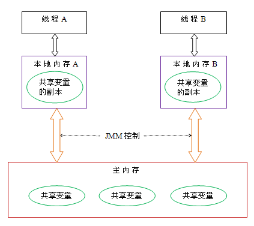

# Java 多线程编程
---

- [Java 多线程编程](#java-多线程编程)
  - [线程概述](#线程概述)
  - [创建线程的方法](#创建线程的方法)
    - [继承Thread类](#继承thread类)
    - [实现Runnable接口](#实现runnable接口)
    - [匿名内部类创建](#匿名内部类创建)
    - [lambda表达式创建Runnable子类对象](#lambda表达式创建runnable子类对象)
  - [Thread类](#thread类)
    - [常见的构造方法](#常见的构造方法)
    - [常用属性](#常用属性)
    - [常用方法](#常用方法)
  - [线程状态](#线程状态)
      - [线程的状态](#线程的状态)
      - [状态转移](#状态转移)
      - [获取线程状态](#获取线程状态)
      - [wait()](#wait)
      - [设置优先级](#设置优先级)
    - [守护线程（Daemon Thread）](#守护线程daemon-thread)
  - [Java 内存模型（JMM）](#java-内存模型jmm)
    - [原子性](#原子性)
    - [可见性](#可见性)
    - [有序性](#有序性)
    - [volatile底层机制——java内存屏障](#volatile底层机制java内存屏障)
      - [内存屏障](#内存屏障)
      - [java内存屏障](#java内存屏障)
  - [无锁](#无锁)
      - [悲观锁与乐观锁](#悲观锁与乐观锁)
      - [CAS](#cas)
  - [线程池](#线程池)
      - [线程池概述](#线程池概述)
      - [`ThreadPoolExecutor`类](#threadpoolexecutor类)
        - [创建线程池](#创建线程池)
        - [提交任务](#提交任务)
        - [任务队列](#任务队列)
        - [拒绝策略](#拒绝策略)
      - [线程池的状态](#线程池的状态)
      - [`Executors` 类](#executors-类)
  - [Callable](#callable)
      - [Future](#future)
      - [FutureTask](#futuretask)
      - [submit()](#submit)
  - [锁（Lock）](#锁lock)
      - [获取锁](#获取锁)
      - [condition](#condition)
      - [ReadWriteLock](#readwritelock)


## 线程概述

**Java中的线程**
- 基于操作系统原生线程实现（1:1线程模型）
- 通过java.lang.Thread类实现线程控制

**与操作系统中线程概念的区别**
- 实现模型：
  - Java线程通过JVM映射到OS线程
  - 早期Green Threads模型（用户级线程）已弃用
- 调度方式：
  - Java线程优先级建议（1-10）最终映射到OS优先级（通常1-5）
  - 实际调度仍由操作系统决定
- 资源分配：
  - OS线程直接分配CPU时间片
  - Java线程通过JVM分配内存资源（堆/方法区）


**进程和线程的区别**
- 进程是包含线程的. 每个进程至少有⼀个线程存在，即主线程。
- 进程和进程之间不共享内存空间. 同⼀个进程的线程之间共享同⼀个内存空间.
- 进程是系统分配资源的最小单位，线程是系统调度的最小单位。
- ⼀个进程挂了⼀般不会影响到其他进程. 但是⼀个线程挂了, 可能把同进程内的其他线程⼀起带走(整个进程崩溃)

  

## 创建线程的方法

### 继承Thread类
- 继承Thread类，并重写run方法
- 创建子类对象，调用start方法启动线程
- 注意：
  - 线程启动后，会自动调用run方法
  - 线程启动后，不能再次调用start方法

```java
public class threadPr extends Thread  {
	@Override
	public void run() {
		System.out.println("这是一个新建的线程");
	}

	public static void main(String[] args) {
		System.out.println("这是主线程");
		threadPr t = new threadPr();
		t.start();
	}
}
```

### 实现Runnable接口
- 实现Runnable接口，并重写run方法
- 创建实现类对象，将实现类对象作为参数传递给Thread类的构造方法
- 创建Thread类对象，调用start方法启动线程

```java
public class MyRunnable implements Runnable  {
    @Override
    public void run() {
        System.out.println("这是一个新建的线程");
    }


    public static void main(String[] args) {
        System.out.println("这是主线程");
        MyRunnable myRunnable = new MyRunnable();
        Thread thread = new Thread(myRunnable);
        thread.start();
    }
}
```
实现Runnable更灵活，避免单继承限制，适合资源共享。

### 匿名内部类创建

```java
public class Iner {
    public static void main(String[] args) {
        Thread t1 = new Thread() {
            @Override
            public void run() {
                System.out.println("这是新建的线程");
            }
        };
        Thread t2 = new Thread(new Runnable()  {
            @Override
            public void run() {
                System.out.println("这是新建的线程");
            }
        });
        t2.start();
        System.out.println("这是主线程");
        t1.start(); 
    } 
}
```

### lambda表达式创建Runnable子类对象

```java
public class Lambda {
    public static void main(String[] args) {
        System.out.println("这是主线程");
        Thread t = new Thread(() -> {
            System.out.println("这是新建的线程");
        });
        t.start();
    }
}
```

## Thread类
### 常见的构造方法
- `Thread()`：创建一个新的线程对象。
- `Thread(Runnable target)`：使用Runnable对象创建一个新的线程对象。
- `Thread(String name)`：创建一个新的线程对象，并指定线程名称。
- `Thread(Runnable target, String name)`：使用Runnable对象创建一个新的线程对象，并指定线程名称。

### 常用属性
- `String : getName()`：获取线程名称。
- `long : getId()`：获取线程ID。
- `int : getPriority()`：获取线程优先级。
- `boolean : isAlive()`：检查线程是否处于活动状态。
- `boolean : isDaemon()`：检查线程是否为守护线程。
- `boolean : isInterrupted()`：检查线程是否被中断。

### 常用方法

**`start()`与`run()`的区别**
- `start()`：启动新线程，JVM调用`run()`方法。
- 直接调用`run()`：不会创建新线程，代码在当前线程执行。

```java
public static void main(String[] args) {
    Thread thread = new Thread(() -> {
        System.out.println("当前线程: " + Thread.currentThread().getName());
    });
    thread.start(); // 输出：当前线程: Thread-0
    thread.run();   // 输出：当前线程: main
}
```

**`sleep()`方法**

让线程休眠指定时间（毫秒），期间线程处于`TIMED_WAITING`状态。

```java
class SleepExample extends Thread {
    @Override
    public void run() {
        try {
            for (int i = 3; i > 0; i--) {
                System.out.println(i);
                Thread.sleep(1000); // 暂停1秒
            }
        } catch (InterruptedException e) {
            e.printStackTrace();
        }
    }
}
```

**`join()`方法**

等待线程终止。例如，主线程等待子线程完成：

```java
public class Main {
    public static void main(String[] args) throws InterruptedException {
        Thread thread = new Thread(() -> {
            try {
                Thread.sleep(2000);
                System.out.println("子线程完成");
            } catch (InterruptedException e) {
                e.printStackTrace();
            }
        });
        thread.start();
        thread.join(); // 主线程等待子线程结束
        System.out.println("主线程继续执行");
    }
}
```

**`interrupt()`中断线程**

通过中断标志位终止线程。若线程在阻塞状态（如`sleep()`），会抛出`InterruptedException`。

```java
class InterruptExample extends Thread {
    @Override
    public void run() {
        try {
            while (!isInterrupted()) {
                System.out.println("运行中...");
                Thread.sleep(1000);
            }
        } catch (InterruptedException e) {
            System.out.println("线程被中断");
        }
    }
}

public class Main {
    public static void main(String[] args) throws InterruptedException {
        InterruptExample thread = new InterruptExample();
        thread.start();
        Thread.sleep(3000);
        thread.interrupt(); // 中断线程
    }
}
```
**`yield()` 让出CPU**

yield 不会改变线程的状态，但会使当前线程让出CPU资源，让其他具有相同或更高优先级的线程运行，让当前线程重新去排队
调用 yield() 方法并不会释放锁或者阻塞当前线程，它只是暂停当前线程的执行，并允许其他线程获得执行。当当前线程被重新调度时，它将继续执行，但并不能保证它会立即被调度。

但是，调用 yield() 方法并不能保证其他线程会获得执行，因为调度器可以选择忽略 yield() 方法的调用。过度使用 yield() 方法可能会导致性能问题，因为频繁的调用 yield() 方法可能会导致线程频繁地切换，从而降低系统的性能。

```java
public class YieldExample {
    public static void main(String[] args) throws InterruptedException {
        Thread t1 = new Thread(new Runnable() {
            @Override
            public void run() {
                while (true) {
                      System.out.println("张三");
                      Thread.yield();
              }
            }
        }, "t1");
        
        t1.start();
        
        Thread t2 = new Thread(new Runnable() {
          @Override
            public void run() {
                while (true) {
                      System.out.println("李四");
                }
            }
        }, "t2");
        t2.start();
    }
}
```

## 线程状态

#### 线程的状态

- **NEW**：系统中的线程还没创建出来，只是有了一个 Thread 对象（已经安排好了工作，但是还未开始行动）。
- **TERMINATED**：系统中的线程已经执行完了，但 Thread 对象还在（工作已经完成了）。
- **RUNNABLE**：就绪状态，有两种可能的情况
  - 线程正在CPU上运行
  - 线程已经准备好随时可以去CPU上运行
 （表示“可工作的”状态；又可以分成正在工作中和即将开始工作）。
- **TIMED_WAITING**：线程正在“指定时间等待”，表示线程在有限时地等待唤醒（等待其它线程发来通知）。一个典型的状况就是线程正在休眠sleep()。
- **BLOCKED**：表示等待获取锁的状态。
- **WAITING**：使用 `wait()` 方法出现，表示线程在无限时等待唤醒（等待其它线程发来通知）。

#### 状态转移

  


#### 获取线程状态

通过`getState()`方法获取线程状态。

```java
Thread thread = new Thread(() -> {
    try {
        Thread.sleep(1000);
    } catch (InterruptedException e) {
        e.printStackTrace();
    }
});
System.out.println(thread.getState()); // NEW
thread.start();
System.out.println(thread.getState()); // RUNNABLE
Thread.sleep(500);
System.out.println(thread.getState()); // TIMED_WAITING
```

#### wait()

在Java中，线程必须持有对象的锁才能调用 wait() 方法。当线程调用 wait() 方法时，它会释放当前持有的锁，并将自己挂起，直到被其他线程唤醒。一旦线程调用了 wait() 方法并释放了锁，其他线程就可以获取该对象的锁并继续执行同步块中的代码。当该线程被唤醒（notify）时，它会重新尝试获取对象的锁并恢复执行。但是，在其它线程未释放锁之前该线程仍然会被阻塞。一旦它获得了对象的锁，它才可以继续执行同步块中的代码。

#### 设置优先级
优先级范围：1（最低）~10（最高），默认5。

```java
Thread thread1 = new Thread(() -> System.out.println("低优先级"));
Thread thread2 = new Thread(() -> System.out.println("高优先级"));
thread1.setPriority(Thread.MIN_PRIORITY); // 1
thread2.setPriority(Thread.MAX_PRIORITY); // 10
thread1.start();
thread2.start();
```

### 守护线程（Daemon Thread）
守护线程在后台运行，JVM在所有非守护线程结束后自动退出。

```java
Thread daemonThread = new Thread(() -> {
    while (true) {
        System.out.println("守护线程运行中...");
    }
});
daemonThread.setDaemon(true); // 设置为守护线程
daemonThread.start();
// 主线程结束后，守护线程自动终止
```

## Java 内存模型（JMM）

Java虚拟机规范中定义的，来屏蔽各个硬件平台和操作系统的内存访问差异，以实现让Java程序在各种平台下都能达到一致的内存访问效果的一种规范。

  

Java内存模型规定所有的变量都是存在主存当中，每个线程都有自己的工作内存。线程的工作内存中保存了该线程中使用到的变量的主内存副本拷贝，线程对变量的所有操作都必须在工作内存中进行，而不能直接对主存进行操作。并且每个线程不能访问其他线程的工作内存，线程之间的通信递需要经过主内存。

和内存模型一样，java内存模型中同样存在原子性，可见性，有序性等问题

### 原子性

在Java中，对基本数据类型的变量的读取和赋值操作是原子性操作，即这些操作是不可被中断的，要么执行，要么不执行

```java
x = 1; // 原子性操作
x = y; // 非原子性操作（读y + 赋值）
```
如果要实现更大范围操作的原子性，可以通过synchronized和Lock来实现

### 可见性

Java提供了 **`volatile`** 关键字来保证可见性。

当一个共享变量被`volatile`修饰时，它会保证修改的值会立即被更新到主存，当有其他线程需要读取时，它会去内存中读取新值，并且会让其它线程对于该变量的缓存失效。

在对volatile修饰的变量做写操作时，jvm会给CPU发送lock前缀指令，强制要求在写操作结束后将修改的值写回主存，然后根据缓存一致性协议，其他线程的工作内存中该变量的缓存失效，从而保证了可见性。

### 有序性

Java内存模型具备一些先天的“有序性”，即不需要通过任何手段就能够得到保证的有序性，这个通常也称为 happens-before（先行发生） 原则。如果两个操作的执行次序无法从happens-before原则推导出来，那么它们就不能保证它们的有序性，虚拟机可以随意地对它们进行重排序。

注意：A happens-before B并不要求A操作一定要在B操作之前，而是说A操作后的结果对B操作是可见的，即如果A操作将a的值修改为1，那么B操作在用到a的值的时候已经知道了a的值为1。


### volatile底层机制——java内存屏障

#### 内存屏障

内存屏障（Memory Barrier）是一种CPU指令，用于控制特定条件下的重排序和内存可见性问题。

**分类**

读屏障（Load Barrier）：
   在指令前插入Load Barrier，可以让高速缓存中的数据失效，强制从新从主内存加载数据。

写屏障（Store Barrier）：
  在指令后插入Store Barrier，能让写入缓存中的最新数据更新写入主内存，让其他线程可见。

**作用**：

- 阻止屏障两侧的指令重排序。

- 强制把写缓冲区/高速缓存中的脏数据等写回主内存，让缓存中相应的数据失效。

#### java内存屏障

同样，Java虚拟机为java程序运行时提供了java内存屏障。

java内存屏障有四种类型

- **LoadLoad屏障**：对于这样的语句Load1； LoadLoad；Load2，在Load2及后续读取操作要读取的数据被访问前，保证Load1要读取的数据被读取完毕。
- **StoreStore屏障**：对于这样的语句Store1；StoreStore；Store2，在Store2及后续写入操作执行前，保证Store1的写入操作对其它处理器可见。
- **LoadStore屏障**：对于这样的语句Load1；LoadStore；Store2，在Store2及后续写入操作被刷出前，保证Load1要读取的数据被读取完毕。
- **StoreLoad屏障**：对于这样的语句Store1；StoreLoad；Load2，在Load2及后续所有读取操作执行前，保证Store1的写入对所有处理器可见。它的开销是四种屏障中最大的。在大多数处理器的实现中，这个屏障是个万能屏障，兼具其它三种内存屏障的功能。

**volatile语义中的内存屏障**：

- 在每个volatile写操作前插入StoreStore屏障，在写操作后插入StoreLoad屏障；

- 在每个volatile读操作前插入LoadLoad屏障，在读操作后插入LoadStore屏障；

## 无锁
#### 悲观锁与乐观锁

**悲观锁**

一种悲观的思想，总是假设最坏的情况，每次去拿数据的时候都认为别人会修改

每次在拿数据的时候都会上锁，这样别人想拿这个数据就会阻塞直到它拿到锁

**乐观锁**

一种乐观的的思想，每次取数据都假设别人不会修改，所以不会上锁。

当需要更新数据时，会检测这个数据是否已经被其他人更新了，如果已经被别人更新过了，就返回让用户自己选择怎么处理。乐观锁适用于读多写少的场景。

**java解决临界区代码安全问题的办法**：

- 阻塞式方法：使用synchronized或者Lock进行加锁。这其实就是一种悲观锁的思想。

- 非阻塞式方法：使用原子变量的方法。这就是一种乐观锁的思想。

#### CAS

java中乐观锁是通过CAS（compare and swap）方式实现的。

**算法思想**

CAS算法有三个操作数，内存地址V，旧值A，新值B。

CAS算法的思想：当需要更新值时，先将旧值A与内存地址V中的值进行比较，如果相同，就说明没有其他人对这个值作更新，此时就可以执行更新操作；如果发现旧值A与内存地址V中的值不同，说明有其他人更新过这个值，此时将旧值A换成别人修改过的值，继续进行检测，直到检测到内存地址V中的值和A的值一样时，就执行更新操作。下面代码来模拟CAS算法。

```java
gradle
public class CAS {

    private int value;  //代表内存地址中的值

    public synchronized int compareAndSwap(int A, int B){    
        //java中实际上没有使用synchronized关键字，而是通过操作硬件实现的
        int oldValue = value;
        if(oldValue == A){  //如果A的值和内存地址中的值相同就进行更新
            value = B;
        }
        return oldValue;   //返回上次内存地址中的值，在更新失败时将此值赋给A
    }
}
```

**CAS的优点**：
- 没有使用锁，不存在死锁的情况。
- 在读多写少的情况下不需要每次都加锁，不会使其他线程阻塞。

**CAS的缺点**：
- 如果线程读写频繁，则循环检测会浪费CPU很多资源。
- 只能保证一个共享变量的原子操作。
- 存在ABA问题

从Java1.5开始JDK提供了AtomicReference类来保证引用对象之间的原子性，可以把多个变量放在一个对象里来进行CAS操作。


**ABA问题**：

如果线程1将A修改为B，线程2又将B修改为A，这时线程C想要修改这个值，他看到的还是A，操作可以顺利进行，但是却不知道A->B->A的这个变化

解决ABA问题可以在CAS方法中加入版本号，每次修改都使版本号加1，这样只要做了修改，版本号就会有变化。


## 线程池

#### 线程池概述

**什么是线程池**

如果同一时刻有大量的任务需要执行，而这些任务又比较简单，那么每次都创建一个新的线程肯定会耗费很多时间。

为了减少创建线程所花费的时间，人们想出了线程池的办法。线程池中预先创建了一定数量的线程，当需要线程执行任务时就从线程池中取，当任务执行完后，线程不会消亡，而是继续执行其它任务。

**优点**
- 减少资源开销：不会每次都创建新线程，而是从线程池中取。
- 提高响应速度：线程已经提前创建好了，需要执行任务时直接用就可以了。
- 便于管理：线程是一种稀缺资源，如果不加以控制，不仅会浪费大量资源，而且可能影响系统的稳定性。使用线程池可以对线程的创建和停止，线程的数量加以控制，使线程处在可控的范围内，不仅便于管理，而且方便调优。

**线程池的构成**：
- 核心线程：已经创建好的并处在运行状态的一定数量的线程，它们不断从阻塞队列中获取任务并执行。
- 阻塞队列：用来存储工作线程来不及处理的任务，当所有的工作线程都被占用后，之后的任务就会进入阻塞队列，等待某个线程执行完后才有机会被处理。

#### `ThreadPoolExecutor`类

**Excutor接口**

ThreadPoolExecutor的顶层接口是 Excutor，位于 java.util.concurrent 包下

该接口中只提供了一个用于接收Runnable类型参数的方法excute(Runnabel task)，用于接收一个任务

```java
public class Demo implements Executor{

    @Override
    public void execute(Runnable r) {
        r.run();   //既可以在execute方法中直接执行任务
        new Thread(r).start();   //也可以新建一个线程去执行任务
    }
}
```

**ExcutorService接口**

ExcutorService 是一个比 Excutor 使用更广泛的子接口，提供了线程生命周期管理的方法。

Excutor 中只有一个用于接收任务的excute方法，该方法没有返回值。而 ExcutorService 的submit()方法可以返回一个Future对象，用来获取任务的执行结果。ExcutorService 拓展了 Excutor，在开发中使用的更多。


下面是两者的区别：

|                 **Executor**                  |                 **ExecutorService**                 |
| :-------------------------------------------: | :-------------------------------------------------: |
| Java 线程池的核心接口，用于并发执行提交的任务 | Executor 接口的扩展，提供异步执行和关闭线程池的方法 |
|    提供 execute() 方法提交任务（无返回值）    |   提供 submit() 方法提交任务（返回 Future 对象）    |
|                 不能取消任务                  |    可通过 Future.cancel() 取消 pending 中的任务     |
|             没有关闭线程池的方法              |      提供 shutdown()/shutdownNow() 关闭线程池       |


**ThreadPoolExecutor**

  

从上面的类图我们看到 ExcutorService 接口的实现类是 AbstractExecutorService，这是一个抽象类，而这个类的子类就是ThreadPoolExecutor

##### 创建线程池

```java
    /**
     * Creates a new {@code ThreadPoolExecutor} with the given initial
     * parameters.
     *
     * @param corePoolSize the number of threads to keep in the pool, even
     *        if they are idle, unless {@code allowCoreThreadTimeOut} is set
     * @param maximumPoolSize the maximum number of threads to allow in the
     *        pool
     * @param keepAliveTime when the number of threads is greater than
     *        the core, this is the maximum time that excess idle threads
     *        will wait for new tasks before terminating.
     * @param unit the time unit for the {@code keepAliveTime} argument
     * @param workQueue the queue to use for holding tasks before they are
     *        executed.  This queue will hold only the {@code Runnable}
     *        tasks submitted by the {@code execute} method.
     * @param threadFactory the factory to use when the executor
     *        creates a new thread
     * @param handler the handler to use when execution is blocked
     *        because the thread bounds and queue capacities are reached
     * @throws IllegalArgumentException if one of the following holds:<br>
     *         {@code corePoolSize < 0}<br>
     *         {@code keepAliveTime < 0}<br>
     *         {@code maximumPoolSize <= 0}<br>
     *         {@code maximumPoolSize < corePoolSize}
     * @throws NullPointerException if {@code workQueue}
     *         or {@code threadFactory} or {@code handler} is null
     */
    public ThreadPoolExecutor(int corePoolSize,
                              int maximumPoolSize,
                              long keepAliveTime,
                              TimeUnit unit,
                              BlockingQueue<Runnable> workQueue,
                              ThreadFactory threadFactory,
                              RejectedExecutionHandler handler) {
        if (corePoolSize < 0 ||
            maximumPoolSize <= 0 ||
            maximumPoolSize < corePoolSize ||
            keepAliveTime < 0)
            throw new IllegalArgumentException();
        if (workQueue == null || threadFactory == null || handler == null)
            throw new NullPointerException();
        this.corePoolSize = corePoolSize;
        this.maximumPoolSize = maximumPoolSize;
        this.workQueue = workQueue;
        this.keepAliveTime = unit.toNanos(keepAliveTime);
        this.threadFactory = threadFactory;
        this.handler = handler;

        String name = Objects.toIdentityString(this);
        this.container = SharedThreadContainer.create(name);
    }
```

其构造函数可以有七个参数：

- corePoolSize：线程池中核心线程的数目。
- maximumPoolSize：线程池允许创建的最大线程数。如果队列满了，并且已创建的线程数小于最大线程数，则线程池会再创建新的救急线程执行任务。
- keepAliveTime：救急线程空闲后存活的时间。
- unit：救急线程存活的时间单位。
- workQueue：任务队列。用来保存等待执行的任务的阻塞队列。
- threadFactory：用于设置创建线程的工厂，可以通过线程工厂给每个创建出来的线程设置更有意义的名字。
- handler：饱和策略。

  

##### 提交任务

通过构造方法创建了线程池之后，可以使用execute()和submit()向线程池中提交任务，这两个方法都是接收 Runnabel 类型的参数


**返回值处理**

- `execute()`
  ```java
  executor.execute(() -> {
      System.out.println("任务执行");
  });
  ```
  - 没有返回值，无法直接获取任务执行结果  
  - 适用于 **不需要返回结果** 的异步任务

- `submit()`
  ```java
  Future<String> future = executor.submit(() -> {
      return "任务结果";
  });
  String result = future.get(); // 阻塞获取结果
  ```
  - 返回 `Future` 对象，可获取任务返回值或异常  
  - 适用于 **需要处理返回值或异常** 的任务

**异常处理**

- `execute()`
  ```java
  executor.execute(() -> {
      try {
          // 业务代码
      } catch (Exception e) {
          // 必须手动处理异常
          e.printStackTrace();
      }
  });
  ```
  - 任务中的未捕获异常会导致线程终止  
  - 必须手动在任务内部处理异常

- `submit()`
  ```java
  Future<?> future = executor.submit(() -> {
      throw new RuntimeException("测试异常");
  });

  try {
      future.get(); // 会抛出 ExecutionException
  } catch (InterruptedException | ExecutionException e) {
      System.out.println("捕获异常: " + e.getCause());
  }
  ```
  - 异常会被封装到 `Future` 中，调用 `future.get()` 时抛出 `ExecutionException`  
  - 可通过 `Future` 统一管理异常

**具体使用示例**

**场景 1：简单异步任务（无返回值）**

```java
// 使用 execute()
executor.execute(() -> {
    System.out.println(Thread.currentThread().getName() + " 执行任务");
});

// 使用 submit() 等效写法
executor.submit(() -> {
    System.out.println(Thread.currentThread().getName() + " 执行任务");
});
```

**场景 2：需要获取任务结果**

```java
// 使用 submit() + Callable
Future<Integer> future = executor.submit(() -> {
    TimeUnit.SECONDS.sleep(1);
    return 42;
});

// 阻塞等待结果
try {
    int result = future.get(); 
    System.out.println("计算结果: " + result);
} catch (InterruptedException | ExecutionException e) {
    e.printStackTrace();
}
```

**异常处理**

```java
// execute() 的异常处理
executor.execute(() -> {
    try {
        throw new RuntimeException("execute() 异常");
    } catch (Exception e) {
        System.out.println("execute() 内部捕获异常");
    }
});

// submit() 的异常处理
Future<?> future = executor.submit(() -> {
    throw new RuntimeException("submit() 异常");
});

try {
    future.get();
} catch (Exception e) {
    System.out.println("通过 Future 捕获异常: " + e.getCause());
}
```

---

**关键特性对比表**

| **特性**               | `execute()`                  | `submit()`                   |
|:------------------------:|:------------------------------:|:------------------------------:|
| 返回值                 | 无                           | 返回 `Future` 对象           |
| 支持的任务类型         | 仅 `Runnable`                | `Runnable` 和 `Callable`     |
| 异常传播方式           | 直接抛出导致线程终止         | 封装到 `Future` 中           |
| 结果获取               | 无法直接获取                 | 通过 `Future.get()` 获取     |
| 是否阻塞               | 非阻塞                       | `Future.get()` 会阻塞        |
| 适用场景               | 简单异步任务                 | 需要结果/异常管理的复杂任务  |


**基础使用示例----场景：处理 10 个任务**
```java
public class BasicExample {
    public static void main(String[] args) {
        // 创建线程池（核心2线程，最大4线程，队列容量2）
        ThreadPoolExecutor executor = new ThreadPoolExecutor(
            2, 
            4,
            60, TimeUnit.SECONDS,
            new ArrayBlockingQueue<>(2),
            new ThreadPoolExecutor.CallerRunsPolicy()
        );

        // 提交10个任务
        for (int i = 1; i <= 10; i++) {
            final int taskId = i;
            executor.execute(() -> {
                System.out.println(Thread.currentThread().getName() 
                    + " 执行任务 " + taskId);
                try {
                    Thread.sleep(1000); // 模拟任务耗时
                } catch (InterruptedException e) {
                    e.printStackTrace();
                }
            });
        }

        executor.shutdown(); // 关闭线程池
    }
}
```
```plaintext
运行结果分析：
pool-1-thread-1 执行任务 1
pool-1-thread-2 执行任务 2
pool-1-thread-3 执行任务 5  // 当队列满时创建新线程
pool-1-thread-4 执行任务 6  // 达到最大线程数4
main 执行任务 9            // 触发拒绝策略（CallerRunsPolicy）
pool-1-thread-1 执行任务 7  // 核心线程复用
```

##### 任务队列

在 Java 的 `ThreadPoolExecutor` 中，任务队列（`BlockingQueue<Runnable>`）是决定线程池行为和性能的关键组件之一。不同的队列类型会影响任务的排队策略、线程池的扩展机制以及资源管理方式。

**`ArrayBlockingQueue`（数组实现的有界队列）**

**特性：**
- **基于数组**的固定容量队列，需指定队列容量（如 `new ArrayBlockingQueue<>(100)`）。
- **先进先出（FIFO）** 顺序处理任务。
- 队列满时，新提交的任务会触发线程池的 **拒绝策略**（如抛出异常或创建新线程）。

```java
    new ArrayBlockingQueue<>(2), // 容量为2
```

**适用场景：**
- **资源受限环境**：需严格控制队列长度，避免内存溢出（OOM）。
- **稳定负载场景**：任务提交速率可预测，队列容量能覆盖短期峰值。
- **需要显式拒绝策略**：当队列满时，希望立即触发拒绝策略，而不是无限制堆积任务。

**缺点：**
- 容量固定，可能因队列过小导致频繁触发拒绝策略。

**`ArrayBlockingQueue`原理**

- `ArrayBlockingQueue`内部是通过 `Object[]` 数组保存数据的，本质上是通过数组实现的，ArrayBlockingQueue的大小即数组的容量·

- `ArrayBlockingQueue`中包含一个`ReentrantLock`对象(可重入的互斥锁)，`ArrayBlockingQueue`就是根据该互斥锁实现“多线程对竞争资源的互斥访问”。同时，还可在创建时指定使用公平锁还是非公平锁（默认非公平锁）

- ArrayBlockingQueue中包含两个Condition对象(notEmpty和notFull)，通过Condition可以实现对ArrayBlockingQueue的更精确的访问
  - 某线程(线程A)要取数据时，数组正好为空，则该线程会执行notEmpty.await()进行等待；当其它某个线程(线程B)向数组中插入了数据之后，会调用notEmpty.signal()唤醒“notEmpty上的等待线程”。此时，线程A会被唤醒从而得以继续运行。
  - 若某线程(线程H)要插入数据时，数组已满，则该线程会它执行notFull.await()进行等待；当其它某个线程(线程I)取出数据之后，会调用notFull.signal()唤醒“notFull上的等待线程”。此时，线程H就会被唤醒从而得以继续运行。


**`LinkedBlockingQueue`（链表实现的无界/有界队列）**

**特性：**
- **基于链表**，默认无界（容量为 `Integer.MAX_VALUE`，约21亿），也可通过构造函数指定容量。
- **先进先出（FIFO）** 顺序处理任务。
- 无界队列时，新任务会无限堆积，直到内存耗尽；有界队列满时触发拒绝策略。

```java
// 无界队列（默认）
BlockingQueue<Runnable> unboundedQueue = new LinkedBlockingQueue<>();

// 有界队列（容量100）
BlockingQueue<Runnable> boundedQueue = new LinkedBlockingQueue<>(100);
```

**适用场景：**
- **高吞吐场景**：任务处理速度快，队列仅用于短期缓冲。
- **突发流量**：需要临时缓冲大量任务（如秒杀活动）。
- **无需严格拒绝策略**：允许任务在队列中等待较长时间。

**缺点：**
- 无界队列可能导致内存溢出
  
**`SynchronousQueue`（同步移交队列）**

**特性：**
- **不存储元素**，每个插入操作必须等待另一个线程的移除操作。
- 提交的任务直接交给空闲线程处理，若无线程空闲且未达最大线程数，则创建新线程。
- 队列“容量”始终为0，任务无法排队。

```java
ThreadPoolExecutor executor = new ThreadPoolExecutor(
    2, 4, 60, TimeUnit.SECONDS,
    new SynchronousQueue<>(),
    new ThreadPoolExecutor.AbortPolicy()
);
```

**适用场景：**
- **高响应需求**：任务需立即执行，拒绝排队延迟。
- **线程池快速扩展**：希望尽快创建新线程处理任务（如 `newCachedThreadPool` 使用此队列）。
- **短任务场景**：任务执行时间短，避免线程频繁创建销毁的开销。

**缺点：**
- 任务无法缓冲，若线程数已达最大值且无空闲线程，立即触发拒绝策略。

---

**`PriorityBlockingQueue`（优先级无界队列）**

**特性：**
- **无界队列**，任务按优先级排序（需实现 `Comparable` 或提供 `Comparator`）。
- 优先级高的任务先执行，同优先级按 FIFO 处理。
- 可能导致内存溢出，需谨慎使用。

```java
BlockingQueue<Runnable> priorityQueue = new PriorityBlockingQueue<>(
    10, // 初始容量
    Comparator.comparing(Task::getPriority) // 自定义优先级规则
);
```

**适用场景：**
- **任务优先级区分**：需按优先级处理任务（如 VIP 用户请求优先处理）。
- **动态调整执行顺序**：任务优先级可能在队列中动态变化。

**缺点：**
- 无界队列可能导致内存溢出。
- 实现复杂，需自定义比较逻辑。

**`DelayedWorkQueue`（延迟队列，用于 `ScheduledThreadPoolExecutor`）**

**特性：**
- 专用于延迟执行或周期性任务（如 `ScheduledThreadPoolExecutor`）。
- 任务按延迟时间排序，到期后才会被取出执行。
- 内部基于堆结构实现，保证延迟最短的任务优先执行。

```java
ScheduledThreadPoolExecutor scheduler = new ScheduledThreadPoolExecutor(2);
scheduler.schedule(
    () -> System.out.println("延迟5秒执行"),
    5, TimeUnit.SECONDS
);
```

**适用场景：**
- **定时任务**：如延迟执行、周期性任务（心跳检测、缓存刷新）。


| **队列类型**          | **核心线程满时行为**       | **队列满时行为**             | **最大线程满时行为**       |
|:-----------------------:|:---------------------------:|:-----------------------------:|:---------------------------:|
| `ArrayBlockingQueue`  | 任务入队                  | 创建新线程（直到最大线程数） | 触发拒绝策略              |
| `LinkedBlockingQueue` | 任务入队                  | 创建新线程（仅当有界队列满） | 触发拒绝策略（仅当有界）  |
| `SynchronousQueue`    | 直接创建新线程（若未达最大）| 队列始终“满”，触发拒绝策略   | 触发拒绝策略              |
| `PriorityBlockingQueue` | 任务按优先级入队         | 无界队列永不触发拒绝策略     | 无界队列永不触发拒绝策略    |   
| `DelayedWorkQueue`   | 创建新线程（仅当有界队列满） | 无界队列永不触发拒绝策略     | 无界队列永不触发拒绝策略    |

**生产环境建议**
- **避免无界队列**：优先使用有界队列（如 `ArrayBlockingQueue` 或指定容量的 `LinkedBlockingQueue`），防止内存溢出。
- **结合拒绝策略**：队列满时，合理选择拒绝策略（如记录日志、降级处理）。
-  **监控队列大小**：通过 `executor.getQueue().size()` 实时监控，调整队列容量和线程数。
-  **优先级队列慎用**：仅在明确需要优先级调度时使用，避免复杂度增加。

##### 拒绝策略

**拒绝策略对比**

| 策略类                           | 行为                                  |
|----------------------------------|---------------------------------------|
| `AbortPolicy`（默认）           | 抛出RejectedExecutionException       |
| `CallerRunsPolicy`              | 由调用者线程直接执行任务              |
| `DiscardPolicy`                 | 静默丢弃被拒绝的任务                  |
| `DiscardOldestPolicy`           | 丢弃队列最旧的任务，尝试重新提交      |


**自定义拒绝策略**
```java
// 自定义日志记录+重试机制
class CustomRejectionHandler implements RejectedExecutionHandler {
    @Override
    public void rejectedExecution(Runnable r, ThreadPoolExecutor executor) {
        System.out.println("任务被拒绝，尝试重新提交...");
        if (!executor.isShutdown()) {
            try {
                executor.getQueue().put(r); // 阻塞直到有空间
            } catch (InterruptedException e) {
                Thread.currentThread().interrupt();
            }
        }
    }
}
```
#### 线程池的状态

线程池使用 int 的高三位来存储线程池的状态，其它的位数用来存储线程的数量，这些信息用是原子变量 ctl 来进行存储的。之所以这么做是为了只进行一次 CAS 操作就可以既改变线程池的状态，又可以改变线程池中线程的数量。

线程池共有五种状态：
- RUNNING（运行状态）：线程池被创建后就处于RUNNIG状态，接受新任务，并且也能处理阻塞队列中的任务。
- SHUTDOWN（关闭状态）：不接受新任务，但可以处理阻塞队列中的任务。
- STOP（停止状态）：中断正在执行的任务，并且抛弃阻塞队列的任务。
- TIDYIDNG（整理状态）：如果所有的任务都执行完了，线程池就会进入该状态。该状态会执行 terminated 方法进入TERMINATED。
- TERMINATED（终止状态）：执行完 terminated 方法后就会进入该状态，默认 terminated 方法什么也不做。


**监控线程池状态**

```java
// 在任务执行过程中添加监控
System.out.println("活跃线程数: " + executor.getActiveCount());
System.out.println("已完成任务数: " + executor.getCompletedTaskCount());
System.out.println("队列大小: " + executor.getQueue().size());
```

#### `Executors` 类

`Executors` 是 Java 并发包 (`java.util.concurrent`) 中的一个工厂类，用于快速创建不同类型的线程池。它通过静态方法提供了多种线程池的实现，简化了线程池的配置过程。

**newCachedThreadPool()**

创建一个可缓存的线程池。这个线程池的线程数量可以根据需要自动扩展，如果有可用的空闲线程，就会重用它们；如果没有可用的线程，就会创建一个新线程。适用于执行大量的短期异步任务。

- **适用场景**：处理大量短时任务（如 HTTP 请求）。
  
```java
ExecutorService executor = Executors.newCachedThreadPool();

for (int i = 0; i < 10; i++) {
    executor.submit(() -> {
        System.out.println("Task executed by " + Thread.currentThread().getName());
        try {
            Thread.sleep(1000); // 模拟短时任务
        } catch (InterruptedException e) {
            e.printStackTrace();
        }
    });
}

executor.shutdown(); // 关闭线程池
```

**newFixedThreadPool(int nThreads)**

- **特点**：固定线程数量，不会自动扩展，无空闲线程回收。
- **适用场景**：资源受限环境（如数据库连接池），固定数量的长期任务。
- **示例**：

```java
ExecutorService executor = Executors.newFixedThreadPool(3);

for (int i = 0; i < 5; i++) {
    executor.submit(() -> {
        System.out.println("FixedPool Task - " + Thread.currentThread().getName());
        try {
            Thread.sleep(2000);
        } catch (InterruptedException e) {
            e.printStackTrace();
        }
    });
}

executor.shutdown();
```


**newSingleThreadExecutor()**
- **特点**：单线程串行执行任务。
- **适用场景**：保证任务顺序执行（如日志写入）。
- **示例**：

```java
ExecutorService executor = Executors.newSingleThreadExecutor();

executor.submit(() -> System.out.println("Task 1"));
executor.submit(() -> System.out.println("Task 2"));
executor.submit(() -> System.out.println("Task 3"));

executor.shutdown();
```


**newScheduledThreadPool(int corePoolSize)**
- **特点**：支持定时或周期性任务。
- **适用场景**：心跳检测、定时数据同步。
- **示例**：

```java
ScheduledExecutorService scheduler = Executors.newScheduledThreadPool(2);

// 延迟 3 秒后执行
scheduler.schedule(() -> System.out.println("Delayed Task"), 3, TimeUnit.SECONDS);

// 周期性任务：首次延迟 1 秒，之后每 2 秒执行一次
scheduler.scheduleAtFixedRate(() -> 
    System.out.println("Periodic Task - " + new Date()), 
    1, 2, TimeUnit.SECONDS
);

// 运行一段时间后关闭
Thread.sleep(10000);
scheduler.shutdown();
```

**newWorkStealingPool(int parallelism)**

- **特点**：创建一个工作窃取线程池，线程数量根据CPU核心数动态调整
- **适用场景**：适用于CPU密集型的任务。

```java
    int parallelism = Runtime.getRuntime().availableProcessors();
    ExecutorService executorService = Executors.newWorkStealingPool(parallelism);

    for (int i = 0; i < 10; i++) {
        final int taskId = i;
        executorService.submit(() -> {
            System.out.println("Task " + taskId + " is running on thread " + Thread.currentThread().getName());
        });
    }

    executorService.shutdown();
```

**注意事项**
- **资源泄漏风险**：必须调用 `shutdown()` 关闭线程池。
- **阿里规约警告**：不建议直接使用 `Executors`，推荐通过 `ThreadPoolExecutor` 构造函数显式指定参数（避免 `newFixedThreadPool` 和 `newCachedThreadPool` 的潜在 OOM 问题）。
- **自定义参数**：如需调整线程池行为（如拒绝策略），需手动创建 `ThreadPoolExecutor`。


## Callable

`Callable` 和 `Future` 是 Java 并发编程中用于处理异步任务返回结果的工具。与 `Runnable` 不同，`Callable` 允许任务返回值或抛出异常，而 `Future` 则用于获取异步任务的结果或状态。

**与 Runnable 的区别**

| **特性**               | **Runnable**                     | **Callable**                     |
|------------------------|----------------------------------|----------------------------------|
| **返回值**             | 无 (`void`)                     | 有 (泛型 `T`)                   |
| **异常处理**           | 不能抛出受检异常                | 可抛出受检异常                  |
| **提交到线程池的方法** | `execute(Runnable)` 或 `submit` | `submit(Callable)`              |


####  Future

`Future` 是一个接口，它表示一个异步计算的结果。它提供了获取任务结果的方法，以及取消任务的方法。

**Future 的常用方法**

| **方法**                   | **说明**                                                                 |
|---------------------------|--------------------------------------------------------------------------|
| `get()`                   | 阻塞直到任务完成并返回结果                                               |
| `get(long timeout, TimeUnit unit)` | 阻塞指定时间，超时抛出 `TimeoutException`                                 |
| `isDone()`                | 返回任务是否完成（正常结束、异常或取消）                                 |
| `cancel(boolean mayInterruptIfRunning)` | 尝试取消任务，`true` 表示允许中断运行中的任务                           |
| `isCancelled()`           | 返回任务是否被取消                                                        |

```java
public class TestFuture {

    public static void main(String[] args) throws InterruptedException, ExecutionException {

        ExecutorService executor = Executors.newFixedThreadPool(3);

        System.out.println("任务不想做，让其它线程去处理吧" + System.currentTimeMillis());

        Future<String> future = executor.submit(()->{    //提交任务
            System.out.println("我正在执行任务....." + System.currentTimeMillis());
            Thread.sleep(20000);
            return "任务完成~~" + System.currentTimeMillis();
        });

        System.out.println("主线程继续执行" + System.currentTimeMillis());

        int count = 0;
        while( !future.isDone() ){     //判断任务是否完成
            System.out.println("--- 任务还没有完成 ---");
            Thread.sleep(1000);
            count++;
            if(count == 5){
                future.cancel(true);    //如果任务执行时间过长，我们可以取消任务
            }
        }

        //String result = future.get();   //调用get方法如果其它线程还没有返回结果，会阻塞主线程直到其它线程返回结果
        //调用了 get() 时，如果任务被取消了，会抛出 CancellationException 异常。
        //所以这里不能直接 get()，需要先判断任务是否被取消了。
        if( !future.isCancelled() ){
            String result = future.get();   //调用get方法如果其它线程还没有返回结果，会阻塞主线程直到其它线程返回结果
            System.out.println("返回结果是: " + result);
        }else {
            System.out.println("任务已被取消！！");
        }   

        executor.shutdown();    //关闭线程池
    }
}
```

**超时控制**

避免因任务长时间未完成导致主线程阻塞：

```java
try {
    // 最多等待 1 秒，超时抛出 TimeoutException
    Integer result = future.get(1, TimeUnit.SECONDS);
} catch (TimeoutException e) {
    System.out.println("任务超时，取消任务");
    future.cancel(true); // 中断任务
}
```

#### FutureTask

`FutureTask` 是一个 `Future` 的实现类，实现了 RunnableFuture 接口，见名知意，RunnableFuture 接口同时继承了 Runnable 接口和 Future 接口

具有 Runnable 的特性，创建类继承 RunnableFuture 接口并重写 run() 后，可以创建线程来执行这个任务。

```java
public class TestRunnableFuture implements RunnableFuture {     //将RunnableFuture当做Runnbale来使用

    @Override
    public void run() {                                 //可以将该类的对象作为Runnable类型的任务提交给一个线程执行
        System.out.println("重写run方法，线程会执行");      // new Thread(testRunnableFuture).start(); 创建线程来执行
    }
}
```

具有 Future 的特性，可以获取任务的返回值（只有使用 Callable 提交的任务才有返回值）

**重写的run()**

```java
public void run() {
      // 如果状态不是 NEW，说明任务已经执行过或者已经被取消，直接返回
      // 如果状态是 NEW，则尝试把执行线程保存在 runnerOffset（runner字段），如果赋值失败，则直接返回
    if (state != NEW ||
        !UNSAFE.compareAndSwapObject(this, runnerOffset,
                                     null, Thread.currentThread()))
        return;
    try {
          // 获取构造函数传入的 Callable 值
        Callable<V> c = callable;
        if (c != null && state == NEW) {
            V result;
            boolean ran;
            try {
                  // 正常调用 Callable 的 call 方法就可以获取到返回值
                result = c.call();
                ran = true;
            } catch (Throwable ex) {
                result = null;
                ran = false;
                  // 保存 call 方法抛出的异常, CAS操作
                setException(ex);
            }
            if (ran)
                  // 保存 call 方法的执行结果, CAS操作
                set(result);
        }
    } finally {        
        runner = null;       
        int s = state;
          // 如果任务被中断，则执行中断处理
        if (s >= INTERRUPTING)
            handlePossibleCancellationInterrupt(s);
    }
}
```

通过构造方法中Executor类的使用，可以把Runnable 类型的任务转换成 Callable 类型的任务

```java
public FutureTask(Runnable runnable, V result) {
    this.callable = Executors.callable(runnable, result);
    this.state = NEW;       // ensure visibility of callable
}

public FutureTask(Callable<V> callable) {
    if (callable == null)
        throw new NullPointerException();
    this.callable = callable;
    this.state = NEW;       // ensure visibility of callable
}
```

不管是 Runnable 还是 Callable 类型，FutureTask 都会把其封装成 Callable。如果是 Runnable 类型，就调用 Executors.callable()，该方法可以把 Runnable 类型的任务变成 Callable 类型。

```java
public class TestFutureTask {

    public static void main(String[] args) throws ExecutionException, InterruptedException {

        FutureTask<String> futureTask = new FutureTask<>(()->{
            System.out.println("正在执行任务");
            System.out.println(Thread.currentThread().getName());
            try {
                Thread.sleep(5000);
            } catch (InterruptedException e) {
                e.printStackTrace();
            }
        }, "我是返回值");        //这是一个Runnable类型的任务

        //既可以通过线程池来执行FutureTask提交的任务
        ExecutorService exector = Executors.newFixedThreadPool(3);
        exector.submit(futureTask);

        //也可以通过新建一个线程来执行FutureTask提交的任务
        new Thread(futureTask).start();

        while( !futureTask.isDone() ){
           System.out.println("--- 任务还没有执行完 ---");
           Thread.sleep(1000);
        }

        String result = futureTask.get();

        System.out.println(result);

        exector.shutdown();
    }
}
```

#### submit()

`submit()` 方法是 `ExecutorService` 接口提供的一个方法，用于提交一个 `Runnable` 或 `Callable` 任务到执行器中执行。该方法返回一个 `Future` 对象，该对象可以用来获取任务执行的结果。

submit() 既可以接收 Runnable 类型的参数，也可以接收 Callable 类型的参数，然后将其封装到一个 FutureTask 对象中，因为 FutureTask  间接实现了 Runnable 接口，所以在 submit() 中可以直接使用 execute() 来执行这个任务并且通过返回 FutureTask  对象来获取任务的返回值以及其他信息。

```java
public abstract class AbstractExecutorService implements ExecutorService {

    protected <T> RunnableFuture<T> newTaskFor(Runnable runnable, T value) {
        return new FutureTask<T>(runnable, value);
    }

    protected <T> RunnableFuture<T> newTaskFor(Callable<T> callable) {
        return new FutureTask<T>(callable);
    }

    public Future<?> submit(Runnable task) {
        if (task == null) throw new NullPointerException();
        RunnableFuture<Void> ftask = newTaskFor(task, null);
        execute(ftask);
        return ftask;
    }

    public <T> Future<T> submit(Runnable task, T result) {
        if (task == null) throw new NullPointerException();
        RunnableFuture<T> ftask = newTaskFor(task, result);
        execute(ftask);
        return ftask;
    }

    public <T> Future<T> submit(Callable<T> task) {
        if (task == null) throw new NullPointerException();
        RunnableFuture<T> ftask = newTaskFor(task);
        execute(ftask);
        return ftask;
    }
}
```

 - FutureTask 类中有一个 Callable 类型的成员变量 callable，通过构造方法创建一个对象
   - 如果是 Callable 类型的任务，就直接将该 Callable 任务的实例赋值给成员变量 callable。
   - 如果是 Runnable 类型的任务，在构造方法中需要显示的设置返回值 result 对象，通过构造方法调用 Executors.callable()， 而 callable() 中是通过 RunnableAdapter  类的构造方法将 Runnable 任务和 result 返回值封装成 Callable 对象。
 - 因为 FutureTask 间接实现了 Runnable 接口，所以我们既可以在线程池中提交 FutureTask 中的任务，也可以创建一个新的线程来执行这个任务。
 - FutureTask  对象可以直接获取任务的返回值，所以在线程池中使用时，只是将 FutureTask 当做 Runnable 类型的任务在使用，不需要再通过 submit() 返回的 FutureTask 对象来获取返回值。比如下面的例子

```java
public class TestFutureTask {

    public static void main(String[] args) throws ExecutionException, InterruptedException {

        ExecutorService exector = Executors.newFixedThreadPool(3);  //通过线程池来使用FutureTask


        FutureTask<String> futureTask = new FutureTask<>(()->{
            System.out.println("正在执行任务");
            System.out.println(Thread.currentThread().getName());
            try {
                Thread.sleep(5000);
            } catch (InterruptedException e) {
                e.printStackTrace();
            }
        }, "我是返回值");        //这是一个Runnable类型的任务

        //只是将futureTask当做 Runnable 类型的任务
        Future<String> future1 = exector.submit(futureTask, "我不是任务的返回值");

        while( !future1.isDone() ){
           System.out.println("--- 任务还没有执行完 ---");
           Thread.sleep(1000);
        }

        String result = futureTask.get();

        String result1 = future1.get();

        System.out.println("futureTask.get() = " + result);  //futureTask.get() = 我是返回值
        System.out.println("future1.get() = " + result1);  //future1.get() = 我不是任务的返回值

        exector.shutdown();
    }
}
```

## 锁（Lock）

Lock 是 java.util.concurrent.locks 包下的接口，Lock 实现提供了比 synchronized 关键字更广泛的锁操作，它能以更优雅的方式处理线程同步问题。

**lock接口中的方法**

```java
public interface Lock {
    
    // 获取锁  
    void lock()

    // 如果当前线程未被中断，则获取锁，可以响应中断  
    void lockInterruptibly()

    // 返回绑定到此 Lock 实例的新 Condition 实例  
    Condition newCondition()

    // 仅在调用时锁为空闲状态才获取该锁，可以响应中断  
    boolean tryLock()

    // 如果锁在给定的等待时间内空闲，并且当前线程未被中断，则获取锁  
    boolean tryLock(long time, TimeUnit unit)

    // 释放锁  
    void unlock()
}
```

#### 获取锁

**lock()**

使用lock()获取锁，如果锁已被其他线程获取，则进行等待，必须主动去释放锁，并且在发生异常时，不会自动释放锁。
因此，一般来说，使用 Lock 必须在 try…catch 块中进行，并且将释放锁的操作放在 finally 块中进行，以保证锁一定被被释放，防止死锁的发生


```java
Lock lock = ...;
lock.lock();
try{
    //处理任务
}catch(Exception ex){

}finally{
    lock.unlock();   //释放锁
} 
```

**tryLock()**

tryLock() 是有返回值的，它表示用来尝试获取锁，如果获取成功，则返回 true；如果获取失败（即锁已被其他线程获取），则返回 false，也就是说，这个方法无论如何都会立即返回（在拿不到锁时不会一直在那等待）。

```java
Lock lock = ...;
if(lock.tryLock()) {
     try{
         //处理任务
     }catch(Exception ex){

     }finally{
         lock.unlock();   //释放锁
     } 
}else {
    //如果不能获取锁，则直接做其他事情
}
```

**tryLock(long time, TimeUnit unit)**

tryLock(long time, TimeUnit unit) 和 tryLock() 是类似的，只不过区别在于这个方法在拿不到锁时会等待一定的时间，在时间期限之内如果还拿不到锁，就返回 false，同时可以响应中断。如果一开始拿到锁或者在等待期间内拿到了锁，则返回 true。

**lockInterruptibly()**

`lockInterruptibly()` 允许线程在等待锁的过程中**响应中断**。与普通的 `lock()` 方法不同，`lockInterruptibly()` 在获取锁的阻塞期间，若线程被其他线程调用 `interrupt()` 中断，会立即抛出 `InterruptedException`，从而使线程能够退出等待状态并处理中断

**核心特性**
- **可中断性**：线程在等待锁时可以被外部中断。
- **异常处理**：若线程被中断，会抛出 `InterruptedException`，需捕获处理。
- **适用场景**：需要避免线程因长时间等待锁而无法终止的场景（如死锁预防、任务取消）。

```java
import java.util.concurrent.locks.Lock;
import java.util.concurrent.locks.ReentrantLock;

public class LockInterruptiblyDemo {
    private static final Lock lock = new ReentrantLock();

    public static void main(String[] args) throws InterruptedException {
        // 线程1：先获取锁并长期持有
        Thread thread1 = new Thread(() -> {
            lock.lock();
            try {
                System.out.println("Thread1 获取锁，将长期持有...");
                Thread.sleep(10000); // 模拟长时间占用锁
            } catch (InterruptedException e) {
                e.printStackTrace();
            } finally {
                lock.unlock();
                System.out.println("Thread1 释放锁");
            }
        });

        // 线程2：尝试通过 lockInterruptibly() 获取锁
        Thread thread2 = new Thread(() -> {
            try {
                System.out.println("Thread2 尝试获取锁...");
                lock.lockInterruptibly(); // 可中断的锁获取
                try {
                    System.out.println("Thread2 成功获取锁");
                } finally {
                    lock.unlock();
                }
            } catch (InterruptedException e) {
                System.out.println("Thread2 在等待锁时被中断！");
            }
        });

        thread1.start();
        Thread.sleep(100); // 确保 thread1 先获取锁
        thread2.start();

        // 主线程等待一段时间后中断 thread2
        Thread.sleep(2000);
        thread2.interrupt(); // 中断 thread2 的等待
    }
}
```

**输出**：
```bash
Thread1 获取锁，将长期持有...
Thread2 尝试获取锁...
Thread2 在等待锁时被中断！  (2秒后输出)
Thread1 释放锁             (10秒后输出)
```

**注意事项**
- 使用 `lockInterruptibly()` 时，必须处理中断异常（`InterruptedException`），否则可能导致线程意外终止。
- 即使发生中断，仍需在 `finally` 块中检查锁的持有状态并释放锁，避免死锁。

**中断的语义**  
   - 线程被中断后，会立即退出锁等待队列。  
   - 中断是协作式的：线程需主动检查中断状态或捕获异常，才能响应中断。

**与 `tryLock()` 的区别**  
   - `tryLock()` 支持超时和非阻塞尝试，但不直接响应中断。  
   - `lockInterruptibly()` 专门用于可中断的阻塞等待。

**应用场景**
- **死锁预防**：当检测到潜在死锁时，中断某个等待锁的线程以打破僵局。
- **任务取消**：若线程需要执行一个可能长时间阻塞的任务，可通过中断终止其等待。
- **响应式系统**：在需要快速响应外部事件（如用户取消操作）的系统中，避免线程无限制等待。


#### condition

在使用 synchronized 进行同步的情况中，每个锁对象都关联着一个 Monitor 对象，我们称之为监视器。Monitor 不仅实现了线程同步，还提供了 wait() 和 notify() 等方法实现了线程间的通信。与 synchronized 类似，每个 Lock 对象也关联着另一个对象来实现线程间的通信，而这个对象就是 Condition。

| 对比项                            | Object监视器                                 | Condition                                                                 |
|-----------------------------------|---------------------------------------------|---------------------------------------------------------------------------|
| **前置条件**                      | 获取对象的锁                                | 1. 调用`Lock.lock()`获取锁<br>2. 通过`Lock.newCondition()`获取Condition对象 |
| **调用方式**                      | 直接调用`Object.notify()`                   | 直接调用`condition.await()`                                               |
| **等待队列个数**                  | 一个                                        | 多个                                                                      |
| **释放锁进入等待状态**            | 支持                                        | 支持                                                                      |
| **等待中响应中断**                | 不支持                                      | 支持                                                                      |
| **支持超时等待**                  | 支持                                        | 支持                                                                      |
| **支持定时等待**                  | 不支持                                      | 支持                                                                      |
| **唤醒单个线程**                  | 支持`notify()`                              | 支持`condition.signal()`                                                  |
| **唤醒全部线程**                  | 支持`notifyAll()`                           | 支持`condition.signalAll()`                                               |

**核心方法**
| **方法**               | **说明**                                                                 |
|------------------------|--------------------------------------------------------------------------|
| `await()`              | 释放锁并进入等待状态，直到被唤醒或中断。                                  |
| `awaitUninterruptibly()` | 类似 `await()`，但不响应中断。                                           |
| `awaitNanos(long)`     | 在指定纳秒时间内等待，超时后自动唤醒。                                    |
| `signal()`             | 唤醒一个等待在此条件上的线程（类似 `notify()`）。                         |
| `signalAll()`          | 唤醒所有等待在此条件上的线程（类似 `notifyAll()`）。                      |


**使用示例：生产者-消费者模型**
```java
public class ProducerConsumerDemo {
    private final Queue<Integer> queue = new LinkedList<>();
    private final int capacity = 5;
    private final Lock lock = new ReentrantLock();
    private final Condition notFull = lock.newCondition();  // 队列未满条件
    private final Condition notEmpty = lock.newCondition(); // 队列非空条件

    // 生产者方法
    public void produce(int value) throws InterruptedException {
        lock.lock();
        try {
            // 队列已满，生产者等待
            while (queue.size() == capacity) {
                notFull.await();
            }
            queue.add(value);
            System.out.println("生产: " + value + "，队列大小: " + queue.size());
            notEmpty.signal(); // 唤醒一个消费者
        } finally {
            lock.unlock();
        }
    }

    // 消费者方法
    public int consume() throws InterruptedException {
        lock.lock();
        try {
            // 队列为空，消费者等待
            while (queue.isEmpty()) {
                notEmpty.await();
            }
            int value = queue.poll();
            System.out.println("消费: " + value + "，队列大小: " + queue.size());
            notFull.signal(); // 唤醒一个生产者
            return value;
        } finally {
            lock.unlock();
        }
    }

    public static void main(String[] args) {
        ProducerConsumerDemo demo = new ProducerConsumerDemo();

        // 生产者线程
        new Thread(() -> {
            for (int i = 1; i <= 10; i++) {
                try {
                    demo.produce(i);
                    Thread.sleep(100);
                } catch (InterruptedException e) {
                    e.printStackTrace();
                }
            }
        }).start();

        // 消费者线程
        new Thread(() -> {
            for (int i = 1; i <= 10; i++) {
                try {
                    demo.consume();
                    Thread.sleep(200);
                } catch (InterruptedException e) {
                    e.printStackTrace();
                }
            }
        }).start();
    }
}
```


**Condition 的优势**

- **多条件队列**
  - **传统 `wait()`/`notify()`**：一个对象的监视器只能有一个等待队列，无法区分不同条件。
  - **`Condition`**：通过多个 `Condition` 对象管理不同条件的线程。  
    例如：生产者等待 `notFull`，消费者等待 `notEmpty`，唤醒更精准。

- **更灵活的唤醒策略**
  - **精准唤醒**：通过 `signal()` 唤醒特定条件的线程，避免无效竞争。
  - **减少虚假唤醒**：结合 `while` 循环检查条件，防止虚假唤醒（如 `await()` 返回后需重新检查条件）。

- **支持超时和中断**
  - **超时控制**：`awaitNanos()`/`await(long, TimeUnit)` 避免无限等待。
  - **可中断等待**：`await()` 响应中断，提升程序健壮性。


**超时等待**
```java
lock.lock();
try {
    boolean isConditionMet = notEmpty.await(2, TimeUnit.SECONDS);
    if (isConditionMet) {
        // 条件满足
    } else {
        // 超时处理
    }
} finally {
    lock.unlock();
}
```

**不可中断等待**
```java
lock.lock();
try {
    notEmpty.awaitUninterruptibly(); // 不响应中断
} finally {
    lock.unlock();
}
```

**应用场景**
- **生产者-消费者模型**：精准控制生产者和消费者的等待与唤醒。
- **线程池任务调度**：根据任务队列状态动态调整工作线程。
- **阻塞队列实现**：如 `ArrayBlockingQueue` 内部依赖 `Condition`。
- **复杂状态依赖**：多条件协调的场景（如交通信号灯控制）。


#### ReadWriteLock

ReadWriteLock 是一种锁，它允许多个线程同时进行读操作，但当一个线程进行写操作时，其他线程会被阻塞。

```java
public interface ReadWriteLock {
    /**
     * Returns the lock used for reading.
     * 返回读锁
     * @return the lock used for reading
     */
    Lock readLock();

    /**
     * Returns the lock used for writing.
     * 返回写锁 
     * @return the lock used for writing
     */
    Lock writeLock();
}
```

一个简单的ReadWriteLock实现：
```java
import java.util.concurrent.locks.Condition;
import java.util.concurrent.locks.Lock;
import java.util.concurrent.locks.ReentrantLock;

public class SimpleReadWriteLock {
    // 内部维护的读锁和写锁状态
    private int readCount = 0;      // 当前持有读锁的线程数
    private int writeCount = 0;     // 写锁的重入次数（0 表示无写锁）
    private Thread writeOwner;      // 写锁持有线程（用于重入判断）

    // 同步控制的核心锁
    private final Lock syncLock = new ReentrantLock();
    // 条件变量：写锁等待队列（写线程在此等待）
    private final Condition writeCondition = syncLock.newCondition();
    // 条件变量：读锁等待队列（读线程在此等待）
    private final Condition readCondition = syncLock.newCondition();

    // 读锁对象
    public Lock readLock() {
        return new ReadLock();
    }

    // 写锁对象
    public Lock writeLock() {
        return new WriteLock();
    }

    //------------------------ 读锁实现 ------------------------
    private class ReadLock implements Lock {
        @Override
        public void lock() {
            syncLock.lock();
            try {
                // 如果有写锁被持有，且不是当前线程持有写锁（即非锁降级），则等待
                while (writeCount > 0 && writeOwner != Thread.currentThread()) {
                    readCondition.await();
                }
                readCount++;
            } catch (InterruptedException e) {
                Thread.currentThread().interrupt();
            } finally {
                syncLock.unlock();
            }
        }

        @Override
        public void unlock() {
            syncLock.lock();
            try {
                readCount--;
                if (readCount == 0) {
                    // 唤醒等待的写线程
                    writeCondition.signal();
                }
            } finally {
                syncLock.unlock();
            }
        }
    }

    //------------------------ 写锁实现 ------------------------
    private class WriteLock implements Lock {
        @Override
        public void lock() {
            syncLock.lock();
            try {
                // 如果已有写锁持有者，且不是当前线程，则等待
                while (writeCount > 0 && writeOwner != Thread.currentThread()) {
                    writeCondition.await();
                }
                // 如果有读锁被持有，等待
                while (readCount > 0) {
                    writeCondition.await();
                }
                writeCount++;
                writeOwner = Thread.currentThread(); // 记录写锁持有者
            } catch (InterruptedException e) {
                Thread.currentThread().interrupt();
            } finally {
                syncLock.unlock();
            }
        }

        @Override
        public void unlock() {
            syncLock.lock();
            try {
                writeCount--;
                if (writeCount == 0) {
                    writeOwner = null;
                    // 优先唤醒等待的写线程（避免写线程饥饿）
                    writeCondition.signal();
                    // 唤醒所有读线程
                    readCondition.signalAll();
                }
            } finally {
                syncLock.unlock();
            }
        }
    }
}
```
