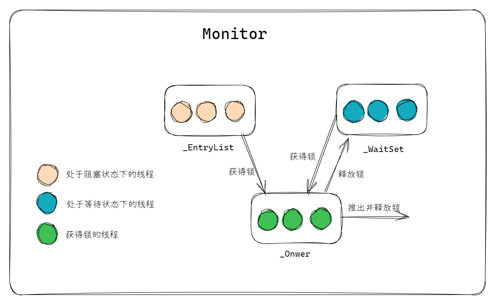

# **synchronized**
---

- [**synchronized**](#synchronized)
    - [**一、`synchronized` 的基本用法**](#一synchronized-的基本用法)
    - [**二、`synchronized` 的底层实现**](#二synchronized-的底层实现)
      - [**对象头与 Monitor 机制**](#对象头与-monitor-机制)
      - [**同步方法的底层实现**](#同步方法的底层实现)
      - [**同步代码块的实现**](#同步代码块的实现)
    - [**三、锁升级**](#三锁升级)
      - [**无锁（No Lock）**](#无锁no-lock)
      - [**偏向锁（Biased Locking）**](#偏向锁biased-locking)
      - [**轻量级锁（Lightweight Lock）**](#轻量级锁lightweight-lock)
      - [**重量级锁（Heavyweight Lock）**](#重量级锁heavyweight-lock)
    - [**四、`synchronized` 的特性**](#四synchronized-的特性)
    - [**五、锁粗化（Lock Coarsening）**](#五锁粗化lock-coarsening)
    - [**六、锁消除（Lock Elimination）**](#六锁消除lock-elimination)
    - [**synchronized 与 volatile 的对比**](#synchronized-与-volatile-的对比)
    - [**synchronized 与 Lock 的对比**](#synchronized-与-lock-的对比)


在Java中，`synchronized` 关键字是用于实现线程同步的核心机制，旨在解决多线程并发访问共享资源时的**数据竞争**和**可见性**问题。它的本质是通过对代码块或方法的加锁，确保同一时间只有一个线程可以执行被保护的代码，从而保证线程安全性。以下是 `synchronized` 的全面解析：

### **一、`synchronized` 的基本用法**
`synchronized` 可以修饰以下三种范围：
1. **实例方法**  
   ```java
   public synchronized void method() {
       // 同步代码：锁是当前实例对象（this）
   }
   ```
   - 锁对象为当前类的**实例对象**（`this`）。
   - 同一实例的多个线程调用此方法时会互斥。

2. **静态方法**  
   ```java
   public static synchronized void staticMethod() {
       // 同步代码：锁是当前类的Class对象（如 MyClass.class）
   }
   ```
   - 锁对象为当前类的**Class对象**（`MyClass.class`）。
   - 所有线程调用该静态方法时会互斥。

3. **代码块**  
   ```java
   public void blockMethod() {
       synchronized (lockObject) {
           // 同步代码：锁是手动指定的对象（lockObject）
       }
   }
   ```
   - 锁对象为显式指定的任意对象（`lockObject`）。
   - 粒度更细，可减少锁竞争的范围。

### **二、`synchronized` 的底层实现**
#### **对象头与 Monitor 机制**
**对象头（Object Header）**  
  
每个Java对象在内存中分为三部分：**对象头**、实例数据和对齐填充。对象头中存储了与锁相关的信息：
  
- **Mark Word**：记录对象的哈希码、分代年龄、锁状态标志等。
- **Klass Pointer**：指向对象所属类的元数据（Class 对象）。

**Monitor（管程/监视器）**  

 `synchronized` 的锁机制基于 **Monitor** 实现，每个对象关联一个 Monitor（由 JVM 隐式创建）。

**Monitor 包含以下关键字段：**

```c
ObjectMonitor() {
    _header       = NULL;
    _count        = 0; //锁的计数器，获取锁时count数值加1，释放锁时count值减1，直到
    _waiters      = 0, //等待线程数
    _recursions   = 0; //锁的重入次数
    _object       = NULL; 
    _owner        = NULL; //指向持有ObjectMonitor对象的线程地址
    _WaitSet      = NULL; //处于wait状态的线程，会被加入到_WaitSet
    _WaitSetLock  = 0 ;
    _Responsible  = NULL ;
    _succ         = NULL ;
    _cxq          = NULL ; //阻塞在EntryList上的单向线程表
    FreeNext      = NULL ;
    _EntryList    = NULL ; //处于等待锁block状态的线程，会被加入到该列表
    _SpinFreq     = 0 ;
    _SpinClock    = 0 ;
    OwnerIsThread = 0 ;
  }
```

**获取与释放**

获取Monitor和释放Monitor的流程如下：

- 当多个线程同时访问同步代码块时，首先会进入到EntryList中，然后通过CAS的方式尝试将Monitor中的owner字段设置为当前线程，同时count加1，若发现之前的owner的值就是指向当前线程的，recursions也需要加1。如果CAS尝试获取锁失败，则进入到EntryList中。
- 当获取锁的线程调用wait()方法，则会将owner设置为null，同时count减1，recursions减1，当前线程加入到WaitSet中，等待被唤醒。
- 当前线程执行完同步代码块时，则会释放锁，count减1，recursions减1。当recursions的值为0时，说明线程已经释放了锁。

  


#### **同步方法的底层实现**

**方法访问标志（ACC_SYNCHRONIZED）**

`synchronized`修饰方法时，JVM会通过方法的**访问标志**（`ACC_SYNCHRONIZED`）隐式实现同步，**而非显式插入`monitorenter`和`monitorexit`指令**。  

- **验证字节码**：  
  使用`javap -v`反编译示例代码的字节码，可以看到方法的访问标志包含`ACC_SYNCHRONIZED`：  
  ```java
  private synchronized void add();
    descriptor: ()V
    flags: ACC_PRIVATE, ACC_SYNCHRONIZED  // 关键标志
    Code:
      stack=2, locals=1, args_size=1
        0: getstatic     #2  // 获取静态变量i
        3: iconst_1
        4: iadd
        5: putstatic     #2  // 更新静态变量i
        8: return
  ```
  - **关键点**：同步方法的字节码中**没有`monitorenter`和`monitorexit`指令**，而是通过`ACC_SYNCHRONIZED`标志触发同步机制。

**隐式的锁获取与释放**
  
- **调用方法时**：JVM会隐式地获取**方法所属对象的监视器锁**（对于实例方法，锁是`this`；对于静态方法，锁是`Class`对象）。  

- **方法执行期间**：锁由当前线程持有，其他线程无法进入该方法。  

- **方法返回时**：JVM自动释放锁（无论正常返回还是异常退出）。


以示例代码`private synchronized void add()`为例：  
1. **调用方法时**：  
   - 线程尝试获取锁（`this`对象关联的Monitor）。  
   - 若锁未被占用，线程成为Monitor的`owner`，执行方法。  
   - 若锁已被占用，线程进入`EntryList`队列阻塞等待。  

2. **执行方法逻辑**：  
   - 线程持有锁期间，其他线程无法进入该方法。  
   - 示例中的`i++`操作（非原子操作）被保护为原子性操作。  

3. **方法返回时**：  
   - JVM自动释放锁，唤醒`EntryList`中的线程竞争锁。  

#### **同步代码块的实现**

当`synchronized`修饰代码块时，字节码中会显式插入`monitorenter`和`monitorexit`指令：  

```java
public void blockSync() {
    synchronized (this) {
        i++;
    }
}
```
对应字节码：
```java
0: aload_0
1: dup
2: astore_1
3: monitorenter    // 显式获取锁
4: getstatic #2
7: iconst_1
8: iadd
9: putstatic #2
12: aload_1
13: monitorexit     // 显式释放锁（正常退出）
14: goto 22
17: astore_2
18: aload_1
19: monitorexit     // 显式释放锁（异常退出）
20: aload_2
21: athrow
22: return
```


| **特性**         | **同步方法**                          | **同步代码块**                      |
|------------------|-------------------------------------|-------------------------------------|
| **锁的粒度**      | 整个方法                            | 显式指定的代码块                     |
| **字节码指令**    | 无`monitorenter/monitorexit`       | 显式插入`monitorenter/monitorexit` |
| **锁对象**        | 隐式锁（实例方法锁`this`/静态方法锁`Class`） | 显式指定锁对象                       |
| **异常处理**      | JVM自动释放锁                        | 需通过`monitorexit`确保释放          |


**非静态方法操作静态变量的风险**  

示例中的`i`是静态变量，但`add()`是非静态同步方法。此时：  
  - 锁对象是实例（`this`），但静态变量属于类级别，多实例并发调用时仍存在线程安全问题。  
  - **正确做法**：若需保护静态变量，应使用静态同步方法（`static synchronized`）。


### **三、锁升级**

Java早期版本的 `synchronized` 直接使用重量级锁（依赖操作系统互斥量），导致线程阻塞和唤醒的**上下文切换开销巨大**。为了优化性能，JVM引入**锁升级机制**（又称锁膨胀），根据竞争强度动态调整锁状态，平衡性能与安全性。

锁升级的四个阶段：  
**无锁 → 偏向锁 → 轻量级锁 → 重量级锁**

#### **无锁（No Lock）**
- **状态特征**：  
  对象刚被创建时，未被任何线程访问，Mark Word中未存储锁信息。
- **适用场景**：  
  对象未被任何线程访问，或所有线程仅读取共享变量（无竞争）。

#### **偏向锁（Biased Locking）**
**核心思想**：  

假设锁始终由同一线程访问，通过记录线程ID避免重复竞争。

**引入偏向锁的目的**：

减少只有一个线程执行同步代码块时的性能消耗，即在没有其他线程竞争的情况下，一个线程获得了锁。
  
**实现机制**：  

  1. **初次加锁**：  
     当第一个线程访问同步代码时：  
     - 通过 **CAS** 将Mark Word中的线程ID（占用54位）设置为当前线程ID。  
     - 锁标志位变为 **101（偏向锁）**。  
  2. **重入检查**：  
     后续同一线程访问时，直接检查线程ID是否匹配，若匹配则直接执行代码，无需CAS操作。  
  3. **偏向锁撤销**：  
     当其他线程尝试获取锁时：  
     - JVM暂停持有偏向锁的线程（Stop The World）。  
     - 若原线程已退出同步代码，则撤销偏向锁，升级为无锁状态。  
     - 若原线程仍活跃，则升级为轻量级锁。

**适用场景**：  

单线程重复访问同步代码（如循环调用同步方法）。


**JVM参数**：  
```bash
-XX:+UseBiasedLocking          # 启用偏向锁（JDK 15后默认禁用）
-XX:BiasedLockingStartupDelay=0 # 关闭偏向锁延迟（默认延迟4秒）
```

#### **轻量级锁（Lightweight Lock）**
**核心思想**：  
  
一种自旋锁，通过线程**自旋**（CAS重试）避免线程阻塞，减少上下文切换。

**实现机制**：  
  
  1. **加锁过程**：  
     - JVM在当前线程栈帧中创建**锁记录（Lock Record）**，存储对象Mark Word的拷贝，并将Lock Record中的owner指向当前对象。 
     - 通过 **CAS** 将对象头Mark Word替换为指向锁记录的指针，并将锁标志位改为 **00（轻量级锁）**。  
     - 若成功，线程获得锁；若失败，触发自旋（默认自旋10次，可通过 `-XX:PreBlockSpin` 调整）。  
  2. **自旋成功**：  
     线程在自旋期间获得锁，继续执行同步代码。  
  3. **自旋失败**：  
     升级为重量级锁，未获取锁的线程进入阻塞状态。

**适用场景**：  

低并发、同步代码执行时间短（如简单计数器）。

**性能权衡**：  
  - **优点**：避免线程阻塞，减少上下文切换。  
  - **缺点**：自旋消耗CPU资源，长时间自旋可能导致性能下降。

#### **重量级锁（Heavyweight Lock）**
**核心思想**：  

依赖操作系统底层的 **Mutex Lock** 实现线程阻塞与唤醒。

**实现机制**：  
  1. 当锁升级为重量级锁时，Mark Word中存储指向**Monitor对象**的指针，锁标志位为 **10**。  
  2. 未获取锁的线程进入阻塞状态，由操作系统调度唤醒。  
  3. 线程唤醒后重新竞争锁。

**适用场景**：  

高并发、同步代码执行时间长（如复杂业务逻辑）。

**性能问题**：

线程阻塞和唤醒涉及**用户态与内核态切换**，开销较大。


| **转换方向**         | **触发条件**                                                                 |
|----------------------|-----------------------------------------------------------------------------|
| 无锁 → 偏向锁        | 第一个线程访问同步代码，且偏向锁未禁用。                                      |
| 偏向锁 → 轻量级锁    | 其他线程尝试获取锁，且原线程已释放锁或仍在活跃状态。                          |
| 轻量级锁 → 重量级锁  | 自旋超过阈值（默认10次）或等待线程数超过CPU核心数的一半。                     |
| 重量级锁 → 无锁      | 锁被释放且无其他线程竞争。                                                  |


对象头中的Mark Word在不同锁状态下存储不同内容（以64位JVM为例）：

| **锁状态**   | **存储内容**                              | **标志位** |
|--------------|------------------------------------------|-----------|
| 无锁         | 对象哈希码、分代年龄                     | 001       |
| 偏向锁       | 线程ID、Epoch、分代年龄、偏向模式        | 101       |
| 轻量级锁     | 指向栈中锁记录的指针                     | 00        |
| 重量级锁     | 指向Monitor对象的指针                    | 10        |
| GC标记       | 空（用于垃圾回收）                       | 11        |


### **四、`synchronized` 的特性**
1. **可重入性（Reentrant）**  
   同一线程可以重复获取同一把锁（避免死锁）。  
   ```java
   synchronized void methodA() {
       methodB();  // 允许：当前线程已持有锁
   }
   synchronized void methodB() {}
   ```

2. **内存可见性**  
   通过 `synchronized` 保护的代码块，能保证：
   - 线程释放锁时，所有修改会**强制刷新到主内存**。
   - 线程获取锁时，会**从主内存重新加载共享变量**。

3. **线程阻塞与唤醒**  
   - `wait()`、`notify()`、`notifyAll()` 必须在 `synchronized` 代码块内调用。
   - 通过 Monitor 的 `_WaitSet` 管理等待线程。

**优点**
- **简单易用**：语法简洁，自动加锁/释放锁。
- **线程安全**：天然支持可重入性和内存可见性。
- **JVM 优化**：锁升级机制（偏向锁、轻量级锁）提升性能。

**缺点**
- **性能开销**：重量级锁涉及操作系统互斥量，上下文切换成本高。
- **不可中断**：线程阻塞后无法被中断，只能等待锁释放。
- **粒度固定**：锁的粒度由代码块或方法定义，灵活性较差（相比 `ReentrantLock`）。


### **五、锁粗化（Lock Coarsening）**

**核心思想**

若代码中存在**连续的多个细粒度同步块**（尤其是循环体内的同步操作），频繁的加锁/释放锁会导致性能损耗。
JVM检测到多个相邻的同步块对**同一锁对象**进行加锁时，将这些同步块合并为单个更大的同步块，减少锁操作次数。

**触发条件**
- **连续同步块**：  
  多个同步块在代码中连续出现，且使用同一锁对象。
- **循环内的同步操作**：  
  在循环体内重复加锁同一对象（常见于遍历共享集合时的同步操作）。

```java
//优化前：
public void process(List<String> list) {
    for (String s : list) {
        synchronized (this) {  // 每次循环都加锁/解锁
            System.out.println(s);
        }
    }
}

//优化后：锁粗化
public void process(List<String> list) {
    synchronized (this) {  // 合并为一次加锁/解锁
        for (String s : list) {
            System.out.println(s);
        }
    }
}
```

**性能影响**
- **优点**：减少锁操作次数，降低上下文切换开销。  
- **缺点**：同步块范围扩大，可能增加锁竞争的概率。


### **六、锁消除（Lock Elimination）**

**核心思想**

某些同步代码的锁对象**仅被当前线程访问**（无逃逸），此时同步操作是多余的。
JVM通过**逃逸分析（Escape Analysis）** 判断锁对象是否可能被其他线程访问，若不可能，则直接移除锁操作。

**触发条件**
- **锁对象无逃逸**：  
  对象仅在当前线程的栈帧中创建和使用，未传递到堆或全局变量中。
- **同步代码无实际竞争**：  
  锁保护的操作不存在多线程竞争的可能。

```java
public String concat(String s1, String s2) {
    StringBuffer sb = new StringBuffer();  // 局部变量，未逃逸
    synchronized (sb) {                    // 锁消除：sb不会被其他线程访问
        sb.append(s1);
        sb.append(s2);
    }
    return sb.toString();
}

//优化后：锁操作被移除
public String concat(String s1, String s2) {
    StringBuffer sb = new StringBuffer();  // 锁操作被移除
    sb.append(s1);
    sb.append(s2);
    return sb.toString();
}
```

**逃逸分析的关键点**
- **对象逃逸类型**：  
  - **不逃逸**：对象仅在方法内使用。  
  - **方法逃逸**：对象作为返回值或参数传递到其他方法。  
  - **线程逃逸**：对象被赋值给其他线程可访问的变量。  
- **JVM参数**：  
  ```bash
  -XX:+DoEscapeAnalysis   # 启用逃逸分析（默认开启）
  -XX:+EliminateLocks     # 启用锁消除（默认开启）
  ```

**注**

1. **避免过度同步**：  
   - 仅在必要处使用`synchronized`，减少锁粗化和锁消除的触发条件。  
   - 优先使用线程安全类（如`ConcurrentHashMap`）而非显式同步。

2. **利用局部变量**：  
   - 将锁对象限制在方法内部（无逃逸），促进锁消除优化。

3. **监控优化效果**：  
   - 使用JVM参数打印优化日志：  
     ```bash
     -XX:+PrintEscapeAnalysis    # 查看逃逸分析结果
     -XX:+PrintEliminateLocks    # 查看锁消除日志
     ```


### **synchronized 与 volatile 的对比**

| **特性**               | **synchronized**                                 | **volatile**                                  |
|------------------------|-------------------------------------------------|-----------------------------------------------|
| **作用范围**            | 代码块或方法                                      | 变量                                           |
| **内存可见性**          | 保证（通过锁的获取与释放强制刷新内存）              | 保证（直接读写主内存，禁止指令重排序）           |
| **原子性**              | 保证（锁机制确保代码块原子执行）                   | 不保证（仅单次读/写原子，复合操作非原子）         |
| **线程阻塞**            | 会阻塞线程（竞争失败时进入阻塞状态）                | 不会阻塞线程（仅强制内存可见性）                 |
| **重排序限制**          | 通过锁的规则限制重排序                             | 通过内存屏障禁止重排序                          |
| **适用场景**            | 多线程共享资源的复杂同步操作                        | 单变量的可见性控制（如状态标志位）               |

### **synchronized 与 Lock 的对比**

| **特性**               | **synchronized**                                 | **Lock（如ReentrantLock）**                    |
|------------------------|-------------------------------------------------|-----------------------------------------------|
| **锁类型**              | 隐式锁（自动获取与释放）                          | 显式锁（需手动`lock()`和`unlock()`）            |
| **实现方式**            | JVM 内置实现（基于Monitor机制）                   | Java API 实现（基于AQS框架）                    |
| **可中断性**            | 不可中断（阻塞线程需等待锁释放）                   | 可中断（支持`lockInterruptibly()`方法）          |
| **公平性**              | 非公平锁（默认）                                  | 可配置公平锁或非公平锁                          |
| **条件变量**            | 通过`wait()`/`notify()`实现                       | 通过`Condition`对象实现（支持多个条件队列）       |
| **异常处理**            | 自动释放锁（异常退出时由JVM处理）                  | 需在`finally`块中手动释放锁（否则可能死锁）       |
| **锁状态查询**          | 不支持                                           | 支持（如`isLocked()`、`hasQueuedThreads()`）     |
| **性能**                | 优化后性能接近显式锁（低竞争场景高效）              | 高竞争场景更灵活（支持超时、尝试获取锁等）        |
| **适用场景**            | 简单同步逻辑（少量代码块）                         | 复杂同步需求（如超时锁、公平锁、多条件等待）      |
