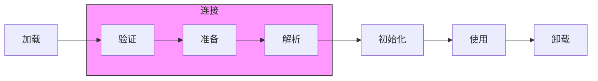

- [堆、栈、静态区](#堆栈静态区)
- [String str="i"与 String str=new String("i")一样吗？](#string-stri与-string-strnew-stringi一样吗)
- [能够重写一个函数需要满足哪些条件，哪些方法不能重写](#能够重写一个函数需要满足哪些条件哪些方法不能重写)
- [方法重写 vs 方法重载（Overload）](#方法重写-vs-方法重载overload)
- [执行顺序](#执行顺序)
- [final 和 static 的区别](#final-和-static-的区别)
- [Java的常用集合](#java的常用集合)
- [java 中创建线程的方式](#java-中创建线程的方式)
- [JDK、JRE与JVM之间的关系：](#jdkjre与jvm之间的关系)
- [Java 的类加载机制](#java-的类加载机制)
- [`==` 和 `equals()` 的区别](#-和-equals-的区别)
- [`final`](#final)
- [Object类](#object类)
  - [7. **多线程相关方法**](#7-多线程相关方法)
- [成员变量与局部变量](#成员变量与局部变量)
- [动态代理](#动态代理)
  - [**输出结果**](#输出结果)
- [**动态代理的原理**](#动态代理的原理)
  - [**1. 动态代理的底层实现**](#1-动态代理的底层实现)
  - [**2. 核心流程**](#2-核心流程)
- [**动态代理的局限性**](#动态代理的局限性)
- [**动态代理的应用场景**](#动态代理的应用场景)
- [**总结**](#总结)


### 堆、栈、静态区

**1. 堆（Heap）**
- **作用**：存放所有**对象实例**和**数组**（通过 `new` 关键字创建的对象）。
- **特点**：
  - 由 JVM 自动管理，通过垃圾回收（GC）机制回收不再使用的对象。
  - 线程共享，所有线程都可以访问堆中的对象。
  - 生命周期不确定，对象存活时间由引用是否可达决定。
  - 可能抛出 `OutOfMemoryError`（内存不足时）。
- **示例**：
  ```java
  Object obj = new Object(); // 对象实例存储在堆中，变量 obj 的引用存储在栈中。
  ```
**2. 栈（Stack）**
- **作用**：存储**方法调用**的栈帧、局部变量和部分结果。
  - 每个线程有独立的栈，存放其方法的执行上下文。
  - 每个方法调用会创建一个栈帧（存储局部变量表、操作数栈等）。
- **特点**：
  - 存放**基本数据类型**（如 `int`, `double`）和**对象引用**（地址指针）。
  - 内存分配和释放由编译器自动完成（方法结束或线程结束时弹出栈帧）。
  - 可能抛出 `StackOverflowError`（递归过深或栈帧过多时）。
- **示例**：
  ```java
  void method() {
      int x = 10;      // 基本类型变量 x 的值直接存储在栈中。
      String s = "abc";// 引用变量 s 存储在栈中，实际字符串对象可能存储在堆或字符串常量池。
  }
  ```

**3. 静态区（Static Area / 方法区）**
- **作用**：存放**类元数据**、**静态变量**、**常量**（如字符串常量池）和 JIT 编译后的代码。
  - **静态变量**（`static` 修饰的变量）属于类级别，所有实例共享。
  - **常量**（`final` 修饰的常量）和字符串字面量通常存储在运行时常量池。
- **特点**：
  - 线程共享，生命周期与 JVM 一致。
  - 在 Java 8 后，方法区的实现从“永久代（PermGen）”改为“元空间（Metaspace）”（使用本地内存，避免 `OutOfMemoryError`）。
- **示例**：
  ```java
  class MyClass {
      static int count = 0; // 静态变量 count 存储在静态区。
      final String NAME = "Java"; // 常量 NAME 存储在运行时常量池（静态区的一部分）。
  }
  ```

---

**对比总结**
| **区域**     | **存储内容**                     | **线程安全** | **生命周期**       | **内存管理**       |
|--------------|----------------------------------|--------------|--------------------|--------------------|
| **堆**       | 对象实例、数组                   | 线程共享     | 由垃圾回收 （GC）机制回收         | 动态分配           |
| **栈**       | 局部变量、方法调用栈帧           | 线程私有     | 方法结束自动释放   | 编译器自动分配     |
| **静态区**   | 类元数据、静态变量、常量池       | 线程共享     | 与 JVM 生命周期一致 | JVM 管理           |


### String str="i"与 String str=new String("i")一样吗？

不一样，因为内存的分配方式不一样。String str="i"的方式，java 虚拟机会将其分配到常量池中；而 String str=new String("i") 则会被分到堆内存中。


### 能够重写一个函数需要满足哪些条件，哪些方法不能重写

**方法重写（Override）的条件**

1. **继承关系**  
   必须存在继承关系（子类继承父类）或接口实现关系（类实现接口）。

2. **方法签名一致**  
   子类方法的 **方法名、参数列表、返回类型** 必须与父类方法完全一致（返回类型可以是父类返回类型的子类，称为**协变返回类型**）。

3. **访问权限不能更严格**  
   子类方法的访问修饰符权限不能比父类方法更严格。例如：  
   - 父类方法是 `public` → 子类方法必须是 `public`。  
   - 父类方法是 `protected` → 子类方法可以是 `protected` 或 `public`，但不能是 `private` 或 `default`。

4. **异常范围不能扩大**  
   子类方法抛出的异常类型不能比父类方法更宽泛（可以抛出更具体的异常或不抛出异常）。

5. **非静态方法**  
   只能重写父类的**实例方法**（非 `static` 方法）。

**不能重写的方法**：以下类型的方法无法被重写：

1. **`static` 方法（静态方法）**
- 静态方法是与类绑定的，而不是对象。  
- 子类可以定义与父类同名的 `static` 方法，但这属于 **方法隐藏（Method Hiding）**，不是重写。  

2. **`final` 方法**
- 用 `final` 修饰的方法表示不可修改，子类无法重写。  

3. **`private` 方法**
- `private` 方法是类私有的，子类无法访问，因此不能重写。  
- 即使子类定义同名方法，也视为子类的新方法，与父类无关。  

4. **构造方法（Constructor）**
- 构造方法名必须与类名相同，因此不能继承，也无法重写。


            |


**总结**
- **可重写**：父类的非 `static`、非 `final`、非 `private` 的实例方法。  
- **不可重写**：`static`、`final`、`private` 方法以及构造方法。  
- **注解**：使用 `@Override` 注解可以显式声明重写，帮助编译器检查是否符合重写规则。  


### 方法重写 vs 方法重载（Overload）
| **对比项**       | **重写（Override）**                          | **重载（Overload）**                  |
|------------------|-----------------------------------------------|---------------------------------------|
| **作用范围**     | 子类与父类之间                                | 同一类内                              |
| **方法签名**     | 必须完全相同（方法名、参数列表、返回类型）    | 方法名相同，参数列表不同               |
| **访问权限**     | 子类方法不能更严格                            | 无限制                                |
| **异常范围**     | 不能扩大                                      | 无限制                                |
| **多态性**       | 运行时多态（动态绑定）                        | 编译时多态（静态绑定）    

### 执行顺序
1. **静态内容优先**：静态变量和静态代码块在类加载时执行，且只执行一次。
2. **父类优先于子类**：继承关系中，先初始化父类，再初始化子类。
3. **代码顺序决定执行顺序**：变量赋值和代码块按代码中的书写顺序执行。
4. **构造函数最后执行**：实例初始化完成后，才会执行构造函数。


```java
class A {
    static { System.out.println("A的静态代码块"); }
    { System.out.println("A的实例代码块"); }
    public A() { System.out.println("A的构造函数"); }
}

class B extends A {
    static { System.out.println("B的静态代码块"); }
    { System.out.println("B的实例代码块"); }
    public B() { 
        System.out.println("B的构造函数"); 
    }
}

public class Main {
    public static void main(String[] args) {
        new B();
        new B();
    }
}
```
**输出**：
```
A的静态代码块
B的静态代码块
A的实例代码块
A的构造函数
B的实例代码块
B的构造函数
A的实例代码块
A的构造函数
B的实例代码块
B的构造函数
```
**解释**：
- 静态代码块（A→B）仅在类加载时执行一次。
- 每次实例化时，实例代码块和构造函数重复执行。

###  final 和 static 的区别

| **特性**        | `final`                          | `static`                          |
|-----------------|----------------------------------|-----------------------------------|
| **核心语义**     | 不可变性（变量、方法、类）       | 类级别共享（变量、方法、代码块）  |
| **变量生命周期** | 与对象或类绑定                   | 类加载时初始化，与类生命周期一致  |
| **方法调用**     | 实例方法或静态方法均可           | 只能通过类名或静态上下文调用      |
| **内存占用**     | 实例变量每个对象一份，静态变量一份 | 静态变量所有对象共享一份          |

- `final` 关注 **不可变性**，控制变量、方法、类的修改或继承。
- `static` 关注 **类级别共享**，表示成员属于类而非对象。
- 二者可以组合使用（如 `static final`），实现全局常量的定义。

### Java的常用集合
**一、Collection 接口（单列集合）**

**1. List（有序、可重复）**
- **ArrayList**  
  - **底层实现**：动态数组（`Object[]`）。  
  - **特点**：支持快速随机访问（`O(1)`），插入/删除效率低（需移动元素）。  
  - **扩容**：默认初始容量为 10，扩容时增长为原来的 1.5 倍。  
  - **线程安全**：非线程安全，可用 `Collections.synchronizedList` 包装。

- **LinkedList**  
  - **底层实现**：双向链表（`Node<E>`）。  
  - **特点**：插入/删除效率高（`O(1)`），随机访问效率低（`O(n)`）。  
  - **额外功能**：实现了 `Deque` 接口，可用作队列或栈。

- **Vector**  
  - **底层实现**：动态数组（类似 `ArrayList`）。  
  - **特点**：线程安全（方法用 `synchronized` 修饰），但性能较差。  
  - **替代方案**：优先使用 `CopyOnWriteArrayList`（写时复制）。


**2. Set（无序、唯一）**
- **HashSet**  
  - **底层实现**：基于 `HashMap`，存储的元素作为 `HashMap` 的键。  
  - **特点**：依赖 `hashCode()` 和 `equals()` 保证唯一性，无序。  
  - **性能**：添加/删除/查找的时间复杂度为 `O(1)`。

- **LinkedHashSet**  
  - **底层实现**：继承 `HashSet`，内部使用 `LinkedHashMap` 维护插入顺序。  
  - **特点**：按插入顺序遍历，性能略低于 `HashSet`。

- **TreeSet**  
  - **底层实现**：基于 `TreeMap`（红黑树）。  
  - **特点**：元素按自然顺序或自定义比较器排序，操作时间复杂度 `O(log n)`。

**3. Queue（队列）**
- **LinkedList**  
  - **功能**：可用作普通队列或双端队列（`Deque`）。

- **PriorityQueue**  
  - **底层实现**：堆（完全二叉树）。  
  - **特点**：元素按优先级排序（自然顺序或比较器），队首总是最小元素。

- **线程安全队列**  
  - **ArrayBlockingQueue**：基于数组的阻塞队列，固定容量。  
  - **LinkedBlockingQueue**：基于链表的阻塞队列，可选固定容量。  
  - **ConcurrentLinkedQueue**：基于 CAS 的无界非阻塞队列。


**二、Map 接口（键值对集合）**
**1. HashMap**
- **底层实现**：  
  - JDK 7：数组 + 链表（拉链法解决哈希冲突）。  
  - JDK 8+：数组 + 链表/红黑树（链表长度 ≥8 且数组长度 ≥64 时树化）。  
- **哈希函数**：通过 `(n-1) & hash` 计算桶位置（`n` 为数组长度）。  
- **扩容**：默认初始容量 16，负载因子 0.75，扩容时容量翻倍。  
- **线程安全**：非线程安全，可用 `ConcurrentHashMap` 替代。


**2. LinkedHashMap**
- **底层实现**：继承 `HashMap`，通过双向链表维护插入顺序或访问顺序（LRU）。  
- **应用场景**：实现缓存（如 LRUCache）。


**3. TreeMap**
- **底层实现**：红黑树（自平衡二叉搜索树）。  
- **特点**：按键的自然顺序或自定义比较器排序，操作时间复杂度 `O(log n)`。

**4. ConcurrentHashMap**
- **线程安全实现**：  
  - JDK 7：分段锁（Segment），降低锁粒度。  
  - JDK 8+：`synchronized` + CAS（锁单个桶，链表/红黑树）。  
- **优点**：高并发下性能优于 `Hashtable`。


**5. Hashtable**
- **特点**：线程安全（方法用 `synchronized` 修饰），但性能差。  
- **替代方案**：优先使用 `ConcurrentHashMap`。

**三、其他工具类**
- **Collections**：提供 `synchronizedXXX()` 方法包装线程安全集合。  
- **Arrays**：提供数组操作工具方法（如排序、二分查找）。


| 集合类          | 底层数据结构          | 特点                         |
|----------------|---------------------|-----------------------------|
| ArrayList      | 动态数组             | 快速随机访问，扩容 1.5 倍      |
| LinkedList     | 双向链表             | 插入/删除快，支持队列/栈操作    |
| HashMap        | 数组+链表/红黑树      | 哈希表，支持快速查找           |
| LinkedHashMap  | HashMap + 双向链表   | 维护插入/访问顺序              |
| TreeMap        | 红黑树               | 按键排序，操作复杂度 O(log n)  |
| HashSet        | HashMap（键）        | 基于哈希表的 Set 实现          |
| TreeSet        | TreeMap（键）        | 基于红黑树的 Set 实现          |
| ConcurrentHashMap | 分段锁/CAS + 红黑树 | 高并发安全的 HashMap           |


### java 中创建线程的方式

**1. 继承 `Thread` 类**
**步骤**：
1. 定义一个类继承 `Thread`。
2. 重写 `run()` 方法，定义线程执行的任务。
3. 创建子类对象并调用 `start()` 方法启动线程。

**示例**：
```java
public class MyThread extends Thread {
    @Override
    public void run() {
        System.out.println("继承 Thread 类的线程执行");
    }

    public static void main(String[] args) {
        MyThread thread = new MyThread();
        thread.start(); // 启动线程，JVM 会自动调用 run()
    }
}
```

**特点**：
- 简单直接，但 Java 单继承的限制导致扩展性差。
- 线程与任务绑定，不够灵活（任务和线程耦合）。


**2. 实现 `Runnable` 接口**
**步骤**：
1. 定义一个类实现 `Runnable` 接口。
2. 实现 `run()` 方法，定义线程任务。
3. 创建 `Thread` 对象时传入 `Runnable` 实例，调用 `start()` 启动线程。

**示例**：
```java
public class MyRunnable implements Runnable {
    @Override
    public void run() {
        System.out.println("实现 Runnable 接口的线程执行");
    }

    public static void main(String[] args) {
        Thread thread = new Thread(new MyRunnable());
        thread.start();
    }
}
```

**特点**：
- 解耦线程和任务，更灵活（可复用同一个 `Runnable` 对象创建多个线程）。
- 避免单继承限制，**推荐使用**。


**3. 实现 `Callable` 接口 + `FutureTask`**
**步骤**：
1. 定义一个类实现 `Callable<T>` 接口（泛型 `T` 为返回值类型）。
2. 实现 `call()` 方法，定义任务并返回结果。
3. 将 `Callable` 对象包装为 `FutureTask`。
4. 创建 `Thread` 对象并传入 `FutureTask`，启动线程。
5. 通过 `FutureTask.get()` 获取任务返回值。

**示例**：
```java
import java.util.concurrent.Callable;
import java.util.concurrent.FutureTask;

public class MyCallable implements Callable<String> {
    @Override
    public String call() throws Exception {
        return "Callable 线程执行结果";
    }

    public static void main(String[] args) throws Exception {
        FutureTask<String> futureTask = new FutureTask<>(new MyCallable());
        Thread thread = new Thread(futureTask);
        thread.start();
        System.out.println(futureTask.get()); // 阻塞直到获取结果
    }
}
```

**特点**：
- 支持返回值，允许抛出异常。
- 结合线程池使用更高效（见方式4）。


**4. 使用线程池（`ExecutorService`）**
**步骤**：
1. 通过线程池工具类 `Executors` 创建线程池。
2. 提交任务（支持 `Runnable` 或 `Callable`）。
3. 关闭线程池。

**示例**：
```java
import java.util.concurrent.ExecutorService;
import java.util.concurrent.Executors;

public class ThreadPoolDemo {
    public static void main(String[] args) {
        // 创建固定大小的线程池
        ExecutorService executor = Executors.newFixedThreadPool(3);

        // 提交 Runnable 任务
        executor.execute(() -> {
            System.out.println("线程池执行 Runnable 任务");
        });

        // 提交 Callable 任务并获取 Future
        Future<String> future = executor.submit(() -> "线程池执行 Callable 任务");
        System.out.println(future.get());

        executor.shutdown(); // 关闭线程池
    }
}
```

**特点**：
- **推荐使用**，避免频繁创建/销毁线程的开销。
- 支持管理线程生命周期和任务队列。
- 更安全高效，实际开发中应优先选择。

---

**5. 匿名内部类或 Lambda 表达式（简化写法）**
**示例**：
```java
public class AnonymousThread {
    public static void main(String[] args) {
        // 匿名内部类实现 Runnable
        new Thread(new Runnable() {
            @Override
            public void run() {
                System.out.println("匿名内部类线程");
            }
        }).start();

        // Lambda 表达式简化（Java 8+）
        new Thread(() -> System.out.println("Lambda 线程")).start();
    }
}
```

**特点**：
- 代码简洁，适用于简单的一次性任务。
- 本质仍是实现 `Runnable` 接口。


**对比总结**
| **方式**               | **优点**                          | **缺点**                          | **适用场景**               |
|------------------------|-----------------------------------|-----------------------------------|---------------------------|
| 继承 `Thread`          | 简单直接                          | 单继承限制，任务与线程耦合        | 简单测试或快速原型         |
| 实现 `Runnable`        | 解耦任务，支持多线程共享任务对象  | 无返回值                          | 大多数多线程场景           |
| 实现 `Callable`        | 支持返回值和异常                  | 需配合 `FutureTask` 或线程池      | 需要异步获取结果的场景     |
| 线程池                 | 资源复用，高效管理                | 需手动配置参数                    | 高并发或长期运行的任务     |
| 匿名/Lambda            | 代码简洁                          | 可读性差，难维护复杂逻辑          | 简单或临时任务            |

### JDK、JRE与JVM之间的关系：

JDK全程为Java SE Development Kit（Java开发工具），提供了编译和运行Java程序所需的各种资源和工具，包括：JRE+java开发工具。
JRE全称为Java runtime environment（Java运行环境），包括：虚拟机+java的核心类库。
JVM是运行Java程序的核心虚拟机。


### Java 的类加载机制

虚拟机把描述类的数据从Class文件加载到内存，并对数据进行校验、解析和初始化，最终形成可以被虚拟机直接使用的Java类型，这就是虚拟机的类加载机制。JVM是懒加载（节约系统资源）。

**java 类的生命周期**



加载、验证、准备、初始化和卸载这五个阶段的顺序是确定的，但解析阶段则不一定，它在某些情况下可以在初始化阶段之后再开始。

虚拟机规范严格规定了有且只有五种情况必须立即对类进行“初始化”：

- 使用new关键字实例化对象的时候、读取或设置一个类的静态字段的时候，已经调用一个类的静态方法的时候。
- 使用java.lang.reflect包的方法对类进行反射调用的时候，如果类没有初始化，则需要先触发其初始化。
- 当初始化一个类的时候，如果发现其父类没有被初始化就会先初始化它的父类。
- 当虚拟机启动的时候，用户需要指定一个要执行的主类（就是包含main()方法的那个类），虚拟机会先初始化这个类；
- 使用Jdk1.7动态语言支持的时候的一些情况。

### `==` 和 `equals()` 的区别

在Java中，`==`和`equals()`是用于比较的两个核心操作，但它们的用途和行为有本质区别。以下是详细的对比和总结：

**`==` 操作符**
- **作用**：比较两个对象的**内存地址（引用）**是否指向同一对象，或比较基本数据类型的**值**是否相等。
- **适用场景**：
  - 基本数据类型（`int`, `char`, `boolean`等）：直接比较值是否相等。
  - 对象类型：判断两个引用是否指向堆内存中的**同一个对象**。
- **示例**：
  ```java
  int a = 5;
  int b = 5;
  System.out.println(a == b); // true（比较值）

  String s1 = new String("hello");
  String s2 = new String("hello");
  System.out.println(s1 == s2); // false（不同对象）
  ```

**`equals()` 方法**
- **作用**：默认行为与 `==` 相同（比较内存地址），但通常被**重写**为比较对象的**内容是否相等**。
- **适用场景**：
  - 对象类型：比较内容是否逻辑相等（如`String`比较字符序列）。
  - 自定义类需重写`equals()`来定义自己的相等逻辑。
- **示例**：
  ```java
  String s1 = new String("hello");
  String s2 = new String("hello");
  System.out.println(s1.equals(s2)); // true（内容相同）

  // 未重写 equals() 的自定义类
  class Person {
      String name;
      // 未重写 equals()
  }
  Person p1 = new Person("Alice");
  Person p2 = new Person("Alice");
  System.out.println(p1.equals(p2)); // false（默认比较内存地址）
  ```

| **对比项**       | **`==`**                            | **`equals()`**                     |
|------------------|-------------------------------------|-------------------------------------|
| **比较内容**     | 内存地址（对象）或值（基本类型）     | 对象的内容（需重写后生效）          |
| **数据类型**     | 基本类型和对象均可                  | 仅对象类型                          |
| **行为依赖**     | 无需重写，语言原生支持              | 依赖类的具体实现（可能被重写）      |
| **示例结果**     | `new String("a") == new String("a")` → `false` | `new String("a").equals(new String("a"))` → `true` |


**注意事项**

1. **字符串字面量的特殊处理**  
   ```java
   String s1 = "hello"; // 字符串常量池
   String s2 = "hello";
   System.out.println(s1 == s2); // true（同一常量对象）
   ```

2. **包装类的缓存机制**  
   ```java
   Integer a = 127; // 缓存范围-128~127
   Integer b = 127;
   System.out.println(a == b); // true

   Integer c = 128;
   Integer d = 128;
   System.out.println(c == d); // false（超出缓存范围）
   ```

3. **避免空指针异常**  
   ```java
   String str = null;
   System.out.println(str.equals("test")); // 抛出 NullPointerException
   System.out.println("test".equals(str)); // 安全，返回 false
   ```

4. **重写 `equals()` 必须重写 `hashCode()`**  
   - 若两个对象`equals()`为`true`，它们的`hashCode()`必须相同（反之不一定成立）。


**如何正确使用**

- **基本类型比较**：用 `==`。
- **对象内容比较**：用 `equals()`（确保类已正确重写）。
- **引用是否相同**：用 `==`（如单例模式中检查实例）。

### `final`

**final 的引用：**
- 基本数据类型：常量，值无法修改
- 对象类型：指向的对象的引用无法修改，但对象的内容可以修改
- 成员变量：final修饰的成员变量，在初始化后无法被修改，且需要初始化。

**final 的方法：**
- 阻止被重写，但可以被继承。

**final 的类：**
- 阻止被继承。

### Object类

在Java中，`Object`类是所有类的**根类**，所有类（包括数组和自定义类）都直接或间接继承自`Object`类。如果一个类没有显式继承其他类，编译器会默认继承`Object`类。`Object`类定义了所有对象共有的基本方法和属性，为Java对象提供了通用行为。

**Object类的主要方法**

1. **`toString()`**
- **作用**：返回对象的字符串表示，默认格式为`类名@哈希码的十六进制形式`。
- **默认实现**：
  ```java
  public String toString() {
      return getClass().getName() + "@" + Integer.toHexString(hashCode());
  }
  ```
- **重写场景**：
  - 打印对象时提供有意义的信息（如调试、日志）。
  - 示例：
    ```java
    public class Person {
        private String name;
        private int age;

        @Override
        public String toString() {
            return "Person{name='" + name + "', age=" + age + "}";
        }
    }
    ```

2. **`equals(Object obj)`**
- **作用**：比较两个对象是否“逻辑相等”（默认比较内存地址）。
- **默认实现**：
  ```java
  public boolean equals(Object obj) {
      return (this == obj);
  }
  ```
- **重写场景**：
  - 自定义对象的内容比较（如比较字段值）。
  - **必须与`hashCode()`方法一起重写**（若两个对象`equals()`为`true`，则它们的`hashCode()`必须相同）。
  - 示例：
    ```java
    public class Person {
        private String name;

        @Override
        public boolean equals(Object obj) {
            if (this == obj) return true;
            if (obj == null || getClass() != obj.getClass()) return false;
            Person person = (Person) obj;
            return Objects.equals(name, person.name);
        }
    }
    ```


3. **`hashCode()`**
- **作用**：返回对象的哈希码值，用于哈希表（如`HashMap`、`HashSet`）的高效存储和查找。
- **默认实现**：返回对象内存地址的哈希码。
- **重写场景**：
  - 若重写了`equals()`，必须同时重写`hashCode()`，确保相等的对象有相同的哈希码。
  - 示例：
    ```java
    @Override
    public int hashCode() {
        return Objects.hash(name, age); // 使用字段值生成哈希码
    }
    ```

4. **`clone()`**
- **作用**：创建并返回对象的副本（浅拷贝）。
- **使用条件**：
  - 类必须实现`Cloneable`接口（标记接口，无方法定义）。
  - 需要处理`CloneNotSupportedException`异常。
- **示例**：
  ```java
  public class Person implements Cloneable {
      private String name;

      @Override
      public Object clone() throws CloneNotSupportedException {
          return super.clone(); // 浅拷贝
      }
  }
  ```

5. **`getClass()`**
- **作用**：返回对象的运行时类（`Class`对象），用于反射。
- **示例**：
  ```java
  Person person = new Person();
  Class<?> clazz = person.getClass(); // 获取Person类的Class对象
  ```

#### 7. **多线程相关方法**
- **`wait()`, `notify()`, `notifyAll()`**：用于线程间通信（需在同步块中使用）。
  ```java
  synchronized (obj) {
      obj.wait();     // 当前线程等待
      obj.notify();   // 唤醒一个等待线程
  }
  ```

**Object类的核心作用**
1. **统一对象行为**：提供所有对象的基础方法（如比较、哈希、字符串表示）。
2. **支持多态**：通过`Object`引用可以指向任何对象（如集合类`List<Object>`）。
3. **反射基础**：`getClass()`方法是反射操作的入口。
4. **线程协作**：提供线程间通信的基本方法。


**注意事项**
1. **`equals()`和`hashCode()`必须一起重写**，否则在使用哈希表时会出现逻辑错误。
2. **`clone()`默认是浅拷贝**，若需深拷贝，需手动复制引用类型的字段。
3. **避免依赖`finalize()`**，优先使用`AutoCloseable`接口管理资源。


### 成员变量与局部变量
| **对比维度**       | **成员变量**                                                                 | **局部变量**                                                                 |
|--------------------|-----------------------------------------------------------------------------|-----------------------------------------------------------------------------|
| **语法形式**       | 类中直接声明                                                                | 方法/代码块内定义或方法参数                                                 |
| **修饰符**         | 可用 `public`/`private`/`protected`/`static`/`final` 等修饰                 | 只能用 `final` 修饰                                                        |
| **存储位置**       | - `static` 修饰：类/方法区<br>- 非 `static`：堆内存（随对象存在）           | 栈内存（随方法调用存在）                                                    |
| **生命周期**       | 随对象创建而存在，随对象被回收而销毁                                        | 随方法调用创建，方法结束立即销毁                                            |
| **默认值**         | 有类型默认值（如 `int` 为 0，对象为 `null`）                                | 无默认值，必须显式初始化                                                    |
| **final 特殊要求** | `final` 修饰时必须显式初始化（直接赋值/构造器/代码块）                      | `final` 修饰时只需保证使用前初始化                                           |
| **作用域**         | 整个类内部可见（根据访问修饰符可能扩大）                                    | 仅在定义它的代码块或方法内有效                                              |

### 动态代理

在Java中，**动态代理**是一种在运行时动态生成代理对象的技术，它允许在不修改原始类代码的前提下，通过代理对象增强目标类的功能（如日志、事务、权限控制等）。动态代理的核心基于**反射**机制，是Java实现AOP（面向切面编程）的关键技术之一。

- **目标对象**：需要被代理的原始对象。
- **代理对象**：对目标对象进行功能增强的中间对象。

**实现步骤**
1. **定义接口**：目标对象实现的接口。
2. **实现目标类**：实现接口的具体类。
3. **创建`InvocationHandler`**：定义代理逻辑（增强逻辑）。
4. **生成代理对象**：通过`Proxy.newProxyInstance()`动态创建代理对象。

**实例：动态代理实现日志增强**
```java

//定义接口和实现类
// 1. 定义接口
public interface UserService {
    void addUser(String name);
    void deleteUser(String name);
}

// 2. 目标类实现接口
public class UserServiceImpl implements UserService {
    @Override
    public void addUser(String name) {
        System.out.println("添加用户: " + name);
    }

    @Override
    public void deleteUser(String name) {
        System.out.println("删除用户: " + name);
    }
}
```

```java

//实现InvocationHandler
import java.lang.reflect.InvocationHandler;
import java.lang.reflect.Method;

// 3. 定义代理逻辑（日志增强）
public class LogHandler implements InvocationHandler {
    private Object target; // 目标对象

    public LogHandler(Object target) {
        this.target = target;
    }

    @Override
    public Object invoke(Object proxy, Method method, Object[] args) throws Throwable {
        // 前置增强：记录方法调用日志
        System.out.println("[日志] 调用方法: " + method.getName() + ", 参数: " + args[0]);

        // 调用目标对象的原始方法
        Object result = method.invoke(target, args);

        // 后置增强：记录方法结束日志
        System.out.println("[日志] 方法执行完毕");
        return result;
    }
}
```


```java

//生成代理对象并测试
import java.lang.reflect.Proxy;

public class Main {
    public static void main(String[] args) {
        // 创建目标对象
        UserService target = new UserServiceImpl();

        // 创建InvocationHandler，绑定目标对象
        InvocationHandler handler = new LogHandler(target);

        // 动态生成代理对象
        UserService proxy = (UserService) Proxy.newProxyInstance(
                target.getClass().getClassLoader(), // 类加载器
                target.getClass().getInterfaces(), // 目标接口
                handler                             // 代理逻辑处理器
        );

        // 通过代理对象调用方法
        proxy.addUser("Alice");
        proxy.deleteUser("Bob");
    }
}
```

#### **输出结果**
```
[日志] 调用方法: addUser, 参数: Alice
添加用户: Alice
[日志] 方法执行完毕

[日志] 调用方法: deleteUser, 参数: Bob
删除用户: Bob
[日志] 方法执行完毕
```

---

### **动态代理的原理**
#### **1. 动态代理的底层实现**
- Java通过`Proxy`类和`InvocationHandler`接口实现动态代理。
- **动态生成代理类**：`Proxy.newProxyInstance()`会在运行时生成一个代理类（如`$Proxy0`），该类实现目标接口并继承`Proxy`类。
- **代理类结构**（伪代码）：
  ```java
  public final class $Proxy0 extends Proxy implements UserService {
      private static Method mAddUser;
      private static Method mDeleteUser;

      static {
          // 通过反射获取目标接口的方法
          mAddUser = UserService.class.getMethod("addUser", String.class);
          mDeleteUser = UserService.class.getMethod("deleteUser", String.class);
      }

      public $Proxy0(InvocationHandler handler) {
          super(handler);
      }

      @Override
      public void addUser(String name) {
          // 调用InvocationHandler的invoke方法
          handler.invoke(this, mAddUser, new Object[]{name});
      }

      @Override
      public void deleteUser(String name) {
          handler.invoke(this, mDeleteUser, new Object[]{name});
      }
  }
  ```

#### **2. 核心流程**
1. **代理类生成**：  
   `Proxy.newProxyInstance()`通过字节码生成技术（如`sun.misc.ProxyGenerator`）动态生成代理类的字节码，并加载到JVM中。

2. **方法调用转发**：  
   代理对象的方法调用会被转发到`InvocationHandler.invoke()`，开发者在此方法中实现增强逻辑。

3. **反射调用目标方法**：  
   在`invoke()`中通过`method.invoke(target, args)`反射调用目标对象的原始方法。


### **动态代理的局限性**
1. **只能代理接口**：  
   动态代理基于接口实现，无法代理没有接口的类（此时可用CGLIB库）。
2. **性能开销**：  
   反射调用比直接调用稍慢，但在现代JVM中优化后差距不大。


### **动态代理的应用场景**
1. **AOP编程**：  
   日志记录、事务管理、权限校验等横切关注点的统一处理。
2. **远程方法调用（RPC）**：  
   动态代理隐藏网络通信细节（如Dubbo框架）。
3. **延迟加载**：  
   例如MyBatis的Mapper接口代理，延迟执行SQL。


### **总结**
- **动态代理的本质**：通过反射在运行时生成代理类，将方法调用转发到`InvocationHandler`。
- **核心类**：`Proxy`（生成代理类）和`InvocationHandler`（定义增强逻辑）。
- **优点**：解耦业务逻辑与非功能性代码，提高代码复用性。
- **适用场景**：需要统一处理多个方法的增强逻辑时优先选择动态代理。