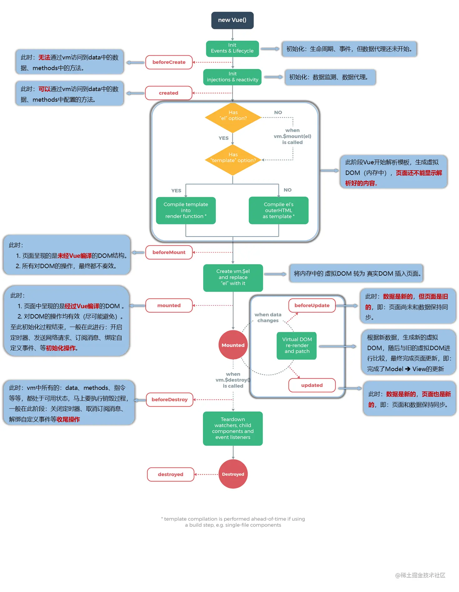

Vue
---

- [Vue](#vue)
  - [1. Vue简介](#1-vue简介)
    - [1.1. Vue的特点](#11-vue的特点)
    - [1.2. 初识Vue](#12-初识vue)
  - [2. Vue的数据与模板语法](#2-vue的数据与模板语法)
    - [2.1. Vue模板语法](#21-vue模板语法)
    - [2.2. Vue数据绑定](#22-vue数据绑定)
    - [2.3. el和data的两种写法](#23-el和data的两种写法)
  - [3.MVVM 模型](#3mvvm-模型)
  - [4. 数据代理](#4-数据代理)
    - [4.1. Object.defineProperty()](#41-objectdefineproperty)
    - [4.2. Vue数据代理](#42-vue数据代理)
  - [5. Vue事件](#5-vue事件)
    - [5.1. 事件的基本使用](#51-事件的基本使用)
    - [5.2. 事件修饰符](#52-事件修饰符)
    - [5.3. 键盘事件](#53-键盘事件)
  - [6. Vue计算属性](#6-vue计算属性)
  - [7. Vue监视属性](#7-vue监视属性)
  - [8. Vue中的样式绑定](#8-vue中的样式绑定)
  - [9. 条件渲染](#9-条件渲染)
  - [10. 列表](#10-列表)
    - [10.1. 列表渲染](#101-列表渲染)
    - [10.2. key 属性](#102-key-属性)
    - [10.3. 虚拟DOM的Diff算法](#103-虚拟dom的diff算法)
    - [10.4. 列表过滤](#104-列表过滤)
    - [10.5. 列表排序](#105-列表排序)
  - [11. Vue数据监视](#11-vue数据监视)
    - [11.3. 收集表单数据](#113-收集表单数据)
  - [12. Vue过滤器](#12-vue过滤器)
  - [13. Vue内置指令](#13-vue内置指令)
    - [13.1. `v-text`](#131-v-text)
    - [13.2. `v-html`](#132-v-html)
    - [13.3. `v-cloak`](#133-v-cloak)
    - [13.4. `v-once`](#134-v-once)
    - [13.5. `v-pre`](#135-v-pre)
    - [13.6. 自定义指令](#136-自定义指令)
  - [14.生命周期](#14生命周期)
    - [14.1. 生命周期](#141-生命周期)
    - [14.2. 生命周期函数](#142-生命周期函数)
  - [14. 组件](#14-组件)
    - [14.1. 概念](#141-概念)
    - [14.2. 非单文件组件](#142-非单文件组件)
    - [14.3. 组件的嵌套](#143-组件的嵌套)
    - [14.4. 原型](#144-原型)
    - [14.5. Vue与VueComponent的关系](#145-vue与vuecomponent的关系)
    - [14.6. 单文件组件](#146-单文件组件)
  - [15. Vue脚手架](#15-vue脚手架)
    - [15.1. Vue项目结构](#151-vue项目结构)
    - [15.2 render](#152-render)
    - [15.3. ref](#153-ref)
    - [15.4. props](#154-props)
    - [15.5. mixin混入](#155-mixin混入)
    - [15.6. 插件](#156-插件)
    - [15.7. scoped](#157-scoped)
  - [16. TodoList 案例](#16-todolist-案例)
  - [17. webStorage](#17-webstorage)
  - [18. 自定义事件](#18-自定义事件)
  - [19. 全局事件总线](#19-全局事件总线)
  - [20. 消息订阅与发布](#20-消息订阅与发布)
  - [21. nextTick](#21-nexttick)


### 1. Vue简介

**Vue简介**

Vue是一个渐进式JavaScript框架，用于构建用户界面。Vue的核心是一个响应式数据绑定库，它允许开发者使用简单的模板语法来创建动态的视图。Vue提供了一种声明式的方式来更新DOM，从而简化了视图的更新逻辑。

#### 1.1. Vue的特点
1. 采用组件化模式，提高代码复用率、可维护性。
2. 声明式编码，让编码人员无需直接直接操作DOM，从而提高开发效率。
3. 使用虚拟DOM和diff算法（比较与复用），减少DOM操作，提高性能。

#### 1.2. 初识Vue
1.想让vue工作，就必须创建一个Vue实例，且要传入一个配置对象;
2.root容器里的代码依然符合html规范，只不过混入了一些特殊的Vue语法;
3.root容器里的代码被称为【Vue模板】;
4.Vue实例和容器是一一对应的;
5.容器和Vue实例是一一对应的关系，一个Vue实例对应一个容器:
6.{{xxx}}中的xxx要写js表达式，且xxx可以自动读取到data中的所有属性;
7.一旦data中的数据发生改变，那么中用该数据的地方也会自动更新;

```html
<!DOCTYPE html>
<html lang="en">
<head>
    <meta charset="UTF-8">
    <meta name="viewport" content="width=device-width, initial-scale=1.0">
    <title>Hello</title>
    <script src="https://cdn.jsdelivr.net/npm/vue@2.6.14/dist/vue.js"></script>
</head>
<body>
    <div id="root">
        <h1>Hello {{ name }}</h1>
    </div>

    <script>
        Vue.config.productionTip = false; // 关闭生产模式下给出的提示

        //创建Vue实例
        new Vue({
            el:'#root',    //el属性，指定当前Vue实例要管理哪个DOM元素(挂载点)
            data:{
                name:'Vue!' //data属性，用于存放数据，供el实例去使用
                // Vue实例会代理data中的数据，通过this.name访问
            },
        })
    </script>
</body>
</html>
```

### 2. Vue的数据与模板语法

#### 2.1. Vue模板语法

**插值语法**

- 功能：用于解析文本内容
- 语法：{{xxx}}，xxx可以写js表达式，也可以写js表达式中的变量

**指令语法**

- 功能：用于解析标签和标签属性
- 语法：v-xxx:yyy="zzz"，xxx是指令，zzz是值，yyy是参数

```html
    <div id="root">
        <h1>插值语法</h1>
        <h2>Hello {{ name }}</h2>

        <hr/>
        <h1>指令语法</h1>
        <!-- <a href="https://www.baidu.com">点我</a> 静态写法  -->
         <a v-bind:href="url">点我</a>
        <!-- v-bind: 可以简写为 : -->
    </div>

    <script>

        new Vue({
            el:'#root',    
                url:'https://www.baidu.coms',
                name:'Vue!' 
            },
        })
    </script>
```

#### 2.2. Vue数据绑定

**单项数据绑定**
`v-bind`：数据只能从data流向页面，可简写为`:`

**双向数据绑定**

`v-model`：数据不仅能从data流向页面，还可以从页面流向data。`v-model:value` 可以简写为`v-model`，因为`v-model`默认收集的就是value值，双向绑定一般都应用在表单类元素上(如:input、select等)

```html
    <div id="root">
        单项数据绑定:<input type="text" v-bind:value="name"> <br/>
        双项数据绑定:<input type="text" v-model="name">
    </div>

    <script>

        new Vue({
            el:'#root',    
            data:{
                name:'Vue!',
            }
        })
    </script>
```

#### 2.3. el和data的两种写法

**el的两种写法**

```js

    new Vue({
        el:'#root',    
        data:{}
    })

    //------------------------------------------------

     const vm = new Vue({
        //不写el
        data:{}
     })

     vm.$mount('#root') // 手动挂载

```

**data的两种写法**

```js

    new Vue({
        data:{
            //name:'Vue!'
        }
    })

    data:function(){
        return {
            // name:'Vue!'
        }
    }


```

### 3.MVVM 模型

M:Model模型
V:View视图
VM:ViewModel视图模型


### 4. 数据代理
#### 4.1. Object.defineProperty()
`Object.defineProperty()` 方法会直接在一个对象上定义一个新属性，或者修改一个对象的现有属性，并返回此对象。
```js

        let number = 18

        let person = {
            name:'张三',
            sex:'男'
        }

        Object.defineProperty(person,'age',{
            //value:18,  //直接指定值，或用getter
            //enumerable:true, //是否可枚举
            //configurable:true, //是否可配置
            //writable:true, //是否可修改
            //configurable:false, //是否可配置
            get:function(){
                console.log('有人读取了age属性')
                return number
            },

            set:function(newValue){
                console.log('有人修改了age属性')
                number = newValue
            }
        })

        console.log(Object.keys(person))
        //输出：[ 'name', 'sex' ]
        console.log(person)
        //输出：{ name: '张三', sex: '男' }
```
#### 4.2. Vue数据代理

**概念**

通过一个对象代理另一个对象的属性的操作。

**语法**
```js
        let obj = {x:100}
        let obj2 = {y:200}

        Object.defineProperty(obj,'y',{
            get:function(){
                return obj2.y
            },
            set:function(newValue){
                obj2.y = newValue
            }
        })
```

### 5. Vue事件

#### 5.1. 事件的基本使用

1.使用v-on:xxx或@xxx定事件，其中xxx是事件名;
2.事件的回调需要配置在methods对象中，最终会在vm上;
3.@click="demo"和 @click="demo($event)”效果一致，但后者可以传参:

```html
    <div id="root">
        <button v-on:click="showInfo">点我</button>
        <!-- <button @click="showInfo">点我</button> -->
         <button @click="showInfo2(66,$event)">点我2</button>
        <!-- 防止event部分丢失，$event占位 -->
    </div>

    <script>
        Vue.config.productionTip = false; // 关闭生产模式下给出的提示

        //创建Vue实例
        new Vue({
            el:'#root',  
            data:{
                name:'Vue!' 
            },
            methods:{
                showInfo(event){
                    //console.log(event.target.innerText)  // 打印按钮文本
                    //console.log(this)  // this指向当前Vue实例
                    alert('This is a Vue!')
                },

                showInfo2(number,a){
                    console.log(a)  // 打印a,a为event对象
                    alert('This is a Vue!' + number)
                }
            }
        })
    </script>
```

#### 5.2. 事件修饰符

**常见事件修饰符**

- prevent：阻止默认事件
- stop：阻止事件冒泡
- once：事件只触发一次
- capture：事件捕获
- passive：事件的默认行为立即执行，无需等待事件回调执行完毕
- self：只有event.target是当前元素时才触发事件

```html
    <div id="root">
        <a href="url" @click.prevent="showInfo">点我</a>
    </div>

    <script>
        new Vue({
            el:'#root',  
            data:{
                url:"https://www.baidu.com"
            },
            methods:{
                showInfo(event){
                    // event.preventDefault() //阻止默认行为
                    alert(this.url)
                },
            }
        })
    </script>
```

#### 5.3. 键盘事件

**Vue中常用的按键别名**
- 回车 => enter
- 删除 => delete(捕荻“删除”和“退格”键)
- 退出 => esc
- 空格 => space
- 换行 => tab  （keydown）
- 上 => up
- 下 => down
- 左 => left
- 右 => right

**未提供别名的按键**

- Vue未提供别名的按键，可以使用按键原始的key值去绑定，但注意要转为kebab-case(短横线命名)           
- 也可以使用keyCode去指定具体的按键(不推荐)


**系统修饰键**

包括：ctrl、alt、shift、meta
- 配合keyup使用:按下修饰键的同时，再按下其他键，随后释放其他键，事件才被触发。
- 配合keydown使用:正常触发事件。

**自定义键名**

`Vue.config.keyCodes`
自定义键名 = 键码，可以去定制按键别名

```html
    <div id="root">
        <input type="text" placeholder="按下回车提示输入" @keyup.enter="showInfo">
        <!-- <input type="text" placeholder="按下ctrl+y提示输入" @keyup.ctrl.y="showInfo"> -->
    </div>

    <script>
        new Vue({
            el:'#root',  
            data:{},
            methods:{
                showInfo(event){
                    //if (event.keyCode !== 13) return
                    console.log(event.target.value)
                },
            }
        })
    </script>
```

### 6. Vue计算属性

**概念**

计算属性是Vue提供的一种特殊的属性，它的值会根据它所依赖的属性值变化而变化，当依赖的属性值变化时，会自动触发计算属性的重新计算，从而更新计算属性的值。
```html
    <div id="root">
        姓：<input type="text" v-model:value="firstname">  <br/><br/>
        名：<input type="text" v-model:value="lastname">   <br/><br/>
        <!-- 插值语法实现 -->
        <!-- 全名: <span>{{ firstname + '-' + lastname }}</span> -->

        <!-- methods 实现-->
        <!-- 全名: <span>{{ fullname() }}</span> -->

        <!-- 计算属性实现 -->
        全名: <span>{{ fullname }}</span>
    </div>

    <script>
        new Vue({
            el:'#root',  
            data:{
                firstname:'张',
                lastname:'三'
            },
            // methods:{
            //     fullname(){
            //         return this.firstname + '-' + this.lastname
            //     }
            // },
            computed:{
                fullname:{
                    //get的作用：当有人读取fullname时，会执行get
                    //get什么时候调用：
                    //          1.第一次读取fullname时
                    //          2.当依赖的数据发生变化时（firstname和lastname）
                    get(){
                        console.log('get被调用了')
                        return this.firstname + '-' + this.lastname
                    },
                    set(newValue){
                        console.log('set被调用了')
                        const arr = newValue.split('-')
                        this.firstname = arr[0]
                        this.lastname = arr[1]
                    }
                }
            }

        })
    </script>
```

**对比计算属性和methods**

computed：有缓存，只在依赖的数据发生变化时才重新计算，性能高
methods：没有缓存，每次调用都会重新计算，性能低

**简写**

只有在对计算出来的属性不进行修改的时候使用
直接将计算属性写成一个函数代替get()

```html

    <div id="root">
        姓：<input type="text" v-model:value="firstname">  <br/><br/>
        名：<input type="text" v-model:value="lastname">   <br/><br/>
        全名: <span>{{ fullname }}</span>
    </div>

    <script>
        new Vue({
            el:'#root',  
            data:{
                firstname:'张',
                lastname:'三'
            },
            computed:{
                fullname(){
                        return this.firstname + '-' + this.lastname
                }
            }
        })
    </script>

```

### 7. Vue监视属性

**概念**
Vue监视属性，就是当数据发生变化时，自动执行对应的方法。

**深度监视**
监视属性时，默认是浅监视，即监视的属性值是基本数据类型时，当属性值发生变化时，会自动执行对应的方法。当属性值是引用数据类型时，当属性值发生变化时，不会自动执行对应的方法。

deep:true: 深度监视，使得监视的属性值是引用数据类型时，当属性值发生变化时，也会自动执行对应的方法。

```html
    <div id="root">
        <h2>今天天气很{{ weather }}</h2>
        <button @click="ishot = !ishot">切换天气</button>
        <hr/>
        <h2>a的值是:{{ numbers.a }}</h2>
        <button @click="numbers.a++">点我让a ++</button>
    </div>

    <script>
        const vm = new Vue({
            el:'#root',  
            data:{
                ishot: true,
                numbers:{
                    a:1,
                    b:2
                }
            },
            computed:{
                weather(){
                    return this.ishot ? '炎热' : '凉爽'
                }
            },
            watch:{
                ishot:{
                    //handler:在ishot发生变化时调用
                    handler(newValue,oldValue){
                        console.log('ishot发生变化了',newValue,oldValue)
                    },
                    //immediate:是否立即执行handler,初始化的时候handler会执行一次
                    immediate:true
                },
                //监视多级结构中某个属性的变化
                // 'numbers.a':{
                //     handler(){
                //         console.log('a发生变化了')
                //     }
                // }

                //深度监视
                numbers:{
                    deep:true,

                    handler(){
                        console.log('numbers发生变化了')
                    }
                }
            }
        })

        // vm.$watch('ishot',{
        //             //第二个参数的内容同watch内的写法
        //             handler(newValue,oldValue){
        //                 console.log('ishot发生变化了',newValue,oldValue)
        //             },
        //             immediate:true
        // })
    </script>
```

部分内容监听属性和计算属性都可实现，但是监听属性可以更好的实现异步任务：

```js
    watch:{
        first(newValue){
            setTimeout(()=>{
                this.value = newValue;
            },1000)
        }
    }
```

### 8. Vue中的样式绑定

**绑定class样式方法**
- 字符串写法：`:class="a"`
- 对象写法：`:class="{a:true,b:false}"`
- 数组写法：`:class="[a,b]"`

```html
    <div id="root">
        <!-- 绑定class -->
        <div class="basic" :class="a" @click="changeMod">Hello</div>
    </div>

    <script>

        new Vue({
            el:'#root',    
            data:{
                a:"normal"
                // 此处要绑定的样式还可以是数组(绑定多个样式)
                // a:['s1','s2'...]
                // 修改样式时，修改数组的值即可
            },
            methods:{
                changeMod(){
                    this.a = this.a === "normal" ? "active" : "normal"
                }
            }
        })
    </script>
```

**绑定style样式**

```html
    <div id="root">
        <!-- 绑定style样式 -->
        <div class="basic" :style="styleObj">Hello</div>
        <!-- 绑定style样式时还可以为样式对象数组 -->
    </div>

    <script>

        new Vue({
            el:'#root',    
            data:{
                styleObj:{
                    color:'red',
                    fontSize:'20px'
                }
            },
            methods:{
                changeMod(){
                    this.a = this.a === "normal" ? "active" : "normal"
                }
            }
        })
    </script>
```

### 9. 条件渲染

条件渲染，即在页面中根据条件来显示或者隐藏内容

**v-show**

通过修改元素的 display 属性来控制元素的显示与隐藏，元素始终会被渲染到 DOM 中

适用于需要频繁切换显示状态的场景,切换显示状态的开销较小

**v-if**

根据条件来动态地创建或销毁元素，当条件为ture时，元素会被创建并插入到DOM中

适用于在运行时条件很少改变的场景，因为它的初始渲染开销较小

**template结合v-if**

不影响结构，对多个元素进行条件渲染

```html
    <div id="root">
        <!-- 使用v-show做条件渲染-->
        <h2 v-show="isShow1">Hello1</h2>
        <button @click="changeMod1">点我{{ state1 }}Hello1</button>

        <!-- 使用v-if / v-else-if / v-else做条件渲染 -->
        <h2 v-if="isShow2">Hello2</h2>
        <h2 v-else>Hello2已被隐藏</h2>
        <button @click="changeMod2">点我{{ state2 }}Hello2</button>

        <!-- 使用template标签包裹内容，实现条件渲染 -->
        <template v-if="isShow1">
            <h2>Hello3</h2>
            <h2>Hello4</h2>
        </template>
    </div>

    <script>
        new Vue({
            el:'#root',    
            data:{
                isShow1:true,
                state1:"隐藏",
                isShow2:true,
                state2:"隐藏"
            },
            methods:{
                changeMod1(){
                    this.isShow1 = !this.isShow1
                    if(this.isShow){
                        this.state1 = "隐藏"
                    }else{
                        this.state1 = "显示"
                    }
                },
                changeMod2(){
                    this.isShow2 = !this.isShow2
                    if(this.isShow2){
                        this.state2 = "隐藏"
                    }else{
                        this.state2 = "显示"
                    }
                }
            }
        })
    </script>
```

### 10. 列表

#### 10.1. 列表渲染

**基本列表**

```html
    <div id="root">
        <!-- 遍历数组 -->
        <h1> person List </h1>
        <ul>
            <li v-for="(p,index) in persons" :key="index"> {{p.name}} - {{p.age}} </li>
        </ul>

        <!-- 遍历对象 -->
        <h1> person Info </h1>
        <ul v-for="(value,key) in persons[0]" :key="key"> 
            <li> {{key}} - {{value}} </li>
        </ul>

        <!-- 遍历字符串 -->
        <h1> person Name </h1>
        <ul v-for="(value,index) in persons[0].name" :key="index"> 
            <li> {{value}} </li>
        </ul>

        <!-- 遍历指定次数 -->
        <h1> number </h1>
        <ul v-for="(value,index) in 5" :key="index"> 
            <li> {{value}} - {{index}} </li>
        </ul>
    </div>

    <script>
        new Vue({
            el:'#root',    
            data:{
                persons:[
                    {id:"001",name:"张三",age:18},
                    {id:"002",name:"李四",age:19},
                    {id:"003",name:"王五",age:20}
                ]
            }
        })
    </script>
```


#### 10.2. key 属性

1. **核心作用**  
   `key`是Vue用于**跟踪节点身份的唯一标识**。在列表渲染（`v-for`）时，通过`key`可以精确判断哪些元素被添加、删除或重新排序，从而优化虚拟DOM的对比过程。

2. **工作原理**  
   - **复用节点**：当数据变化触发重新渲染时，Vue会生成新的虚拟DOM树，并与旧树对比。如果新旧节点的`key`相同且类型一致，Vue会复用该节点（直接移动DOM元素，而非销毁重建），避免不必要的DOM操作。
   - **保持状态**：若元素包含临时状态（如表单输入值），`key`能确保元素在顺序变化时正确保留状态。没有`key`时，Vue可能基于索引复用节点，导致状态错乱。

3. **最佳实践**  
   - 使用**唯一且稳定**的值作为`key`（如数据中的`id`）。
   - 避免使用索引（`index`）作为`key`，尤其是在动态列表（如排序、过滤）中，这可能导致性能下降或渲染错误。


#### 10.3. 虚拟DOM的Diff算法

Vue的Diff算法基于**同级比较**和**双端对比策略**，旨在最小化DOM操作

**同级节点比较**

   - 仅在同一层级的虚拟DOM节点间比较，不会跨层级移动节点。
   - 若节点类型不同（如`<div>`变为`<p>`），直接销毁旧节点并创建新节点。

**双端对比策略**

   当对比新旧子节点数组时，Vue按以下顺序高效匹配：
   1. **头头比较**：新旧数组的头部节点对比。
   2. **尾尾比较**：新旧数组的尾部节点对比。
   3. **旧头新尾**：旧数组头部与新数组尾部对比。
   4. **旧尾新头**：旧数组尾部与新数组头部对比。
   5. **遍历剩余节点**：若未匹配到，遍历旧节点建立`key`索引表，查找可复用节点。

   ```javascript
   // 伪代码示例
   while (旧头 <= 旧尾 && 新头 <= 新尾) {
     if (旧头节点.key === 新头节点.key) { ... }
     else if (旧尾节点.key === 新尾节点.key) { ... }
     else if (旧头节点.key === 新尾节点.key) { ... }
     else if (旧尾节点.key === 新头节点.key) { ... }
     else {
       // 通过key映射表查找可复用节点
     }
   }
   ```

**Key的作用**

   - **精准匹配**：通过`key`快速定位新旧节点的对应关系。
   - **减少DOM操作**：复用节点后，仅移动元素位置或更新属性，而非重建。

#### 10.4. 列表过滤

根据`filter()`方法和对于条件条件筛选出符合要求的列表项，然后展示给用户

**watch实现**

```html
<div id="root">
        <h1> person List </h1>
        <input type="text" v-model="keyword" placeholder="输入姓名">
        <ul>
            <li v-for="p in filperson" :key="p.id"> 
                {{p.name}} -- {{p.age}} -- {{p.sex}}
            </li>
        </ul>
    </div>

    <script>
        new Vue({
            el:'#root',    
            data:{
                keyword:"",
                persons:[
                    {id:"001",name:"马冬梅",age:18,sex:"女"},
                    {id:"002",name:"周冬雨",age:19,sex:"女"},
                    {id:"003",name:"周杰伦",age:20,sex:"男"},
                    {id:"004",name:"温兆伦",age:21,sex:"男"}
                ],
                filperson:[]
            },
            watch:{
                keyword:{
                    immediate:true,
                    handler(newValue){
                        console.log(newValue)
                        this.filperson = this.persons.filter((p)=>{
                            return p.name.indexOf(newValue) !== -1
                        })
                    }
                } 
            }
        })
    </script>
```

**computed实现**

```html
    <div id="root">
        <h1> person List </h1>
        <input type="text" v-model="keyword" placeholder="输入姓名">
        <ul>
            <li v-for="p in filperson" :key="p.id"> 
                {{p.name}} -- {{p.age}} -- {{p.sex}}
            </li>
        </ul>
    </div>

    <script>
        new Vue({
            el:'#root',    
            data:{
                keyword:"",
                persons:[
                    {id:"001",name:"马冬梅",age:18,sex:"女"},
                    {id:"002",name:"周冬雨",age:19,sex:"女"},
                    {id:"003",name:"周杰伦",age:20,sex:"男"},
                    {id:"004",name:"温兆伦",age:21,sex:"男"}
                ]
            },
            computed:{
                filperson(){
                    return this.persons.filter((p)=>{
                        return p.name.indexOf(this.keyword) !== -1
                    })
                }
            }
        })
    </script>
```

####  10.5. 列表排序

通过函数sort()，对列表进行排序，然后返回排序后的列表


```html
    <div id="root">
        <h1> person List </h1>
        <input type="text" v-model="keyword" placeholder="输入姓名">
        <button @click="sortType=1">年龄升序</button>
        <button @click="sortType=2">年龄降序</button>
        <button @click="sortType=0">原顺序</button>
        <ul>
            <li v-for="p in filperson" :key="p.id"> 
                {{p.name}} -- {{p.age}} -- {{p.sex}}
            </li>
        </ul>
    </div>

    <script>
        new Vue({
            el:'#root',    
            data:{
                sortType:0, // 0:原顺序，1:升序，2:降序
                keyword:"",
                persons:[
                    {id:"001",name:"马冬梅",age:18,sex:"女"},
                    {id:"002",name:"周冬雨",age:22,sex:"女"},
                    {id:"003",name:"周杰伦",age:20,sex:"男"},
                    {id:"004",name:"温兆伦",age:21,sex:"男"}
                ]
            },
            computed:{
                filperson(){
                    const arr = this.persons.filter((p)=>{
                        return p.name.indexOf(this.keyword) !== -1
                    })
                    if (this.sortType){
                        arr.sort((p1,p2)=>{
                            return this.sortType === 1 ? p2.age - p1.age : p1.age - p2.age
                        })
                    }
                    return arr
                }
            }
        })
    </script>
```

Vue.set(target,key,value)
vm.$set(target,key,value)

```html
    <div id="root">
        <h1> Student Info </h1>
        <button @click="addSex">点击添加性别属性，默认男</button>
        <h2>姓名:{{ student.name }}</h2>
        <h2 v-if="student.sex">性别:{{ student.sex }}</h2>
        <h2>年龄:{{ student.age }}</h2>
    </div>

    <script>
        const vm = new Vue({
            el:'#root',    
            data:{
                student:{
                    name:"张三",
                    age:18,
                }
            },
            methods:{
                addSex(){
                    Vue.set(this.student,'sex','男')
                    //this.$set(this.student,'sex','男')  功能同上
                }
            }
        })
    </script>
```

### 11. Vue数据监视

Vue监视数据的原理:
1.vue会监视data中所有层次的数据，
2.如何监测对象中的数据?
通过setter实现监视，且要在new Vue时就传入要监测的数据。
(1),对象中后追加的属性，Vue默认不做响应式处理
(2).如需给后添加的属性做响应式，请使用如下API:
Vue.set(target,propertyName/index，value)或
vm.$set(target,propertyName/index，value)
3.如何监测数组中的数据?
通过包裹数组更新元素的方法实现，本质就是做了两件事:
(1).调用原生对应的方法对数组进行更新。
(2).重新解析模板，进而更新页面。
4.在Vue修改数组中的某个元素一定要用如下方法:
1.使用这些API:push()、pop()、shift()、unshift()、splice()、sort()、reverse()
2.Vue.set()或vm.$set()
特别注意:Vue.set()和 vm.$set()不能给vm 或 v的根数对象 添加属性!!!

数据劫持

_data = data

#### 11.3. 收集表单数据

收集表单数据:
若:`<input type="text"/>`，则v-model收集的是value值，用户输入的就是value伉。
若:`<input type="radio"/>`，则v-model收集的是value值，且要给标签配置value值
若:`<input type="checkbox"/>`
1.没有配置input的value属性，那么收集的就是checked(勾选 or 未勾选，是布尔值)
2.配置input的value属性:
(1)v-model的初始值是非数组，那么收集的就是checked(勾选or 未勾选，是布尔值)
(2)v-mode1的初始值是数组，那么收集的的就是value组成的数组
备注:v-model的三个修饰符:
lazy:失去焦点再收集数据
number:输入字符串转为有效的数字
trim:输入首尾空格过滤

```html
 <div id="root">
        <form @submit.prevent="submits">
            <!-- <label for="demo">账号：</label>
            <input type="text" id="demo" v-model="student.name"> <br/></input> -->
            账号：<input type="text" v-model.trim="accout"> <br/><br/></input>
            密码：<input type="password" v-model="password"> <br/><br/></input>
            年龄：<input type="number" v-model.number="age"> <br/><br/></input>
            性别：
            男<input type="radio" v-model="sex" name="sex" value="male"></input>
            女<input type="radio" v-model="sex" name="sex" value="famle"></input> <br/><br/>
            爱好：
            <input type="checkbox" v-model="hobby" value="eat">吃饭</input>
            <input type="checkbox" v-model="hobby" value="sleep">睡觉</input>
            <input type="checkbox" v-model="hobby" value="doudou">打豆豆</input> <br/><br/>
            校区：
            <select v-model="city">
                <option value="">请选择校区</option>
                <option value="北京">北京</option>
                <option value="上海">上海</option>
                <option value="广州">广州</option>
                <option value="深圳">深圳</option>
            </select>
            <br/><br/>
            其他信息：
            <textarea v-model="othors"></textarea>
            <br/><br/>
            <input type="checkbox" v-model.lazy="agree">阅读并接受<a herf="#">《用户协议》</a>
            <br/><br/>
            <button>提交</button>
        </form>
        
    </div>

    <script>

        const vm = new Vue({
            el:'#root',    
            data:{
                accout:'',
                password:'',
                age:12,
                sex:'male',
                hobby:[],
                city:'北京',
                othors:'',
                agree:''
            },
            methods:{
               submits(){
                   alert("1111")
                   console.log(this.date)
               }
            }
        })
    </script>
```


### 12. Vue过滤器

**过滤器**

对要显示的数据进行特定格式化后再显示(适用于一些简单逻辑的处理)

**语法**

注册过滤器:`Vue.filter(name,callback)`（全局过滤器）或 `new Vue{filters:{}}`(局部过滤器)

- 过滤器也可以接收额外参数、多个过滤器也可以串联
- 并没有改变原本的数据，是产生新的对应的数据

```html
<div id="root">
        <h1></h1>
        <h2>Hello {{ name | format }}</h2>

        <h2>Hello {{ name | format('11111') }}</h2>

        <h2>Hello {{ name | format | format2 }}</h2>
    </div>

    <script>

        new Vue({
            el:'#root',    
            data:{
                name:'Jack',
            },
            filters:{
                // 第一个参数默认是传入的value
                format(value,str='没有参数'){
                    console.log(str)
                    return value.toUpperCase()
                },
                format2(value){
                    return value.slice(0,2)
                }
            }
        })
    </script>
```

### 13. Vue内置指令

#### 13.1. `v-text`

```html
    <div id="root">
        <div>你好，{{name}}</div>
        <hr/>
        <div v-text="name">你好，</div>
        <!-- 你好不会显示，整个被name替换 -->
        <h2 v-text="name">你好，</h2>
    </div>

    <script>
        new Vue({
            el:'#root',    
            data:{
                name:'jack'
            }
        })
    </script>
```

#### 13.2. `v-html`

```html
    <div id="root">
        <div>你好，{{name}}</div>
        <hr/>
        <div v-text="str"></div>
        <!-- 输出：<div>你好，jack</div> 无法解析 -->
        <div v-html="str"></div>
        <!-- 输出：你好，jack，可以解析 -->
    </div>

    <script>
        new Vue({
            el:'#root',    
            data:{
                name:'jack',
                // 有可能导致xss攻击
                str:'<div>你好，jack</div>'
            }
        })
    </script>
```


js阻塞：

#### 13.3. `v-cloak`

本质是一个特殊属性，Vue实例创建完毕并解析模板后，会删除`v-cloak`属性，然后页面会进行更新。

```html
<!DOCTYPE html>
<html lang="en">
<head>
    <meta charset="UTF-8">
    <meta name="viewport" content="width=device-width, initial-scale=1.0">
    <title>v-text</title>
    <script src="https://cdn.jsdelivr.net/npm/vue@2.6.14/dist/vue.js"></script>
    <style>
        [v-cloak]{
            display: none;
        }
    </style>
</head>
<body>
    <div id="root">
        <!-- 配合 v-cloak 指令，在页面加载时隐藏元素，直到数据绑定完毕 -->
        <div v-cloak>你好，{{name}}</div>
    </div>

    <script>
        new Vue({
            el:'#root',    
            data:{
                name:'jack',
            }
        })
    </script>
</body>
</html>
```

#### 13.4. `v-once`

`v-once`用于指定某个节点，在第一次渲染后，就不再更新,视为静态内容


```html
<body>
    <div id="root">
        <div v-once>初始的n的值是：{{n}}</div>
        <div>当前n的值是：{{n}}</div>
        <button @click="n++">点我n++</button>
    </div>

    <script>
        new Vue({
            el:'#root',    
            data:{
                n:1,
            }
        })
    </script>
</body>
```

#### 13.5. `v-pre`

`v-pre`用于跳过这个元素和它的子元素的编译过程，即跳过编译器对这个元素和它的子元素的解析，用于优化性能

```html
    <div id="root">
        <h2 v-pre>显示n的值</h2>
        <!-- 正常显示 -->
        <div>当前n的值是：{{n}}</div>
        <!-- v-pre 不会解析，显示 {{n}} -->
        <div v-pre>当前n的值是：{{n}}</div>
        <button @click="n++">点我n++</button>
    </div>

    <script>
        new Vue({
            el:'#root',    
            data:{
                n:1,
            }
        })
    </script>
```


#### 13.6. 自定义指令

**函数式自定义指令**

将指令的逻辑封装成directives属性内的一个函数

参数：
- el：指令所绑定的元素，可以用来操作DOM
- binding：binding.value：指令的绑定值
属性：
- vnode：Vue编译生成的虚拟节点
- oldVnode：上一个虚拟节点

函数何时被调用：
- 指令与元素成功绑定时
- 指令所在的模板被重新解析时
  
**对象式自定义指令**

将指令的逻辑封装成directives属性内的一个对象，对象内有多个函数，如bind、inserted、update、componentUpdated、unbind，在不同时候执行指令的逻辑

- bind：指令与元素成功绑定时调用
- inserted：指令所在模板被插入到 DOM 中时调用
- update：所在组件的 VNode 更新时调用，但是可能发生在其子 VNode 更新之前

**指令的命名**

如果有多个单词，则使用连字符的形式，如v-my-zhiling
在定义时候需要用单引号包起

**全局指令**

上述方法构造的指令只能在当前实例下使用，如果希望全局使用，则需要用Vue.directive()方法

```html
    <div id="root">
        <h2>当前的n的值是:<span v-text="n"></span></h2>
        <h2>放大十倍后的n的值是:<span v-big="n"></span></h2>
        <button @click="n++">点我n++</button>
        <hr/>
        <input type="text" v-model="n"></input>
        <input type="text" v-fmodel="n"></input>
    </div>

    <script>
        new Vue({
            el:'#root',    
            data:{
                n:1,
            },
            directives:{                
                big(element,binding){
                    element.innerText = binding.value * 10
                },
                fmodel:{
                    bind(element,binding){
                        console.log('bind')
                        //指令与元素成功绑定时调用
                    },
                    inserted(element,binding){
                        console.log('inserted')
                        //指令所在元素被插入页面时调用
                        element.value = binding.value * 2
                        element.focus()
                    },
                    update(element,binding){
                        console.log('update')
                        //指令所在模板被重新解析时调用
                        element.value = binding.value
                        element.focus()
                    }
                }
            }
        })
    </script>
```


### 14.生命周期

#### 14.1. 生命周期

**生命周期**：组件从创建到销毁的整个过程就是生命周期

   


**父组件引入子组件**：
- 先执行父组件的BeforeCreateted, created, 和BeforeMounted
- 在以此执行每个子组件的BeforeCreateted, created, BeforeMounted和mounted
- 在执行父组件的mounted

**在created中如何获取dom**

写异步代码，获取dom是在异步中获取的就可以了
如：settTimeout, nextTick

因为js的运行顺序先同步在异步

**发送请求**

如果请求是在methods封装好了，在beforecreate调用的时候，beforecreate阶段是拿不到methods里而的方法

如果有多个子组件，则如果父组件的请求写道created中，则父组件的请求完成后，才会执行子组件的请求。若没有父子组件的依赖关系，则放到created和放到mounted中没有实质性的区别

#### 14.2. 生命周期函数
**生命周期函数**:Vue实例在挂载前后会调用一些函数，这些函数就是生命周期函数

|生命周期钩子函数|说明|应用场景|
| :----: | :----: | :----: |
|beforeCreated|vue实例的挂载元素$el和数据对象data都为undefined，还未初始化|加loading事件|
|created|vue实例的数据对象data有了，$el还没有|结束loading、请求数据为mounted渲染做准备|
|beforeMount|vue实例的$el和data都初始化了，但还是虚拟的dom节点，具体的data.filter还未替换| - |
|mounted|vue实例挂载完成，data.filter成功渲染|配合路由钩子使用|
|beforeUpdate|data更新时触发（数据更新了，但是界面还没有更新）| - |
|updated|data更新时触发（页面和数据保持同步了）|数据更新时，做一些处理（也可用watch进行观测）|
|beforeDestro y|组件销毁时触发| - |
|destroyed|组件销毁时触发，vue实例解除了事件监听以及和dom的绑定（无响应了），但DOM节点依旧存在|组件销毁时进行提示| 

### 14. 组件

#### 14.1. 概念
**组件的定义**

实现应用中局部功能代码和资源的集合

**模块化与组件化**


#### 14.2. 非单文件组件

```html
    <div id="root">
        <!-- <h2>学校名称：{{schoolName}}</h2>
        <h2>学校地址：{{schoolAddress}}</h2>
        <hr>
        <h2>学生姓名：{{studentName}}</h2>
        <h2>学生年龄：{{studentAge}}</h2> -->

        <School></School>
        <hr>
        <Student></Student>
    </div>

    <script>

        //创建school组件
        const school = Vue.extend({
            template:'<div><h2>学校名称：{{schoolName}}</h2><h2>学校地址：{{schoolAddress}}</h2><button @click="showName">点我提示学校名</button></div>',
            //没有el配置项，因为最终所有的组件都要被一个Vm管理，由vm决定服务那个DOM
            //data必须写成函数的形式，避免组件被复用时，数据存在引用关系
            data(){
                return {
                    schoolName:'希望小学',
                    schoolAddress:'希望路'
                }
            },
            methods:{
                showName(){
                    alert(this.schoolName)
                }
            }
        })

        //创建student组件 简写
        const student = {
            template:'<div><h2>学生姓名：{{studentName}}</h2><h2>学生年龄：{{studentAge}}</h2></div>',
            data(){
                return {
                    studentName:'张三',
                    studentAge:18
                }
            }
        }
        
        // 注册组件(全局注册)
        // Vue.component('student',student)
        
        new Vue({
            el:'#root',    
            // 注册组件（step2，局部注册）
            components:{
                //组件命名：
                //单单词，单词首字母大写
                //多词，kebab-case命名
                School:school,
                Student:student
            }
        })
    </script>
```

#### 14.3. 组件的嵌套

组件的嵌套，就是将一个组件，嵌套在另一个组件内部

```html
    <div id="root">
        <App></App>    
    </div>

    <script>
        const Student = {
            template:'<div><h2>学生姓名：{{studentName}}</h2><h2>学生年龄：{{studentAge}}</h2></div>',
            data(){
                return {
                    studentName:'张三',
                    studentAge:18
                }
            }
        }

        const School = {
            template:'<div><h2>学校名称：{{schoolName}}</h2><h2>学校地址：{{schoolAddress}}</h2><Student></Student></div>',
            data(){
                return {
                    schoolName:'希望小学',
                    schoolAddress:'希望路'
                }
            },
            methods:{
                showName(){
                    alert(this.schoolName)
                }
            },
            components:{
                Student
            }
        }

        const Hello = {
            template:'<div><h2>Hello {{name}}</h2></div>',
            data(){
                return {
                    name:'张三'
                }
            }
        }

        const App = {
            template:'<div><school></school><hello></hello></div>',
            components:{
                School,
                Hello
            }
        }
        new Vue({
            el:'#root',    
            components:{
                App,
            }
        })
    </script>
```

**关于VueComponent**:

- schoo1组件本质是一个名`Vuecomponert`的构造函数，且不是程序员定义的，是`vue.extend`生成的。
- 我们只需要写`<school/>`或`<school></school>`，Vue解析时会帮我们创建school组件的实例对象，
即Vue帮我们执行的:`new Vuecomponent(options)`
- 每次调用`Vue.extend`，返回的都是一个全新的`Vuecomponent`
- `this`指向:
  - 组件配置中:
    `data`函数、`methods`中的函数、`watch`中的函数、`computed`中的函数 它们的`this`均是`Vuecomponent`实例对象
  - `new Vue()`配置中:
    `data`函数、`methods`中的函数、`watch`中的函数、`computed`中的函数 它们的`this`均是`Vue`实例对象

#### 14.4. 原型

原型是Javascript中的继承的基础，JavaScript的继承就是基于原型的继承。

**函数的原型对象**

在JavaScript中，每一个函数都有一个`prototype`属性，这个属性是一个指针，指向一个对象，这个对象的用途是包含可以由特定类型的所有实例共享的属性和方法。这个对象就是原型对象。

例如，如果你创建了一个构造函数`Person`，那么`Person.prototype`就是该构造函数的原型对象。

**对象原型**

当我们创建一个对象（例如通过new关键字和构造函数），这个新创建的对象内部会有一个指向构造函数的原型对象的指针，这个指针通常被称为`[[Prototype]]`（在标准的ECMAScript规范中）或者在某些浏览器实现中可以通过`__proto__`属性访问（但请注意，`__proto__`并不是标准属性，尽管大多数现代浏览器都支持它）。

这个指针指向的对象就是该对象的原型。通过这个原型，对象可以继承原型上定义的属性和方法。

**原型链**

当我们试图访问一个对象的属性时，JavaScript会首先在该对象本身上查找这个属性。如果找不到，它会继续在该对象的原型（即`[[Prototype]]`或`__proto__`指向的对象）上查找，然后是该原型的原型，以此类推，直到找到属性或者达到原型链的末尾（通常是`Object.prototype`）。这个查找过程形成的链式结构就是原型链。如果到达原型链的末尾还没有找到属性，那么就会返回undefined。这就是原型链查找机制。

简而言之，原型对象是构造函数用于**存储共享属性和方法的对象**；对象原型是**实例对象内部指向其构造函数原型对象的指针**；而原型链则是用于在对象和它的原型（以及原型的原型等）之间**查找属性和方法的机制**。

```js
    function Person(name) {
        this.name = name;
    }
  
    // 在原型对象上添加方法
    Person.prototype.sayHello = function() {
      console.log(`Hello, I'm ${this.name}`);
    };
  
    const alice = new Person("Alice");
    alice.sayHello(); // 输出: Hello, I'm Alice


    Person.prototype.age = 25;
    console.log(alice.age); // 输出: 25

    const bob = new Person("Bob");
    console.log(bob.age); // 输出: 25


    //原型对象的 constructor 属性指向构造函数本身。
    console.log(Person.prototype.constructor === Person); // 输出: true
    console.log(alice.constructor === Person); // 输出: true（通过原型链查找）

    //继承
    // 父类
    function Animal(name) {
        this.name = name;
    }
    Animal.prototype.eat = function() {
        console.log(`${this.name} is eating.`);
    };
  
    // 子类
    function Dog(name, breed) {
        Animal.call(this, name); // 继承属性
        this.breed = breed;
    }
  
    // 继承方法：设置 Dog.prototype 的原型为 Animal.prototype
    Dog.prototype = Object.create(Animal.prototype);
    Dog.prototype.constructor = Dog; // 修复 constructor 指向
  
    Dog.prototype.bark = function() {
        console.log("Woof!");
    };
  
    const myDog = new Dog("Buddy", "Golden Retriever");
    myDog.eat(); // 输出: Buddy is eating.
    myDog.bark(); // 输出: Woof!
```
#### 14.5. Vue与VueComponent的关系

  

这样的关系可以让组件实例对象（vc）可以访问到Vue的原型对象的属性和方法

#### 14.6. 单文件组件

### 15. Vue脚手架

#### 15.1. Vue项目结构

**项目结构概览**

```bash
my-vue-project/
├── node_modules/       # 项目依赖的第三方库
├── public/             # 静态资源（不参与打包）
│   ├── favicon.ico     # 网站图标
│   └── index.html      # 入口 HTML 文件
├── src/                # 项目源码
│   ├── assets/         # 静态资源（图片、字体等，会被 Webpack 处理）
│   ├── components/     # 可复用的 Vue 组件
│   ├── App.vue         # 根组件
│   └── main.js         # 项目入口文件
├── .gitignore          # Git 忽略文件配置
├── babel.config.js     # Babel 转码配置
├── package.json        # 项目配置和依赖管理
├── README.md           # 项目说明文档
└── vue.config.js       # Vue CLI 自定义配置（可选）
```

**核心文件/目录详解**

1. `public/`
- **作用**：存放不需要 Webpack 处理的静态资源。
- **重要文件**：
  - `index.html`：应用的入口 HTML 文件。Vue 会通过此文件挂载根组件（`<div id="app"></div>`）。
  - `favicon.ico`：浏览器标签页图标。

2. `src/`
- **作用**：项目源码的核心目录。
  - **`assets/`**：存放需要 Webpack 处理的静态资源（如图片、CSS、字体文件）。
  - **`components/`**：存放可复用的 Vue 组件（如 `Button.vue`、`Header.vue`）。
  - **`App.vue`**：根组件，所有其他组件的父组件。
    ```vue
    <template>
      <div id="app">
        <HelloWorld msg="Welcome to Your Vue.js App"/>
      </div>
    </template>
    ```
  - **`main.js`**：入口文件，初始化 Vue 实例并挂载到 HTML。
    ```javascript
    import Vue from 'vue';
    import App from './App.vue';

    new Vue({
      render: h => h(App),
    }).$mount('#app');
    ```

3. `package.json`
- **作用**：定义项目依赖、脚本命令和基础配置。
  ```json
  {
    "scripts": {
      "serve": "vue-cli-service serve",   // 启动开发服务器
      "build": "vue-cli-service build",   // 打包生产环境代码
      "lint": "vue-cli-service lint"       // 代码格式检查
    },
    "dependencies": {
      "vue": "^2.6.11"                     // Vue 核心库
    },
    "devDependencies": {
      "@vue/cli-service": "~4.5.0"         // Vue CLI 服务
    }
  }
  ```

4. 配置文件
- **`babel.config.js`**：配置 Babel 转码规则（如兼容旧浏览器）。
  ```javascript
  module.exports = {
    presets: ['@vue/cli-plugin-babel/preset']
  };
  ```
- **`vue.config.js`**（可选）：自定义 Vue CLI 配置（如代理、Webpack 配置）。
  ```javascript
  module.exports = {
    devServer: {
      proxy: 'http://api.example.com'  // 配置开发服务器代理
    }
  };
  ```

5. 其他文件
- **`tests/`**（可选）：存放单元测试文件（需选择测试工具初始化项目时生成）。
- **`.gitignore`**：指定 Git 忽略的文件（如 `node_modules/`、`dist/`）。


**关键命令**

```bash
npm run serve   # 启动开发服务器（默认端口 8080）
npm run build   # 打包生产环境代码到 dist/ 目录
npm run lint    # 检查代码格式（需安装 ESLint）
```

#### 15.2 render

**render 函数的作用与原理**

在 Vue CLI 生成的脚手架项目中，main.js 中使用了特殊的 render 函数形式：

```javascript
new Vue({
  render: h => h(App),
}).$mount('#app')
```

**核心概念解析**：
1. **运行时构建（Runtime-only）**：
   - Vue 的 `vue.runtime.esm.js` 版本不包含模板编译器（体积减小约 30%）
   - 不能直接使用 `template` 配置项，需要使用预编译的 render 函数
   - 单文件组件（.vue）的模板会被 vue-loader 预编译为 render 函数

2. **h 函数本质**：
   - 即 `createElement` 函数的简写，用于创建虚拟 DOM（VNode）
   - 接收三个参数：`(元素/组件, 数据对象, 子节点)`

**与完整版的对比**：
```javascript
// 完整版（vue.js）工作流程
template -> ast -> render -> virtual DOM -> UI

// 运行时版（vue.runtime.js）工作流程
render -> virtual DOM -> UI
```

**render 函数的多种写法**：
```javascript
// 1. 完整写法
render(createElement) {
  return createElement('h1', { class: 'title' }, 'Hello Vue')
}

// 2. 箭头函数简写
render: h => h(App)

// 3. 创建嵌套元素
render: h => h('div', [
  h('h1', '主标题'),
  h('p', '正文内容')
])

// 4. 带属性的组件
render: h => h(MyComponent, {
  props: { msg: 'Hello' },
  on: { click: this.handleClick }
})
```

**开发建议**：
1. 使用单文件组件（.vue 文件）时，推荐保持默认的运行时构建
2. 需要直接使用 `template` 配置项时，需修改 vue.config.js：
```javascript
module.exports = {
  configureWebpack: {
    resolve: {
      alias: {
        'vue$': 'vue/dist/vue.esm.js' // 使用完整版
      }
    }
  }
}
```

**常见错误场景**：
```javascript
// 错误：使用 template 选项 + 运行时构建
new Vue({
  template: '<App/>',
  components: { App }
})

// 正确写法（运行时构建）
new Vue({
  render: h => h(App)
})
```

**性能优化技巧**：
- 对于复杂 UI，使用 JSX 语法编写 render 函数
- 使用函数式组件提升渲染性能
```javascript
Vue.component('functional-button', {
  functional: true,
  render: (h, context) => {
    return h('button', context.data, context.children)
  }
})
```

**与模板编译的关系**：
- 单文件组件中的 `<template>` 会被 vue-loader 编译为 render 函数
- 最终打包时会剔除模板编译器，减小生产环境包体积
```javascript
// 编译前（.vue 文件）
<template>
  <div>{{ message }}</div>
</template>

// 编译后（render 函数）
render(h) {
  return h('div', this.message)
}
```

**版本兼容性说明**：
| Vue 版本 | 特性支持 |
|---------|---------|
| 2.x     | 支持 render 函数和模板语法 |
| 3.x     | 全面使用 render 函数，优化组合式 API 支持 |

```javascript
// Vue 3 组合式 API 中的使用
import { h } from 'vue'
export default {
  setup() {
    return () => h('div', 'Hello Vue 3')
  }
}
```

#### 15.3. ref

**ref 的作用与原理**

ref 是 Vue 提供的用于注册元素或子组件引用的特殊属性，主要应用场景包括：
1. 直接访问 DOM 元素
2. 获取子组件实例
3. 替代 `document.getElementById` 等原生 DOM 操作

**基本语法**
```html
<!-- 模板中使用 -->
<div ref="myDiv"></div>
<ChildComponent ref="myComponent" />

<script>
// 通过 $refs 访问
this.$refs.myDiv // 获取 DOM 元素
this.$refs.myComponent // 获取组件实例
</script>
```

#### 15.4. props

**props 的作用与原理**

props 是 Vue 组件间通信的核心机制，用于父组件向子组件传递数据。关键特性包括：

1. 单向数据流：数据只能从父组件流向子组件
2. 类型验证：支持指定数据类型和格式校验
3. 响应式更新：父组件数据变化会自动同步到子组件

**基本语法：**
```javascript
// 子组件定义
export default {
  props: ['title'], // 简单声明
  props: { // 详细配置
    title: {
      type: String,
      required: true,
      default: '默认标题'
    }
  }
}

<!-- 父组件使用 -->
<ChildComponent :title="parentTitle" />
```

**核心配置选项：**
| 选项        | 说明                          | 示例值                  |
|------------|-------------------------------|------------------------|
| type       | 指定数据类型                   | [String, Number]       |
| required   | 是否必传                       | true/false             |
| default    | 默认值                        | () => ({}) 对象/数组需工厂函数 |
| validator  | 自定义验证函数                 | (value) => value > 0  |

**示例场景：**

1. 基础用法：
```javascript
// 子组件
export default {
  props: ['userName'],
  template: `<div>欢迎 {{ userName }}</div>`
}

// 父组件
<WelcomeMessage :user-name="currentUser.name" />
```

2. 类型验证：
```javascript
props: {
  age: {
    type: Number,
    validator: value => value >= 0 && value <= 150
  },
  metadata: {
    type: Object,
    default: () => ({})
  }
}
```

3. 动态绑定：
```html
<!-- 父组件 -->
<DataTable :columns="tableConfig.columns" 
           :data-source="fetchData()"
           @sort="handleSort">
</DataTable>
```

#### 15.5. mixin混入

**mixin 的作用与原理**

mixin 是 Vue 的代码复用机制，用于分发组件中的可复用功能。核心特性包括：
1. 选项合并策略（数据对象/生命周期钩子/方法等）
2. 全局混入与局部混入两种模式
3. 混入对象的属性将被注入到所有组件
4. 混入对象的生命周期钩子将在组件自身钩子之前调用

**基本语法：**
```javascript
// 定义混入对象
const myMixin = {
  created() {
    this.logMessage()
  },
  methods: {
    logMessage() {
      console.log('混入的日志记录')
    }
  }
}

// 局部混入（组件内使用）
export default {
  mixins: [myMixin],
  created() {
    console.log('组件自身的created')
  }
}

// 全局混入（main.js）
Vue.mixin({
  mounted() {
    console.log('全局混入的mounted')
  }
})
```

**合并策略说明：**
| 选项类型       | 合并策略                          | 示例                         |
|--------------|-----------------------------------|------------------------------|
| 数据对象      | 组件数据优先                       | mixin: {data: {a:1}}, comp: {data: {a:2}} → a=2 |
| 生命周期钩子  | 合并为数组，混入对象的钩子先执行   | mixin created → comp created |
| 方法/计算属性 | 组件属性覆盖混入对象               | 同名方法以组件为准           |
| 其他对象      | 组件属性覆盖混入对象               | 如components、directives等  |

**示例场景：**

1. 多个组件共享方法：
```javascript
// mixins/logger.js
export default {
  methods: {
    $log(action) {
      console.log(`[${new Date()}] ${this.$options.name} ${action}`)
    }
  }
}

// 组件使用
import logger from '@/mixins/logger'
export default {
  mixins: [logger],
  mounted() {
    this.$log('组件挂载完成')
  }
}
```

2. 表单验证混入：

```javascript
// mixins/formValidation.js
export default {
  data() {
    return {
      errors: {}
    }
  },
  methods: {
    validateEmail(email) {
      const re = /^[^\s@]+@[^\s@]+\.[^\s@]+$/
      return re.test(String(email).toLowerCase())
    },
    clearErrors() {
      this.errors = {}
    }
  }
}
```

**开发规范：**

1. 混入命名以 `mixin` 为后缀（例：`loadingMixin`）
2. 避免在混入中直接修改组件状态
3. 优先使用局部混入，谨慎使用全局混入
4. 使用属性前缀防止命名冲突：
```javascript
// 推荐方式
const fetchMixin = {
  methods: {
    $_fetchMixin_getData() {
      // ...
    }
  }
}
```

**性能优化建议：**

1. 避免在混入中声明大量数据属性
2. 合理拆分混入功能，保持单一职责原则
3. 使用 Object.freeze 冻结静态配置：
```javascript
const staticMixin = {
  config: Object.freeze({
    maxItems: 100,
    timeout: 3000
  })
}
```
#### 15.6. 插件

**插件的作用与原理**

插件是 Vue 的全局功能扩展机制，用于添加以下类型的全局功能：
1. 添加全局方法或属性（如：vue-cookie）
2. 添加全局资源（指令/过滤器/过渡等，如：vuelidate）
3. 通过全局混入来添加组件选项（如：vue-router）
4. 添加 Vue 实例方法（如：vue-axios）

**基本结构：**
```javascript
// plugins/myPlugin.js
export default {
  install(Vue, options) {
    // 1. 添加全局方法或属性
    Vue.myGlobalMethod = function () {
      console.log('全局方法调用')
    }

    // 2. 添加全局指令
    Vue.directive('focus', {
      inserted: el => el.focus()
    })

    // 3. 注入组件选项
    Vue.mixin({
      created() {
        console.log('全局混入的created')
      }
    })

    // 4. 添加实例方法
    Vue.prototype.$myMethod = function () {
      console.log('实例方法调用')
    }
  }
}
```

**安装方式：**
```javascript
// main.js
import Vue from 'vue'
import myPlugin from './plugins/myPlugin'

Vue.use(myPlugin, { 
  size: 'large' // 可选的配置对象
})
```

**核心功能实现：**

1. **全局指令扩展**：
```javascript
// 图片懒加载插件
Vue.directive('lazy', {
  inserted: (el, binding) => {
    const observer = new IntersectionObserver((entries) => {
      entries.forEach(entry => {
        if (entry.isIntersecting) {
          el.src = binding.value
          observer.unobserve(el)
        }
      })
    })
    observer.observe(el)
  }
})
```

2. **全局过滤器扩展**：
```javascript
// 货币格式化插件
Vue.filter('currency', (value, symbol = '￥') => {
  return symbol + value.toFixed(2)
})
```

3. **全局状态注入**：
```javascript
// 简易的全局状态管理
const store = {
  state: Vue.observable({ count: 0 }),
  increment() {
    this.state.count++
  }
}

Vue.prototype.$store = store
```

**开发规范：**
1. 插件命名使用小驼峰式（例：`axiosPlugin`）
2. 导出对象必须包含 install 方法
3. 避免修改 Vue 的原型链核心方法
4. 提供 TypeScript 类型声明（可选）：
```typescript
// types/vue.d.ts
declare module 'vue/types/vue' {
  interface Vue {
    $myMethod: () => void
  }
}
```

**性能优化建议：**
1. 使用 Object.freeze 冻结静态配置
2. 延迟加载非关键功能
3. 提供按需加载能力：
```javascript
export const FocusDirective = {
  install(Vue) {
    Vue.directive('focus', {/*...*/})
  }
}

// 按需引入
import { FocusDirective } from './plugins/myPlugin'
Vue.use(FocusDirective)
```

#### 15.7. scoped

**scoped 的作用与原理**

scoped 是 Vue 单文件组件中用于实现样式隔离的关键属性，核心功能包括：
1. 组件级样式隔离，防止全局污染
2. 自动添加属性选择器实现样式局部化
3. 支持深度选择器穿透子组件样式

**基本语法：**
```vue
<template>
  <div class="demo">局部样式组件</div>
</template>

<style scoped>
.demo {
  color: red;
  /* 编译后：.demo[data-v-xxxxxxx] */
}
</style>
```

**编译后效果：**
```html
<!-- 渲染后的 DOM -->
<div class="demo" data-v-f3f3eg9>局部样式组件</div>

<!-- 生成的 CSS -->
.demo[data-v-f3f3eg9] {
  color: red;
}
```
### 16. TodoList 案例

**组件化编码流程**:

- 拆分静态组件:组件要按照功能点拆分，命名不要与html元素冲突。
- 实现动态组件:考感好数据的存放位置，数据是一个组件在用，还是一些组件在用:
  - 一个组件在用:放在组件自身即可。
  - 一些组件在用:放在他们共同的父组件上(状态提升)
- 实现交互:从绑定事件开始

**props适用于**:

(1).父组件 ==>子组件 通信
(2).子组件 ==>父组件 通信(要求父先给子一个函数)

使用v-model时要切记:v-model绑定的值不能是props传过来的值，因为props是不可以修改的
props传过来的若是对象类型的值，修改对象中的属性时Vue不会报错，但不推荐这样做

### 17. webStorage

存储内容大小一般支持5MB左右(不同浏览器可能还不一样)
浏览器端通过 Window.sessionStorage 和 Window.localStorage 属性来实现本地存储机制，

**相关API**:
- `xxxxxStorage.setItem('key",'value")`
    该方法接受一个键和值作为参数，会把键值对添加到存储中，如果键名存在，则更新其对应的值。
- `xxxxxStorage.getItem('person')`
    该方法接受一个键名作为参数，返回健名对应的值。
- `xxxxxStorage.removeItem("key')`
    该方法接受一个键名作为参数，并把该键名从存储中删除。
- `xxxxxStorage.clear()`
    该方法会清空存储中的所有数据。

**注**

SesslonStorage存储的内容会随着浏览器窗口关闭而消失。

Localstorage存储的内容，需要手动清除才会消失,

xxxxxstorage.getItem(xxx)如果xxx对应的value获取不到，那么getltem的返回值是nul,

JSON.parse(nu11)的结果依然是null。

### 18. 自定义事件

**适用场景**：一种组件间通信的方式，适用于子组件向父组件传信息。

**使用场景**：A是父组件，B是子组件，B想给A传数据，那么就要在A中给B绑定自定义事件（事件的回调在A中） 。

**绑定自定义事件**
- 第一种方式，在父组件中：`<Demo @atguigu="test"/>` 或 `<Demo v-on:atguigu="test"/>`
- 第二种方式，在父组件中：

```js
<Demo ref="demo"/>
......
mounted(){
  this.$refs.xxx.$on('atguigu',this.test)
}
```
    - 若想让自定义事件只能触发一次，可以使用`once`修饰符，或`$once`方法。

**触发自定义事件**：`this.$emit('atguigu',数据)`
   
**解绑自定义事件**：`this.$off('atguigu')`

**绑定原生DOM事件**：组件上也可以绑定原生DOM事件，需要使用`native`修饰符。

**注意事项**：

通过`this.$refs.xxx.$on('atguigu',回调)`绑定自定义事件时，回调要么配置在`methods`中，要么用箭头函数，否则`this`指向会出问题

### 19. 全局事件总线

**全局事件总线的作用与原理**：
- 实现任意组件间通信的通用方案
- 基于 Vue 实例的事件系统（`$on`/`$emit`/$off）
- 充当组件间通信的中间媒介

**基本用法**：
```javascript
// main.js 中创建事件总线
new Vue({
  beforeCreate() {
    Vue.prototype.$bus = this // 将总线挂载到Vue原型
  }
})

// 组件A（发送事件）
this.$bus.$emit('message', { content: 'Hello' })

// 组件B（接收事件）
this.$bus.$on('message', (payload) => {
  console.log('收到消息:', payload)
})

// 组件销毁前移除监听
beforeDestroy() {
  this.$bus.$off('message')
}
```

**典型应用场景**：
1. 非父子组件间的数据传递
2. 跨多级组件通信（祖孙组件）
3. 复杂应用的状态变更通知
4. 需要解耦的组件间交互

**与自定义事件对比**：
| 特性            | 全局事件总线         | 自定义事件           |
|----------------|--------------------|---------------------|
| 通信范围        | 任意组件间         | 父子组件间           |
| 生命周期管理    | 需要手动解绑       | 自动解绑            |
| 适用场景        | 跨层级/复杂通信    | 直接的父子通信       |
| 实现原理        | Vue实例事件系统    | Vue自定义事件机制    |

**最佳实践**：
1. 事件命名规范（推荐模块前缀）：
```javascript
// 用户模块事件
this.$bus.$emit('user:login', userData)
// 购物车模块事件
this.$bus.$emit('cart:update', items)
```

2. 封装事件总线工具：
```javascript
// utils/eventBus.js
export default {
  on(event, callback) {
    this.$bus.$on(event, callback)
  },
  emit(event, payload) {
    this.$bus.$emit(event, payload)
  },
  off(event, callback) {
    this.$bus.$off(event, callback)
  }
}
```


**注意事项**：
1. 避免事件名冲突（建议使用命名空间）
2. 在组件销毁时及时移除事件监听
3. 不宜过度使用（复杂场景建议使用Vuex）
4. 错误处理：
```javascript
this.$bus.$on('error', (err) => {
  console.error('总线错误:', err)
})
```

**高级用法**：
```javascript
// 一次性事件监听
this.$bus.$once('init-complete', this.handleInit)

// 多事件处理
this.$bus.$on(['eventA', 'eventB'], this.handleEvents)

// 带确认的通信模式
function confirmAction() {
  return new Promise(resolve => {
    this.$bus.$once('action-confirm', resolve)
  })
}
```

### 20. 消息订阅与发布

**消息订阅与发布的作用与原理**：
- 实现任意组件间通信的解耦方案
- 基于发布-订阅模式（Pub/Sub）的事件系统
- 不依赖 Vue 实例，可在非 Vue 环境中使用
- 推荐使用第三方库 `pubsub-js` 实现

**核心概念**：
```javascript
// 安装库
npm install pubsub-js

// 基本使用
import PubSub from 'pubsub-js'

// 订阅消息（组件创建时）
this.token = PubSub.subscribe('消息名', (msg, data) => {
  console.log('收到消息:', msg, data)
})

// 发布消息
PubSub.publish('消息名', { key: 'value' })

// 取消订阅（组件销毁前）
PubSub.unsubscribe(this.token)
```

**与事件总线的对比**：
| 特性            | 消息订阅与发布       | 全局事件总线         |
|----------------|--------------------|---------------------|
| 依赖关系        | 独立第三方库        | Vue 实例           |
| 通信范围        | 任意技术栈组件      | 仅 Vue 组件         |
| 生命周期管理    | 需手动取消订阅      | 需手动解绑         |
| 适用场景        | 跨框架/复杂系统     | Vue 生态系统内部    |
| 消息持久化      | 支持历史消息查询    | 仅实时通信         |

**典型应用场景**：
1. 跨技术栈组件通信（Vue + React）
2. 微前端架构中的主子应用通信
3. 复杂工作流的状态变更通知
4. 需要历史追溯的消息系统

**最佳实践**：
1. 封装消息服务：
```javascript
// utils/message.js
import PubSub from 'pubsub-js'

export default {
  subscribe(event, callback) {
    return PubSub.subscribe(event, (_, data) => callback(data))
  },
  publish(event, data) {
    PubSub.publish(event, data)
  },
  unsubscribe(token) {
    PubSub.unsubscribe(token)
  }
}
```

2. TypeScript 类型支持：
```typescript
// types/message.d.ts
declare module 'pubsub-js' {
  export function subscribe(
    event: string, 
    callback: (msg: string, data?: any) => void
  ): string
  
  export function publish(event: string, data?: any): boolean
  export function unsubscribe(token: string): void
}
```

3. 消息命名规范：
```javascript
// 模块化命名防止冲突
const CHANNEL = {
  USER: {
    LOGIN: 'user/login',
    LOGOUT: 'user/logout'
  },
  ORDER: {
    CREATE: 'order/create',
    UPDATE: 'order/update'
  }
}

// 发布示例
PubSub.publish(CHANNEL.USER.LOGIN, { userId: 123 })
```

**高级用法**：
```javascript
// 同步消息处理
PubSub.subscribe('sync-message', (_, data) => {
  return new Promise(resolve => {
    // 异步操作
    setTimeout(() => resolve(data * 2), 1000)
  })
})

// 同步发布
const result = await PubSub.publishSync('sync-message', 21)
console.log(result) // 42

// 历史消息追溯
const history = PubSub.getSubscriptions('user/login')
console.log('历史订阅:', history)
```

**注意事项**：
1. 内存泄漏防范：
```javascript
// 错误：匿名函数无法取消订阅
PubSub.subscribe('event', () => {})

// 正确：使用具名函数
const handler = data => console.log(data)
PubSub.subscribe('event', handler)
PubSub.unsubscribe(handler)
```

2. 性能优化建议：
- 高频消息使用节流处理
- 大数据量使用序列化传输
- 敏感信息加密处理

3. 错误处理机制：
```javascript
PubSub.subscribe('error', (_, err) => {
  console.error('全局错误:', err)
  // 上报错误监控系统
})
```

### 21. nextTick

**语法**

this.$nextTick(回调函数)

**作用**

在下一次 DOM 更新结束后执行其指定的回调.

什么时候用:当改变数据后，要基于更新后的新DOM进行某些操作时，要在nextTick所指定的回调函数中执行


