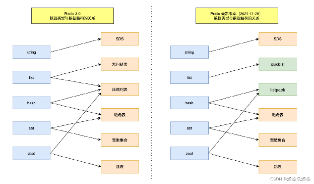
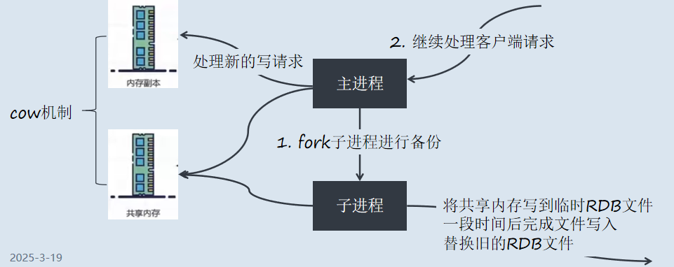
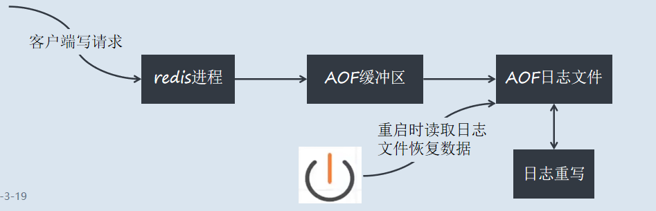
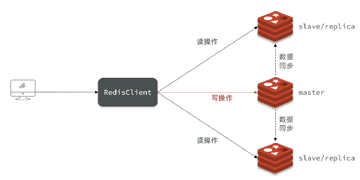
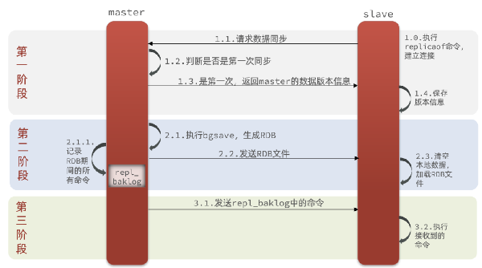
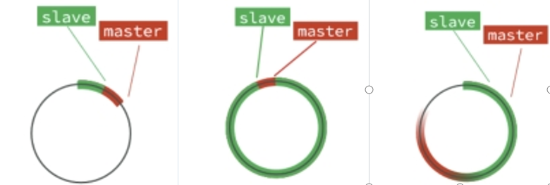

# **Redis**
---
- [**Redis**](#redis)
    - [**1. 缓存**](#1-缓存)
    - [**2. redis缓存**](#2-redis缓存)
      - [**2.1. Redis概述**](#21-redis概述)
      - [**2.2. Redis 数据的底层存储结构**](#22-redis-数据的底层存储结构)
      - [**2.3. Redis持久化**](#23-redis持久化)
      - [**2.3. redis的主从机制**](#23-redis的主从机制)
      - [**2.4. 缓存穿透**](#24-缓存穿透)
      - [**2.5. 缓存击穿**](#25-缓存击穿)
      - [**2.6. 缓存雪崩**](#26-缓存雪崩)
      - [**2.7. Redis的内存淘汰机制**](#27-redis的内存淘汰机制)
      - [**2.8. Redis主动更新策略**](#28-redis主动更新策略)

### **1. 缓存**
**概念**

最早，缓存是硬件的概念，CPU上的一种高速存储器（CPU 二级缓存等等），先于内存与CPU交换数据，速度非常快，是觉得内存处理速度跟不上CPU而采用的一种解决方案

而现在，互联网行业高速发展，缓存的概念，泛指存储在计算机上的原始数据的复杂集，便于快速访问，让系统快速响应的关键技术之一
  
我们使用的缓存，比如redis，就是因为不满足磁盘IO的速度，而将内存作为缓存，只不过，redis会用各种数据结构规划这块内存空间，用各种模型和算法，让这块空间得到充分的利用，从而达到非常快的响应速度

**缓存的优点**
  - 提升用户体验
  - 减轻服务器压力
  - 提升系统性能（响应时间、延迟、吞吐量、并发能力和资源利用率等）

**缺点**
  - 额外的硬件：缓存是用空间换时间的技术
  - 高并发缓存失效的代价过高（缓存击穿、缓存雪崩、缓存穿透）
  - 缓存与数据库数据实时同步
  - 缓存并发竞争


### **2. redis缓存**
#### **2.1. Redis概述**

**Redis**（Remote Dictionary Server ），即远程字典服务，是一个开源的使用ANSIC语言编写、支持网络、可基于内存亦可持久化的日志型、Key-Value数据库，并提供多种语言的API。可以理解成一个大容量的map。

**作用**

可以做为数据库存储数据，也可以用来做缓存、计数器、分布式锁等。实际工作中很少用它做数据库。

**Redis常用的五种基本类型**
  - string：字符串数据类型
  - hash：类似于对象，map的形式
  - list：表示一种线性数据结构，队列或栈
  - set：无序不可重复集合
  - zset：有序不可重复集合
  - 另外还有三种数据类型，都不是很常用。Geospatial、Bitmap、Hyperloglog
  

#### **2.2. Redis 数据的底层存储结构**

**String（字符串）**

底层结构：SDS（Simple Dynamic String）

  ```c
  struct sdshdr {
      int len;     // 已用空间长度
      int free;    // 剩余可用空间
      char buf[];  // 实际存储数据的字符数组
  };
  ```
- **特性**：
  - 预分配空间（减少内存重分配次数）
  - 二进制安全（可存储任意格式数据）
  - O(1)时间复杂度获取字符串长度
- **编码方式**：
  - int（存储8字节长整型）
  - embstr（<=39字节的短字符串）
  - raw（>39字节的长字符串）

**Hash（哈希表）**

1. ziplist（压缩列表） 
- **使用条件**：
  - 所有键值对的键和值的字符串长度 < `hash-max-ziplist-value`（默认64字节）
  - 元素数量 < `hash-max-ziplist-entries`（默认512个）
- **结构特点**：
  - 连续内存块存储
  - 无指针开销，内存紧凑
  - 适合小数据量存储

1. hashtable（字典）
- **使用条件**：当不满足ziplist条件时自动转换
- **结构特点**：
  - 数组+链表实现
  - 渐进式rehash机制
  - 采用MurmurHash2算法

**List（列表）**

底层结构：quicklist（快速列表）


```c
  typedef struct quicklist {
      quicklistNode *head;
      quicklistNode *tail;
      unsigned long count;    // 元素总数
      unsigned long len;      // quicklistNode节点数量
      int fill : 16;          // 单个ziplist大小限制
      unsigned int compress : 16; // LZF压缩深度
  } quicklist;
```
- **特点**：
  - ziplist双向链表（结合了ziplist和linkedlist优点）
  - 可配置压缩深度（`list-compress-depth`）
  - 默认每个ziplist存储8KB数据

**Set（集合）**
1. intset（整数集合）
- **使用条件**：
  - 所有元素都是整数
  - 元素数量 < `set-max-intset-entries`（默认512个）

  ```c
  typedef struct intset {
      uint32_t encoding; // 编码方式（int16/int32/int64）
      uint32_t length;   // 元素数量
      int8_t contents[]; // 元素数组
  } intset;
  ```


2. hashtable
- **使用条件**：当不满足intset条件时
- **特点**：
  - 字典实现（value为NULL）
  - O(1)时间复杂度查找元素

**Zset（有序集合）**
1. ziplist
- **使用条件**：
  - 元素数量 < `zset-max-ziplist-entries`（默认128个）
  - 所有元素长度 < `zset-max-ziplist-value`（默认64字节）
- **存储方式**：
  - 元素和分值交替存储：[元素1, 分数1, 元素2, 分数2...]

1. skiplist + dict
- **结构组成**：
  ```c
  typedef struct zset {
      dict *dict;        // 维护元素->分数的映射
      zskiplist *zsl;    // 维护有序结构
  } zset;
  ```
- **特点**：
  - 跳表实现范围查询（O(logN)）
  - 字典实现单元素查询（O(1)）
  - 内存开销较大（需要维护两种数据结构）

| 数据类型 | 编码方式                 | 转换条件                             |
|----------|--------------------------|--------------------------------------|
| String   | int/embstr/raw           | 根据内容和长度自动转换               |
| Hash     | ziplist → hashtable      | 元素数量或单个元素大小超过阈值       |
| List     | 快速列表（固定ziplist）  | 3.2版本后统一使用quicklist           |
| Set      | intset → hashtable       | 元素类型或数量超过阈值               |
| Zset     | ziplist → skiplist+dict  | 元素数量或单个元素大小超过阈值       |


#### **2.3. Redis持久化**

持久化就是把内存的数据写到磁盘中去，防止服务宕机了内存数据丢失。

**机制**：RDB（默认） 和 AOF 机制。

**RDB**

RDB是Redis DataBase缩写快照 ，默认的持久化方式。按照一定的时间将内存的数据以快照的形式保存到硬盘中，对应产生的数据文件为dump.rdb



- 触发机制
  - save的规则满足的情况下
  - 执行 flushall 命令
  - 退出redis，也会产生 rdb 文件

**AOF**：

AOF持久化(即Append Only File持久化)，则是将Redis执行的每次写命令记录到单独的日志文件中，当重启Redis会重新将持久化的日志中文件恢复数据



  - AOF的三种策略
    - always
    - everysec(默认值)
    - no always

#### **2.3. redis的主从机制**

**主从模式介绍**

概念：指将 Redis 服务部署到多个物理服务器上，然后让其中的一个节点作为 “主节点”，让其他节点作为 “从节点”


  
**节点关系**：
  - 从节点隶属于主节点，即从节点中的数据要跟随主节点变化，且从节点的数据要与主节点保持一致
  - 主节点只负责写入，即主节点只处理修改请求，并且需要将修改请求同步到从节点。
  - 从节点只负责读取，从节点中的数据不允许修改，即从节点只处理查询请求。
  - 通过主从复制的方式我们能够有效的解决单点问题：


**可用性**：

如果从节点挂了，不影响客户端读写请求
当主节点挂了，只需要重启主节点或让某个从节点成为主节点即可，不影响客户端读写请求，也不会丢失数据

**性能问题**：

将读请求全部分摊给从节点去执行，大大降低了主节点的压力，因为实际业务中绝大部分请求都是读请求


**Redis主从复制流程**
  - **保存主节点信息**：从节点保存主节点的 IP + PORT 信息
  - **主从建立连接**：从节点向主节点发起三次握手，建立 TCP 连接。(在系统层面上验证双方通信信道是否正常)
  - **发送 ping 命令**：从节点向主节点发送 ping，主节点返回 pong。(在应用层面上验证主节点能够正常工作)
  - **权限验证**：如果主节点设置了 requirepass 参数，需要进行密码验证。
  - **同步数据集**：对于首次建立复制的场景，主节点会把当前持有的所有数据全部发送给从节点，即全量同步；对于断开重连的从节点，会根据情况进行全量同步或部分同步。
  - **命令持续复制**：当从节点复制了主节点的所有数据之后，针对之后的修改命令，主节点会持续的把命令发送给从节点，从节点执行修改命令，保证主从数据的一致性。


**PSYNC数据同步**

**全量复制**：一般用于初次复制场景，Redis 早期支持的复制功能只有全量复制，它会把主节点全部数据一次性发送给从节点，当数据量较大时，会对主从节点和网络造成很大的开销



**增量复制**：在全量同步的基础上，当主从的Replication Id相同时，我们可以理解为，此时slave数据集至少是master的子集了。主节点会把从节点复制进度（offset）发送给从节点，从节点会根据复制进度进行数据同步。 
  - repl_baklog中会记录Redis处理过的命令日志及offset，包括master当前的offset，和slave已经拷贝到的offset。每次在第二阶段，master就去发送：从 已经拷贝过的offset开始 到 当前offset的数据
  - repl_baklog这个文件是一个固定大小的数组，只不过数组是环形，也就是说角标到达数组末尾后，会再次从0开始读写，这样数组头部的数据就会被覆盖，但因为slave（绿色部分已经同步了，因此master可以直接覆盖也无妨）
  - 但是如果slave宕机过久，导致master把尚未同步的红色部分覆盖了（即，红色超过了一整圈），此时只能全量同步了

 

#### **2.4. 缓存穿透**

**缓存和数据库中都没有的数据**，可用户还是源源不断的发起请求，导致每次请求都会到数据库，从而压垮数据库。
  
**解决办法**
  - **业务层校验**：用户发过来的请求，根据请求参数进行校验，对于明显错误的参数，直接拦截返回
  - **不存在数据设置短过期时间**
  - **布隆过滤器**：布隆过滤器是一种数据结构，利用极小的内存，可以判断大量的数据“一定不存在或者可能存在”。

#### **2.5. 缓存击穿**

Redis中一个**热点key失效**的同时，大量的请求过来，从而会全部到达数据库，压垮数据库。

**解决办法**
  - **设置热点数据永不过期**：
  - **定时更新**：
  - **互斥锁**：这是解决缓存穿透比较常用的方法
    互斥锁简单来说就是在Redis中根据key获得的value值为空时，先锁上，然后从数据库加载，加载完毕，释放锁。若其他线程也在请求该key时，发现获取锁失败，则睡眠一段时间（比如100ms）后重试。

#### **2.6. 缓存雪崩**

Redis中缓存的数据大面积同时失效，或者Redis宕机，从而会导致大量请求直接到数据库，压垮数据库。

**解决办法**
  - **设置有效期均匀分布**
  - **数据预热**
  - **保证Redis服务高可用**

#### **2.7. Redis的内存淘汰机制**

当 Redis 的内存使用量达到 `maxmemory` 配置的阈值时，Redis 会根据设定的 **淘汰策略（Eviction Policy）** 删除部分数据以释放空间。淘汰策略通过 `maxmemory-policy` 配置，支持多种模式：

**淘汰策略分类**

Redis 的淘汰策略分为 **基于键过期时间** 和 **全局淘汰** 两类：

| **策略**                   | **描述**                                                                 |
|----------------------------|-------------------------------------------------------------------------|
| **`volatile-lru`**         | 从设置了过期时间的键中，淘汰 **最近最少使用（LRU）** 的键。               |
| **`volatile-lfu`**         | 从设置了过期时间的键中，淘汰 **最不经常使用（LFU）** 的键（Redis 4.0+）。 |
| **`volatile-ttl`**         | 从设置了过期时间的键中，淘汰 **剩余生存时间（TTL）最短** 的键。            |
| **`volatile-random`**      | 从设置了过期时间的键中，随机淘汰键。                                      |
| **`allkeys-lru`**          | 从所有键中，淘汰 **最近最少使用（LRU）** 的键。                           |
| **`allkeys-lfu`**          | 从所有键中，淘汰 **最不经常使用（LFU）** 的键（Redis 4.0+）。              |
| **`allkeys-random`**       | 从所有键中，随机淘汰键。                                                  |
| **`noeviction`**（默认）   | 不淘汰任何键，达到内存上限时返回错误（写入操作拒绝，读操作正常）。          |

**2. LRU 与 LFU 的实现细节**

- **近似 LRU**：  
  Redis 使用 **概率性 LRU** 算法，随机采样 5 个（可配置）键，淘汰其中最久未访问的键。牺牲精度换取性能，避免维护全局链表。
  - 配置参数：`maxmemory-samples 5`
- **LFU**：  
  基于访问频率统计，为每个键维护一个 **计数器**，随时间衰减。优先淘汰访问频率最低的键。  
  - 计数器增长规则：每次访问时，概率性增加计数器。  
  - 衰减机制：每隔一段时间（`lfu-decay-time`）自动减少计数器。  
  - 配置参数：  
    ```bash
    lfu-log-factor 10    # 控制计数器增长速度
    lfu-decay-time 1     # 衰减时间（分钟）
    ```

**适用场景**

- **`volatile-*` 策略**：适合缓存场景，优先淘汰临时数据。  
- **`allkeys-*` 策略**：适合将 Redis 作为数据库，所有数据可淘汰。  
- **`noeviction`**：适合数据不可丢失的场景（需确保内存足够）。


#### **2.8. Redis主动更新策略**

主动更新策略主要指 Redis 如何管理键的 **过期删除** 和 **缓存一致性**，确保数据及时更新并释放内存。

**过期键删除策略**

Redis 通过两种机制删除过期键，避免内存泄漏：

| **策略**          | **描述**                                                                 |
|-------------------|-------------------------------------------------------------------------|
| **惰性删除**      | 在访问键时检查其过期时间，若过期则直接删除。                              |
| **定期删除**      | 周期性随机抽查一定数量的键（默认每秒 10 次），删除其中过期的键。           |
| **内存淘汰触发**  | 当内存不足触发淘汰策略时，若键已过期，优先删除。                          |


**缓存一致性策略**

Redis 作为缓存时，需与底层数据库保持数据一致性。常见主动更新策略包括：

| **策略**                | **描述**                                                                 |
|-------------------------|-------------------------------------------------------------------------|
| **Cache-Aside**         | 应用层控制缓存的读写：读时先查缓存，未命中则读数据库并回填；写时更新数据库并删除缓存。 |
| **Write-Through**       | 将缓存视为数据库的代理：写操作同时更新缓存和数据库（需缓存支持）。                    |
| **Write-Behind**        | 写操作先更新缓存，异步批量写入数据库（高性能但可能丢失数据）。                        |
| **TTL 自动过期**        | 为缓存键设置合理的过期时间，依赖 Redis 自动删除旧数据。                              |

**主动更新最佳实践**
1. **结合过期时间与淘汰策略**：  
   - 对热点数据设置较长 TTL，冷数据设置较短 TTL 或由淘汰策略自动清理。  
   - 示例：  
     ```bash
     SET user:1001 "{...}" EX 3600  # 设置 1 小时过期
     ```
2. **避免缓存雪崩**：  
   - 为键的 TTL 添加随机扰动，防止大量键同时过期。  
     ```python
     import random
     ttl = 3600 + random.randint(0, 300)  # 1小时 ±5分钟
     ```
3. **双删策略**：  
   - 写数据库后，先删除缓存，延迟再次删除（应对并发更新导致的脏数据）。  
   - 伪代码：  
     ```python
     def update_data(key, value):
         db.write(key, value)     # 写数据库
         redis.delete(key)        # 第一次删除
         time.sleep(0.1)          # 延迟
         redis.delete(key)        # 第二次删除
     ```

