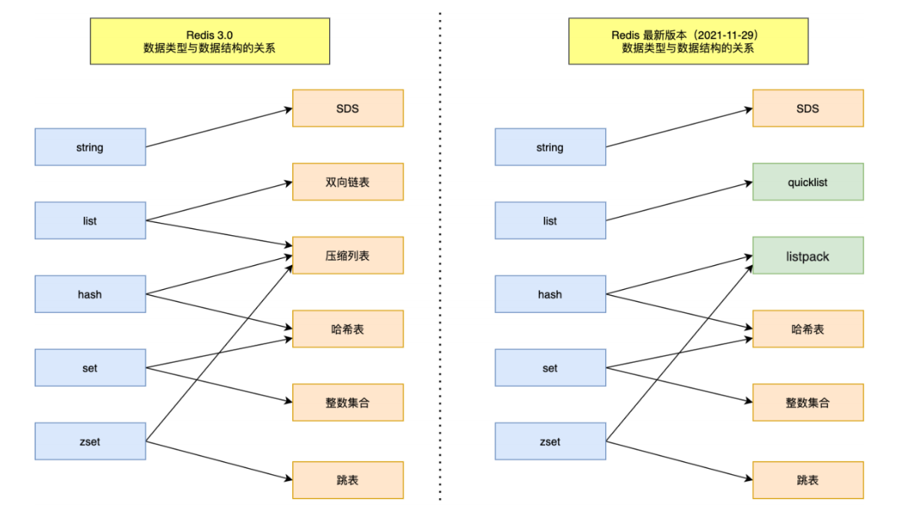

# **Redis**
---
- [**Redis**](#redis)
    - [**1. 缓存**](#1-缓存)
    - [**2. redis缓存**](#2-redis缓存)
      - [**2.1. Redis概述**](#21-redis概述)
      - [**2.2. Redis 数据的底层存储结构**](#22-redis-数据的底层存储结构)
      - [**2.3. Redis持久化**](#23-redis持久化)
      - [**2.3. redis的主从机制**](#23-redis的主从机制)
      - [**2.4. 缓存穿透**](#24-缓存穿透)
      - [**2.5. 缓存击穿**](#25-缓存击穿)
      - [**2.6. 缓存雪崩**](#26-缓存雪崩)
      - [**2.7. Redis的内存淘汰机制**](#27-redis的内存淘汰机制)
      - [**2.8. Redis主动更新策略**](#28-redis主动更新策略)
    - [**3. redis 为什么快**](#3-redis-为什么快)
    - [**4. COW**](#4-cow)
### **1. 缓存**
**概念**

最早，缓存是硬件的概念，CPU上的一种高速存储器（CPU 二级缓存等等），先于内存与CPU交换数据，速度非常快，是觉得内存处理速度跟不上CPU而采用的一种解决方案

而现在，互联网行业高速发展，缓存的概念，泛指存储在计算机上的原始数据的复杂集，便于快速访问，让系统快速响应的关键技术之一
  
我们使用的缓存，比如redis，就是因为不满足磁盘IO的速度，而将内存作为缓存，只不过，redis会用各种数据结构规划这块内存空间，用各种模型和算法，让这块空间得到充分的利用，从而达到非常快的响应速度

**缓存的优点**
  - 提升用户体验
  - 减轻服务器压力
  - 提升系统性能（响应时间、延迟、吞吐量、并发能力和资源利用率等）

**缺点**
  - 额外的硬件：缓存是用空间换时间的技术
  - 高并发缓存失效的代价过高（缓存击穿、缓存雪崩、缓存穿透）
  - 缓存与数据库数据实时同步
  - 缓存并发竞争


### **2. redis缓存**
#### **2.1. Redis概述**

**Redis**（Remote Dictionary Server ），即远程字典服务，是一个开源的使用ANSIC语言编写、支持网络、可基于内存亦可持久化的日志型、Key-Value数据库，并提供多种语言的API。可以理解成一个大容量的map。

**作用**

可以做为数据库存储数据，也可以用来做缓存、计数器、分布式锁等。实际工作中很少用它做数据库。

**Redis常用的五种基本类型**
  - string：字符串数据类型
  - hash：类似于对象，map的形式
  - list：表示一种线性数据结构，队列或栈
  - set：无序不可重复集合
  - zset：有序不可重复集合
  - 另外还有三种数据类型，都不是很常用。Geospatial、Bitmap、Hyperloglog

  


#### **2.2. Redis 数据的底层存储结构**
**1.SDS（Simple Dynamic Strings）**
- **灵活性**：可存储字符串或二进制数据（包括空字符），不受空字符限制。
- **缓存长度**：头部保存字符串长度，`O(1)` 时间获取长度。
- **动态扩容**：根据数据自动扩展内存，无需手动管理。

```c
struct sdshdr {
    int len;      // 字符串长度（不含空字符）
    int free;     // 空闲空间
    char buf[];   // 存储实际数据
};
```

- 高效获取长度，避免遍历。
- 自动内存管理，减少内存碎片。

**2. 双端链表（Doubly Linked List）**
- **节点结构**：
  ```c
  typedef struct listNode {
      struct listNode *prev;  // 前驱指针
      struct listNode *next;  // 后继指针
      void *value;            // 存储数据
  } listNode;
  ```
- **链表结构**：
  ```c
  typedef struct list {
      listNode *head;         // 头节点指针
      listNode *tail;         // 尾节点指针
      void *(*dup)(void *ptr);   // 数据复制函数
      void (*free)(void *ptr);   // 数据释放函数
      int (*match)(void *a, void *b); // 数据匹配函数
  } list;
  ```

**优点**：
- **高效操作**：头尾插入/删除 `O(1)`。
- **双向遍历**：支持从头或尾开始遍历。
- 获取链表数量：`O(1)`。

**缺点**：
- 内存不连续，CPU 缓存命中率低。
- 节点开销较大（每个节点需存储两个指针）。

**适用场景**：
- 实现 List 数据类型（队列、栈）。
- LRU 缓存淘汰策略。

---

**3. 压缩列表（ZipList）**

- **紧凑存储**：节点连续存储，节省内存。
- **动态长度**：节点长度根据数据动态调整。
- **支持多种类型**：存储字符串或整数。

```c
struct ziplist {
    // 头部和尾部指针
    unsigned char *head, *tail;
    // 其他元数据
    ...
};
```

**节点编码：**
- **前驱长度**：记录前一个节点的长度。
- **自身长度**：记录当前节点的长度。

**优点**：
- 内存紧凑，适合小数据集。
- 随机访问 `O(1)`（通过偏移量计算）。

**缺点**：
- **连锁更新**：插入/删除时可能需要移动后续节点。
- 适用于小规模数据，大数据时转换为双端链表。

**适用场景**：
- 小型 List 或 Hash 数据类型。

**4. 哈希表（Hash Table）**

```c
typedef struct dict {
    dictType *type;          // 哈希表类型
    void *privdata;          // 私有数据
    dictht ht[2];            // 哈希表数组（主表和扩展表）
    long rehashidx;          // 重哈希索引
    unsigned long iterators; // 迭代器计数
} dict;

typedef struct dictht {
    dictEntry **table;       // 桶数组
    unsigned long size;      // 桶数量
    unsigned long sizemask;  // size-1，用于取模
    unsigned long used;      // 已使用的桶数
} dictht;
```

**碰撞处理**：链地址法，冲突时形成链表。

**动态扩容**：渐进式 rehash：将数据逐步迁移至新表，避免阻塞。

**优点**：
- **快速查找**：`O(1)` 平均时间复杂度。
- 灵活支持多种键值类型。

**适用场景**：
- 实现 Hash 和部分 Set 数据类型。

**5. 整数集合（IntSet）**
- **紧凑存储**：按固定字节存储整数（如 2/4/8 字节）。
- **有序性**：元素按升序排列，支持二分查找。

```c
typedef struct intset {
    uint32_t encoding; // 整数编码（2/4/8 字节）
    uint32_t length;   // 元素个数
    uint8_t contents[]; // 整数数据
} intset;
```

**优点**：
- 内存效率高（无需指针）。
- 查找 `O(logN)`。

**缺点**：
- 仅支持整数类型。
- 动态扩容时需重新分配内存。

**适用场景**：
- 存储整数类型的 Set 数据。


**6. 跳表（SkipList）**

- **多层链表**：每层链表包含部分元素，顶层最稀疏。
- **节点结构**：
  ```c
  typedef struct zskiplistNode {
      robj *obj;          // 元素值（SDS）
      double score;       // 权重（分值）
      struct zskiplistLevel {
          struct zskiplistNode *forward; // 下一节点指针
          unsigned int span;             // 跨度（用于快速查找）
      } *level;
  } zskiplistNode;
  ```

**查找过程**：
1. 从最高层开始，向右遍历直到找到 `score ≤ target` 的节点。
2. 若当前节点的 `score` 等于目标值，返回该节点。
3. 否则，下移一层，重复步骤 1-2。

**优点**：
- 查找、插入、删除 `O(logN)`。
- 实现简单，无需复杂平衡操作。

**缺点**：
- 内存占用略高于平衡树。
- 随机化可能导致最坏 `O(N)` 时间。

**适用场景**：
- 实现 Sorted Set 数据类型。


**7. QuickList（快速列表）**
**结构**：
- **双向链表**：节点间通过指针连接。
- **压缩列表**：每个节点内部存储多个元素。

**特点**：
- **混合结构**：链表 + 压缩列表。
- **控制节点大小**：通过 `quicklist-node-max-elements` 和 `quicklist-fill-factor` 避免连锁更新。

**优点**：
- **高效操作**：头尾插入/删除 `O(1)`。
- 内存紧凑，适合存储列表数据。

**适用场景**：
- Redis List 数据类型（旧版本默认）。

**8. ListPack（列表包）**
**结构**：
- **紧凑存储**：连续内存块，无前驱长度字段。
- **节点格式**：
  ```c
  struct listpack {
      unsigned char *p;     // 内存起始地址
      int size;             // 总长度
      int tail_offset;      // 尾部偏移量
      // 元素以连续字节存储，每个元素前记录长度
  };
  ```

**特点**：
- **避免连锁更新**：仅记录当前节点长度。
- **高效插入/删除**：尾部操作 `O(1)`。

**优点**：
- 内存效率更高，无连锁更新问题。
- 适合小型列表数据。

**缺点**：
- 随机访问需遍历，复杂度 `O(N)`。

**适用场景**：
- Redis List 数据类型（新版本默认）。
- 小规模列表存储。


| 数据结构       | 适用场景                 | 时间复杂度（关键操作）       | 内存效率       |
|----------------|--------------------------|-----------------------------|----------------|
| **SDS**        | 字符串存储               | 获取长度 `O(1)`             | 中（含头部开销）|
| **双端链表**   | 队列、栈、LRU            | 插入/删除 `O(1)`            | 低（节点指针多）|
| **压缩列表**   | 小型 List/Hash           | 随机访问 `O(1)`             | 高（紧凑存储）  |
| **哈希表**     | Hash/Set 数据类型        | 查找/插入 `O(1)`            | 中（键值对开销）|
| **整数集合**   | 整数 Set                 | 查找 `O(logN)`              | 高（无指针）    |
| **跳表**       | Sorted Set               | 查找/插入 `O(logN)`         | 中（多层指针）  |
| **QuickList**  | 列表（旧版本）           | 头尾操作 `O(1)`             | 中（链表+压缩） |
| **ListPack**   | 列表（新版本）           | 尾部操作 `O(1)`             | 高（无连锁更新）|


#### **2.3. Redis持久化**

持久化就是把内存的数据写到磁盘中去，防止服务宕机了内存数据丢失。

**机制**：RDB（默认） 和 AOF 机制。

**RDB**

RDB是Redis DataBase缩写快照 ，默认的持久化方式。按照一定的时间将内存的数据以快照的形式保存到硬盘中，对应产生的数据文件为dump.rdb


- 触发机制
  - save的规则满足的情况下
  - 执行 flushall 命令
  - 退出redis，也会产生 rdb 文件

**AOF**：

AOF持久化(即Append Only File持久化)，则是将Redis执行的每次写命令记录到单独的日志文件中，当重启Redis会重新将持久化的日志中文件恢复数据


  - AOF的三种策略
    - always
    - everysec(默认值)
    - no always

#### **2.3. redis的主从机制**

**主从模式介绍**

概念：指将 Redis 服务部署到多个物理服务器上，然后让其中的一个节点作为 “主节点”，让其他节点作为 “从节点”


  
**节点关系**：
  - 从节点隶属于主节点，即从节点中的数据要跟随主节点变化，且从节点的数据要与主节点保持一致
  - 主节点只负责写入，即主节点只处理修改请求，并且需要将修改请求同步到从节点。
  - 从节点只负责读取，从节点中的数据不允许修改，即从节点只处理查询请求。
  - 通过主从复制的方式我们能够有效的解决单点问题：


**可用性**：

如果从节点挂了，不影响客户端读写请求
当主节点挂了，只需要重启主节点或让某个从节点成为主节点即可，不影响客户端读写请求，也不会丢失数据

**性能问题**：

将读请求全部分摊给从节点去执行，大大降低了主节点的压力，因为实际业务中绝大部分请求都是读请求


**Redis主从复制流程**
  - **保存主节点信息**：从节点保存主节点的 IP + PORT 信息
  - **主从建立连接**：从节点向主节点发起三次握手，建立 TCP 连接。(在系统层面上验证双方通信信道是否正常)
  - **发送 ping 命令**：从节点向主节点发送 ping，主节点返回 pong。(在应用层面上验证主节点能够正常工作)
  - **权限验证**：如果主节点设置了 requirepass 参数，需要进行密码验证。
  - **同步数据集**：对于首次建立复制的场景，主节点会把当前持有的所有数据全部发送给从节点，即全量同步；对于断开重连的从节点，会根据情况进行全量同步或部分同步。
  - **命令持续复制**：当从节点复制了主节点的所有数据之后，针对之后的修改命令，主节点会持续的把命令发送给从节点，从节点执行修改命令，保证主从数据的一致性。


**PSYNC数据同步**

**全量复制**：一般用于初次复制场景，Redis 早期支持的复制功能只有全量复制，它会把主节点全部数据一次性发送给从节点，当数据量较大时，会对主从节点和网络造成很大的开销


**增量复制**：在全量同步的基础上，当主从的Replication Id相同时，我们可以理解为，此时slave数据集至少是master的子集了。主节点会把从节点复制进度（offset）发送给从节点，从节点会根据复制进度进行数据同步。 
  - repl_baklog中会记录Redis处理过的命令日志及offset，包括master当前的offset，和slave已经拷贝到的offset。每次在第二阶段，master就去发送：从 已经拷贝过的offset开始 到 当前offset的数据
  - repl_baklog这个文件是一个固定大小的数组，只不过数组是环形，也就是说角标到达数组末尾后，会再次从0开始读写，这样数组头部的数据就会被覆盖，但因为slave（绿色部分已经同步了，因此master可以直接覆盖也无妨）
  - 但是如果slave宕机过久，导致master把尚未同步的红色部分覆盖了（即，红色超过了一整圈），此时只能全量同步了

 

#### **2.4. 缓存穿透**

**缓存和数据库中都没有的数据**，可用户还是源源不断的发起请求，导致每次请求都会到数据库，从而压垮数据库。
  
**解决办法**
  - **业务层校验**：用户发过来的请求，根据请求参数进行校验，对于明显错误的参数，直接拦截返回
  - **不存在数据设置短过期时间**
  - **布隆过滤器**：布隆过滤器是一种数据结构，利用极小的内存，可以判断大量的数据“一定不存在或者可能存在”。

#### **2.5. 缓存击穿**

Redis中一个**热点key失效**的同时，大量的请求过来，从而会全部到达数据库，压垮数据库。

**解决办法**
  - **设置热点数据永不过期**：
  - **定时更新**：
  - **互斥锁**：这是解决缓存穿透比较常用的方法
    互斥锁简单来说就是在Redis中根据key获得的value值为空时，先锁上，然后从数据库加载，加载完毕，释放锁。若其他线程也在请求该key时，发现获取锁失败，则睡眠一段时间（比如100ms）后重试。

#### **2.6. 缓存雪崩**

Redis中缓存的数据大面积同时失效，或者Redis宕机，从而会导致大量请求直接到数据库，压垮数据库。

**解决办法**
  - **设置有效期均匀分布**
  - **数据预热**
  - **保证Redis服务高可用**

#### **2.7. Redis的内存淘汰机制**

当 Redis 的内存使用量达到 `maxmemory` 配置的阈值时，Redis 会根据设定的 **淘汰策略（Eviction Policy）** 删除部分数据以释放空间。淘汰策略通过 `maxmemory-policy` 配置，支持多种模式：

**淘汰策略分类**

Redis 的淘汰策略分为 **基于键过期时间** 和 **全局淘汰** 两类：

| **策略**                   | **描述**                                                                 |
|----------------------------|-------------------------------------------------------------------------|
| **`volatile-lru`**         | 从设置了过期时间的键中，淘汰 **最近最少使用（LRU）** 的键。               |
| **`volatile-lfu`**         | 从设置了过期时间的键中，淘汰 **最不经常使用（LFU）** 的键（Redis 4.0+）。 |
| **`volatile-ttl`**         | 从设置了过期时间的键中，淘汰 **剩余生存时间（TTL）最短** 的键。            |
| **`volatile-random`**      | 从设置了过期时间的键中，随机淘汰键。                                      |
| **`allkeys-lru`**          | 从所有键中，淘汰 **最近最少使用（LRU）** 的键。                           |
| **`allkeys-lfu`**          | 从所有键中，淘汰 **最不经常使用（LFU）** 的键（Redis 4.0+）。              |
| **`allkeys-random`**       | 从所有键中，随机淘汰键。                                                  |
| **`noeviction`**（默认）   | 不淘汰任何键，达到内存上限时返回错误（写入操作拒绝，读操作正常）。          |

**2. LRU 与 LFU 的实现细节**

- **近似 LRU**：  
  Redis 使用 **概率性 LRU** 算法，随机采样 5 个（可配置）键，淘汰其中最久未访问的键。牺牲精度换取性能，避免维护全局链表。
  - 配置参数：`maxmemory-samples 5`
- **LFU**：  
  基于访问频率统计，为每个键维护一个 **计数器**，随时间衰减。优先淘汰访问频率最低的键。  
  - 计数器增长规则：每次访问时，概率性增加计数器。  
  - 衰减机制：每隔一段时间（`lfu-decay-time`）自动减少计数器。  
  - 配置参数：  
    ```bash
    lfu-log-factor 10    # 控制计数器增长速度
    lfu-decay-time 1     # 衰减时间（分钟）
    ```

**适用场景**

- **`volatile-*` 策略**：适合缓存场景，优先淘汰临时数据。  
- **`allkeys-*` 策略**：适合将 Redis 作为数据库，所有数据可淘汰。  
- **`noeviction`**：适合数据不可丢失的场景（需确保内存足够）。


#### **2.8. Redis主动更新策略**

主动更新策略主要指 Redis 如何管理键的 **过期删除** 和 **缓存一致性**，确保数据及时更新并释放内存。

**过期键删除策略**

Redis 通过两种机制删除过期键，避免内存泄漏：

| **策略**          | **描述**                                                                 |
|-------------------|-------------------------------------------------------------------------|
| **惰性删除**      | 在访问键时检查其过期时间，若过期则直接删除。                              |
| **定期删除**      | 周期性随机抽查一定数量的键（默认每秒 10 次），删除其中过期的键。           |
| **内存淘汰触发**  | 当内存不足触发淘汰策略时，若键已过期，优先删除。                          |


**缓存一致性策略**

Redis 作为缓存时，需与底层数据库保持数据一致性。常见主动更新策略包括：

| **策略**                | **描述**                                                                 |
|-------------------------|-------------------------------------------------------------------------|
| **Cache-Aside**         | 应用层控制缓存的读写：读时先查缓存，未命中则读数据库并回填；写时更新数据库并删除缓存。 |
| **Write-Through**       | 将缓存视为数据库的代理：写操作同时更新缓存和数据库（需缓存支持）。                    |
| **Write-Behind**        | 写操作先更新缓存，异步批量写入数据库（高性能但可能丢失数据）。                        |
| **TTL 自动过期**        | 为缓存键设置合理的过期时间，依赖 Redis 自动删除旧数据。                              |

**主动更新最佳实践**
1. **结合过期时间与淘汰策略**：  
   - 对热点数据设置较长 TTL，冷数据设置较短 TTL 或由淘汰策略自动清理。  
   - 示例：  
     ```bash
     SET user:1001 "{...}" EX 3600  # 设置 1 小时过期
     ```
2. **避免缓存雪崩**：  
   - 为键的 TTL 添加随机扰动，防止大量键同时过期。  
     ```python
     import random
     ttl = 3600 + random.randint(0, 300)  # 1小时 ±5分钟
     ```
3. **双删策略**：  
   - 写数据库后，先删除缓存，延迟再次删除（应对并发更新导致的脏数据）。  
   - 伪代码：  
     ```python
     def update_data(key, value):
         db.write(key, value)     # 写数据库
         redis.delete(key)        # 第一次删除
         time.sleep(0.1)          # 延迟
         redis.delete(key)        # 第二次删除
     ```

### **3. redis 为什么快**

**1. 基于内存的存储**
- **内存访问速度远超磁盘**  
  Redis 将所有数据存储在内存中，而内存的读写速度比磁盘（如机械硬盘或 SSD）快 **1000 倍以上**。例如：
  - 内存读写速度：**GB/s 级别**（如 DDR4 内存可达 25-32 GB/s）。
  - SSD 读写速度：通常为 **数百 MB/s**（如 NVMe SSD 约 3-3.5 GB/s）。
  - 机械硬盘：仅 **几十 MB/s**（如 SATA HDD 约 100-200 MB/s）。
  - **避免磁盘 I/O 延迟**：内存操作无需等待磁盘寻址，直接通过 CPU 寄存器访问，极大减少了延迟。

- **持久化异步化**  
  Redis 的持久化（如 RDB 快照、AOF 日志）是 **异步** 进行的，不会阻塞主线程的读写操作，确保高性能。

**2. 单线程模型**
- **避免线程切换和锁竞争**  
  Redis 采用 **单线程模型**，所有请求在同一个线程中顺序执行。虽然单线程看似“低效”，但其优势在于：
  - **无锁设计**：无需多线程间的锁竞争，避免了锁的开销和死锁风险。
  - **原子性保障**：每个命令的执行是原子的，简化了并发控制。
  - **减少上下文切换**：多线程模型中，频繁的线程切换会消耗 CPU 时间，而单线程模型通过事件循环高效处理所有请求。

- **适合 I/O 密集型场景**  
  Redis 的操作多为短平快的 I/O 操作（如简单的键值存取），单线程模型能充分利用 CPU 时间处理更多请求，而非等待 I/O 完成。

**3. 简单的 Key-Value 结构**
- **避免复杂查询**  
  传统关系型数据库需要处理复杂的 SQL 查询、索引、事务等，而 Redis 的 **键值对模型** 极大简化了数据操作，仅需通过键直接访问值，时间复杂度接近 **O(1)**。

- **高效的数据结构**  
  Redis 内部使用高度优化的数据结构，例如：
  - **哈希表（Hash Table）**：全局哈希表存储所有键值对，通过哈希函数直接定位，查找速度极快。冲突时通过 **链式哈希** 和 **双哈希表 Rehash** 机制避免性能下降。
  - **简单动态字符串（SDS）**：Redis 的字符串类型使用 SDS 实现，记录长度（避免遍历计算）、预分配空间（减少内存分配次数），相比 C 语言的字符串更高效。
  - **跳跃表（SkipList）**：有序集合（Sorted Set）使用跳跃表实现，提供 **O(log n)** 的插入、删除和查找性能，同时支持快速范围查询。
  - **整数集合（IntSet）**：对整数值的集合进行压缩存储，减少内存占用和操作时间。

**4. 非关系型设计**
- **无需复杂事务和 ACID**  
  Redis 的设计目标是高性能和高可用，牺牲了部分一致性（如最终一致性），避免了关系型数据库的事务开销（如锁、日志、回滚等）。


**5. 基于事件的 Reactor 模型**
- **I/O 多路复用（epoll/kqueue）**  
  Redis 使用 **Reactor 模型**，通过 **epoll（Linux）** 或 **kqueue（BSD/macOS）** 实现 **非阻塞 I/O 多路复用**：
  - **单线程处理多个连接**：主线程监听所有 socket 的事件（如可读、可写），当事件就绪时，立即处理，无需阻塞等待。
  - **高效网络通信**：通过事件循环（Event Loop）快速响应客户端请求，最大化吞吐量。
  - **示例**：当客户端 A 发送请求时，主线程立即处理并返回结果，同时继续监听其他客户端的事件。

**6. I/O 操作的辅助线程**
- **后台线程处理耗时任务**  
  Redis 主线程是单线程的，但以下操作会交由后台线程异步处理：
  - **持久化**：RDB 快照生成、AOF 日志重写。
  - **大键操作**：如扫描过期键、大规模数据迁移等。
  - **AOF 写入**：通过独立线程异步写入磁盘，避免阻塞主线程。

**7. 命令管道（Pipeline）**
- **批量提交命令减少网络延迟**  
  客户端可一次性发送多个命令，Redis 顺序执行后批量返回结果，减少网络往返时间（RTT）。

**8. 内存管理优化**
- **内存分配策略**  
  Redis 使用 **分代内存分配器**（如jemalloc），优化小对象分配效率，减少内存碎片。
- **过期键管理**  
  通过 **惰性删除** 和 **定期删除** 组合策略，平衡内存占用和性能：
  - **惰性删除**：在访问键时检查是否过期，若过期则删除。
  - **定期删除**：每秒随机抽样部分键，删除过期的键。

**9. 网络协议优化**
- **二进制协议**  
  Redis 使用 **二进制协议**（而非文本协议）减少序列化/反序列化开销，提升传输效率。
- **多路复用**：通过单线程高效处理多个客户端连接，无需为每个连接创建线程或进程。


**总结：Redis 的性能优势来源**
| **关键点**               | **具体实现与优势**                                                                 |
|--------------------------|---------------------------------------------------------------------------------|
| **内存存储**             | 数据全在内存，避免磁盘 I/O，速度提升千倍以上。                                      |
| **单线程 + 事件驱动**     | 避免线程切换开销，通过 epoll/kqueue 处理多连接，最大化 CPU 利用率。                  |
| **高效数据结构**         | 哈希表、SDS、跳跃表等优化结构，保证 O(1)/O(log n) 时间复杂度。                      |
| **非阻塞 I/O**           | 客户端请求非阻塞，主线程快速响应，提升并发能力。                                    |
| **后台线程辅助**         | 异步处理持久化等耗时任务，避免阻塞主线程。                                         |
| **命令管道与协议优化**   | 减少网络延迟，高效传输数据。                                                       |


**对比传统关系型数据库**
| **特性**                 | **Redis**                                | **关系型数据库**                     |
|--------------------------|-----------------------------------------|-------------------------------------|
| **数据存储**             | 内存（可选持久化）                      | 磁盘（必须持久化）                  |
| **数据模型**             | 简单键值对（支持多种数据结构）           | 复杂表结构、SQL 查询、事务           |
| **并发模型**             | 单线程 + 事件驱动                        | 多线程 + 锁机制                     |
| **性能**                 | 高吞吐、低延迟（每秒万级操作）           | 中等吞吐，高延迟（受磁盘和锁影响）   |
| **适用场景**             | 缓存、实时计数、消息队列、Session 存储   | 复杂事务、强一致性、结构化数据查询   |


### **4. COW**

**Copy-on-Write（写时复制，COW）** 是一种优化技术，广泛应用于操作系统和编程中，其核心思想是：**多个用户共享同一资源，直到某个用户需要修改该资源时，才复制资源的副本进行独立修改**。在 Redis 中，COW 技术被用于持久化（RDB 和 AOF）和内存管理，以提高性能和减少资源消耗。

**的核心原理**
- **共享资源**：多个进程或线程初始时共享同一份数据。
- **延迟复制**：当某个进程/线程需要修改数据时，才复制一份独立的副本，后续修改仅影响自己的副本。
- **减少冗余**：在修改发生前，所有用户共享同一份数据，节省内存或磁盘空间。


**RDB 持久化中的 COW**

Redis 的 **RDB（快照持久化）** 通过以下步骤实现：

1. **fork 子进程**：
   - 主进程调用 `fork()` 系统调用，创建一个子进程。
   - **操作系统层面的 COW**：子进程与父进程（主进程）共享同一份物理内存页（页表相同）。
2. **子进程处理持久化**：
   - 子进程负责将内存数据写入磁盘（生成 RDB 文件），主进程继续处理客户端请求。
3. **写操作触发复制**：
   - **主进程**：当主进程需要修改内存数据时，操作系统会为该内存页 **复制一份副本**，主进程的修改仅影响自己的副本。
   - **子进程**：子进程仍然访问 fork 时的内存快照（未被修改的原始数据），确保生成的 RDB 文件是某一时刻的 **一致快照**。

**(2) AOF 持久化中的 COW**

- **AOF（Append-Only File）** 在重写过程中也使用 COW：
  1. **fork 子进程**：子进程负责将现有 AOF 内容重写为更紧凑的文件。
  2. **主进程继续处理请求**：新写入的命令被追加到内存缓冲区（`aof_buf`）。
  3. **子进程完成重写后**：主进程将缓冲区的增量命令追加到新 AOF 文件，确保数据一致性。


**优势**

**(1) 高性能**
- **避免阻塞主线程**：持久化操作由子进程完成，主进程无需等待 I/O 完成，保持高吞吐。
- **高效内存利用**：子进程与主进程共享内存，减少内存开销。

**(2) 数据一致性**
- **快照一致性**：通过 `fork` 的瞬间，子进程看到的是父进程当时的内存状态，即使主进程后续修改数据，子进程仍能生成一致的 RDB/AOF 文件。
- **避免锁竞争**：无需对内存数据加锁，简化并发控制。

**(3) 低资源消耗**
- **按需复制**：只有在修改内存页时才会复制，其余时间共享数据，减少内存复制的开销。
