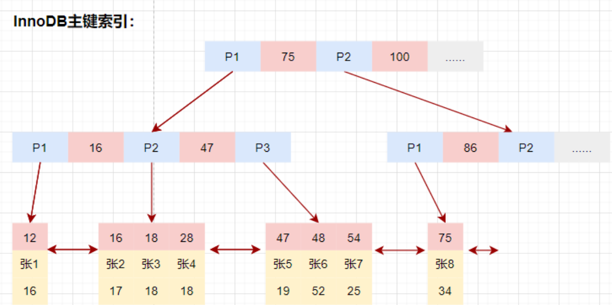

# **index**
---

- [**index**](#index)
    - [**一、概述**](#一概述)
    - [**二、索引类型**](#二索引类型)
      - [**1. 主键索引（Primary Key）**](#1-主键索引primary-key)
      - [**2. 唯一索引（Unique Index）**](#2-唯一索引unique-index)
      - [**3. 复合索引（Composite Index）**](#3-复合索引composite-index)
      - [**4. 全文索引（Full-Text Index）**](#4-全文索引full-text-index)
      - [**5. 前缀索引（Prefix Index）**](#5-前缀索引prefix-index)
    - [**三、主流索引类型及原理**](#三主流索引类型及原理)
      - [**1. B+Tree索引（主流实现）**](#1-btree索引主流实现)
      - [**2. 哈希索引**](#2-哈希索引)
      - [**3. 特殊索引类型**](#3-特殊索引类型)
      - [**4. MyISAM的索引实现**](#4-myisam的索引实现)
      - [**5. InnoDB的索引实现**](#5-innodb的索引实现)
    - [**四、索引优化**](#四索引优化)
      - [**索引设计优化**](#索引设计优化)
      - [**查询优化**](#查询优化)
      - [**EXPLAIN**](#explain)
      - [**Optimizer Trace分析**](#optimizer-trace分析)


### **一、概述**

MySQL 索引是提高数据库查询性能的核心机制

**索引的作用**：
1. **数据定位加速**：通过建立数据目录结构，将全表扫描的O(n)复杂度优化为O(log n)
2. **排序优化**：B+树索引天然有序，避免filesort操作
3. **覆盖查询**：通过索引直接获取数据，减少回表操作

###  **二、索引类型**
#### **1. 主键索引（Primary Key）**

**核心特性**
- **聚簇索引结构**：InnoDB中主键索引即数据存储方式，叶子节点直接存储行数据（16KB页）
- **物理排序**：数据按主键顺序物理存储，范围查询效率高，但乱序插入易导致页分裂
- **隐式逻辑**：未显式定义主键时，InnoDB会自动生成6字节的隐藏RowID作为聚簇索引

- **自增ID vs UUID**：

| 特性          | 自增ID                | UUID                   |
|---------------|-----------------------|------------------------|
| 插入性能       | 顺序写入，无页分裂     | 随机写入，高页分裂概率  |
| 存储空间       | 4/8字节               | 36字节（字符串形式）    |
| 安全性         | 易预测                | 不可预测               |

- **业务主键风险**：若用非自增业务字段（如身份证号），可能引发热点写问题

#### **2. 唯一索引（Unique Index）**

**实现机制**
- **约束验证**：插入/更新时通过B+树结构检查唯一性，时间复杂度O(log n)
- **NULL处理**：
  - 唯一索引允许多个NULL值（根据SQL标准）
  - 但部分存储引擎（如InnoDB）仅允许单个NULL值

**性能影响**
- **查询优化**：唯一索引的等值查询可被优化为const类型（EXPLAIN结果）
- **锁竞争**：唯一索引检查需加GAP锁，高并发插入可能引发死锁

#### **3. 复合索引（Composite Index）**

**最左前缀原则**
- **索引结构**：按定义顺序排列，如索引(a,b,c)的存储顺序为a→b→c
- **有效查询模式**：
  ```sql
  WHERE a=1 AND b>2          -- 使用a,b列
  ORDER BY a DESC, b ASC     -- 需与索引排序方向一致
  ```
- **失效场景**：
  ```sql
  WHERE b=2                  -- 未包含最左列a
  WHERE a=1 AND c=3          -- 跳过b列导致部分失效
  ```

#### **4. 全文索引（Full-Text Index）**

**实现原理**
- **倒排索引结构**：
  ```plaintext
  单词1 → [文档ID1, 位置1], [文档ID3, 位置2]
  单词2 → [文档ID2, 位置5], [文档ID4, 位置3]
  ```
- **分词机制**：
  - 默认使用ngram解析器（支持中文）
  - 可配置停用词表（stopword）

**使用示例**
```sql
ALTER TABLE articles ADD FULLTEXT INDEX ft_index (title, body) 
  WITH PARSER ngram;

SELECT * FROM articles 
WHERE MATCH(title, body) AGAINST('"数据库优化" -故障' IN BOOLEAN MODE);
```

**模式对比**：
| 模式          | 描述                   |
|---------------|------------------------|
| NATURAL       | 自然语言搜索（默认）    |
| BOOLEAN       | 支持+-操作符           |
| QUERY EXPANSION| 查询扩展（两次搜索）    |


#### **5. 前缀索引（Prefix Index）**

**优化策略**
- **长度选择公式**：
  ```sql
  SELECT 
    COUNT(DISTINCT LEFT(col, 3))/COUNT(*) AS sel3,
    COUNT(DISTINCT LEFT(col, 5))/COUNT(*) AS sel5,
    COUNT(DISTINCT LEFT(col, 7))/COUNT(*) AS sel7
  FROM table;
  -- 选择sel值趋近完整列区分度的最小长度
  ```
- **存储节省**：text列前20字符的索引仅占约25字节（CHAR(20)）

**使用限制**
- **无法覆盖排序**：
  ```sql
  SELECT * FROM logs 
  WHERE host LIKE '192.168%' 
  ORDER BY host;  -- 前缀索引无法避免filesort
  ```
- **无法用于GROUP BY**：部分场景需回表验证完整值

| 场景                | 推荐索引类型          | 注意事项                  |
|---------------------|----------------------|--------------------------|
| 高并发写入          | 自增主键+二级索引     | 避免随机主键导致页分裂    |
| 多维度查询          | 复合索引              | 遵循最左前缀原则          |
| 文本搜索            | 全文索引+ngram        | 注意中文分词效果          |
| 地理数据查询        | 空间索引              | 需校验SRID一致性          |
| 长文本字段查询      | 前缀索引              | 平衡选择性与存储成本      |

### **三、主流索引类型及原理**
#### **1. B+Tree索引（主流实现）**

  


**结构特性**：
- 多路平衡搜索树，树高通常3-4层（可支撑千万级数据）
- 非叶子节点存储键值和指针（20B），叶子节点形成双向链表
- InnoDB叶子节点存储完整数据行（聚簇索引特性）

| 特性        | B-Tree       | B+Tree           |
|-----------|--------------|------------------|
| 数据存储位置  | 所有节点      | 仅叶子节点         |
| 范围查询效率  | 需要回溯      | 链表直接遍历        |
| 节点利用率   | 较低         | 更高（更矮的树）    |

#### **2. 哈希索引**
- Memory引擎默认实现，InnoDB支持自适应哈希
- 精确匹配O(1)时间复杂度，但无法支持：
  - 范围查询
  - 排序操作
  - 最左前缀匹配

#### **3. 特殊索引类型**
- **全文索引**：倒排索引结构，支持文本搜索（MyISAM/InnoDB）
- **空间索引**：R-Tree实现，用于地理数据（MyISAM）
- **前缀索引**：对文本前N字符建立索引，平衡存储与查询效率

#### **4. MyISAM的索引实现**

**索引结构**

MyISAM的数据文件和索引文件是分开存储的，MyISAM使用B+树构建索引树时，叶子节点中键值key存储的是索引列的值，数据data存储的是索引所在行的磁盘地址。

  

**辅助索引**

在MyISAM存储引擎中，辅助索引和主键索引的结构是一样的，没有任何区别，叶子节点中data阈存储的都是行记录的磁盘地址。

主键列索引的键值是唯一的，而辅助索引的键值是可以重复的。

查询数据时，由于辅助索引的键值不唯一，可能存在多个拥有相同的记录，所以即使是等值查询，也需要按照范围查询的方式在辅助索引树种检索数据


#### **5. InnoDB的索引实现**

**主键索引（聚簇索引）**

每个InnoDB表都有一个聚簇索引，聚簇索引使用B+树构建，叶子节点的data阈存储的是整行记录。一般情况下，聚簇索引等同于主键索引，当一个表没有创建主键索引时，InnoDB会自动创建一个ROWID字段来构建聚簇索引。InnoDB创建索引的具体规则如下：

- 在创建表时，定义主键PRIMARY KEY，InnoDB会自动将主键索引用作聚簇索引。
- 如果表没有定义主键，InnoDB会选择第一个不为NULL的唯一索引列用作聚簇索引。
- 如果以上两个都没有，InnoDB会自动使用一个长度为6字节的ROWID字段来构建
聚簇索引，该ROWID字段会在插入新的行记录时自动递增。

除聚簇索引之外的所有索引都被称为辅助索引。在InnoDB中，辅助索引中的叶子节点键值存储的是该行的主键值。在检索时，InnoDB使用此主键在聚餐索引中搜索行记录。

  


**组合索引**

  

以下是MySQL索引优化的系统化指南，涵盖设计策略、使用技巧及维护方法，结合原理与实践案例：


### **四、索引优化**
#### **索引设计优化**

1. **选择性优先原则**
- **计算方法**：
  ```sql
  SELECT 
    COUNT(DISTINCT column)/COUNT(*) AS selectivity 
  FROM table;
  -- 选择性>0.2适合建立索引
  ```
- **案例对比**：
  - 性别字段（选择性≈0.5%）：不适合单独建索引
  - 手机号字段（选择性≈100%）：理想索引候选

2. **复合索引排列策略**
- **黄金法则**：
  1. **高频查询条件**列在前
  2. **高区分度**列优先
  3. **排序/分组**需求列靠后
- **示例优化**：
  ```sql
  -- 原始查询：
  SELECT * FROM orders 
  WHERE user_id=1001 AND status='paid' 
  ORDER BY create_time DESC;
  
  -- 最优索引：
  ALTER TABLE orders ADD INDEX idx_user_status_time(user_id, status, create_time);
  ```
3. **索引长度压缩**
- **前缀索引优化**：
  ```sql
  -- 查找最佳前缀长度
  SELECT 
    COUNT(DISTINCT LEFT(title,20))/COUNT(*) AS sel20,
    COUNT(DISTINCT LEFT(title,30))/COUNT(*) AS sel30
  FROM articles;
  
  -- 创建前缀索引
  CREATE INDEX idx_title_prefix ON articles(title(30));
  ```


#### **查询优化**

1. **避免索引失效场景**
  
| **失效模式**          | **优化方案**                     |
|-----------------------|----------------------------------|
| `WHERE DATE(create_time)='2023-10-01'` | 改为范围查询：`create_time BETWEEN '2023-10-01 00:00:00' AND '2023-10-01 23:59:59'` |
| `WHERE amount+100 > 200`              | 改写为：`amount > 100`           |
| `WHERE name LIKE '%john%'`             | 使用全文索引或ES替代方案          |


1. **覆盖索引优化**
- **执行计划对比**：
  ```sql
  -- 需要回表（Using index condition）
  EXPLAIN SELECT * FROM users WHERE age>25;
  
  -- 覆盖索引（Using index）
  EXPLAIN SELECT id,age FROM users WHERE age>25;
  ```
- **设计建议**：将高频查询字段包含在索引中


3. **索引下推（ICP）优化**
- **原理图示**：
  ```plaintext
  传统方式：
  存储引擎 → 检索所有age>20数据 → Server层过滤city='北京'
  
  ICP启用后：
  存储引擎 → 直接检索age>20 AND city='北京'
  ```
- **开启方式**：
  ```sql
  SET optimizer_switch='index_condition_pushdown=on';
  ```

5. **自适应哈希索引（AHI）**
- **监控方法**：
  ```sql
  SHOW ENGINE INNODB STATUS;
  -- 查看INSERT BUFFER AND ADAPTIVE HASH INDEX段落
  ```
- **优化建议**：对热点数据查询，AHI可提升5~10倍性能


#### **EXPLAIN**


**核心作用**

用于分析 SQL 语句的执行计划，帮助开发者：
- 判断索引使用有效性
- 识别全表扫描等性能瓶颈
- 验证 SQL 改写优化效果
- 预估查询资源消耗（扫描行数、排序方式等）

**输出字段**

1. **id** 
- **含义**：查询执行的顺序标识
- **典型场景**：
  - 相同 id：同一查询层级（如联表查询）
  - 不同 id：子查询（数值越大执行优先级越高）

2. **select_type**

| 类型                | 说明                                                                 |
|---------------------|----------------------------------------------------------------------|
| SIMPLE              | 简单 SELECT（无子查询或 UNION）                                       |
| PRIMARY             | 外层主查询                                                            |
| SUBQUERY            | 子查询中的第一个 SELECT                                               |
| DERIVED             | FROM 子句中的子查询（派生表）                                          |
| UNION               | UNION 中的第二个及后续 SELECT                                        |
| UNION RESULT        | UNION 的结果集                                                        |

3. **table**
- **显示对象**：当前操作的表
- 特殊值说明：
  - `<derivedN>`：第 N 个派生表
  - `<unionM,N>`：UNION 结果集

4. **partitions**（5.7+）
- 显示查询涉及的分区（需建表时显式定义分区）

5. **type**（**关键指标**）

性能排序（优→劣）：
```plaintext
system > const > eq_ref > ref > fulltext > range > index > ALL
```

**常见类型详解**：
  - **const**：通过主键/唯一索引等值查询
    ```sql
    EXPLAIN SELECT * FROM users WHERE id = 1;
    ```
  - **eq_ref**：联表查询时使用主键/唯一索引关联
    ```sql
    EXPLAIN SELECT * FROM orders 
    JOIN users ON orders.user_id = users.id; -- users.id 是主键
    ```
  - **ref**：非唯一索引等值查询
    ```sql
    EXPLAIN SELECT * FROM users WHERE phone = '13800138000';
    ```
  - **range**：索引范围扫描（BETWEEN、IN、>等）
    ```sql
    EXPLAIN SELECT * FROM orders WHERE amount > 100;
    ```
  - **index**：全索引扫描（效率通常优于ALL）
    ```sql
    EXPLAIN SELECT COUNT(*) FROM users; -- 使用覆盖索引
    ```
  - **ALL**：全表扫描（需重点优化）

6. **possible_keys**
- **显示可能使用的索引**（不一定实际使用）
- 若为 NULL，说明无合适索引可用

7. **key**
- **实际使用的索引**
- 可能为 NULL（未使用索引）或 PRIMARY（主键索引）

8. **key_len**
- **索引使用长度**（字节数）
- **计算规则**：
  - 字符串类型：`3*N + 2`（utf8mb4，N为定义长度）
  - 可为 NULL 的列：+1字节
  ```sql
  -- 示例：varchar(255) + NULL
  key_len = 3*255 + 2 + 1 = 768
  ```

9. **ref**
- **索引关联的列或常量**
- 常见形式：
  - `const`：常量值
  - `db.table.column`：关联表的列

10. **rows**
- **预估扫描行数**（基于统计信息）
- 注意：实际执行可能与该值存在偏差

11. **filtered**
- **存储引擎层过滤后的剩余比例**
- 示例：rows=1000，filtered=10% → 最终返回约100行

12. **Extra**（**关键优化指标**）

| 值                    | 含义                                                                 | 优化建议                          |
|-----------------------|----------------------------------------------------------------------|----------------------------------|
| **Using index**       | 覆盖索引（无需回表）                                                  | 保持当前索引策略                   |
| **Using where**       | 存储引擎返回数据后，Server 层需二次过滤                               | 检查是否可添加索引覆盖条件           |
| **Using temporary**   | 使用临时表（常见于 GROUP BY/ORDER BY）                                | 优化 SQL 或调整索引                  |
| **Using filesort**    | 额外排序操作                                                          | 添加 ORDER BY 相关索引              |
| **Using join buffer** | 使用联表缓存（Block Nested Loop）                                     | 检查索引是否缺失或调整 join 顺序      |
| **Impossible WHERE**  | WHERE 条件永远不成立                                                  | 检查业务逻辑                        |

**执行计划解读流程**
1. **检查 type**：是否达到 range 或以上级别
2. **验证索引**：possible_keys 与 key 是否匹配
3. **分析扫描行数**：rows 是否合理
4. **关注 Extra**：识别临时表/文件排序等问题
5. **计算覆盖索引**：key_len 是否接近完整索引长度

#### **Optimizer Trace分析**
- **使用步骤**：
  ```sql
  SET optimizer_trace="enabled=on";
  SELECT * FROM users WHERE ...;
  SELECT * FROM information_schema.optimizer_trace;
  ```

