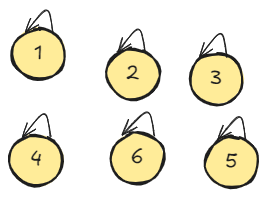
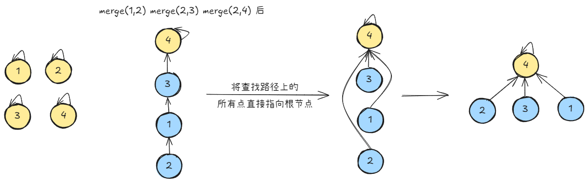
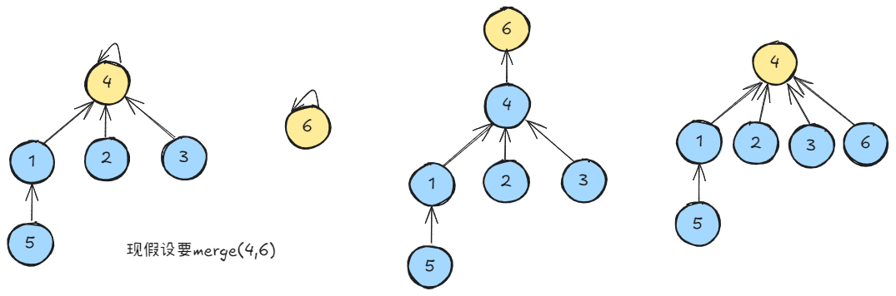

# **并查集（Union-Find）**

- [**并查集（Union-Find）**](#并查集union-find)
  - [**操作**](#操作)
    - [**初始化**](#初始化)
    - [**查找（Find）**](#查找find)
    - [**合并（Union）**](#合并union)
  - [**路径压缩**](#路径压缩)
  - [**按秩合并**](#按秩合并)
    - [**按秩合并实现**](#按秩合并实现)


并查集（Union-Find）是一种用于处理 **不相交集合** 的合并与查询问题的树型数据结构。它支持两种基本操作：
1. **Find**：查询元素所属集合（判断两个元素是否属于同一集合）
2. **Union**：合并两个不相交的集合

其核心特点是 **以极低的时间复杂度处理动态连通性问题**（近乎 O(1)）。

## **操作**
### **初始化**
- 通常使用一个数组 `parent[]` 来表示每个元素的父节点。
- 每个元素都被初始化为一个单独的集合，即每个元素的父节点指向自己。

```c++
int parent[MAXN];

inline void init(int n)
{
    for (int i = 1; i <= n; ++i)
        parent[i] = i;
}
```
  

### **查找（Find）**

**目标**：找到元素的根节点（集合代表）  

**终止条件**：一层一层访问父节点，直至根节点（根节点的标志就是父节点是本身）

要判断两个元素是否属于同一个集合，只需要看它们的根节点是否相同即可。


```c++
int find(int x)
{
    if(parent[x] == x)
        return x;
    else
        return find(parent[x]);
}
```

### **合并（Union）**  

找到两个集合的代表元素，然后将前者的父节点设为后者即可

```c++
inline void merge(int i, int j)
{
    parent[find(i)] = find(j);
}
```

## **路径压缩**

若只是简单的合并，可能会导致树的高度不平衡，从而降低查询效率。

路径压缩是一种优化策略，它通过在查找过程中，将路径上的所有节点直接指向根节点，从而减少树的高度。

```c++
int find(int x)
{
    return x == parent[x] ? x : (parent[x] = find(parent[x]));
}
```
  

## **按秩合并**

  

我们常常会遇到上面的情况：有一棵较复杂的树需要与一个单元素的集合合并

显然，第二种树的高度更小，效果更优

按秩合并的目的是在合并两个集合时，将**较小的树合并到较大的树**中，从而避免树的高度（秩）快速增长

这里的“秩”通常有两种定义：
1. **树的高度（Depth）**：初始时每个节点的秩为0，合并时将高度较小的树合并到高度较大的树上，若高度相等则任选一个作为根，并将新树的秩加1。
2. **树的大小（Size）**：秩表示树中包含的节点数量，合并时将节点数较少的树合并到节点数较多的树中。

两种定义的最终目标一致：通过平衡树的结构，确保树的高度尽可能小，从而加快后续查找操作的速度。


### **按秩合并实现**

**数据结构**
- **parent数组**：记录每个节点的父节点
- **rank数组**：记录每个根节点的秩（高度或大小），初始时每个节点的秩为0或1（取决于定义）。

**合并操作（Union）**
合并两个元素 `x` 和 `y` 的步骤如下：
1. **查找根节点**：通过 `find(x)` 和 `find(y)` 找到它们的根节点 `root_x` 和 `root_y`。
2. **判断是否属于同一集合**：若 `root_x == root_y`，则无需合并。
3. **按秩合并**：
   - **若秩不同**：将秩较小的树的根指向秩较大的树的根。
   - **若秩相同**：任选一个树的根作为新根，并将新根的秩加1。（若是基于高度，则直接将秩的大小相加）

```c++
inline void merge(int i, int j)
{
    int x = find(i), y = find(j);    //先找到两个根节点
    if (rank[x] <= rank[y])
        parent[x] = y;
    else
        parent[y] = x;
    if (rank[x] == rank[y] && x != y)
        rank[y]++;                   //如果深度相同且根节点不同，则新的根节点的深度+1
}
```