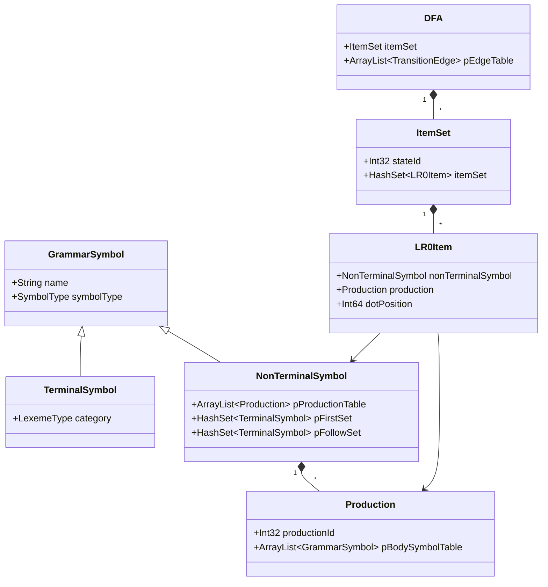
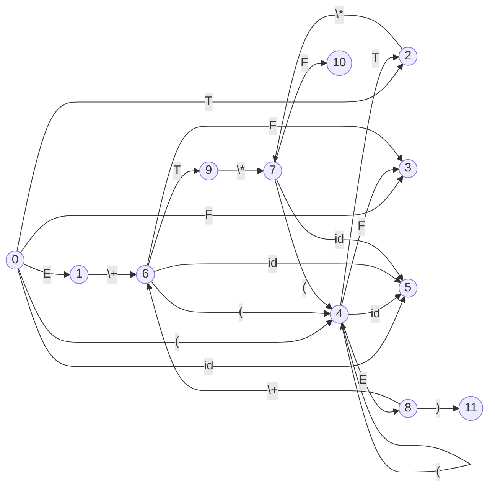

- [一、实验题目](#一实验题目)
- [二、实验目的](#二实验目的)
- [三、实验环境](#三实验环境)
- [四、实验内容](#四实验内容)
  - [4.1. 任务一：FIRST/FOLLOW集合计算](#41-任务一firstfollow集合计算)
    - [4.1.1. 数据结构的定义](#411-数据结构的定义)
    - [4.1.2. 辅助功能函数](#412-辅助功能函数)
    - [4.1.3. 产生式 FIRST 集求解](#413-产生式-first-集求解)
    - [4.1.4. 非终结符 FIRST 集求解](#414-非终结符-first-集求解)
    - [4.1.5.  非终结符 FOLLOW 集求解](#415--非终结符-follow-集求解)
    - [4.1.6. 测试与结果](#416-测试与结果)
  - [4.2. LR语法分析](#42-lr语法分析)
    - [4.2.1. 相关数据结构分析](#421-相关数据结构分析)
    - [4.2.2. 核心项的闭包求解](#422-核心项的闭包求解)
    - [4.2.3. 项集的变迁](#423-项集的变迁)
    - [4.2.4. DFA求解](#424-dfa求解)
    - [4.2.5. 是否为SLR(1)文法的判断](#425-是否为slr1文法的判断)
    - [4.2.6. LR语法分析表](#426-lr语法分析表)
    - [4.2.7. 测试与结果](#427-测试与结果)
  - [4.3. TINY语言测试](#43-tiny语言测试)
- [五、收获与体会](#五收获与体会)


### 一、实验题目  
实验二：上下文无关文法的DFA构建及语法分析表生成  

### 二、实验目的  
1. 理解LR(0)项集闭包的构造原理，掌握DFA自动机的生成算法  
2. 掌握非终结符的FIRST/FOLLOW集合计算、产生式FIRST集合求解方法  
3. 实践SLR(1)文法判定逻辑，理解冲突检测机制  
4. 掌握LR语法分析表（ACTION/GOTO表）的构建方法  
5. 验证算法在算术表达式文法和TINY语言文法中的适用性  

### 三、实验环境  
1. **操作系统**：Windows 11  
2. **开发语言**：仓颉语言（基于C++的扩展语法）  
3. **开发工具**：Visual Studio Code 1.78.2  
4. **编译器环境**：Cangjie Compiler: 0.53.18 (cjnative)  

### 四、实验内容  

#### 4.1. 任务一：FIRST/FOLLOW集合计算

##### 4.1.1. 数据结构的定义

**GrammarSymbol 类**：表示文法中的符号，包括终结符和非终结符。  
主要成员：
- `name`：符号名称。
- `symbolType`：
  - `TERMINAL` (终结符)
  - `NONTERMINAL` (非终结符)
  - `NULL_SYMBOL` (空符号)

**TerminalSymbol 类**：继承自 `GrammarSymbol`，表示一个终结符。
- `category`：词法种类。

**NonTerminalSymbol 类**：继承自 `GrammarSymbol`，表示一个非终结符。
- `pProductionTable`：非终结符的产生式集合。
- `pFirstSet`：FIRST 集。
- `pFollowSet`：FOLLOW 集。
- `canDeriveEpsilon`：是否可以推导出 ε。

**Production 类**：表示单个产生式。
- `pBodySymbolTable`：产生式体中包含的符号。
- `pFirstSet`：该产生式的 FIRST 集。

##### 4.1.2. 辅助功能函数

**辅助函数：`getEpsilonSymbol`**
获取特殊终结符 ε 的标记。

```cj
func getEpsilonSymbol() : TerminalSymbol {
    var epsilon : TerminalSymbol = TerminalSymbol("epsilon", LexemeType.NULL)
    return epsilon
}
```

**辅助函数：`containsEpsilon`**
检查一个 FIRST 集是否包含 ε。
```cj
func containsEpsilon(firstSet : HashSet<TerminalSymbol>) : Bool {
    for (symbol in firstSet) {
        if (symbol.name == "epsilon") {
            return true
        }
    }
    return false
}
```

##### 4.1.3. 产生式 FIRST 集求解

根据产生式的定义，递归求解出某产生式的 FIRST 集, 并判断该产生式是否可以推导出 ε。

**实现代码**

```c++
func computeProductionFirstSet(production : Production, canDriveEpsilonMap : HashMap<NonTerminalSymbol, Bool>) : Unit {
    production.pFirstSet.clear()
    
    var canDeriveEpsilon : Bool = true

    for (symbol in production.pBodySymbolTable) {
        if (symbol.symbolType == SymbolType.TERMINAL) {
            var temp : TerminalSymbol = TerminalSymbol(symbol.name, LexemeType.NULL)
            production.pFirstSet.put(temp)
            canDeriveEpsilon = false
            break
        } else if (symbol.symbolType == SymbolType.NONTERMINAL) {
            var nonTerminal : NonTerminalSymbol = (symbol as NonTerminalSymbol).getOrThrow()
            
            for (term in nonTerminal.pFirstSet) {
                production.pFirstSet.put(term)
            }
            if (!canDriveEpsilonMap.contains(nonTerminal)) {
                canDeriveEpsilon = false
                break
            } else if (!canDriveEpsilonMap[nonTerminal]) {
                canDeriveEpsilon = false
                break
            }
        }
    }
}
```

- **初始化**：清空产生式的First集合，假设可以推导ε（`canDeriveEpsilon = true`）。
- **遍历产生式体中的每个符号**：
  - **终结符**：将其加入First集，停止遍历（后续符号不影响First集）。
  - **非终结符**：
    - 将其First集合合并到当前产生式的First集中。
    - 检查该非终结符是否能推导出ε（通过`canDriveEpsilonMap`）：
      - 若不能推导ε，设置`canDeriveEpsilon = false`，停止遍历。
      - 若能推导ε，继续检查下一个符号。

##### 4.1.4. 非终结符 FIRST 集求解

通过对非终结符相关所有产生式的 FIRST 集求解，递归记录所有组合结果，完成非终结符的 FIRST 集计算。

**实现代码**

```c++
func computeAllFirstSets(grammarSymbols : ArrayList<GrammarSymbol>, canDriveEpsilonMap : HashMap<NonTerminalSymbol, Bool>) : Unit {
    var changed : Bool = true
    while (changed) {
        changed = false
        for (symbol in grammarSymbols) {
            if (symbol.symbolType == SymbolType.NONTERMINAL) {
                var nonTerminal : NonTerminalSymbol = (symbol as NonTerminalSymbol).getOrThrow()
                var oldFirstSize : Int32 = Int32(nonTerminal.pFirstSet.size)
                var oldCanDeriveEpsilon : Bool = nonTerminal.canDeriveEpsilon
                nonTerminal.canDeriveEpsilon = false
                for (production in nonTerminal.pProductionTable) {
                    if (production.bodysize == 0) {
                        nonTerminal.canDeriveEpsilon = true
                    } else {
                        computeProductionFirstSet(production, canDriveEpsilonMap)
                        for (terminal in production.pFirstSet) {
                            nonTerminal.pFirstSet.put(terminal)
                        }
                        var prodcanDeriveEpsilon : Bool = true
                        for (prodSymbol in production.pBodySymbolTable) {
                            if (prodSymbol.symbolType == SymbolType.TERMINAL) {
                                prodcanDeriveEpsilon = false
                                break
                            } else if (prodSymbol.symbolType == SymbolType.NONTERMINAL) {
                                var prodNonTerminal : NonTerminalSymbol = (prodSymbol as NonTerminalSymbol).getOrThrow()
                                if (!canDriveEpsilonMap.contains(prodNonTerminal)) {
                                    prodcanDeriveEpsilon = false
                                    break
                                } else {
                                    if (!canDriveEpsilonMap[prodNonTerminal]) {
                                        prodcanDeriveEpsilon = false
                                        break
                                    }
                                }
                            }
                        }
                        if (prodcanDeriveEpsilon) {
                            nonTerminal.canDeriveEpsilon = true
                        }
                    }
                }
                if (Int32(nonTerminal.pFirstSet.size) > oldFirstSize || nonTerminal.canDeriveEpsilon != oldCanDeriveEpsilon) {
                    changed = true
                }
            }
        }
        for (symbol in grammarSymbols) {
            if (symbol.symbolType == SymbolType.NONTERMINAL) {
                var nonTerminal : NonTerminalSymbol = (symbol as NonTerminalSymbol).getOrThrow()
                canDriveEpsilonMap.put(nonTerminal, nonTerminal.canDeriveEpsilon)
            }
        }
    }
}
```
- **思路**：不动点迭代，循环直到First集合和ε状态不再变化。
- **遍历所有语法符号**：
  - **非终结符处理**：
    - 记录旧状态（First集合大小、ε状态）。
    - 重置ε状态为`false`。
    - **遍历所有产生式**：
      - **空产生式**：直接标记该非终结符可推导ε。
      - **非空产生式**：
        - 调用`computeProductionFirstSet`计算产生式的First集。
        - 合并产生式的First集到非终结符的First集。
        - 若该产生式可推导ε（所有符号可推导ε），标记非终结符可推导ε。
    - **更新状态**：若First集或ε状态变化，标记继续迭代。
- **更新全局ε映射**：将最新ε状态存入`canDriveEpsilonMap`。

##### 4.1.5.  非终结符 FOLLOW 集求解

通过对产生式的推导，记录非终结符的 FOLLOW 集，直至不再变化。

**实现代码**

```c++
func computeAllFollowSets(grammarSymbols : ArrayList<GrammarSymbol>, rootSymbol : NonTerminalSymbol, canDeriveEpsilonMap : HashMap<NonTerminalSymbol, Bool>) : Unit {
    var eof : TerminalSymbol = TerminalSymbol("$", LexemeType.EOF)
    for (symbol in grammarSymbols) {
        if (symbol.symbolType == SymbolType.TERMINAL && symbol.name == "$") {
            eof = (symbol as TerminalSymbol).getOrThrow()
            rootSymbol.pFollowSet.put(eof)
            break
        }
    }
    var changed : Bool = true
    while (changed) {
        changed = false
        for (symbol in grammarSymbols) {
            if (symbol.symbolType == SymbolType.NONTERMINAL) {
                var nt : NonTerminalSymbol = (symbol as NonTerminalSymbol).getOrThrow()
                var oldFollowSize : Int32 = Int32(nt.pFollowSet.size)
                for (sym in grammarSymbols) {
                    if (sym.symbolType == SymbolType.NONTERMINAL) {
                        var head : NonTerminalSymbol = (sym as NonTerminalSymbol).getOrThrow()
                        for (production in head.pProductionTable) {
                            var i : Int64 = 0
                            while (i < production.pBodySymbolTable.size) {
                                var bodySymbol : GrammarSymbol = production.pBodySymbolTable[i]
                                if (bodySymbol == (nt as GrammarSymbol).getOrThrow()) {
                                    var addFollow : Bool = true
                                    var j : Int64 = i + 1
                                    while (j < production.pBodySymbolTable.size && addFollow) {
                                        var nextSymbol : GrammarSymbol = production.pBodySymbolTable[j]
                                        if (nextSymbol.symbolType == SymbolType.TERMINAL) {
                                            var terminal : TerminalSymbol = (nextSymbol as TerminalSymbol).getOrThrow()
                                            nt.pFollowSet.put(terminal)
                                            addFollow = false
                                        } else if (nextSymbol.symbolType == SymbolType.NONTERMINAL) {
                                            var nextNt : NonTerminalSymbol = (nextSymbol as NonTerminalSymbol).getOrThrow()
                                            for (terminal in nextNt.pFirstSet) {
                                                nt.pFollowSet.put(terminal)
                                            }
                                            if (!canDeriveEpsilonMap[nextNt]) {
                                                addFollow = false
                                            }
                                        }
                                        j += 1
                                    }
                                    if (addFollow) {
                                        for (terminal in head.pFollowSet) {
                                            nt.pFollowSet.put(terminal)
                                        }
                                    }
                                }
                                i += 1                                 
                            }
                        }
                    }
                }
                if (Int32(nt.pFollowSet.size) > oldFollowSize) {
                    changed = true
                }
            }
        }
    }
}
```

- **初始化**：将EOF（$）加入根符号的Follow集。
- **不动点迭代**：循环直到Follow集合不再变化。
- **遍历所有非终结符**：
  - 记录旧Follow集大小。
  - **遍历所有产生式**：
    - **查找非终结符在产生式体中的位置**：
      - 对每个位置i的非终结符B：
        - **处理后续符号（i+1开始）**：
          - 终结符：加入B的Follow集，停止。
          - 非终结符：合并其First集到B的Follow集；若其不能推导ε，停止。
        - **若后续符号均可推导ε**：将产生式头部的Follow集加入B的Follow集。
  - **更新状态**：若Follow集变化，继续迭代。

##### 4.1.6. 测试与结果

**测试文法**：

```txt
E -> E + T | T
T -> T * F | F
F -> ( E ) | id
```

**测试输出**：

```bash
Testing computeProductionFirstSet for Production F -> ( E )
FIRST set of Production F -> ( E ):
(
Testing computeAllFirstSets for Arithmetic Grammar
FIRST set of E:
(
id
FIRST set of T:
(
id
FIRST set of F:
(
id
Can E derive epsilon: false
Can T derive epsilon: false
Can F derive epsilon: false
Testing computeAllFollowSets for Arithmetic Grammar
FOLLOW set of E:
$
+
)
FOLLOW set of T:
$
+
)
*
FOLLOW set of F:
$
+
)
*
```

测试结果表明，所有函数的测试都通过，说明First集和Follow集的计算正确。

#### 4.2. LR语法分析  

##### 4.2.1. 相关数据结构分析  

 **LR0Item 类**  
表示LR(0)分析过程中的核心项目，描述产生式解析进度。  
主要成员：  
- `nonTerminalSymbol`：项目所属的非终结符（产生式头部）  
- `production`：当前处理的产生式对象  
- `dotPosition`：圆点位置（0表示位于产生式最左端）  
- `category`：项目类型  
  - `CORE`：核心项（初始或驱动符转移生成）  
  - `NONCORE`：非核心项（闭包运算生成）  

 **ItemSet 类**  
表示LR(0)项集（DFA状态），存储具有相同前缀的LR(0)项目集合。  
主要成员：  
- `stateId`：项集的唯一状态标识  
- `itemSet`：存储LR0Item对象的哈希集合  
  - 通过哈希表实现快速查重  
  - 使用`itemSetsEqual`函数判断两个项集是否等价  

 **TransitionEdge 类**  
描述DFA状态之间的转移关系。  
主要成员：  
- `driverSymbol`：驱动符号（终结符/非终结符）  
- `fromItemSet`：转移出发项集  
- `toItemSet`：转移到达项集  

 **DFA 类**  
表示LR(0)自动机的完整结构。  
主要成员：  
- `itemSet`：初始项集（DFA起始状态）  
- `pEdgeTable`：所有状态转移边的集合  
- `pItemSetTable`：所有生成的项集状态  

 **ActionCell 类**  
描述LR分析表的ACTION部分单元格。  
主要成员：  
- `stateId`：当前状态编号  
- `terminalSymbolName`：终结符名称（输入符号）  
- `actionType`：动作类型  
  - `SHIFT`：移入动作（s）  
  - `REDUCE`：规约动作（r）  
  - `ACCEPT`：接受动作（a）  
- `id`：动作参数  
  - 移入时表示目标状态  
  - 规约时表示产生式ID  

 **GotoCell 类**  
描述LR分析表的GOTO部分单元格。  
主要成员：  
- `stateId`：当前状态编号  
- `nonTerminalSymbolName`：非终结符名称  
- `nextStateid`：跳转的目标状态  

 **ProductionInfo 类**  
产生式概述表的元数据存储。  
主要成员：  
- `indexId`：产生式唯一编号  
- `headName`：头部非终结符名称  
- `bodysize`：产生式体长度  



##### 4.2.2. 核心项的闭包求解

`getClosure` 函数用于计算给定项集（`ItemSet`）的闭包。通过将点后为非终结符的项扩展，添加所有可能的产生式，确保项集包含所有相关 LR(0) 项。


```c++
func getClosure(itemSet : ItemSet) : Unit {
    var workList : ArrayList<LR0Item> = ArrayList<LR0Item>()
    
    // 初始化工作队列
    for (item in itemSet.itemSet) {
        workList.append(item)
    }
    
    while (!workList.isEmpty()) {
        var currentItem : LR0Item = workList.remove(0)
        
        if (currentItem.dotPosition < Int64(currentItem.production.bodysize)) {
            var nextSymbol : GrammarSymbol = currentItem.production.pBodySymbolTable[currentItem.dotPosition]
            if (nextSymbol.symbolType == SymbolType.NONTERMINAL) {
                var nt : NonTerminalSymbol = (nextSymbol as NonTerminalSymbol).getOrThrow()
                for (prod in nt.pProductionTable) {
                    var newItem : LR0Item = LR0Item(nt, prod, 0, ItemCategory.NONCORE)
                    if (itemSet.itemSet.put(newItem)) {
                        workList.append(newItem)
                    }
                }
            }
        }
    }
}
```

**实现思路**
- 使用工作队列（`workList`）实现迭代扩展，类似广度优先搜索。
- 对于每个项，若点未到产生式末尾且点后符号是非终结符，则添加该非终结符的所有产生式（点在开头）。
- 重复此过程，直到没有新项加入。

**具体步骤**
1. **初始化工作队列**：
   - 将输入项集中的所有项（`itemSet.itemSet`）加入 `workList`。
2. **迭代处理**：
   - 当工作队列不为空时，取出队首项（`currentItem`）。
3. **检查点位置**：
   - 若点位置（`dotPosition`）小于产生式体长度（`bodysize`），则点后有符号需要处理。
4. **处理非终结符**：
   - 获取点后的符号（`nextSymbol`）。
   - 若该符号是非终结符（`NONTERMINAL`）：
     - 转换为 `NonTerminalSymbol` 类型（`nt`）。
     - 遍历 `nt` 的所有产生式（`prod`）。
     - 为每个产生式创建新项（`newItem`），点位置为 0，类别为非核心项（`NONCORE`）。
     - 若新项不在项集中（`itemSet.itemSet.put` 返回 `true`），加入工作队列。

##### 4.2.3. 项集的变迁

`buildLR0DFA` 函数从文法的起始符号构造完整的 LR(0) DFA，包括项集表和转移边表。

``` c++
func exhaustTransition(itemSet : ItemSet, pItemSetTable : ArrayList<ItemSet>, pEdgeTable : ArrayList<TransitionEdge>) : Unit {
    var transitionMap : HashMap<GrammarSymbol, ArrayList<LR0Item>> = HashMap<GrammarSymbol, ArrayList<LR0Item>>()

    // Build transition map
    for (item in itemSet.itemSet) {
        if (item.dotPosition < Int64(item.production.bodysize)) {
            var driver : GrammarSymbol = item.production.pBodySymbolTable[item.dotPosition]
            var nextItem : LR0Item = LR0Item(item.nonTerminalSymbol, item.production, item.dotPosition + 1, item.category)
            var items : ArrayList<LR0Item>
            if (!transitionMap.contains(driver)) {
                items = ArrayList<LR0Item>()
                transitionMap.put(driver, items)
            } else {
                items = transitionMap[driver]
            }
            items.append(nextItem)
        }
    }

    // Process each transition
    for ((driver,coreItems) in transitionMap) {
        var newItemSet : ItemSet = ItemSet(Int32(pItemSetTable.size))
        for (item in coreItems) {
            newItemSet.itemSet.put(item)
        }
        getClosure(newItemSet)

        var isNew : Bool = true
        var existingSet : ItemSet = ItemSet(0)
        for (existing in pItemSetTable) {
            if (itemSetsEqual(existing, newItemSet)) {
                isNew = false
                existingSet = existing
                break
            }
        }

        if (isNew) {
            pItemSetTable.append(newItemSet)
            existingSet = newItemSet
        }
        var edge : TransitionEdge = TransitionEdge(driver, itemSet, existingSet)
        pEdgeTable.append(edge)
    }
}
```

**实现思路**
- 构建转移映射（`transitionMap`），按点后符号分组后续项。
- 对每个符号驱动的项集，计算闭包，检查是否为新状态，并记录转移边。
- 确保状态唯一性，避免重复添加。

**具体步骤**
1. **构建转移映射**：
   - 遍历项集中的每个项（`item`）。
   - 若点未到末尾，获取点后符号（`driver`）并创建新项（点前移）。
   - 将新项按 `driver` 分组存储到 `transitionMap`。
2. **处理每个转移**：
   - 遍历 `transitionMap` 中的符号（`driver`）和核心项集（`coreItems`）。
   - 创建新项集（`newItemSet`），添加核心项并计算闭包。
3. **检查新状态**：
   - 检查 `newItemSet` 是否已存在于 `pItemSetTable` 中。
   - 若不存在（`isNew` 为 `true`），添加到表中；否则使用已有项集（`existingSet`）。
   - 创建转移边（`edge`），记录驱动符号和起始/目标项集，加入 `pEdgeTable`。

##### 4.2.4. DFA求解

``` c++
func buildLR0DFA(rootSymbol : NonTerminalSymbol) : DFA {
    // 创建增广文法
    var SPrime : NonTerminalSymbol = NonTerminalSymbol("S'")
    var initialProd : Production = Production(0)
    initialProd.head = SPrime
    initialProd.addBodySymbol(rootSymbol)
    SPrime.pProductionTable.append(initialProd)
    SPrime.numOfProduction = 1

    // 初始化起始项目集
    var startupItemSet : ItemSet = ItemSet(0)
    var initialItem : LR0Item = LR0Item(SPrime, initialProd, 0, ItemCategory.CORE)
    startupItemSet.itemSet.put(initialItem)
    getClosure(startupItemSet)

    // 初始化 DFA
    var dfa : DFA = DFA(startupItemSet)
    var workList : ArrayList<ItemSet> = ArrayList<ItemSet>()
    var processed : HashSet<ItemSet> = HashSet<ItemSet>()
    workList.append(startupItemSet)

    // 构建 DFA
    while (!workList.isEmpty()) {
        var currentItemSet : ItemSet = workList.remove(0)  
        exhaustTransition(currentItemSet, dfa.pItemSetTable, dfa.pEdgeTable)
        processed.put(currentItemSet)  // 标记为已处理
        for (edge in dfa.pEdgeTable) {
            if (itemSetsEqual(edge.fromItemSet, currentItemSet)) {
                if (!processed.contains(edge.toItemSet) && !containsItemSet(workList, edge.toItemSet)) {
                    workList.append(edge.toItemSet)
                }
            }
        }
    }

    return dfa
}
```

**实现思路**
- 创建增广文法，添加起始符号 `S'`。
- 从初始项集开始，迭代计算所有状态的闭包和转移，直到无新状态生成。
- 使用工作队列和已处理集合避免重复计算。

**具体步骤**
1. **创建增广文法**：
   - 定义新非终结符 `S'`，添加产生式 `S' -> rootSymbol`。
2. **初始化起始项集**：
   - 创建初始项集（状态 0），添加核心项 `S' -> .rootSymbol`，并计算闭包。
3. **初始化 DFA**：
   - 创建 DFA 对象，以起始项集为起点，初始化工作队列和已处理集合。
4. **构建 DFA**：
   - 当工作队列不为空时：
     - 取出当前项集，计算其所有转移（调用 `exhaustTransition`）。
     - 标记为已处理。
     - 检查新生成的转移边，若目标项集未处理且不在队列中，加入队列。

##### 4.2.5. 是否为SLR(1)文法的判断

`isSLR1` 函数判断给定的 DFA 是否对应一个 SLR(1) 文法，通过检查每个状态是否存在移进-归约或归约-归约冲突。

``` c++
func isSLR1(dfa : DFA) : Bool {
    for (itemSet in dfa.pItemSetTable) {
        var reduceProductions : HashSet<Production> = HashSet<Production>()
        var shiftTerminals : HashSet<TerminalSymbol> = HashSet<TerminalSymbol>()

        for (item in itemSet.itemSet) {
            if (item.dotPosition == Int64(item.production.bodysize)) {
                reduceProductions.put(item.production)
            } else if (item.dotPosition < Int64(item.production.bodysize)) {
                var nextSymbol : GrammarSymbol = item.production.pBodySymbolTable[item.dotPosition]
                if (nextSymbol.symbolType == SymbolType.TERMINAL) {
                    shiftTerminals.put((nextSymbol as TerminalSymbol).getOrThrow())
                }
            }
        }

        if (reduceProductions.size > 1) {
            return false
        }

        if (!reduceProductions.isEmpty() && !shiftTerminals.isEmpty()) {
            var reduceProd : Production = reduceProductions.iterator().next().getOrThrow()
            var nt : NonTerminalSymbol = reduceProd.head
            for (term in shiftTerminals) {
                if (nt.pFollowSet.contains(term)) {
                    return false
                }
            }
        }
    }
    return true
}
```

**实现思路**
- 遍历 DFA 的每个项集，分别收集归约项和移进项的符号。
- 检查是否存在冲突：
  - 多个归约项（归约-归约冲突）。
  - 归约项的 FOLLOW 集与移进项的终结符交集非空（移进-归约冲突）。

**具体步骤**
1. **遍历项集**：
   - 对 DFA 的每个项集（`itemSet`）进行分析。
2. **收集归约和移进信息**：
   - 初始化归约产生式集合（`reduceProductions`）和移进终结符集合（`shiftTerminals`）。
   - 遍历项集中的每个项：
     - 若点在末尾（`dotPosition == bodysize`），加入归约集合。
     - 若点后符号为终结符，加入移进集合。
3. **检查冲突**：
   - 若归约产生式多于 1 个，返回 `false`（归约-归约冲突）。
   - 若同时存在归约和移进项：
     - 获取归约产生式的头非终结符（`nt`）。
     - 检查 `nt` 的 FOLLOW 集与移进终结符是否有交集，若有，返回 `false`（移进-归约冲突）。
   - 否则，返回 `true`。

##### 4.2.6. LR语法分析表

`fillLRParseTable` 函数根据 DFA 填充 LR 分析表，包括动作表（移进、归约、接受）和 GOTO 表。

```c++
func fillLRParseTable(dfa : DFA, pActionCellTable : ArrayList<ActionCell>, pGotoCellTable : ArrayList<GotoCell>) : Unit {
    // 处理转移边
    for (edge in dfa.pEdgeTable) {
        var from : ItemSet = edge.fromItemSet
        var to : ItemSet = edge.toItemSet
        var driver : GrammarSymbol = edge.driverSymbol

        if (driver.symbolType == SymbolType.TERMINAL) {
            pActionCellTable.append(ActionCell(from.stateId, driver.name, ActionCategory.SHIFT, to.stateId))
        } else if (driver.symbolType == SymbolType.NONTERMINAL) {
            pGotoCellTable.append(GotoCell(from.stateId, driver.name, to.stateId))
        }
    }

    // 处理归约项
    for (itemSet in dfa.pItemSetTable) {
        for (item in itemSet.itemSet) {
            if (item.dotPosition == Int64(item.production.bodysize)) {
                if (item.nonTerminalSymbol.name == "S'") {
                    pActionCellTable.append(ActionCell(itemSet.stateId, "$", ActionCategory.ACCEPT, 0))
                } else {
                    var nt : NonTerminalSymbol = item.nonTerminalSymbol
                    for (term in nt.pFollowSet) {
                        pActionCellTable.append(ActionCell(itemSet.stateId, term.name, ActionCategory.REDUCE, item.production.productionId))
                    }
                }
            }
        }
    }
}
```

**实现思路**
- 处理 DFA 的转移边，填充移进动作和 GOTO 表。
- 处理项集中点在末尾的项，填充归约或接受动作。

**具体步骤**
1. **处理转移边**：
   - 遍历 DFA 的所有转移边（`edge`）。
   - 若驱动符号为终结符，添加移进动作（`SHIFT`）。
   - 若驱动符号为非终结符，添加 GOTO 表项。
2. **处理归约项**：
   - 遍历每个项集及其项：
     - 若点在末尾：
       - 若为起始符号 `S'`，添加接受动作（`ACCEPT`）。
       - 否则，对于头非终结符的 FOLLOW 集中的每个终结符，添加归约动作（`REDUCE`）。


##### 4.2.7. 测试与结果

**测试文法**

```txt
E -> E + T | T
T -> T * F | F
F -> ( E ) | id
```

**测试结果**
```bash
Closure of ItemSet:
Production 1 : E -> E + T , dot at 0, category: CORE
Production 2 : E -> T , dot at 0, category: NONCORE
Production 3 : T -> T * F , dot at 0, category: NONCORE
Production 4 : T -> F , dot at 0, category: NONCORE
Production 5 : F -> ( E ) , dot at 0, category: NONCORE
Production 6 : F -> id , dot at 0, category: NONCORE
------------------------------------------------------

Item Sets:
State 0:
  Production 1 : E -> E + T , dot at 0
  Production 2 : E -> T , dot at 0
  Production 3 : T -> T * F , dot at 0
  Production 4 : T -> F , dot at 0
  Production 5 : F -> ( E ) , dot at 0
  Production 6 : F -> id , dot at 0
State 1:
  Production 1 : E -> E + T , dot at 1
State 2:
  Production 2 : E -> T , dot at 1
  Production 3 : T -> T * F , dot at 1
State 3:
  Production 4 : T -> F , dot at 1
State 4:
  Production 5 : F -> ( E ) , dot at 1
  Production 1 : E -> E + T , dot at 0
  Production 2 : E -> T , dot at 0
  Production 3 : T -> T * F , dot at 0
  Production 4 : T -> F , dot at 0
  Production 5 : F -> ( E ) , dot at 0
  Production 6 : F -> id , dot at 0
State 5:
  Production 6 : F -> id , dot at 1
Transition Edges:
From 0 on E to 1
From 0 on T to 2
From 0 on F to 3
From 0 on ( to 4
From 0 on id to 5
------------------------------------------------------

LR(0) DFA Item Sets:
State 0:
  Production 0 : S' -> E , dot at 0
  Production 1 : E -> E + T , dot at 0
  Production 2 : E -> T , dot at 0
  Production 3 : T -> T * F , dot at 0
  Production 4 : T -> F , dot at 0
  Production 5 : F -> ( E ) , dot at 0
  Production 6 : F -> id , dot at 0
State 1:
  Production 0 : S' -> E , dot at 1
  Production 1 : E -> E + T , dot at 1
State 2:
  Production 2 : E -> T , dot at 1
  Production 3 : T -> T * F , dot at 1
State 3:
  Production 4 : T -> F , dot at 1
State 4:
  Production 5 : F -> ( E ) , dot at 1
  Production 1 : E -> E + T , dot at 0
  Production 2 : E -> T , dot at 0
  Production 3 : T -> T * F , dot at 0
  Production 4 : T -> F , dot at 0
  Production 5 : F -> ( E ) , dot at 0
  Production 6 : F -> id , dot at 0
State 5:
  Production 6 : F -> id , dot at 1
State 6:
  Production 1 : E -> E + T , dot at 2
  Production 3 : T -> T * F , dot at 0
  Production 4 : T -> F , dot at 0
  Production 5 : F -> ( E ) , dot at 0
  Production 6 : F -> id , dot at 0
State 7:
  Production 3 : T -> T * F , dot at 2
  Production 5 : F -> ( E ) , dot at 0
  Production 6 : F -> id , dot at 0
State 8:
  Production 5 : F -> ( E ) , dot at 2
  Production 1 : E -> E + T , dot at 1
State 9:
  Production 1 : E -> E + T , dot at 3
  Production 3 : T -> T * F , dot at 1
State 10:
  Production 3 : T -> T * F , dot at 3
State 11:
  Production 5 : F -> ( E ) , dot at 3
Transition Edges:
From 0 on E to 1
From 0 on T to 2
From 0 on F to 3
From 0 on ( to 4
From 0 on id to 5
From 1 on + to 6
From 2 on * to 7
From 4 on E to 8
From 4 on T to 2
From 4 on F to 3
From 4 on ( to 4
From 4 on id to 5
From 6 on T to 9
From 6 on F to 3
From 6 on ( to 4
From 6 on id to 5
From 7 on F to 10
From 7 on ( to 4
From 7 on id to 5
From 8 on ) to 11
From 8 on + to 6
From 9 on * to 7
The grammar is SLR(1).
------------------------------------------------------
```

**其mermaid图绘制如下**


**action table**:
  

**goto table**:
  

测试结果表明，所有函数的测试都通过，LR语法分析的结果与预期一致。

#### 4.3. TINY语言测试

**验证文法**
```txt
program → stmt-seq
stmt-seq → stmt | stmt-seq ; stmt
stmt → if-stmt | repeat-stmt | assign-stmt | read-stmt | write-stmt
if-stmt → if ( exp ) then stmt-seq end | if ( exp ) then stmt-seq else stmt-seq end
repeat-stmt → repeat stmt-seq until ( exp )
assign-stmt → identifier := simple-exp
read-stmt → read identifier
write-stmt → write simple-exp
exp → simple-exp relop simple-exp
relop → < | > | = | <= | >= | <>
simple-exp → term | simple-exp addop term
term → factor | term mulop factor
factor → ( simple-exp ) | identifier | number
addop → + | -
mulop → * | /
```

应输出结果太长，具体输出见文件result.txt

action table和goto table见文件action_table.html和goto_table.html

### 五、收获与体会

- 通过亲自的算法编写实现，我对编译原理中LR语法分析的核心算法有了更深刻的理解

- 学习了仓颉代码中的继承与重写，能够自己定义hashcode函数以及equals函数，能够自己实现各种数据结构，如哈希表

- 本次实验让我体会到理论算法与工程实现的差异，对编译器设计的复杂性有了直观认知，为后续实现完整编译器打下坚实基础
