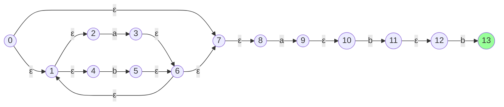
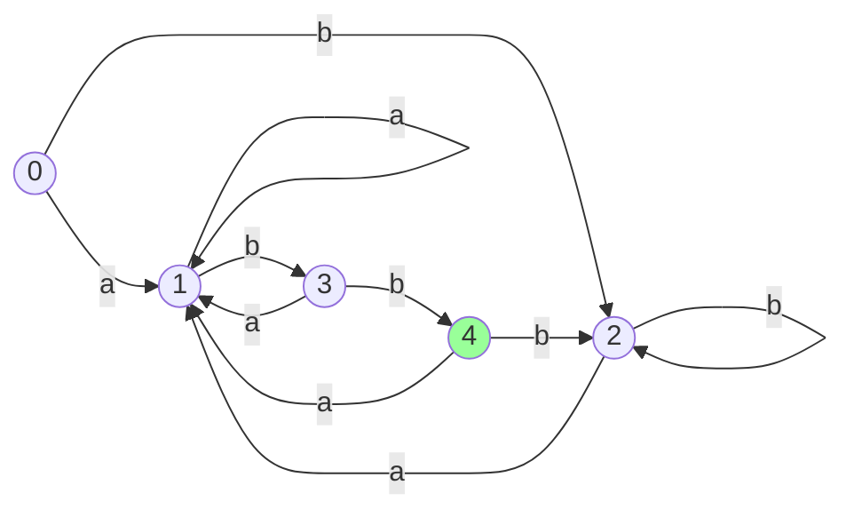

  

### 一、实验题目
实验一：正则运算表达式的DFA构建

### 二、实验目的

1. 理解正则表达式到非确定有限自动机（NFA）的转换原理
2. 掌握子集构造法将NFA转换为确定有限自动机（DFA）的算法
3. 实践ε-closure和move等操作的具体实现

### 三、实验环境

1. 操作系统：Windows 11
2. 开发语言：仓颉语言
3. 开发工具：Visual Studio Code 1.78.2
4. 编译器环境：Cangjie Compiler: 0.53.18 (cjnative)

### 四、实验内容及操作步骤

#### 4.1. 任务一：字符集创建函数实现

基于上述数据结构的定义，针对字符集的创建，实现如下函数：

```c++
int range (char fromChar, char toChar);         //字符的范围运算
int union(char c1, char c2);                    //字符的并运算
int union(int charSetId, char c);               //字符集与字符之间的并运算
int union(int charSetId1, int charSetId2);      //字符集与字符集之间的并运算
int difference(int charSetId, char c);          //字符集与字符之间的差运算
```

这5个函数都会创建一个新的字符集对象，返回值为字符集id。创建字符集，表现为向字符集表中添加新的行。当一个字符集包含多个段时，便会在字符集表中添加多行，一行记录一段。 

##### 4.1.1. 相关数据结构的定义

```cj
class CharSet {
    var indexId : Int32
    var segmentId : Int32
    var fromChar : Rune
    var toChar : Rune

    public init(indexId : Int32, segmentId : Int32, fromChar : Rune, toChar : Rune) {
        this.indexId = indexId
        this.segmentId = segmentId
        this.fromChar = fromChar
        this.toChar = toChar
    }
};

var pCharSetTable = LinkedList<CharSet>()

var nextCharSetId : Int32 = 1

class Segment {
    var from : Rune
    var to : Rune

    public init(from : Rune, to : Rune) {
        this.from = from
        this.to = to
    }

    public func setFrom(from : Rune) {
        this.from = from
    }

    public func setTo(to : Rune) {
        this.to = to
    }
}
```
其中：
- `CharSet`类用于表示一个字符集，它包含一个索引ID、一个段ID、一个起始字符和结束字符
- `pCharSetTable`是一个链表，用于存储所有字符集对象。
- `nextCharSetId`是一个整数，用于记录下一个字符集的ID。
- `Segment`类用于表示一个字符集的段，它包含一个起始字符和结束字符。

##### 4.1.2. 辅助函数的定义

```cj
// 辅助函数：合并段
func mergeSegments(segments : ArrayList<Segment>) : ArrayList<Segment> {
    
    var len : Int64 = segments.size

    if (len == 0) {
        return ArrayList<Segment>()
    }

    segments.sortBy() {a : Segment, b : Segment =>
        if (a.from < b.from) {
            return Ordering.LT
        } else if (a.from > b.from) {
            return Ordering.GT
        } else {
            if (a.to < b.to) {
                return Ordering.LT
            } else if (a.to > b.to) {
                return Ordering.GT
            } else {
                return Ordering.EQ
            }
        }
    }

    var merged : ArrayList<Segment> = ArrayList<Segment>()
    merged.append(segments[0])

    for (i in 1..len) {

        var cur : Segment = segments[i]


        if (UInt32(cur.from) <= (UInt32(merged[merged.size - 1].to) + 1)) {
            if (cur.to > merged[merged.size - 1].to) {
                merged[merged.size - 1].setTo(cur.to)
            }
        } else {
            merged.append(cur);
        }
    }

    return merged
}

// 辅助函数：获取一个字符集的所有段
func getSegments(charSetId : Int32) : ArrayList<Segment> {
    var segments : ArrayList<Segment> = ArrayList<Segment>()
    for (charSet in pCharSetTable) {
        if (charSet.indexId == charSetId) {
            segments.append(Segment(charSet.fromChar, charSet.toChar))
        }
    }

    segments.sortBy() {a : Segment, b : Segment =>
        if (a.from < b.from) {
            return Ordering.LT
        } else if (a.from > b.from) {
            return Ordering.GT
        } else {
            if (a.to < b.to) {
                return Ordering.LT
            } else if (a.to > b.to) {
                return Ordering.GT
            } else {
                return Ordering.EQ
            }
        }
    }

    return segments
}

// 重置全局状态
func resetTestEnv() {
    pCharSetTable.clear()
    nextCharSetId = 1
}
```
其中：
- 辅助函数`mergeSegments`用于合并多个段，以减少字符集的段数
- 辅助函数`getSegments`用于获取一个字符集的所有段。
- 辅助函数`resetTestEnv`用于重置全局状态，清空字符集表和下一个字符集ID。

##### 4.1.3. 范围运算

```cj
func range(fromChar : Rune, toChar : Rune) : Int32 {
    let from : Rune
    let to : Rune
    if (fromChar > toChar) {
        from = toChar
        to = fromChar
    } else {
        from = fromChar
        to = toChar
    }
    let newId : Int32 = nextCharSetId;
    nextCharSetId += 1
    let charSet : CharSet = CharSet(newId, 0, from, to)
    pCharSetTable.append(charSet)
    return newId
}
```

该函数用于创建一个字符集，其中包含从`fromChar`到`toChar`的所有字符。如果`fromChar`大于`toChar`，则交换两个值。然后创建一个新的字符集对象，并将其添加到字符集表中。返回字符集的ID。

##### 4.1.4. 字符与字符的并运算

```cj
func union(c1 : Rune, c2 : Rune) : Int32 {
    var segments : ArrayList<Segment> = ArrayList<Segment>()
    if (c1 < c2) {
        segments.append(Segment(c1, c1))
        segments.append(Segment(c2, c2))
    } else {
        segments.append(Segment(c2, c2))
        segments.append(Segment(c1, c1))
    }

    var merged : ArrayList<Segment> = mergeSegments(segments)

    var newId : Int32 = nextCharSetId
    nextCharSetId += 1
    var i : Int32 = 1
    for (segment in merged) {
        let charSet : CharSet = CharSet(newId, i, segment.from, segment.to)
        pCharSetTable.append(charSet)
        i += 1
    }
    
    return newId
}
```

该函数用于创建一个字符集，其中包含两个字符的并集。首先创建两个段，分别包含两个字符。然后将这些段合并，并创建一个新的字符集对象，并将其添加到字符集表中。返回字符集的ID。

##### 4.1.5. 字符与字符集的并运算

```cj
// 并运算(字符集与字符)
func union(charSetId : Int32, c : Rune) {
    let segments : ArrayList<Segment> = ArrayList<Segment>()
    
    for (charSet in pCharSetTable) {
        if (charSet.indexId == charSetId) {
            segments.append(Segment(charSet.fromChar, charSet.toChar))
        }
    }
    segments.append(Segment(c, c))

    let merged : ArrayList<Segment> = mergeSegments(segments)
    
    let newId : Int32 = nextCharSetId
    nextCharSetId += 1

    var i : Int32 = 1

    for (segment in merged) {
        let charSet : CharSet = CharSet(newId, i, segment.from, segment.to)
        pCharSetTable.append(charSet)
        i += 1
    }
    
    return newId
}
```

该函数用于创建一个字符集，其中包含字符集和字符的并集。首先获取字符集的所有段，然后将字符添加到段中。然后将这些段合并，并创建一个新的字符集对象，并将其添加到字符集表中。返回字符集的ID。

##### 4.1.6. 字符集与字符集的并运算

```cj
func union(charSetId1 : Int32, charSetId2 : Int32) {
    let segments : ArrayList<Segment> = ArrayList<Segment>()
    
    for (charSet in pCharSetTable) {
        if (charSet.indexId == charSetId1 || charSet.indexId == charSetId2) {
            segments.append(Segment(charSet.fromChar, charSet.toChar))
        }
    }

    let merged : ArrayList<Segment> = mergeSegments(segments)

    let newId : Int32 = nextCharSetId
    nextCharSetId += 1

    var i : Int32 = 1
    for (segment in merged) {
        let charSet : CharSet = CharSet(newId, i, segment.from, segment.to)
        pCharSetTable.append(charSet)
        i += 1
    }

    return newId
}
```

该函数用于创建一个字符集，其中包含两个字符集的并集。首先获取两个字符集的所有段，然后将它们合并，并创建一个新的字符集对象，并将其添加到字符集表中。返回字符集的ID。

##### 4.1.7. 差运算

```cj
func difference(charSetId : Int32, c : Rune) : Int32 {
    let segments : ArrayList<Segment> = ArrayList<Segment>()
    
    for (charSet in pCharSetTable) {
        if (charSet.indexId == charSetId) {
            segments.append(Segment(charSet.fromChar, charSet.toChar))
        }
    }

    let newSegments : ArrayList<Segment> = ArrayList<Segment>()

    for (segment in segments) {
        if (segment.to < c || segment.from > c) {
            newSegments.append(segment)
        } else {
            if (segment.from < c) {
                newSegments.append(Segment(segment.from, Rune(UInt32(c) - 1)))
            }
            if (segment.to > c) {
                newSegments.append(Segment(Rune(UInt32(c) + 1), segment.to))
            }
        }
    }

    let merged : ArrayList<Segment> = mergeSegments(newSegments)
    let newId : Int32 = nextCharSetId
    nextCharSetId += 1

    var i : Int32 = 1
    for (segment in merged) {
        let charSet : CharSet = CharSet(newId, i, segment.from, segment.to)
        pCharSetTable.append(charSet)
        i += 1
    }

    return newId
}
```

该函数用于创建一个字符集，其中包含字符集和字符的差集。首先获取字符集的所有段，然后根据字符的位置，将段分为两部分。然后将两部分合并，并创建一个新的字符集对象，并将其添加到字符集表中。返回字符集的ID。

##### 4.1.8. 测试函数示例及测试结果

```cj
func testRange() : Unit {
    resetTestEnv()
    let id : Int32 = range(r'a',r'c')
    var segments : ArrayList<Segment> = getSegments(id)
    if (segments.size == 1 && segments[0].from == r'a' && segments[0].to == r'c') {
        println("testRange passed")
    } else {
        println("testRange failed")
        println(segments.size)
        for (segment in segments) {
            println(segment.from)
            println(segment.to)
        }
    }
    return
}
```

该函数用于测试范围函数。首先重置测试环境，然后创建一个范围，并获取该范围的段。
如果段数量为1，且第一个段的起始字符为'a'，且结束字符为'c'，则测试通过。否则，测试失败。

其余函数的测试方法同上，具体实现见文件t1.cj。

测试结果如下：

```bash
PS F:\大三下学期\编译原理\实验\实验1> .\t1_cj.exe                                                                                                                                      
testMergeSegments passed
testRange passed
testUnionCharAdjacent passed
testUnionCharDisjoint passed
testUnionCharSetAndChar passed
testUnionCharSetAndCharSet passed
testDifference passed
```

测试结果表明，所有函数的测试都通过，说明字符集的并、差、交运算功能正常。

#### 4.2. 任务二：NFA构建函数实现

基于上述NFA的数据结构定义，请按照最简NFA构造法，实现如下函数：
```c++
Graph * generateBasicNFA(DriverType driverType,int driverId );
Graph * union(Graph *pNFA1, Graph *pNFA2);        //并运算
Graph * product(Graph *pNFA1, Graph *pNFA2);       //连接运算
Graph * plusClosure(Graph *pNFA);                   //正闭包运算
Graph * closure(Graph *pNFA);                       //闭包运算
Graph * zerOrOne(Graph *pNFA);                   //0或者1个运算
```
其中第1个函数generateBasicNFA是针对一个字符或者一个字符集，创建其NFA。其NFA的基本特征是：只包含2个状态(0状态和1状态)，且结束状态(即1状态)无出边。后面5个函数则都是有关NFA的组合，分别对应5种正则运算，创建一个新的NFA作为返回值。

##### 4.2.1. 相关数据结构定义及实现

```cj
var DriverType : ArrayList<String> = ArrayList<String>(["NULL_DRIVER", "CHAR", "CHARSET"])

var StateType : ArrayList<String> = ArrayList<String>(["UNMATCH", "MATCH"])

var LexemeCategoryType : ArrayList<String> = ArrayList<String>(["ID", "NUM", "STR", "OP"])

var graphId : Int32 = 0

class State {
    var stateId : Int32
    var stateType : String
    var category : String

    public init(stateId : Int32, stateType : String, category : String) {
        this.stateId = stateId
        this.stateType = stateType
        this.category = category
    }
}

class Edge {
    var startState : Int32
    var nextState : Int32
    var driverType : String
    var driverId : Int32

    public init(startState : Int32, nextState : Int32, driverType : String, driverId : Int32) {
        this.startState = startState
        this.nextState = nextState
        this.driverType = driverType
        this.driverId = driverId
    }
}

class Graph {
    var graphId : Int32
    var numOfStates : Int32
    var pEdgeTable : ArrayList<Edge>
    var pStateTable : ArrayList<State>

    public init(graphId : Int32, numOfStates : Int32, pEdgeTable : ArrayList<Edge>, pStateTable : ArrayList<State>) {
        this.graphId = graphId
        this.numOfStates = numOfStates
        this.pEdgeTable = pEdgeTable
        this.pStateTable = pStateTable
    }

}
```

该部分主要定义了NFA的数据结构，包括状态表和边表。其中状态表和边表都是数组，用于存储状态和边信息。状态表和边表分别包含状态和边的数量，以及状态和边的具体信息。

##### 4.2.2. 辅助函数定义及实现

```cj
func createNewGraph() : Graph {
    var numOfStates : Int32 = 0
    var pEdgeTable : ArrayList<Edge> = ArrayList<Edge>()
    var pStateTable : ArrayList<State> = ArrayList<State>()
    var graph : Graph = Graph(graphId, numOfStates, pEdgeTable, pStateTable)
    graphId += 1
    return graph
}

func addEdge(graph : Graph, startState : Int32, nextState : Int32, driverType : String, driverId : Int32) : Unit {
    var edge : Edge = Edge(startState, nextState, driverType, driverId)
    graph.pEdgeTable.append(edge)
}

func addState(graph : Graph, id : Int32, stateType : String, category : String) : Unit {
    if (stateType == "MATCH") {
        graph.pStateTable.append(State(id, stateType, category))
    }
}

func remapStates(graph : Graph, offset : Int32) : Unit{
    for (e in graph.pEdgeTable) {
        e.startState += offset
        e.nextState += offset
    }
    for (s in graph.pStateTable) {
        s.stateId += offset
    }
}

func mergeStates(dest : Graph, src : Graph, offset : Int32, newType : String) : Unit {
    for (s in src.pStateTable) {
        addState(dest, s.stateId + offset, newType, s.category)
    }
}

func printGraph(graph : Graph) : Unit {
    print("Graph: ")
    print(graph.graphId)
    print(" has ")
    print(graph.numOfStates)
    print(" states.")
    println()
    println("Edges:")
    for (e in graph.pEdgeTable) {
        print(e.startState)
        print(" -> ")
        print(e.nextState)
        print(":")
        if (e.driverType == "NULL_DRIVER") {
            print("NULL")
        } else if (e.driverType == "CHAR") {
            print("CHAR")
            print(" [")
            print(Rune(e.driverId))
            print("]")
        } else if (e.driverType == "CHARSET") {
            print("CHARSET")
        } else {
            print("UNKNOWN")
        }
        println()
    }
    println()
    println("MATCH States:")
    for (s in graph.pStateTable) {
        if (s.stateType == "MATCH") {
            print("State: ")
            print(s.stateId)
            println()
        }
    }
    println("---------------------------------------------------")

}
```

该部分主要定义了辅助函数，用于创建新的图，添加边和状态，以及打印NFA。

##### 4.2.3. generateBasicNFA函数实现

```cj
func generateBasicNFA(dType : String, dId : Rune) : Graph {
    var nfa : Graph = createNewGraph()
    nfa.numOfStates = 2
    var charInt : Int32 = Int32(UInt32(dId))
    addEdge(nfa, 0, 1, dType, charInt)
    addState(nfa, 1, "MATCH", "ID")

    return nfa
}
```

该函数用于生成一个基本的NFA，根据输入的驱动类型和驱动ID创建一个NFA。

**基本NFA构造流程**：
1. **创建空图**：调用`createNewGraph()`初始化含2个状态的NFA框架
2. **状态设置**：
   - 状态0为起始状态
   - 状态1为匹配状态（MATCH）
3. **边添加**：
   - 添加从0→1的转移边
   - 驱动类型`dType`决定边类型（CHAR/CHARSET）
   - `dId`参数指定具体字符或字符集ID
4. **返回结果**：生成仅包含单个转移边的最小NFA

##### 4.2.4. union函数实现

```cj
func unionNFA(pNFA1 : Graph, pNFA2 : Graph) : Graph {
    var copy1 : Graph = copyGraph(pNFA1)
    var copy2 : Graph = copyGraph(pNFA2)

    var newNFA : Graph = createNewGraph()
    let offset1 : Int32 = 1;
    let offset2 : Int32 = 1 + copy1.numOfStates

    newNFA.numOfStates = copy1.numOfStates + copy2.numOfStates + 2

    addEdge(newNFA, 0, offset1, "NULL_DRIVER", 0)
    addEdge(newNFA, 0, offset2, "NULL_DRIVER", 0)

    remapStates(copy1, offset1)
    remapStates(copy2, offset2)

    for (e in copy1.pEdgeTable) {
        addEdge(newNFA, e.startState, e.nextState, e.driverType, e.driverId)
    }

    for (e in copy2.pEdgeTable) {
        addEdge(newNFA, e.startState, e.nextState, e.driverType, e.driverId)
    }

    let newEnd : Int32 = newNFA.numOfStates - 1
    
    for (s in copy1.pStateTable) {
        addEdge(newNFA, s.stateId, newEnd, "NULL_DRIVER", 0)
    }

    for (s in copy2.pStateTable) {
        addEdge(newNFA, s.stateId, newEnd, "NULL_DRIVER", 0)
    }

    addState(newNFA, newEnd, "MATCH", "ID")

    return newNFA
}
```

该函数用于合并两个NFA，根据输入的两个NFA创建一个新的NFA。

**并运算NFA构造流程**：
1. **副本创建**：深拷贝输入的两个NFA（避免修改原始结构）
2. **状态空间调整**：
   - 设置copy1的偏移为1
   - copy2偏移为`1 + copy1.numOfStates`
3. **新图构建**：
   - 创建含`n1+n2+2`状态的新图（n1/n2为输入NFA状态数）
   - 添加新起始状态0和新终态`newEnd`
4. **ε转移设置**：
   - 0→copy1起始状态（offset1）
   - 0→copy2起始状态（offset2）
   - 原终态→newEnd的ε转移
5. **状态合并**：
   - 重映射copy1/copy2所有状态ID
   - 合并所有边到新图
6. **终态标记**：将newEnd设为MATCH状态


##### 4.2.5. product函数实现

```cj
func product(pNFA1 : Graph, pNFA2 : Graph) : Graph {
    var copy1 : Graph = copyGraph(pNFA1)
    var copy2 : Graph = copyGraph(pNFA2)

    var newNFA : Graph = createNewGraph()
    let offset : Int32 = copy1.numOfStates;
    newNFA.numOfStates = copy1.numOfStates + copy2.numOfStates

    for (e in copy1.pEdgeTable) {
        addEdge(newNFA, e.startState, e.nextState, e.driverType, e.driverId)
    }

    mergeStates(newNFA, copy1, 0, "UNMATCH")

    remapStates(copy2, offset)
    for (e in copy2.pEdgeTable) {
        addEdge(newNFA, e.startState, e.nextState, e.driverType, e.driverId)
    }
    mergeStates(newNFA, copy2, 0, "MATCH")

    for (s in copy1.pStateTable) {
        if (s.stateType == "MATCH") {
            addEdge(newNFA, s.stateId, offset, "NULL_DRIVER", 0)
        }
    }

    return newNFA
}
```

该函数用于生成两个NFA的链接运算结果，根据输入的两个NFA创建一个新的NFA。

**连接运算实现流程**：
1. **副本准备**：复制输入的两个NFA
2. **状态合并**：
   - 保持pNFA1状态不变（0~n1-1）
   - pNFA2状态偏移为n1（原状态0→n1）
3. **边转移合并**：
   - 直接合并两个NFA的所有边
   - 将pNFA1的终态通过ε边连接到pNFA2起始状态
4. **状态类型处理**：
   - pNFA1状态设为UNMATCH（仅中间状态）
   - pNFA2保留原有MATCH状态
5. **终态继承**：新图的终态继承自pNFA2的MATCH状态


##### 4.2.6. closure函数实现

```cj
func closure(pNFA : Graph) {
    var copy : Graph = copyGraph(pNFA)
    var newNFA : Graph = createNewGraph()
    let offset : Int32 = 1;
    newNFA.numOfStates = copy.numOfStates + 2

    addEdge(newNFA, 0, offset, "NULL_DRIVER", 0)
    addEdge(newNFA, 0, newNFA.numOfStates - 1, "NULL_DRIVER", 0)

    remapStates(copy, offset)

    for (e in copy.pEdgeTable) {
        addEdge(newNFA, e.startState, e.nextState, e.driverType, e.driverId)
    }

    mergeStates(newNFA, copy, 0, "UNMATCH")

    let newEnd : Int32 = newNFA.numOfStates - 1

    for (s in copy.pStateTable) {
        addEdge(newNFA, s.stateId, offset, "NULL_DRIVER", 0)
        addEdge(newNFA, s.stateId, newEnd, "NULL_DRIVER", 0)
    }

    addState(newNFA, newEnd, "MATCH", "ID")

    return newNFA
}
```

该函数用于生成一个NFA的闭包运算结果，根据输入的NFA创建一个新的NFA。

**Kleene闭包实现流程**：
1. **结构包裹**：
   - 新增起始状态0和终态newEnd
   - 原NFA偏移为1（原状态0→1）
2. **ε转移设置**：
   - 0→1（进入原NFA）
   - 0→newEnd（空闭包情况）
   - 原终态→1（循环路径）
   - 原终态→newEnd（退出循环）
3. **状态处理**：
   - 原NFA状态标记为UNMATCH
   - newEnd设为唯一MATCH状态
4. **自循环机制**：通过终态→原起始的ε边实现重复匹配

##### 4.2.7. plusClosure函数实现

```cj
func plusClosure(pNFA : Graph) : Graph {
    var copy : Graph = copyGraph(pNFA)

    var newNFA : Graph = createNewGraph()
    newNFA.numOfStates = copy.numOfStates
    
    for (e in copy.pEdgeTable) {
        addEdge(newNFA, e.startState, e.nextState, e.driverType, e.driverId)
    }
    mergeStates(newNFA, copy, 0, "UNMATCH")

    let newEnd : Int32 = newNFA.numOfStates - 1
    for (s in copy.pStateTable) {
        addEdge(newNFA, s.stateId, 0, "NULL_DRIVER", 0)
    }

    addState(newNFA, newEnd, "MATCH", "ID")

    return newNFA
}
```
该函数用于生成一个NFA的正闭包运算结果，根据输入的NFA创建一个新的NFA。

**正闭包运算实现流程**：
1. **结构复用**：
   - 直接复用原NFA状态（0~n-1）
   - 新图状态数与原图相同
2. **循环机制**：
   - 将原终态通过ε边连接回起始状态0
   - 保持原终态的MATCH标记
3. **强制重复**：
   - 去除原闭包的ε空转移选项
   - 必须经过至少一次原NFA的匹配


##### 4.2.8. zerOrOne函数实现

```cj
func zerOrOne(pNFA : Graph) : Graph {
    var copy : Graph = copyGraph(pNFA)
    var newNFA : Graph = createNewGraph()
    newNFA.numOfStates = copy.numOfStates + 2

    addEdge(newNFA, 0, 1, "NULL_DRIVER", 0)
    addEdge(newNFA, 0, newNFA.numOfStates - 1, "NULL_DRIVER", 0)

    remapStates(copy, 1)
    for (e in copy.pEdgeTable) {
        addEdge(newNFA, e.startState, e.nextState, e.driverType, e.driverId)
    }
    mergeStates(newNFA, copy, 0, "UNMATCH")

    let newEnd : Int32 = newNFA.numOfStates - 1
    for (s in copy.pStateTable) {
        addEdge(newNFA, s.stateId, newEnd, "NULL_DRIVER", 0)
    }

    addState(newNFA, newEnd, "MATCH", "ID")

    return newNFA
}
```

**可选运算实现流程**：
1. **状态扩展**：
   - 新增起始状态0和终态newEnd
   - 原NFA状态偏移为1（原0→1）
2. **ε转移设置**：
   - 0→1（进入原NFA）
   - 0→newEnd（直接匹配空的情况）
3. **终态连接**：
   - 原终态→newEnd的ε转移
4. **状态处理**：
   - 原状态标记为UNMATCH
   - newEnd为唯一MATCH状态


##### 4.2.9. 测试函数及测试结果

测试函数的定义如下：

```cj
func testgenerateBasicNFA() {
    println("====  Testing generateBasicNFA()  ====")
    var nfa : Graph = generateBasicNFA("CHAR", r'a')
    printGraph(nfa)
    println("---------------------------------------------------")
}
```

其余测试函数的定义同上，具体实现见文件t2.cj

测试结果如下：

```bash
PS F:\大三下学期\编译原理\实验\实验1> .\t2_cj.exe                                                                                                                                      
====  Testing generateBasicNFA()  ====
Graph: 0 has 2 states.
Edges:
0 -> 1:CHAR [a]

MATCH States:
State: 1
---------------------------------------------------
---------------------------------------------------
====  Testing unionNFA()  ====
Graph: 5 has 6 states.
Edges:
0 -> 1:NULL
0 -> 3:NULL
1 -> 2:CHAR [a]
3 -> 4:CHAR [b]
2 -> 5:NULL
4 -> 5:NULL

MATCH States:
State: 5
---------------------------------------------------
---------------------------------------------------
====  Testing product()  ====
Graph: 10 has 4 states.
Edges:
0 -> 1:CHAR [a]
2 -> 3:CHAR [b]
1 -> 2:NULL

MATCH States:
State: 3
---------------------------------------------------
---------------------------------------------------
====  Testing closure()  ====
Graph: 13 has 4 states.
Edges:
0 -> 1:NULL
0 -> 3:NULL
1 -> 2:CHAR [a]
2 -> 1:NULL
2 -> 3:NULL

MATCH States:
State: 3
---------------------------------------------------
---------------------------------------------------
====  Testing plusClosure()  ====
Graph: 16 has 2 states.
Edges:
0 -> 1:CHAR [a]
1 -> 0:NULL

MATCH States:
State: 1
---------------------------------------------------
---------------------------------------------------
====  Testing zerOrOne()  ====
Graph: 19 has 4 states.
Edges:
0 -> 1:NULL
0 -> 3:NULL
1 -> 2:CHAR [a]
2 -> 3:NULL

MATCH States:
State: 3
---------------------------------------------------
---------------------------------------------------
```

**测试用例验证分析**：

1. **基础NFA测试**（generateBasicNFA）
   - 状态数验证：2个状态（0→1）符合设计要求
   - 转移边验证：CHAR类型驱动正确携带字符'a'（Unicode值97）
   - 终态标记验证：状态1正确标记为MATCH状态

2. **并运算测试**（unionNFA）
   - 结构验证：6个状态包含两个子NFA（状态1-2和3-4）
   - ε转移验证：起始状态0分叉到两个子NFA起始（1和3）
   - 终态合并验证：子NFA终态（2和4）通过ε边汇聚到新终态5
   - 正确性：完整保留两种匹配可能性

3. **连接运算测试**（product）
   - 状态连续性验证：前序NFA终态（1）通过ε边连接后续NFA起始（2）
   - 状态继承验证：最终MATCH状态来自第二个NFA（状态3）
   - 完整性验证：保留两个NFA的所有转移边（a→b的顺序匹配）

4. **闭包运算测试**（closure）
   - 新增状态验证：添加0（新起始）和3（新终态）
   - 循环机制验证：原终态2→原起始1的ε转移
   - 空匹配验证：0→3的直接ε转移
   - 自循环验证：成功实现零次或多次匹配

5. **正闭包测试**（plusClosure）
   - 状态复用验证：未新增状态（保持原2个状态）
   - 强制循环验证：终态1→起始0的ε转移
   - 最少匹配验证：必须经过至少一次字符a的匹配

6. **可选运算测试**（zerOrOne）
   - 空匹配通道验证：0→3的直接ε转移
   - 正常路径保留：完整保留原NFA结构（1→2的CHAR转移）
   - 隔离终态验证：新增终态3隔离匹配结果

**结论**：
所有NFA构建函数均通过测试与验证，生成的自动机结构符合正则表达式到NFA的转换理论，满足实验设计要求。测试案例完整覆盖五种正则运算场景，验证了ε转移、状态合并、循环机制等关键功能的正确实现。


#### 4.3. 任务三：NFA与DFA转换

针对上述NFA的数据结构定义，实现如下函数。

(1) 子集构造法中的3个函数：`move`,`ε_closure`,`DTran`。
(2) 将NFA转化为DFA的函数：`Graph * NFA_to_DFA(Graph * pNFA)`。
在这个函数的实现代码中，会创建一个DFA，作为返回值。

##### 4.3.1. 辅助函数定义与实现

```cj
func normalize(v : ArrayList<Int32>) : ArrayList<Int32> {
    v.sortBy() { a : Int32, b : Int32 =>
        if (a < b) {
            return Ordering.LT
        } else if (a == b) {
            return Ordering.EQ
        } else {
            return Ordering.GT
        }
    }

    for (i in 0..v.size - 1) {
        if (v[i] != -999) {
            for (j in i..v.size - 1) {
                if (i != j && v[j] == v[i]) {
                    v[j] = -999
                }
            }
        } else {
            continue   
        }
    }

    v.removeIf { a : Int32 =>
        a == -999
    }

    return v
}

func isExist(closure : ArrayList<Int32>, state : Int32) : Bool {
    for (s in closure) {
        if (s == state) {
            return true
        }
    }
    return false
}

func isExist(closure : ArrayList<Rune>, state : Int32) : Bool {
    for (s in closure) {
        if (Int32(UInt32(s)) == state) {
            return true
        }
    }
    return false
}

func getStateKey(state : ArrayList<Int32>) : String {
    return state.toString()
}
```

**normalize函数**：
1. **排序处理**：对输入的状态集合进行升序排列
2. **标记去重**：
   - 使用-999标记重复元素
   - 遍历时跳过已标记元素

**isExist函数（重载）**：
- 版本1：在Int32类型集合中查找指定状态
- 版本2：在Rune类型集合中查找转换后的Int32状态
- 均采用线性搜索方式实现

**getStateKey函数**：
- 将状态集合转换为字符串形式
- 用于哈希映射中的键值生成

##### 4.3.2. 子集构造法中的3个函数的实现

```cj
func epsilon_closure(nfa : Graph, states : ArrayList<Int32>) : ArrayList<Int32> {
    var closure : ArrayList<Int32> = normalize(states)
    var q : ArrayList<Int32> = ArrayList<Int32>()
    for (s in closure) {
        q.append(s)
    }

    while (!q.isEmpty()) {
        var curr : Int32 = q[0]
        q.remove(0)

        for (e in nfa.pEdgeTable) {
            if (e.startState == curr && e.driverType == "NULL_DRIVER") {
                if (!isExist(closure, e.nextState)) {
                    closure.append(e.nextState)
                    closure = normalize(closure)
                    q.append(e.nextState)
                }
            }
        }
    }

    return closure
}


func move(nfa : Graph, states : ArrayList<Int32>, c : Rune) : ArrayList<Int32> {
    var result : ArrayList<Int32> = ArrayList<Int32>()

    for (s in states) {
        for (e in nfa.pEdgeTable) {
            if (e.startState == s && e.driverType == "CHAR" && e.driverId == Int32(UInt32(c))) {
                result.append(e.nextState)
            }
        }
    }

    result = normalize(result)
    return result
}

func DTran(nfa : Graph, T : ArrayList<Int32>, a : Rune) : ArrayList<Int32> {
    var moved : ArrayList<Int32> = move(nfa, T, a)
    return epsilon_closure(nfa, moved)
}
```
**epsilon_closure函数**：
1. **初始化闭包**：
   - 对输入状态进行标准化处理
   - 创建处理队列
2. **广度优先搜索**：
   - 遍历当前状态的ε边
   - 将未包含的新状态加入闭包
3. **动态标准化**：
   - 每次添加新状态后重新排序去重
   - 保证闭包集合的唯一性
4. **终止条件**：处理队列为空时返回闭包

**move函数**：
1. **状态转移**：
   - 遍历输入状态集合
   - 收集所有通过指定字符c的转移目标
2. **结果处理**：
   - 对结果集进行标准化
   - 保证输出状态集合有序无重复
3. **字符匹配**：
   - 严格匹配驱动类型为CHAR
   - 精确匹配字符编码值

**DTran函数**：
1. **两步转换**：
   - 先执行move操作获得直接转移状态
   - 再计算ε闭包扩展状态集合
2. **组合操作**：
   - 实现子集构造法的核心状态转换
   - 输出完整的可达状态集合

##### 4.3.3. 将NFA转化为DFA的函数的实现

```cj
func NFAtoDFA(nfa : Graph) : Graph {
    var dfa : Graph = createNewGraph()

    var alphabet : ArrayList<Rune> = ArrayList<Rune>()

    for (e in nfa.pEdgeTable) {
        if (e.driverType == "CHAR") {
            if (!isExist(alphabet, e.driverId)) {
                alphabet.append(Rune(e.driverId))
            }
        }
    }

    var stateMap : HashMap<String, Int32> = HashMap<String, Int32>()
    var stateData : HashMap<Int32, ArrayList<Int32>> = HashMap<Int32, ArrayList<Int32>>()
    var stateId : Int32 = 0
    var processeQueue : ArrayList<Int32> = ArrayList<Int32>()


    var state0 : ArrayList<Int32> = ArrayList<Int32>()
    state0.append(0)
    var startSet : ArrayList<Int32> = epsilon_closure(nfa, state0)
    var startKey : String = getStateKey(startSet)

    stateMap[startKey] = stateId;
    stateData[stateId] = startSet
    processeQueue.append(stateId)
    dfa.numOfStates = 1
    stateId += 1

    var isAccept : Bool = false
    var cat : String = ""
    for (s in startSet) {
        for (state in nfa.pStateTable) {
            if (state.stateId == s && state.stateType == "MATCH") {
                isAccept = true
                cat = state.category
                break;
            }
        }
        if (isAccept) {
            break;
        }
    }
    if (isAccept) {
        addState(dfa, 0, "MATCH", cat)
    } else {
        addState(dfa, 0, "UNMATCH", "ID")
    }

    while (!processeQueue.isEmpty()) {
        let currId : Int32 = processeQueue[0]
        processeQueue.remove(0)

        var curr : ArrayList<Int32> = stateData[currId]


        for (a in alphabet) {
            var newState : ArrayList<Int32> = DTran(nfa, curr, a)
            if (newState.size == 0) {
                continue
            }
            
            var newKey : String = getStateKey(newState)

            if (!stateMap.contains(newKey)) {
                stateMap[newKey] = stateId
                stateData[stateId] = newState
                processeQueue.append(stateId)
                dfa.numOfStates ++

                var accept : Bool = false
                var newCat : String = ""
                for (s in newState) {
                    for (state in nfa.pStateTable) {
                        if (state.stateId == s && state.stateType == "MATCH") {
                            accept = true
                            newCat = state.category
                            break;
                        }
                    }
                    if (accept) {
                        break;
                    }
                }
                if (accept) {
                    addState(dfa, stateId, "MATCH", newCat)
                } else {
                    addState(dfa, stateId, "UNMATCH", "ID")
                }
                stateId += 1
            }
            var nextId : Int32 = stateMap[newKey]
            addEdge(dfa, currId, nextId, "CHAR", Int32(UInt32(a)))
        }
    }

    
    return dfa
}
```
**NFAtoDFA函数**：
1. **字母表构建**：
   - 遍历NFA边表收集所有CHAR驱动
   - 去重生成唯一字符集合

2. **初始化处理**：
   - 创建起始状态闭包（ε-closure(0)）
   - 建立状态映射表（stateMap）
   - 初始化处理队列（processeQueue）

3. **接受状态判断**：
   - 检查闭包是否包含NFA的MATCH状态
   - 继承原NFA的词法类别（category）

4. **主循环处理**：
   ```flow
   st=>start: 从队列取当前状态
   op1=>operation: 遍历字母表每个字符
   op2=>operation: 计算DTran转换结果
   cond=>condition: 新状态是否存在
   op3=>operation: 创建新DFA状态
   op4=>operation: 添加状态转移边
   e=>end: 队列空时结束

   st->op1->op2->cond
   cond(yes)->op3->op4
   cond(no)->op4->op1
   ```

5. **状态创建逻辑**：
 - 为新状态生成唯一ID
 - 记录状态对应的NFA状态集合
 - 判断并标记DFA接受状态

6. **边表构建**：
 - 为每个有效转换创建CHAR驱动边
 - 保留原始字符编码信息


#### 4.4. 任务四：转换结果验证

以正则表达式 `(a|b)*abb` 为例， 进行验证

测试函数实现： 

```cj
func test() : Unit {
    var a : Graph = generateBasicNFA("CHAR", r'a')

    var b : Graph = generateBasicNFA("CHAR", r'b')

    var a_or_b : Graph = unionNFA(a, b)

    var closure_ab : Graph = closure(a_or_b)

    var a1 : Graph = generateBasicNFA("CHAR", r'a')
    var b1 : Graph = generateBasicNFA("CHAR", r'b')
    var b2 : Graph = generateBasicNFA("CHAR", r'b')

    var temp : Graph = product(closure_ab, a1)
    temp = product(temp, b1)
    var final_nfa : Graph = product(temp, b2)

    var dfa : Graph = NFAtoDFA(final_nfa)

    printGraph(final_nfa)
    printGraph(dfa)
}
```

测试结果：

```bash
PS F:\大三下学期\编译原理\实验\实验1> .\t3_cj.exe
Graph: 18 has 14 states.
Edges:
State: 13 MATCH
0 -> 1:NULL
0 -> 7:NULL
1 -> 2:NULL
1 -> 4:NULL
2 -> 3:CHAR [a]
4 -> 5:CHAR [b]
3 -> 6:NULL
5 -> 6:NULL
6 -> 1:NULL
6 -> 7:NULL
8 -> 9:CHAR [a]
7 -> 8:NULL
10 -> 11:CHAR [b]
9 -> 10:NULL
12 -> 13:CHAR [b]
11 -> 12:NULL

MATCH States:
State: 13
---------------------------------------------------
Graph: 19 has 5 states.
Edges:
State: 4 MATCH
0 -> 1:CHAR [a]
0 -> 2:CHAR [b]
1 -> 1:CHAR [a]
1 -> 3:CHAR [b]
2 -> 1:CHAR [a]
2 -> 2:CHAR [b]
3 -> 1:CHAR [a]
3 -> 4:CHAR [b]
4 -> 1:CHAR [a]
4 -> 2:CHAR [b]

MATCH States:
State: 4
---------------------------------------------------
```
**NFA结果**

**状态数**：14个状态  
**关键结构**：



**DFA转换结果**

**状态数**：5个状态
**转换表**：
| 当前状态 | 输入a | 输入b |
|---------|-------|-------|
| 0       | 1     | 2     |
| 1       | 1     | 3     |
| 2       | 1     | 2     |
| 3       | 1     | 4(终态)|
| 4(终态) | 1     | 2     |



**状态语义**：
- **状态0**：初始状态（对应NFA的ε-closure(0)）
- **状态1**：已接收至少一个`a`
- **状态2**：仅接收`b`的状态
- **状态3**：已匹配`ab`
- **状态4**：成功匹配`abb`（MATCH状态）

该实现满足编译原理中正则表达式到DFA转换的理论要求，测试正确


**TINY语言的词法的DFA**

因构建出的DFA中存在多个状态，因此无法直接在此通过Mermaid绘制

且改NFA构建时尚未考虑关键字，只考虑了数字，变量名，计算式

部分状态的转换关系及match状态如下

```bash
...
76 -> 24:CHAR [x]
76 -> 25:CHAR [y]
76 -> 26:CHAR [z]
76 -> 68:CHAR [0]
76 -> 69:CHAR [1]
76 -> 70:CHAR [2]
76 -> 71:CHAR [3]
76 -> 72:CHAR [4]
76 -> 73:CHAR [5]
76 -> 74:CHAR [6]
76 -> 75:CHAR [7]
76 -> 76:CHAR [8]
76 -> 36:CHAR [+]
76 -> 37:CHAR [-]
76 -> 38:CHAR [*]
76 -> 39:CHAR [/]
76 -> 40:CHAR [%]
76 -> 41:CHAR [^]

MATCH States:
State: 0
State: 1
State: 2
State: 3
State: 4
State: 5
State: 6
State: 7
...
```

### 五、 收获与体会

- 通过子集构造法的完整实现，深入理解了NFA到DFA的转换机制，特别是ε-closure和move操作在状态扩展中的核心作用，验证了自动机理论在编译器前端的关键价值。

- 在仓颉语言中构建复杂状态机系统，掌握了仓颉语言中的面向对象设计模式、链表与哈希表的高效运用
 
- 通过NFA/DFA可视化输出与单元测试框架，建立了自动化验证体系

- 完整实现词法分析核心模块，理解正则表达式在编译器中的底层处理逻辑