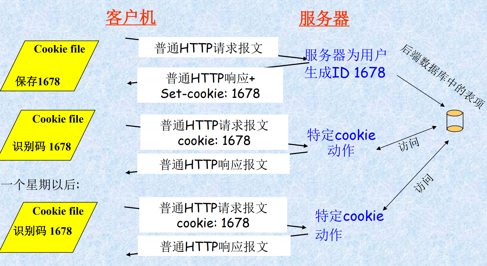
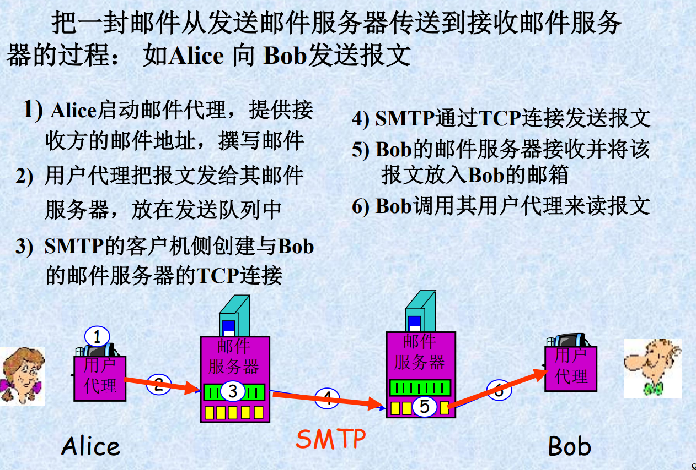

应用层
===
### 2.1. 网络应用程序
#### 2.1.1、网络应用体系结构
 + **研发要点**：写出能够分别在不同端系统运行，并通过网络相互通信的程序
 + **类别**：
   + 浏览器程序：运行在用户主机上
   + Web服务器程序：运行在Web服务器主机上
 + **运行**： 应用程序软件只在端系统运行，不需在网络核心设备上运行
    （网络核心设备无应用层，只有较低层）
 + **体系结构**：
   + 应用程序体系结构：规定如何在各种端系统上组织应用程序，由研发者设计
   + 三种类型：
     + 客户机/服务器
     + 对等 (P2P)
     + 客户机/服务器与P2P的混合
+ **客户机/服务器体系结构**
   + 服务器：
     + 总是打开
     + 为多个客户机请求提供服务
     + 永久的IP地址
     + 可扩展为服务器场（主机群集）
   +  客户机：
      + 总是打开或间歇打开
      + 向服务器发出请求
      + 具有动态的IP地址
      + 彼此之间不直接通信
   + 示例：
     + Web应用程序：总是打开的Web服务器为运行在客户机主机上的浏览器的请求提供服务（接收客户机请求，并发送响应结果）
+ **纯P2P体系结构（peer-to-peer）**
   + 特点：
     + 无（最少）打开的服务器
     + 任意端系统（对等方）可以直接通信
     + 对等方间歇地连接，IP地址不固定
   + 示例：文件分发、因特网电话等
   + 优缺点：可扩展度高、难以管理
   + 未来P2P应用面临的三个主要挑战：
     + ISP友好：受制于“非对称”宽带应用
     + 安全性
     + 激励
+ **客户机/服务器与P2P的混合**
   + Napster：MP3文件共享应用程序。
     + P2P：对等方直接交换MP3文件
     + 服务器注册/定位：
       + 对等方在中心服务器上注册内容
       + 对等方查询相同的中心服务器以定位内容
   + 即时讯息：即时通讯应用
     + P2P：两个用户直接聊天
     + 服务器检测/定位：
       + 用户在线时，向中心服务器注册其IP地址
       + 用户联系中心服务器以找到聊天伙伴的IP地址
#### 2.1.2. 进程通信
+ **进程** (process)：在主机上运行的程序
+ **进程通信**：
  + 同一主机中两个进程间的通信：由操作系统控制
  + 不同主机中进程间的通信：通过网络交换报文进行
    + 发送进程：产生报文并向网络发送
    + 接收进程：接收报文，并回送报文  
    
 + **客户机和服务器进程**
   + 网络应用程序由成对的进程组成，并通过网络相互发送报文
   + 分类：根据功能分别标示为客户机和服务器
     + 客户机进程：发起通信的进程
     + 服务器进程：等待其他进程联系的进程
    + P2P结构的应用程序也可分别看成是客户机进程或服务器进程
      + 如，对等方A（客户机）请求对等方B（服务器）发送某个文件
+ **套接字**(socket)：
  + 套接字：同一台主机内应用层与运输层之间的接口，也叫应用程序和网络之间的应用程序接口API ,是在网络上建立网络应用程序的可编程接口
    
   + 进程与套接字的关系
     + 进程类似房子，套接字是进程的门
     + 进程通过套接字在网络上发送和接收报文
       + 发送进程：把报文推出门（套接字）。
       + 传送报文：通过下面网络把报文传送到目的进程门口。
       + 接收进程：通过其门（套接字）接收报文
    + 应用程序开发者的控制：
       + 应用程序开发者可以控制套接字应用层端的全部，对套接字的运输层端几乎不能控制（只能选择运输层协议、设定几个运输层参数等）
       + 应用程序开发者选择了一个运输层协议，则应用程序就建立在由该协议提供的运输层服务之上（如TCP协议）
 + **进程寻址**：根据进程识别信息找到相应进程（确定主机 $\rightarrow$ 确定进程）
     + 进程识别信息：表示哪台主机上的哪一个进程
       + 主机名称或地址：网络中的哪一个主机，因特网中，用IP地址标识（32位/128位，全球惟一0）
       + 进程的标识：主机中的哪一个进程，因特网中，采用端口号标识(port number)。
     + 周知端口：常用的应用程序被指派固定的端口号
       + Web服务进程(HTTP协议)：80
       + 邮件服务进程(SMTP协议)：25
     + 创建一个新的网络应用程序时，必须分配一个新的端口号，不能重复
 + **用户代理**：用户与网络应用程序之间的接口
   + 示例：
     + Web应用的用户代理：是一些浏览器软件，一个通过套接字收发报文，并提供用户接口的进程
     + 电子邮件应用程序用户代理：是“邮件阅读器”，允许用户进行邮件的撰写和阅读
#### 2.1.3. 应用层协议
 + **定义**：定义了运行在不同端系统上的应用程序进程间传递报文的格式和方式
 + **具体内容**：
   + 各种报文类型及其语法：报文类型（如请求报文和响应报文）以及报文中的各个字段及描述
   + 字段的语义：字段包含信息的含义
   + 时序：进程何时、如何发送报文及对报文进行响应的规则
 + **分类**：
   + 公共领域协议：由标准文档RFC定义，如HTTP
   + 专用层协议：如P2P使用的协议
 + **地位**：应用层协议是网络应用的一部分。
   + 如Web应用组成：HTML、Web浏览器、Web服务器程序，以及一个应用层协议HTTP(超文本传输协议)等，其中HTTP定义了在浏览器程序和Web服务器程序间传输的报文格式和序列
 + **其他协议**：电子邮件协议SMTP等
#### 2.1.4. 因特网运输协议提供的服务
 + **应用程序所需服务**：
   + 应用程序间通信：由运输协议跨越网络将发送进程的报文传输到接收进程的门户
     + 需要使用运输协议所提供的服务
 + **应用程序所需服务特征**：
   + 可靠的数据传输（无数据丢失）
     + 数据不能丢失的应用：如文件传输、金融事务等
     + 能容忍数据丢失的应用：如多媒体应用
   + 带宽（数据传输率）
     + 带宽敏感的应用：需要特定的带宽才能正常工作（因特网电话、其他多媒体应用）
     + 弹性应用：使用的带宽多或少影响不大（电子邮件、文件传输以及Web传输）
   + 定时（数据传输的时间限制）
     + 交互式实时应用：对时间敏感，要求时延小（因特网电话、视频会议以及多方游戏等
     + 非实时应用：时延无限制，时延低更好
   + 安全
 + **典型应用的运输服务要求**
    
 + **TCP服务（传输控制协议）**
   + 面向连接的服务：
     + 建立连接（握手过程）：客户机程序和服务器程序之间互相交换控制信息，在两个进程的套接字之间建立一个TCP连接
     + 传输报文：连接是全双工的，即连接双方的进程可以在此连上同时进行报文收发
     + 拆除连接：应用程序报文发送结束
   + 可靠的传输服务
     + 通信进程可以无差错、按适当顺序交付发送的数据
     + 没有数据丢失和重复
   + 拥塞控制：
     + 当发送方和接收方之间的网络出现拥塞时，会抑制发送进程速率
     + 拥塞控制还会试图限制每个TCP链接，达到公平共享网络带宽的目的
   + 未提供的服务
     + 不提供加密机制：(可添加SSL保证进程间安全通信)
     + 不确保最小传输速率：发送进程受拥塞控制机制的制约
     + 不提供时延保证：数据传输的时间不确定
 + **UDP服务**：
   + 仅提供最小服务模式的轻量级运输协议
   + 特点：
     + 无连接：两个进程通信前没有握手过程；
     + 不可靠数据传输：不保证报文能够被接收，或收到的报文是乱序到达
     + 没有拥塞控制机制：发送进程可以任何速率发送数据
     + 不提供时延保证
 + **常见因特网应用的应用协议与运输协议**
     
### 2.2. Web应用和HTTP协议
#### 2.2.1. Web
 + **Web**：Web是World Wide Web的简称，中文称之为万维网，是用于发布、浏览、查询信息的网络信息服务系统
 + **Web关键技术**
   + 用户超文本标记语言（HTML）：实现信息与信息之间的链接
   + 统一资源定位技术（URL）：实现全球信息的精确定位
   + 超文本传输协议（HTTP）：实现分布式信息共享
#### 2.2.2. HTTP概况
 + **HTTP**：
   + http：超文本传输协议，定义了报文的格式以及客户机和服务器交换报文的方式
   + 地位：应用层协议，Web的核心
   + 构成部分：
     + 客户机程序
     + 服务器程序
     + 分别运行在不同的端系统中，通过交换HTTP报文进行会话
   + HTTP是无状态协议：服务器不保存关于客户机的任何信息
 + **Web常用术语**
   + Web页(文档)：由若干对象组成，一般含有一个基本的HTML文件及几个引用对象
     + 对象：是文件，通过一个URL地址来寻址，如HTML文件、JPEG图形文件、Java小程序等
     + 在基本的HTML文件中，每个对象可由URL来寻址
   + URL(Uniform Resource Locator)：统一资源定位符，标识万维网WWW上的各种文档，全网范围唯一
     + URL地址组成：存放对象的服务器主机名和对象的路径名
    
   + 浏览器（客户机）：是Web应用的用户代理，用于显示所请求的Web页，提供导航功能和配置属性，实现了HTTP协议的客户机端
   + Web服务器：用于存贮Web对象（由URL寻址），实现HTTP协议的服务器端
     + http协议定义了Web客户机 (浏览器)如何向Web站点请求Web页，以及服务器如何将Web页传送给客户机
 + **客户机和服务器之间交互过程**：
   + 客户机：用户请求一个Web页（如点击一个超链接），浏览器向服务器发出对该页所含对象的“HTTP请求报文”
   + 服务器：接受请求，回发包含所请求对象的“HTTP响应报文
   + 运输协议：HTTP协议使用的底层运输协议是TCP
   + 工作过程：创建TCP连接 $\Rightarrow$ 交换报文 $\Rightarrow$ 关闭TCP连接
     + 客户机先与服务器建立TCP连接，然后，浏览器和服务器进程通过套接字访问TCP
     + 客户机：从其套接字接口发送“HTTP请求报文”和接收“响应报文”
     + 服务器：从其套接字口接收“HTTP请求报文”和发送“响应报文”
#### 2.2.3. HTTP连接
 + **非持续HTTP连接**
   + 特点：每个TCP连接在服务器返回对象后关闭（非持续），每个TCP连接上只传送一个Web对象，只传送一个请求/响应对（浏览器可同时打开多个连接，可并行）
   + TCP连接的“三次握手”过程:
     + 客户机发送一个TCP连接请求报文
     + 服务器回送一个TCP确认响应报文
     + 客户机向服务器发送一个包含“HTTP请求”与“TCP确认”的报文
   + 示例：
     + 客户机向服务器请求传送一个Web页：含有一个基本HTML文件和10个JPEG图形，11个对象位于同一个服务器上 
  ```mermaid
  sequenceDiagram
  participant Client as HTTP客户端
  participant Server as www.someSchool.edu服务器主机
  
  Client->>Server: 客户初始化与服务器主机中HTTP服务器进程的TCP连接
  note left of Client:TCP连接
  note right of Server:服务器主机中的HTTP服务器在80端口监听TCP连接请求 
  Server-->Client: 收到连接请求, 接受, 建立连接, 通知客户
  Client->>Server: 发送HTTP请求报文，指明需要的web对象
  note left of Client:报文传输
  Server->>Client: 生成响应报文，并发送到其TCP连接套接字
  Server->>Server: 服务器关闭TCP连接
  Client->>Client: HTTP客户机接收包含HTML文件的响应报文，显示并解析HTML文件
  Client->>Server: 对发现的十个jpeg对象重复上面的步骤
  ``` 

 + **请求一个HTML文件所需时间**
   + 描述：即从客户机请求基本HTML文件开始，到用户收到整个文件为止所花时间
   + 往返时延RTT (Round Trip Time)：一个小分组从客户机到服务器，再回到客户机所花时间
     + 包括传播时延、排队时延以及处理时延
   + 总响应时间：两个RTT时延加上服务器发送文件的时间，即2RTT + 文件传输时间
   + 非持续连接缺点：
     + 服务器负担重：每一个请求对象需建立和维护一个新的连接
     + 每一个对象的传输时延长：包含两个RTT时延，一个用于TCP连接建立，一个用于请求和接收对象
 + **持续连接**：
   + 服务器在发送响应后保持该TCP连接：
     + 相同客户机与服务器之间的后续请求和响应报文通过相同的连接进行传送，或同一服务器上的多个Web页也可以通过一个持续TCP连接传送给同一个客户机
       + 如，一个Web页的所有对象可以通过一个持续TCP连接传送
     + 连接经一定时间间隔(超时间隔)未被使用，服务器就关闭该连接
   + 非流水线方式：客户机只能在前一个响应接收到之后才能发出新的请求
     + 客户机为每一个引用对象的请求和接收都使用一个RTT时延
     + 会浪费一些服务器资源：服务器在发送完一个对象，等待下一个请求时，会出现空闲状态
   + 流水线方式：
     + 客户机可一个接一个连续产生请求（只要有引用就产生），即在前一个请求接收到响应之前可以产生新的请求，服务器一个接一个连续发送相应对象
     + 特点：
       + 节省RTT时延，可能所有引用对象只需一个RTT时延
       + TCP连接空闲时间很短
      
 + **HTTP请求报文**:
   + 发送：客户机向服务器发送
   + 形式：ASCII文本形式，易读
   + 格式：
    
     + 请求行：包含请求的方法（POST）、请求的URL（/chapter17/user.html）以及所使用的HTTP协议及版本（如HTTP/1.1）
     + 其中请求方法：
       + GET：请求一个对象
       + POST：提交表单（添加信息）
       + HEAD：请求返回对象响应报文首部
     + 请求头：包括一系列键值对，用来提供客户端的一些信息，如：
       + Accept: 客户端可以接受的内容类型
       + Referer: 引用此请求的网页的URL
       + Accept-Language: 客户端首选的语言
       + User-Agent: 客户端软件的标识
       + Content-Type: 请求体的MIME类型
       + Host: 主机名和端口号
       + Content-Length: 请求体的长度
       + Connection: 连接方式（如Keep-Alive）
       + Cache-Control: 缓存指令
       + Cookie: 客户端存储的cookie信息
     + 请求体：包含客户端发送的实际数据，通常是表单数据或其他类型的数据
      
 + **HTTP响应报文**:
   + 格式：
    
   + HTTP响应状态码：
     + 200 OK：请求成功，请求的对象在这个报文后面
     + 301 Moved Permanently：请求的对象已转移，新的URL在响应报文的Location首部行中指定
     + 400 Bad Request：请求报文不为服务器理解
     + 404 Not Found：请求的文档没有在该服务器上发现
     + 505 HTTP Version Not Supported：服务器不支持请求报文使用的HTTP版本
#### 2.2.4. 用户与服务器交互：Cookie
 + 
 + **Cookie**：
   + 作用：
     + 允许Web站点跟踪、识别用户
     + 服务器可以限制用户访问，把内容与用户身份关联
   + 许多重要的Web站点使用cookie
     + 在HTTP响应报文中有一个cookie 首部行：当用户首次访问一个网站时，服务器可以发送一个包含 Set-Cookie 首部行的HTTP响应。这个首部行告诉浏览器设置一个cookie
     + 在HTTP请求报文中有一个cookie 首部行：当浏览器后续再次访问同一个网站时，它会在HTTP请求中包含一个 Cookie 首部行，将之前设置的cookie发送回服务器
     + 用户主机中保留有一个 cookie 文件并由浏览器管理：浏览器会根据每个域名和路径自动管理cookie，确保在适当的请求中发送正确的cookie
     + Web站点的后端数据库保存cookie：服务器通常会使用cookie中的信息来识别用户，并在后端数据库中存储与该用户相关的数据，这样，即使cookie本身只包含一个标识符，服务器也可以通过这个标识符查找和恢复用户的会话信息
     
   + Cookie用途
     + 身份认证
     + 虚拟购物车(跟踪用户购买的物品)
     + 推荐广告
     + 用户会话状态 (Web e-mail)
   + Cookie缺陷
     + 站点可以知道用户许多信息
     + 不利于用户隐私保
#### 2.2.5. HTTP内容
 + **传输Web页面所含对象**：
   + 如HTML文件、JPEG文件、Java小应用程序等等
 + **可以传输其他类型的文件**：
   + 如传输XML（可扩展标记语言）文件。
 + **P2P文件共享中**：
   + 作为文件传输协议使用
 + **用于流式存储的音频和视频**
#### 2.2.6. Web缓存
 + **Web缓存器**(Web cache)：
   + 概念：也叫代理服务器，一个能够代表初始web服务器来满足HTTP请求的网络实体，可在客户机或服务器工作，也可在中间系统工作
   + 作用：保存最近请求过的对象的副本
   + 初始（原始）服务器(origin server)：对象最初存放并始终保持其拷贝的服务器
 + **工作过程**
   + 浏览器向Web缓存器发送所有HTTP请求
     + 对象在缓存中：Web缓存器返回对象
     + 对象不在缓存中：Web缓存器与该对象的初始服务器打开一个TCP连接，向初始服务器发出请求，接收对象后转发给客户机，并存储一份在本地中
   + Web缓存器既可以是服务器也可以是客户机：
     + 当它接收浏览器请求并发回响应时，是服务器
     + 当它向初始服务器发出请求并接收响应时，是客户机
 + **优点**：
   + 减少客户机请求的响应时间：
     + 客户机 $\Leftrightarrow$ Web缓存器 $\Leftrightarrow$ 初始服务器，期间通过高速链路连接
   + 减少机构内部网络与因特网连接链路上的通信量：降低开销，改善各种应用的性能。
#### 2.2.7. 条件GET方法
 + **web缓存可能的问题**：虽然减少响应时间，但是存放在缓存中的对象拷贝可能是旧的。即保存在初始Web服务器中的对象可能已经被修改
 + **条件GET方法**：
   + 使缓存器能够证实其保存的对象是否为最新
   + 如果缓存中是最新对象版本，可继续使用，初始Web服务器就不需重新发送该对象
   + 方法
     + Web服务器回发响应报文：包括对象的最后修改时间`Last-modified：date1`
     + 缓存检查Web服务器中的该对象是否已被修改，发送一个条件GET请求报文：`If-modified-since： date1`
       + 告诉服务器，仅当自指定日期之后该对象被修改过，才发送对象
       + 若Web服务器中的该对象未被修改，则响应报文含有`304 Not Modified`，并且实体为空
  ```mermaid
  sequenceDiagram
    participant Client as 缓存器
    participant Server as 服务器
    Client->>Server: GET /fruit/kiwi.gif HTTP/1.1<br>Host: www.exotiquecuisine.com<br>...
    note left of Client:转发，并保存对象到本地
    Server->>Client: 200 OK<br>Last-Modified: date1<br><data>
    Client->>Server: GET /fruit/kiwi.gif HTTP/1.1<br>Host: www.exotiquecuisine.com<br>If-Modified-Since: date1
    note left of Client:一周后再次请求，发送条件GET
    Server->>Client: 304 Not Modified
    note right of Server:对象未修改，缓存可继续使用
  ```
### 2.3. 因特网中的电子邮件
#### 2.3.1. 因特网电子邮件系统的总体结构
 + **构成**：
   + 用户代理
   + 邮件服务器
   + 简单邮件传输协议SMTP
  
 + **用户代理**(user agent)
   + 邮件阅读器：允许用户阅读、回复、发送、保存和撰写报文
     + 当用户完成邮件撰写时，邮件代理向其邮件服务器发送邮件，并存放在发送队列中
     + 当用户想读取一条报文时，邮件代理从其邮件服务器的邮箱中获取该报文
 + **邮件服务器**(mail server)
   + 邮箱：发送给用户的报文
   + 报文队列：用户要发出的邮件报文
   + 邮件发送主要过程：
     + 邮件保存到发送方报文队列
     + 通过SMTP协议转发到接收方邮件服务器，保存到相应邮箱中
       + 若投递失败，发送方将其保存在一个报文队列中，以后每30分钟发送一次，若几天后仍未成功，将该报文删除，并通知发送方
       + 用户访问自己邮箱时，邮件服务器对其身份进行验证(用户名和口令)
 + **简单邮件传送协议SMTP**
   + 特点：应用层协议吗，使用TCP可靠数据传输服务（推协议）
   + 组成：包括两部分
     + 客户机端：在发送方邮件服务器上运行
     + 服务器端：在接收方邮件服务器上运行
     + 每个邮件服务器上都有SMTP的客户机端和服务器端
   + 过程：
  
   + 客户使用TCP来可靠传输邮件报文到服务器端口号25
     + 建立TCP连接：
     + 握手： 指明收发双方的邮件地址
     + 邮件报文的传输
     + 结束：关闭TCP连接
   + SMTP不使用中间邮件服务器发送邮件，即TCP 连接是从发送方到接收方的直接相连
     + 如果接收方的邮件服务器没有开机，该邮件仍保留在发送方邮件服务器上，并在以后进行再次传送。邮件不会在某个中间邮件服务器停留
 + **比较SMTP和HTTP**：
   + 共同点
     + 都用于从一台主机向另一台主机传送文件
       + HTTP用于从Web服务器向Web客户机(浏览器)传送文件 (对象)
       + SMTP用于从一个邮件服务器向另一个邮件服务器传送文件(电子邮件报文)。
     + 持续：HTTP和SMTP都使用持续连接
   + 区别
     + SMTP使用7位ASCII码格式，HTTP数据没有该限制
       + SMTP对一些包含了非7位ASCII字符的报文或二进制数据(如图片、声音)，需要按照7位ASCII码进行编码，再传送，在接收方需要解码还原为原有报文
     + 对含有文本和图形 (或其他媒体类型)的文档：
       + HTTP把每个对象封装在它各自的HTTP响应报文中发送
       + 电子邮件则把所有报文对象放在一个报文中
#### 2.3.2. 邮件报文：
 + **邮件报文格式**：
   + 首部行：主要包括以下部分
     + To：收件人
     + From：发件人
     + Subject：主题
   + 主体：“报文”, 均为ASCII字符
    
 + **多用途因特网邮件扩展 MIME**
   + SMTP的缺点：只传送7位的ASCII码，不能传送可执行文件或其他的二进制对象。
   + 方法：将非ASCII数据编码后传输，接收方再解码还原
     + 增加新的MIME邮件首部
     + 采用某种编码
     
   + 接收的报文：添加一个Received，首部行
  
#### 2.3.4. 邮件访问协议
 + **邮件访问协议**：从服务器获取邮件
   + 取邮件是一个拉操作，而SMTP协议是一个推协议
 + **POP3**
   + 特点：简单、功能有限
     + 在用户代理打开了一个到邮件服务器(服务器)端口110上的TCP连接后，开始工作
   + 工作步骤（三阶段）：
     + 特许阶段：用户代理发送用户名和口令获得下载邮件的特许（身份认证）
     + 事务处理阶段：用户代理取回报文，可对邮件进行某些操作，如做删除标记、取消删除标记、获取统计信息等
     + 更新阶段：邮件服务器删除带有删除标记的报文，结束POP会话
 + **IMAP**
   + POP3缺陷：用户读取邮件后，服务器不再保存。
   + 工作方式：
     + 在用户的PC机上运行IMAP客户程序，然后与ISP的邮件服务器上的IMAP服务器程序建立TCP连接
     + 用户在自己的PC机上就可以操纵邮件服务器的邮箱，就像在本地操纵一样，是一个联机协议
     + 未发出删除命令前，一直保存在邮件服务器
 + **基于web的电子邮件**
   + 工作方式：用户使用浏览器收发电子邮件
     + 用户代理是普通的浏览器，用户和其远程邮箱之间的通信通过HTTP进行
       + 发件人使用HTTP 将电子邮件报文从其浏览器发送到其邮件服务器上
       + 收件人使用HTTP从其邮箱中取一个报文到浏览器
     + 邮件服务器之间发送和接收邮件时，仍使用SMTP
     + 用户可以在远程服务器上以层次目录方式组织报文
   + 应用：Hotmail 、 Yahoo、Mail等。
### 2.4 文件传输协议：FTP
 + **FTP**：
   + 场景：本地主机上的用户，向远程主机上传或者下载文件，用户通过一个FTP用户代理与FTP服务器交互
   + 文件传输过程
     + 用户提供远程主机的主机名：在本地主机的FTP客户机进程与远程主机FTP服务器进程之间建立TCP连接
     + 提供用户标识和口令：在该TCP连接上向服务器传送。
     + 服务器验证通过后，进行文件传送（双向）：将本地文件系统中的文件传送到远程文件系统（上传）或从远程文件系统中得到文件（下载）
    
 + **比较：FTP与HTTP**
   + 都是文件传输协议，并运行在TCP上
   + FTP使用了两个并行的TCP连接：
     + 控制连接
     + 数据连接
   + 控制信息传送方式：
     + FTP的控制信息是带外传送（out-of-band）：使用分离的控制连接；
     + HTTP的控制信息是带内传输(in-band)：请求和响应都是在传输文件的TCP连接中发送
   + 状态：
     + FTP协议是有状态的：FTP服务器对每个活动用户会话的状态进行追踪，并保留；限制同时会话的总数
     + HTTP协议是无状态的：不对用户状态进行追踪
 + **控制连接**：
   + 用于在两主机间传输控制信息（如用户标识、口令等）
     + FTP会话开始前，FTP的客户机与服务器在21号端口上建立
     + FTP的客户机通过该连接发送用户标识和口令，或改变远程目录的命令
   + 持续的：连接在整个用户会话期间一直保持
 + **数据连接**：
   + 用于准确传输文件：
     + 当服务器收到一个文件传输的命令后(从远程主机上读或写)，在20端口发起一个到客户机的数据连接。
     + 在该数据连接上传送一个文件并关闭连接
   + 非持续的：会话中每进行一次文件传输，都需要建立一个新的数据连接
### 2.5. DNS: 因特网的目录服务
#### 2.5.1. DNS提供的服务
 + **标识主机的两种方式**：
   + 主机名：由不定长的字母和数字组成。便于记忆
     + 如www.yahoo.com
     + 结构不定，路由器处理困难。
   + IP地址：由4个字节组成，有着严格的层次结构，路由器容易处理。
     + 如IP地址（点分十进制）：121.7.106.83
    其中121为网络号，其余为主机号
 + **域名系统 DNS**:
   + 进行主机名到IP地址的转换
   + 构成：一个由分层的DNS服务器实现的分布式数据库，允许主机查询分布式数据库的应用层协议
   + 运行：DNS协议运行在UDP之上，使用53号端口
     + DNS通常直接由其他的应用层协议 (包括HTTP、SMTP 和FTP)使用，以将用户提供的主机名解析为IP地址，用户只是间接使用
     + 某个用户主机上的一个浏览器访问某个Web页，www.someschool.edu/index.html，用户主机要将一个HTTP请求报文发送到Web服务器www.someschool.edu，需先得到相应的IP地址。
   + 过程：
     + 用户主机上运行DNS应用的客户机端
     + 浏览器从URL中解析出主机地址，传给DNS客户机端
     + DNS客户机向DNS服务器发送一个包含主机名的请求
     + DNS客户机收到含有对应主机名的IP地址的回答报文
     + 浏览器向该IP地址指定的HTTP服务器发起一个TCP连接
 + **DNS服务**
   + 主机名到IP地址的转换
   + 主机别名
     + 规范名和别名：通过DNS可以得到主机别名(别名更易记)对应的规范主机名及IP地址
   + 邮件服务器别名
     + 电子邮件应用程序调用DNS，对提供的邮件服务器别名进行解析，以获得该主机的规范主机名及其IP地址
   + 负载分配
     + 冗余服务器：一个IP地址集合和一个规范主机名
#### 2.5.2. DNS工作机理概述
 + **DNS工作过程**
   + 过程：
     + 某个应用程序调用DNS的客户端，并指明需要被转换的主机名
     + 用户主机上的DNS客户端接收到后，向网络中发送一个DNS查询报文
     + 经过若干毫秒到若干秒的时延后，用户主机上的DNS客户端接收到一个提供所希望映射的DNS回答报文
     + 映射结果被传递到调用DNS客户端的应用程序
   + DNS查询/回答报文使用UDP数据报，从53号端口发送
   + 从用户主机调用应用程序的角度看，DNS是一个提供简单、直接的转换服务的黑盒子
 + **集中式设计**
   + 假设因特网上只使用一个DNS服务器，该服务器包含所有的映射
   + 工作过程：
     + 用户直接将所有查询直接发往单一的DNS服务器
     + 该DNS服务器直接对所有的查询客户做出响应
   + 优点：设计简单，具有吸引力
   + 问题：
     + 单点故障：若该DNS服务器崩溃，整个因特网随之瘫痪
     + 通信容量：单个DNS服务器要处理所有的DNS查询
     + 远距离的集中式数据库：单个DNS服务器不可能“邻近”所有查询客户，远距离查询将导致严重时延
     + 维护：单个DNS服务器要为所有的因特网主机保留记录
 + **分布式、层次数据库**
   + 单一DNS服务器上运行集中式数据库完全没有可扩展能力，为了处理扩展性问题，DNS使用了大量的DNS服务器，它们以层次方式组织，并且分布在全世界范围内
   + 注：
     + 没有一台DNS服务器拥有因特网上所有主机的映射
     + 该映射分布在所有的DNS服务器上
   + 结构：
    
  + 交互方式：假定一个DNS客户要决定主机名www.amazon.com的IP地址
    + 客户首先与根服务器之一联系，它将返回顶级域名com的TLD服务器的IP地址
    + 该客户则与这些TLD服务器之一联系，它将为amazon.com返回权威服务器的IP地址
    + 最后，该客户与amazon.com权威服务器之一联系，它为主机名www.amazon.com返回其IP地址
+ **本地DNS服务器**（local DNS server）：
  + 特点：每个ISP都有一台本地DNS服务器（也叫默认DNS服务器），主机的本地DNS服务器通常“邻近”本主机。严格来说，不属于DNS服务器的层次结构
  + 功能：代理
    + 当主机发出DNS请求时，该请求被发往本地DNS服务器，由其并将该请求转发到DNS服务器层次结构中
    
   
#### 2.5.3. DNS缓存
 + **作用**：
   + 改善时延性能
   + 减少在因特网上到处传输的DNS报文数量
 + **原理**：
   + 在一个请求链中，当某DNS服务器接收一个DNS回答时，它能将该回答中的信息缓存在本地存储器中
 + **注**：
   + 由于主机和主机名与IP地址间的映射并不是永久的，DNS服务器在一段时间后（通常设置为两天）将丢弃缓存的信息
#### 2.5.4. DNS记录报文
 + **资源记录**（RR）：
   + 由DNS服务器储存，提供了主机名到IP地址的映射
    （每个DNS回答报文包含了一条或多条资源记录）
   + 结构：资源记录是一个4元组（Name,Value,Type,TTL）
   + 记录例子（忽略TTL）：Name和Value的值取决于Type：
     + Type=A，Name则是主机名，Value是该主机对应的IP地址，提供了标准的主机名到IP地址的映射(relayl.bar.foo.com,145.37.93.126,A)
     + Type=NS,Name是一个域（如foo.com）,Value是个知道如何获得该域中主机IP地址的权威DNS服务器主机名，该记录用于沿着查询链来路由DNS查询（foo.com,dns.foo.com,NS）
     + Type=CNAME,Value是别名为Name的主机对应的规范主机名，向查询的主机提供一个主机名对应的规范主机名（foo.com,relayl.bar.foo.com,CNAME）
     + Type=MX,Value是别名为Name的邮件服务器的规范主机名（foo.com,mail.bar.foo.com,MX）
       + MX记录允许邮件服务器主机名具有简单的别名
       + 通过使用MX记录，一个公司的邮件服务器和其他服务器（如Web服务器）可以使用相同的别名
### 2.6. 套接字编程
#### 2.6.1. TCP套接字编程
 + **网络应用程序的核心**：客户机程序和服务器程序。
   + 运行时，分别创建一个客户机进程和一个服务器进程，相互之间通过套接字读写数据进行通信
 + **网络应用程序类型**：
   + 通用应用程序：通过RFC文档所定义的标准协议来实现程序必须满足该RFC所规定的规则；使用与协议相关的端口号。如Web应用
   + 专用的应用程序：程序不必符合RFC规则；开发者根据实际应用设计；不能使用RFC中定义的周知端口号
 + **客户机和服务器程序之间的交互**
   + 方法：先建立TCP连接，再进行数据传输
     + 客户机程序是连接的发起方
     + 服务器必须先准备好，对客户机程序发起的连接做出响应
       + 服务器程序事先已经在系统中运行；
       + 服务器程序的一个套接字（欢迎套接字）已经打开，准备接收客户机程序发起的连接（敲门）
   + 建立TCP连接
     + 客户机进程向服务器发起一个TCP连接：创建一个本地套接字，指定相应服务器进程的地址（IP地址和端口号）
     + 建立一个TCP连接：当服务器听到客户机的连接请求（敲门）时，创建一个新套接字，经过“三次握手”，客户机套接字和服务器套接字之间建立一个TCP连接（直接的虚拟管道）
   + 传送数据
     + TCP连接为客户机和服务器提供了一个直接的传输管道
     + 可靠的, 顺序的,字节流的传输
    
 + **流**
   + 流：流入或流出某进程的一串字符序列。
   + 输入流：来自某个输入源（如键盘）、或某个套接字（因特网的数据流入套接字）
   + 输出流：到某个输出源（如显示器）、或某个套接字（数据通过套接字流向因特网）
#### 2.6.2. Java应用程序示例
 + **功能**：客户机和服务器经TCP连接进行通信
   + 客户机从键盘读一行字符，通过套接字向服务器发送
   + 服务器从套接字读取数据
   + 将该行字符转换成大写
   + 将修改的行通过其连接套接字再回发给客户机
   + 客户机从其套接字中读取修改的行，并将该行在显示器上显示
 + **交互**：
       
 + **客户机** : (TCPClient.java)
   + 产生输入流、输出流、套接字 $\Rightarrow$ 输入 $\Rightarrow$ 发送 $\Rightarrow$ 接收 $\Rightarrow$ 显示
  ```java
  import java.io.*; // 导入输入输出流相关的类
  import java.net.*; // 导入网络通信相关的类

  class TCPClient { // 定义TCP客户端类
    public static void main(String argv[]) throws Exception { 
        String sentence; // 用于存储用户输入的字符串
        String modifiedSentence; // 用于存储从服务器返回的字符串

        // 创建一个BufferedReader对象，用于从标准输入（通常是键盘）读取用户输入
        BufferedReader inFromUser = new BufferedReader(new InputStreamReader(System.in));

        // 创建一个Socket对象，连接到指定的主机（"hostname"）和端口（6789）
        // 注意：这里的"hostname"应该替换为实际的主机名或IP地址
        Socket clientSocket = new Socket("hostname", 6789);

        // 获取Socket的输出流，并将其包装成DataOutputStream对象，用于向服务器发送数据
        DataOutputStream outToServer = new DataOutputStream(clientSocket.getOutputStream());

        // 获取Socket的输入流，并将其包装成BufferedReader对象，用于从服务器接收数据
        BufferedReader inFromServer = new BufferedReader(new InputStreamReader(clientSocket.getInputStream()));

        // 从标准输入读取一行用户输入
        sentence = inFromUser.readLine();

        // 将用户输入的数据发送到服务器
        outToServer.writeBytes(sentence + '\n');

        // 从服务器读取一行响应数据
        modifiedSentence = inFromServer.readLine();

        // 打印从服务器接收到的数据
        System.out.println("FROM SERVER: " + modifiedSentence);

        // 关闭Socket连接
        clientSocket.close();
    }
  }
  ```
 + **服务器**: (TCPServer.java )]
   + 产生输入流、输出流、套接字 $\Rightarrow$ 接收 $\Rightarrow$ 发送
  ```java
  import java.io.*; // 导入输入输出流相关的类
  import java.net.*; // 导入网络通信相关的类

  class TCPServer { // 定义TCP服务器类
    public static void main(String argv[]) throws Exception { 
        String clientSentence; // 用于存储从客户端接收到的字符串
        String capitalizedSentence; // 用于存储转换为大写后的字符串

        // 创建一个ServerSocket对象，监听端口6789
        ServerSocket welcomeSocket = new ServerSocket(6789);

        // 无限循环，持续接受客户端连接
        while (true) {
            // 调用accept()方法等待并接受一个新的客户端连接
            Socket connectionSocket = welcomeSocket.accept();

            // 获取连接Socket的输入流，并将其包装成BufferedReader对象，用于从客户端接收数据
            BufferedReader inFromClient = new BufferedReader(new InputStreamReader(connectionSocket.getInputStream()));

            // 获取连接Socket的输出流，并将其包装成DataOutputStream对象，用于向客户端发送数据
            DataOutputStream outToClient = new DataOutputStream(connectionSocket.getOutputStream());

            // 从客户端读取一行数据
            clientSentence = inFromClient.readLine();

            // 将读取到的字符串转换为大写
            capitalizedSentence = clientSentence.toUpperCase() + '\n';

            // 将转换后的字符串发送回客户端
            outToClient.writeBytes(capitalizedSentence);

            // 注意：这里没有关闭连接Socket，因为这是一个无限循环，每次新的连接都会创建新的Socket对象
        }
    }
  }
  ```
### 2.8. UDP套接字编程
 + **说明**:
   + UDP是一种无连接的服务，即在两个进程之间没有创建管道时所需的初始握手阶段
     + 通信进程之间没有初始握手，不需要欢迎套接字
   + 进程之间的数据传递以分组为单位进行
     + 没有流与套接字相联系
     + 发送主机将信息字节封装生成分组，再发送
   + 分组中含目的进程地址（主机IP地址和端口号)
     + 接收进程解封收到的分组，获得信息字节
   + 提供不可靠的传输服务
 + **交互**：
   
 + **客户机** (ＵDPClient.java）】
   + 产生输入流、套接字 $\Rightarrow$ 输入 $\Rightarrow$ 封装 $\Rightarrow$ 发送
  ```java
  import java.io.*; // 导入输入输出流相关的类
  import java.net.*; // 导入网络通信相关的类

  class UDPSocket { // 定义UDP客户端类 
    public static void main(String args[]) throws Exception {
        BufferedReader inFromUser = 
            new BufferedReader(new InputStreamReader(System.in)); // 创建一个BufferedReader对象，用于从标准输入（通常是键盘）读取用户输入

        DatagramSocket clientSocket = new DatagramSocket(); // 创建一个DatagramSocket对象，用于UDP通信

        InetAddress ipAddress = InetAddress.getByName("hostname"); // 获取服务器的IP地址，"hostname"应替换为实际的主机名或IP地址

        byte[] sendData = new byte[1024]; // 定义一个字节数组，用于存储要发送的数据
        byte[] receiveData = new byte[1024]; // 定义一个字节数组，用于存储从服务器接收到的数据

        String sentence = inFromUser.readLine(); // 从标准输入读取一行用户输入

        sendData = sentence.getBytes(); // 将用户输入的字符串转换为字节数组

        DatagramPacket sendPacket = 
            new DatagramPacket(sendData, sendData.length, ipAddress, 9876); // 创建一个DatagramPacket对象，用于发送数据到指定的主机和端口

        clientSocket.send(sendPacket); // 通过DatagramSocket发送数据包

        DatagramPacket receivePacket = 
            new DatagramPacket(receiveData, receiveData.length); // 创建一个DatagramPacket对象，用于接收数据

        clientSocket.receive(receivePacket); // 通过DatagramSocket接收数据包

        String modifiedSentence = 
            new String(receivePacket.getData(), 0, receivePacket.getLength()); // 将接收到的字节数组转换为字符串

        System.out.println("FROM SERVER: " + modifiedSentence); // 打印从服务器接收到的数据

        clientSocket.close(); // 关闭DatagramSocket连接
    }
  }
  ``` 
 + **服务器**(UDPServer.java)
   + 产生套接字 $\Rightarrow$ 接收 $\Rightarrow$ 解封 $\Rightarrow$ 发送
   ```java
   import java.io.*; // 导入输入输出流相关的类
   import java.net.*; // 导入网络通信相关的类

   class UDPServer { // 定义UDP服务器类
    public static void main(String args[]) throws Exception { 
        DatagramSocket serverSocket = new DatagramSocket(9876); // 创建一个DatagramSocket对象，监听端口9876

        byte[] receiveData = new byte[1024]; // 定义一个字节数组，用于存储从客户端接收到的数据
        byte[] sendData = new byte[1024]; // 定义一个字节数组，用于存储要发送的数据

        while (true) { // 无限循环，持续接受客户端数据包
            DatagramPacket receivePacket = 
                new DatagramPacket(receiveData, receiveData.length); // 创建一个DatagramPacket对象，用于接收数据

            serverSocket.receive(receivePacket); // 通过DatagramSocket接收数据包

            String sentence = 
                new String(receivePacket.getData(), 0, receivePacket.getLength()); // 将接收到的字节数组转换为字符串

            InetAddress ipAddress = receivePacket.getAddress(); // 获取发送方的IP地址
            int port = receivePacket.getPort(); // 获取发送方的端口号

            String capitalizedSentence = sentence.toUpperCase(); // 将读取到的字符串转换为大写

            sendData = capitalizedSentence.getBytes(); // 将转换后的字符串转换为字节数组

            DatagramPacket sendPacket = 
                new DatagramPacket(sendData, sendData.length, ipAddress, port); // 创建一个DatagramPacket对象，用于发送数据

            serverSocket.send(sendPacket); // 通过DatagramSocket发送数据包
        }
      }
      }
     ```

 
