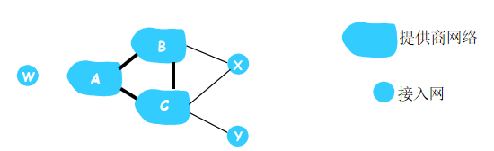

网络层-控制平面
===
---
- [网络层-控制平面](#网络层-控制平面)
    - [5.1. 路由选择算法](#51-路由选择算法)
      - [5.1.1. 选路和转发](#511-选路和转发)
      - [5.1.2. Dijsktra算法](#512-dijsktra算法)
      - [5.1.3. 距离矢量算法](#513-距离矢量算法)
    - [5.2. 因特网AS内部路由：OSPF](#52-因特网as内部路由ospf)
      - [5.2.1. 自治系统](#521-自治系统)
      - [5.2.2. 选路协议](#522-选路协议)
    - [5.3. 因特网AS之间路由：BGP](#53-因特网as之间路由bgp)
    - [5.4. ICMP: 互联网控制报文协议](#54-icmp-互联网控制报文协议)
### 5.1. 路由选择算法
#### 5.1.1. 选路和转发
- **默认路由器**：与主机直接相连的路由器
  - 源路由器：源主机的默认路由器
  - 目的路由器：目的主机的默认路由器
- **选路**
  - 目的：决定从源路由器到目的路由器的路由器序列（好的路径）
  - 图论抽象
    - 节点：路由器
    - 边：物理链路
    - 边权重：链路代价（时延，带宽倒数等）
- **选路算法分类**
  - 全局信息或分散信息
    - 全局的：所有路由器具有完整的拓扑、链路费用信息
     “链路状态”（Link State, LS）算法  
    - 分散的：路由器仅有与其直接相连链路的费用信息
    计算的迭代过程，与邻居交换信息  
    “距离矢量”（Distance Vector, DV）算法  
  - 静态或动态
    - 静态：路由随时间缓慢变化，手工配置。
    - 动态：路由更快地变化
    周期的更新
    适应链路费用和网络拓扑变化
  - 因特网路由选择算法是负载均衡的，链路开销不会反应当前拥塞水平
#### 5.1.2. Dijsktra算法
- **概述**：
  - 所有节点知道网络拓扑、链路费用：
    - 经过“链路状态广播”完成
    - 所有节点具有相同的信息
  - 从一个节点(源)到所有其他节点点计算最低费用路径：
    - $D(v)$: 从源到目的地v路径费用的当前值。
    - $p(v)$: 从源到v沿路径的前任节点。
  - 迭代：k次迭代后，得知到k个目的地的最低费用路径。
    - $N^{'}$: 已知在最小费用路径中的节点集合
- **伪代码**：   
    $init:$
    $ \quad N' = \{ u \} \quad $    
    $ \quad foreach \; v \neq u:$
    $ \qquad if \; v \in neighbor(u): $
    $ \qquad \quad D(v) = c(u,v) \quad$ 
    $ \qquad else: $
    $ \qquad \quad D(v) =  \infty $
    $ Loop \; until \; N^{'} = n:$
    $ \quad for \; w \; that \; w \notin N^{'} and \; min(D(w)) $
    $ \qquad N^{'} = N^{'} \cup w $
    $ \qquad foreach \; v \notin N^{'} $
    $ \qquad \quad D(v) = min(D(v), D(w) + c(w,v)) $
- **路径构建**
  - 思路：追踪前任节点，构建最短路径树
  - 方法：在更新$D(x)$时记录上一结点信息 
- **示例**


| step  | p(v)  | p(w)  | p(x)  | p(y)  | p(z)  |
| :---: | :---: | :---: | :---: | :---: | :---: |
| 0(u)  |  7,u  |  3,u  |  5,u  |  inf  |  inf  |
| 1(w)  |  6,w  |       |  5,u  | 11,w  |  inf  |
| 2(x)  |  6,w  |       |       | 11,w  | 14,x  |
| 3(v)  |       |       |       | 10,v  | 14,x  |
| 4(y)  |       |       |       |       | 12,y  |
| 5(z)  |       |       |       |       |       |

  注：其中p(x) = (D(v),上一节点)
- **路由实现**
  - 发现邻居节点
  - 测量链路状态与成本
  - 封装链路状态包
  - 广播链路状态信息
- **分析**
  - 时间复杂度：
    - 每次要检查不在$ N $中的所有节点，所以总的时间复杂度为：$$ n + (n - 1) + ... + 2 + 1 = \frac{n(n + 1)}{2} \Rightarrow O(n^{2}) $$
    - 运用优先队列等方法可优化为：$ O(n\log n) $
  - 缺点：可能出现震荡的情况，路径来回切换，带来路由的不稳定
#### 5.1.3. 距离矢量算法
- **特点**：一种分布式的，迭代的，异步算法
  - 分布式：
    - 每个节点仅当其DV改变时通知邻居
    - 如果必要，邻居通知他们的邻居
  - 异步迭代
    - 每次本地迭代引起：本地链路费用（$c(x,y)$）改变,DV从邻居更新报文$ d(v,y) $
- **Bellman-ford方程**：从$x$到$y$的最小费用： $$ d_{x}(y) = min_{v} \{ c(x,v) + d_{v}(y) \} $$
- **基本思想**：
  - 每个节点周期性的发送自己的距离矢量给邻居
    - 其中距离向量（$ DV $）: $ D_{x} = [ D_{x}(y) : y \in N] $
  - 当节点x接收到来自邻居的新$ DV $估计时，使用B-F方程更新自己的$DV$:$$ D_{x}(y) \Leftarrow min_{v} \{ c(x,v) + D_{v}(y) \} \quad foreach \; y \in N$$
  - 在规模较小正常的情况下，估计值收敛于实际最小费用
- **伪代码**
$ foreach \; node \; x$
$ \quad if \; v \in neighbor(x) $
$ \qquad D_{x}(v) = c(x,v) $
$ \quad else $
$ \qquad D_{x}(v) = \infin $
$ $
$ while \; true $
$ \quad foreach \; node \; x $
$ \qquad send \; D_{x} \; to \; all \; neighbors$
$ \qquad foreach \; y \in neighbor(x) $
$ \qquad \quad foreach \; z \in distination(y) $
$ \qquad \qquad D_{y}(z) = min(D_{y}(z),c(y,t) + D_{t}(z) ) $
- **算法步骤**
  - 步骤1: **初始化**
  每个节点初始化其到其他节点的距离。初始时，节点到自身的距离为0，到邻居节点的距离为边权值，到其他非邻居节点的距离为无穷大（未知）
  - 步骤2: **更新距离矢量**
  每个节点根据其邻居节点的距离信息更新其到其他节点的距离
  - 步骤3: **传播距离信息**
  节点将更新后的距离矢量信息传播给其邻居节点
  - 步骤4: **迭代更新**
  节点根据接收到的邻居节点的距离矢量信息，再次更新其到其他节点的距离。重复步骤2和步骤3，直到所有节点的距离矢量不再发生变化
  ```mermaid
    graph LR
      A((X)) <-- 2 --> B((Y))
      A <-- 7 --> C((Z))
      B <-- 1 --> C
  ```
- **示例**
  - 初始化：初始化，以$ x $为例，其距离表格初始化为： $$ \begin{matrix} & x & y & z \\ x & 0 & 2 & 7 \\ y & \infin & \infin & \infin \\ z & \infin & \infin & \infin \end{matrix} $$ 
  其中因为没有$y$，$z$的信息，所以都为 $\infin$ （未知）
  - 更新距离矢量：收到邻居的$DV$后，更新其到其他节点的距离，更新后$x$的距离表格：$$ \begin{matrix} & x & y & z \\ x & 0 & 2 & 3 \\ y & 2 & 0 & 1 \\ z & 7 & 1 & 0 \end{matrix} $$ 
    - $ D_{x}(y) = min\{ c(x,y) + D_{y}(y),c(x,z) + D_{z}(y) \} = min \{ 2 + 0, 7 + 1 \} = 2$
    -  $ D_{x}(z) = min\{ c(x,y) + D_{y}(z),c(x,z) + D_{z}(z) \} = min \{ 2 + 1, 7 + 0 \} = 3$
  - $x$将更新后的$DV$发送给其邻居，重复上述过程
  - 最后$x$的距离表格如下所示：$$ \begin{matrix} & x & y & z \\ x & 0 & 2 & 3 \\ y & 2 & 0 & 1 \\ z & 3 & 1 & 0 \end{matrix} $$ 
- **链路费用变化**
  - 节点检测本地链路变化
  - 跟新路由信息，重新计算距离向量
  - 如果$DV$改变，通知所有邻居
- **无穷计算问题**
  - 假设$x$到$y$距离，由4变为60
  - $y$重新计算$ D_{y}(x) $ 
    - $y$知道$z$到$x$的最小距离是5
    - $D_{y}(x) = min_{v} \{ c(y,v) + D_{v}(x) \} = 5 + c(y,z) = 6$
  - $y$计算完$DV$后，通知邻居$z$，$z$收到消息，重新计算$DV$
    - 他以为$D_{y}(x)$是6
    - 得到$D_{z}(x)$是7
  - 持续循环，都以为对方的数据是正确的，其实是错误的，在算法稳定前，有很多次无效迭代（44次）
  - 如果y到x的最小距离经过z，那z计算到x最短距离就应该不经过y，不能重复算路径
  ```mermaid
    graph LR
      A((X)) <-- 4 -> 60 --> B((Y))
      A <-- 50 --> C((Z))
      B <-- 1 --> C
  ```
- **毒性逆转**
  - 如果一个节点$Z$通过$Y$到$X$，则$Z$告诉$Y$他到$X$的距离为 $ \infin $
    - 只考虑一跳的情况
  - 对于上面的例子
    - $z$在计算其到$x$的距离为5时，会告诉$y$其到$x$的距离为无穷大
    - 此时，当$y$重新计算$ D_{y}(x) $的时候，因为$ D_{z}(x) = \infin $，故最后的结果为60；
    - $z$收到结果后，更新$ D_{z}(x) = 50 $，$y$进一步更新$ D_{y}(x) = 51 $，同时告诉$y$到$x$的距离为无穷大
    - 至此算法稳定
   
  - 对于选路环路问题，毒性逆转依然不能完全解决无穷计算的问题
    - 解决：定义最大度量，规定一个最大的跳步
### 5.2. 因特网AS内部路由：OSPF
#### 5.2.1. 自治系统
- **背景**
  - 因特网规模巨大，具有上亿个目的网络，选路表存储和交换面临挑战
  - 每个 ISP 希望控制自己网络中的选路
- **目的**：方便管理和扩展
  - 等级选路
  - 同一 AS 内的路由器运行相同的路由协议（算法）
  - 不同 AS 内的路由器可运行不同的自治系统内的选路协议
- **网关路由器**：
  - 位于 AS “边缘” 
  - 通过链路连接其他 AS 的网关路由器
  - 互相通信的 AS 之间运行相同的自治系统间的选路协议
  - 转发表的设置：
    - AS 内部路由算法设置 AS 内部目的地网络表项
    - AS 之间路由算法和 AS 内部路由算法共同设置 AS 外部目的网络表项
  - 自治系统间路由任务：
    - 知道通过其他网关路由器可以到达那些目的地
    - 传播可达信息到AS中的所有目的地
    - 在接收目的地是 AS 外部的数据报时，选择合适的网关路由器转发
      - 可利用本地偏好、最短 AS Path、热土豆路由等算法选择路由
#### 5.2.2. 选路协议
- **分类**
  - 内部网关协议（IGP）:用于自治系统内部的路由协议
    - 包括RIP（路由信息协议）、OSPF（开放最短路径优先协议）等
  - 外部网关协议(EGP):用于自治系统间接口上的路由协议
    - 如边界网关协议（BGP - 4）
- **RIP**
  - 概述：一种分布式的基于距离向量的路由选择协议
  - 距离度量：跳的数量，从源路由器到目的子网的最短路径所经过子网数量
  - 要点：
    - 仅和相邻的路由器交换路由选择信息
    - 每条信息包括目的子网，下一跳路由器，跳数
    - 按固定的时间间隔交换路由信息，每次通告最多25个目的子网
    - 如果180秒没有收到通告，则邻居/链路失效
  - 距离向量算法：收到相邻路由器（假设地址为$x$）的一个RIP报文的处理，其中$T$本地路由表
  $ foreach \; item \in Report $
  $ \quad item.nextHop = x $
  $ \quad item.distance = item.distance + 1 $
  $ $
  $ foreach \; item \in Report $
  $ \quad if \; item.network \notin T $
  $ \qquad T = T \cup item $
  $ \quad else $
  $ \qquad if \; item.distance \lt T.localItem.distance $
  $ \qquad \quad T.localItem = item $
  $ if \; no \; update \; from \; x \; within \; 3min $
  $ \quad T.item_x.distance = 16 $
  $ \quad send \; an \; announcement \; to \; neighbors$
  $ return $
  - RIP表处理：
    - 由称为route-d（守护进程）的应用级进程管理
    - 通告在UDP分组中发送，周期地重复
  - 优点：实现简单，开销较小。
  - 缺点：
    - 限制网络规模（最大距离为 15 跳）
    - 路由器间交换完整路由表，网络规模扩大时开销增加
    - 网络故障时，坏消息传播慢，收敛时间长（无穷计算问题）
- **OSFP协议**
  - 特点
    - 使用链路状态算法
    - 每个路由器构造完整的网络（AS）拓扑图
    - 可适应大规模网络-层次OSPF
    - 路由变化收敛速度快
  - 其他特征：
    - 支持路由等级划分，支持组播，支持验证，支持（多路径）等值路由，是目前IGP中应用最广、性能好的协议
  - 工作原理
    - 每个路由器通过 “HELLO” 与邻居节点形成和维持邻居关系，在交互中掌握本区域网络拓扑，使用 Dijkstra 算法完成本节点的路由计算
    - 邻居或链路状态发生变化时，通过洪泛法将信息散布到整个区域
    - OSPF 报文直接封装在 IP 报文中
- **层次 OSPF**
  - 两级层次: 本地, 主干
    - 链路状态通告仅在本地
    - 每个节点具有详细的区域拓扑；仅知道到其他区域网络的方向(最短路)
  - 路由器分工：
    - 区域边界路由器 : 负责为流向区域以外的分组提供路径选择
    - 主干路由器 : 运行OSPF 选路限制到主干
    - 边界路由器 : 连接到其他AS
  

### 5.3. 因特网AS之间路由：BGP
- **BGP协议**
  - BGP (边界网关协议): AS间路由协议，因特网“粘合剂”
  - 作用：为每个AS提供了一种手段 :
    - 从相邻AS获得子网可达性信息
    - 向AS内部的所有路由器传播可达性信息
    - 基于可达性信息和策略，决定到子网的“好”路由
  - BGP会话：
    - 一种路由器间来分发路由信息的TCP链接
    - 分类：iBGP和eBGP，分别运行在AS内和AS间
    - 对于每条连接，位于该连接端点的两台路由器称为BGP对等方
    - BGP会话不对应着物理链路(覆盖网络)
  
  - 分发可达性信息
    - 在3a和1c之间有eBGP 会话，AS3向AS1发送前缀可达性信息（前缀表示一个子网/子网集合）
    - 1c则能使用iBGP来向AS1中的所有路由器分发这种新前缀可达信息 
    - 1b则能经1b到2a的eBGP会话向AS2重新通告新的可达信息
    - 当路由器知道了一个新前缀，它将在其转发表中为该前缀创建一个表项
  
- **BGP路径**
  - 通告内容：当通告一个前缀(可达子网)，通告中包括了BGP属性
    - 前缀 + 属性 = “路由”
  - 两个重要的属性:
    - AS-PATH: 包含了对传递前缀的通告所经过的AS
    - 下一跳: 下一跳路由器的IP地址
  - 当网关路由器接收了路由通告，使用输入策略来接受/拒绝（不广播通告）
> 示例：基于策略通告信息
> 
> 假设一个ISP只想承载其客户的流量，而不愿承载其他ISP的流量
> $A$ 发送路由信息$Aw$ 给$B$和$C$
> $B$ 选择不告知$CBAw$:  
> $ \qquad $ 承载$CBAw$的流量，$B$ 没有收益, 因为$C$, $A$, $w$ 都不是$B$的客户
> 无法知道路径$CBAw$，使用路径$CAw$到达$w$
- **BGP路选择**
  - 方式：策略决定（丰富的策略）
    - 最短AS-PATH
    - 选择下一跳路由器: 热土豆选路
    - 各种过滤（IP地址，接口，属性）
  - 热土豆路由选择
    - 选择具有到达子网$x$最低费用的网关
    - 从转发表确定通向最低费用网关的接口$I$，将$(x,I)$项添加到转发表中
  - 对比AS内和AS间选路：
    - 策略: 
      AS间: 管理员希望控制它的流量选路的方式，谁能通过它的网络路由.
      AS内: 单个管理员，因此不需要策略决定
    - 性能: 
      AS内: 能够关注性能
      AS间: 策略将比性能更为重要

### 5.4. ICMP: 互联网控制报文协议
- **功能**：通过差错报文和询问报文来辅助IP网络的功能，由主机和路由器用于网络级信息的通信
  - 差错报告：不可达主机，网络，端口, 协议
  - 网络探寻：回声请求/回答 (由 ping使用)
- **与IP的关系**:ICMP报文作为IP有效载荷
  

- **Traceroute工作原理**
   - 源向目的地发送一系列具有不可到达UDP端口的IP数据报。
   - 第一个TTL（Time to Live，生存时间）设置为1，第二个TTL设置为2，依此类推。
   - 当第n个数据报到达第n个路由器时：
     - 路由器丢弃数据报，并向源发送一个ICMP报文（类型11，编码0）。
     - 报文包括路由器的名字和IP地址。
- **ICMP工作原理**
  - 当ICMP报文到达，源计算 RTT
  - Traceroute执行上述过程3次
  - 停止规则
    - UDP段最终到达目的地主机
    - 目的地返回ICMP “端口不可达”分组 (类型3, 编码3)
    - 当源得到该ICMP, 停止
