网络层：数据平面
========
---
- [网络层：数据平面](#网络层数据平面)
    - [4.1. 概述](#41-概述)
      - [4.1.1. 网络层](#411-网络层)
      - [4.1.2. 数据平面和控制平面](#412-数据平面和控制平面)
      - [4.1.3. 网络服务](#413-网络服务)
    - [4.2. 路由器的构成](#42-路由器的构成)
      - [4.2.1. 路由器概述](#421-路由器概述)
      - [4.2.2. 输入端口的处理](#422-输入端口的处理)
      - [4.2.3 交换结构](#423-交换结构)
      - [4.2.4. 输出端口处理](#424-输出端口处理)
    - [4.3. 网际协议](#43-网际协议)
      - [4.3.1. 数据报格式](#431-数据报格式)
      - [4.3.2. IP分片](#432-ip分片)
      - [4.3.3. IPv4编址](#433-ipv4编址)
      - [4.3.3. 层次划分子网](#433-层次划分子网)
      - [4.3.4. DHPC协议](#434-dhpc协议)
      - [4.3.5. NAT](#435-nat)
      - [4.3.6. IPv6](#436-ipv6)
### 4.1. 概述
#### 4.1.1. 网络层
+ **网络层**：从发送主机到接收主机传输数据
  + 在发送侧网络层将段封装进数据报，向相邻路由器发送
  + 在接收侧网络层，接受来自相邻路由器的数据报，并向运输层交付
+ **网络层协议**：在每台主机、路由器中
  + 数据平面：转发
  + 控制平面：路由选择
+ **功能**：
  + 转发: 将分组从路由器的输入移动到适当的路由器输出
    + 硬件实现
    + 路由器本地动作
  + 选路: 决定分组从源到目的地所采用的路由
    + 软件实现
    + 路由器全局动作
#### 4.1.2. 数据平面和控制平面
+ **数据平面**
  + 本地，每台路由器的功能:确定如何将到达数据报从路由器的输入链路转发到输出链路
  + 两种转发方式：IP转发和通用转发
+ **控制平面**：
  + 网络范围的逻辑
  + 确定数据报沿着从源主机到目的主机的路径中路由器之间的路由方式
  + 两种控制平面方式:
    + 传统的路由算法: 在路/由器中实现,路由器独立运行路由算法，通过交互确定转发表,通过路由选择协议交换路由选择信息
    + 软件定义网络：在远程服务器中实现，远程控制器与本地控制代理（Control Agents, CAs)交互,控制平面与数据平面分离，路由器只执行转发
#### 4.1.3. 网络服务
+ **服务模型**：
  <table>
    <thead>
      <tbody>
          <tr>
              <td>网络体系结构</td>
              <td>服务类型</td>
              <td>带宽保证</td>
              <td>丢失保证</td>
              <td>排序</td>
              <td>定时</td>
              <td>拥塞指示</td>
          </tr>
         <tr>
              <td>因特网</td>
              <td>尽力而为</td>
              <td>无</td>
              <td>无</td>
              <td>任何可能的顺序</td>
              <td>不维持</td>
              <td>无</td>
          </tr>
          <tr>
              <td>ATM</td>
              <td>CBR </td>
              <td>保证恒定速率</td>
              <td>是</td>
              <td>有序</td>
              <td>维持</td>
              <td>拥塞不出现</td>
          </tr>
          <tr>
              <td>ATM</td>
              <td>ABR</td>
              <td>保证最小速率</td>
              <td>无</td>
              <td>有序</td>
              <td>不维持</td>
              <td>提供拥塞指示</td>
          </tr>
      </tbody>
  </table>
+ **面向链接的服务**：虚电路（Virtual Circuit）网络
  + 源节点和目的节点在进行数据传输之前必须建立连接 ，即建立一条虚电路，以保证双方通信所需的一切网络资源
+ **无连接服务**：数据报（datagram）网络
  + 无需先建立连接。每一个分组（即 IP 数据报）独立发送，与其前后的分组无关
  + 每个报文携带目的节点完整的地址信息，路由器接收到数据报时都能根据数据报中目的节点地址来决定如何到达目的节点
### 4.2. 路由器的构成
#### 4.2.1. 路由器概述
+ **路由器的主要功能**
  + 运行路由算法得到转发表
  + 根据转发表对IP分组进行转发
  + 提供多种网络类型接口，完成不同网络的互联
+ **路由器体系结构**
  + 路由器的主要组成部分
    + 输入端口：接收来自不同网络的数据包
    + 输出端口：将处理后的数据包发送到目标网络
    + 分组处理器：对收到的数据包进行处理，包括检查、修改等操作
    + 转发表：存储路由信息，用于决定数据包的转发路径
    + 交换结构：连接各个输入端口和输出端口，实现数据包的转发
  + 控制平面与数据平面
    + 控制平面（软件）：
      + 路由选择协议：如OSPF、BGP等，用于动态更新路由表
      + 路由表：存储所有已知的路由信息，用于指导数据包的转发
    + 数据平面（硬件）：
      + 转发：基于转发表中的信息，快速地将数据包从输入端口转发到相应的输出端口
  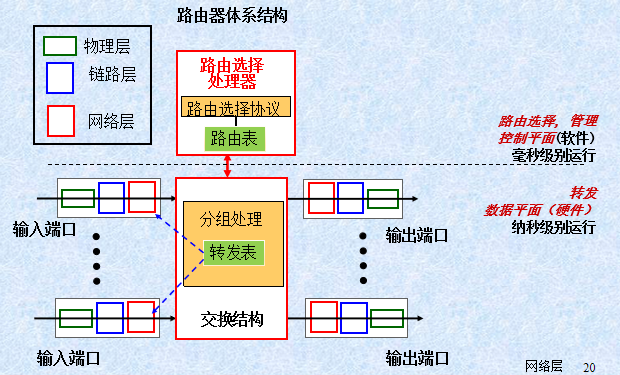
#### 4.2.2. 输入端口的处理
+ **输入端口的处理**
  + 物理层处理：接收比特流（bit-level reception），即将一条输入的物理链路与路由器相连
  + 数据链路层处理：剥去帧首部和尾部后，将分组送到网络层队列中排队等待处理。这会产生一定的时延
  + 网络层处理：查找转发表并决定转发到哪个输出端口
    + 输入端口保留转发表影子副本 检测分组首部值，匹配和动作
    + 传统转发: 基于首部目的IP地址转发
    + 通用转发: 基于一系列首部值转发
  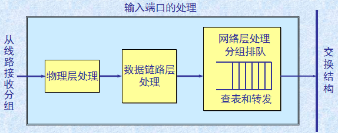  
+ **基于目的地址转发**：每台路由器有一个将目的地址映射到链路接口的转发表。
  + 转发表冗长：有四十亿可能的项
+ **最长前缀匹配**：当一个数据包到达路由器时，路由器会检查其目的IP地址，并与路由表中的多个可能的路由项进行比较，选择具有最长前缀匹配的路由项作为最佳路径
> 示例：
> 前缀匹配 $\Rightarrow$ 链路接口
> 11001000 00010111 00010 $\Rightarrow$ 0 
> 11001000 00010111 00011000 $\Rightarrow$ 1
> 11001000 00010111 00011 $\Rightarrow$ 2
> otherwise/默认路由 $\Rightarrow$ 3
> 目的地址: <u>11001000  00010111  00011</u>000  10101010 
> 1： 匹配24位;$ \qquad $ 2：匹配21位 
> 按照最长前缀匹配选择链路接口1
> 注：给出前缀计算地址数量时留意包含的情况
#### 4.2.3 交换结构
+ **交换结构**：将路由器的输出端口与输入端口相连
+ **经内存交换**：
  + 具有交换功能的传统计算机，在CPU的直接控制下分组拷贝到系统的内存，输入端与输出端的功能类似于I/O操作
  + 速率受内存带宽限制(每数据报跨越两次总线)
  + 不能同时转发两个分组，因为经过共享系统总线一次只能执行一个内存读/写操作
  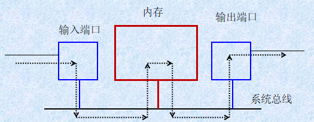  
+ **经总线交换**：
  + 数据报从输入端口到输出端口经一个共享的总线（以广播形式），总线速度快于内存读取速度
  + 总线竞争: 任何时刻，总线仅能连通1个输入和1个输出，数据转发速率受总线带宽限制
  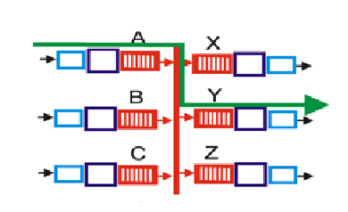
+ **经互联网络交换**：
  + 克服了总线带宽限制
  + Crossbar由2N条总线组成的互联网络，连接N个输入端口和N个输出端口，同时满足多个输入和输出连通
  + 交叉开关结构允许每个输入端口独立地连接到任意输出端口，只要没有其他输入端口在同一时间竞争相同的输出端口就不会出现等待的情况
  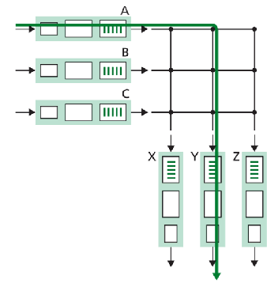
+ **输入端口排队**：
  + 交换结构比输入端口处理速度慢-> 数据报在输入端口排队
  + 排队延时，若内存溢出可能丢包
  + 线路前部Head-of-the-Line (HOL)阻塞 : 队列前面的数据报因为需要等待阻挡了队列后面的数据报转发
  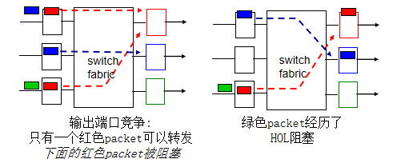  
#### 4.2.4. 输出端口处理
+ **输出端口处理**：
  + 当交换结构传送过来的分组先进行缓存，数据链路层处理模块将分组加上链路层的首部和尾部，交给物理层后发送到外部线路
  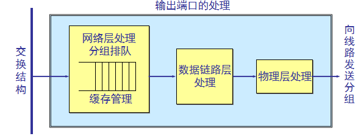
+ **输出端口排队**：
  + 当达到端口速度超过输出速度，则需要缓存数据报
  + 排队延时，若内存溢出则会丢包
   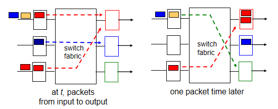
+ **调度机制**
  + FIFO
  + 优先级调度
  + 循环排队
  + 加权公平排队
### 4.3. 网际协议
#### 4.3.1. 数据报格式
+ **IP数据报格式**：
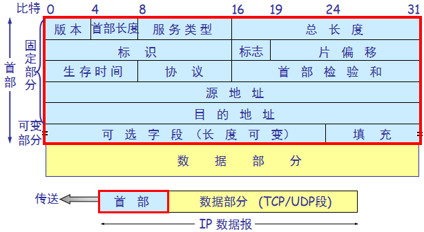
  + **首部长度**：同TCP首部长度，固定的20字节
  + **版本**——占 4 bit，指IP协议的版本目前的 IP 协议版本号为 4 (即 IPv4)
  + **首部长度**——占 4 bit，可表示的最大数值是15个单位(一个单位为4字节),故IP首部最大为60字节
  + **服务类型**——占 8 bit
  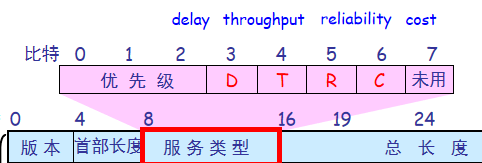
  + **总长度**——占 16 bit，指首部和数据之和的长度，单位为字节
    + 数据报的理论最大长度为 65535 字节
    + 总长度不得大于MTU(以太网1500字节)
  + **标识、标志、片偏移**：用于IP分片功能
    + 标识字段（16bit）: 标识一个IP分组，IP协议利用一个计数器，每产生IP分组计数器加1，作为该分组的标识，所有分片的数据报具有相同标识
    + 标志：保留、DF、MF
      + DF = 1：禁止分片， DF = 0: 允许分片
      + MF = 1: 非最后一片， MF = 0： 最后一片或未分片
      + 片偏移(13bit): 偏移字节(以8字节为单位)，指示分片的位置
    + IPv6不允许在路由器上对分组分片
  + **生存时间**（Time-To-Live, TTL,8bit）：确保数据报不会永远在网络中循环
    + 每当数据报经过一台路由器，该字段减1
    + 当TTL字段为0，丢弃该数据报
  + **协议**(8 bit)：指出此数据报携带的数据使用何种协议，以便目的主机的 IP 层将数据部分上交给哪个处理过程
    + TCP：6 UDP：17
    + ICMP:1      IGMP: 2      OSPF: 89 
  + **首部检验和**(16 bit)：用于差错检验
    + 只检验数据报的首部不包括数据部分
  + **源地址、目的地址**各占四字节

#### 4.3.2. IP分片
+ **IP分片和重新组装**
  + 网络链路有MTU (最大传输单元) —— 最大可能的链路级帧不同的链路类型和不同MTU
  + 所以在网络中，大IP数据报将被分割(“分段”)
    + “重新装配”仅在最后目的地(端系统)
    + IP首部(标识、标志、段偏移)用于标识、排序相关段
  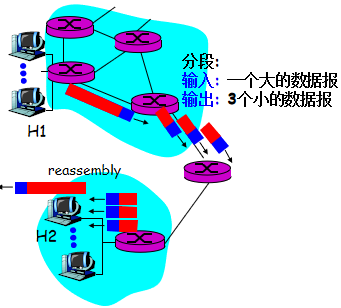
+ **IP分片过程**
  + 假设原IP分组总长度为L，待转发链路的MTU为M
  + 若L>M，且DF=0，则需要分片
  + 分片时每个分片的标识复制原IP分组的标识，同时一般情况下除最后一个分片，其他分片均分为MTU允许的最大分片
    + 一个最大分片可封装的数据应该是8字节的倍数，一个最大分片可封装的数据为: $$d=\bigg \lfloor \frac{M - 20}{8} \bigg \rfloor \times 8$$
    + 需要的总片数为:$$n = \bigg \lceil \frac{L - 20}{d} \bigg \rceil$$
    + 有效载荷是8字节倍数，每片的片偏移字段取值为： $$F_i = \frac{d}{8} \times (i - 1),1 \leq i \leq n$$
    + 每片的总长度字段为:$$MF_i=\begin{cases} 1 & 1 \leq i < n \\ 0 & i = n \end{cases}$$
> 例：原始数据报信息：总长度: 4000字节；MTU: 1500字节
> 计算每个分片的数据量：数据字段长度: 1480字节
> 偏移值: 1480 / 8 = 185
> 最后的分片结果如下所示：
> <table>
>    <thead>
>        <tr>
>           <th>分片</th>
>            <th>长度 (字节)</th>
>            <th>ID</th>
>            <th>标志</th>
>            <th>偏移</th>
>        </tr>
>    </thead>
>    <tbody>
>        <tr>
>            <td>分片1</td>
>            <td>1500</td>
>            <td>x</td>
>            <td>1</td>
>            <td>0</td>
>        </tr>
>        <tr>
>            <td>分片2</td>
>            <td>1500</td>
>            <td>x</td>
>            <td>1</td>
>            <td>185</td>
>        </tr>
>        <tr>
>            <td>分片3</td>
>            <td>1040</td>
>            <td>x</td>
>            <td>0</td>
>            <td>370</td>
>        </tr>
>    </tbody>
> </table>
> 
> 其中每个分片的ID同原数据报的ID  
> 如果MTU为1504：分片结果一样，每个分片的长度仍为1500字节
#### 4.3.3. IPv4编址
+ **IP地址**：
  + 定义：对主机、路由器接口的32-bit 标识符
  + 表示：点分十进制
    + 例：233.1.1.1 $ \Rightarrow $ 11011111 00000001 00000001 00000001
+ **接口**：
  + 在主机/路由器和物理链路之间的边界
  + 路由器通常具有多个接口，而主机可能具有多个接口，IP编址与每个接口相联系
+ **子网**：
  + 从主机或路由器分离每个接口，生成孤立网络的岛
  + 特点
    + 子网内主机无需通过路由器就能够物理上互相到达
    + 子网内节点IP地址高阶部分相同
    + 两个路由器直接连接，即使中间没有主机也算一个子网
  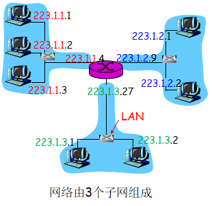
  + 子网的表示：前缀(网络号)/长度(子网掩码)
    + 例如： 223.1.1.0/24，任何连到子网223.1.1.0/24的节点都具有223.1.1.X的形式
  + 子网的大小必须为2的幂次方
+ **两级IP地址**: IP 地址是一种分等级的地址结构
  + 子网号：高阶比特
  + 主机号：低阶比特
  + 好处：
    + IP 地址管理机构在分配 IP 地址时只分配网络号和掩码，而剩下的主机号则由得到该网络号的单位自行分配。方便 IP 地址的管理
    + 路由器仅根据目网络号（前缀）来转发分组，这样就可以使路由表/转发表表项大幅度减少
+ **分类IP编址**
  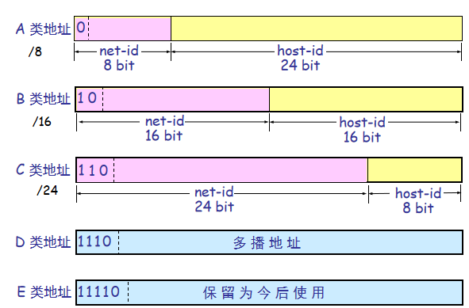
  + 网络数:
    + A类: $ 2^7 - 2 $
     网络号不能为全0,127.X.X.X为循环测试保留地址,所以0,127段不使用
    + B类: $ 2^{14} $
    + C类: $ 2^{21} $
  + 主机数:
    + A类: $ 2^{24} - 2 $
    + B类: $ 2^{16} - 2 $
    + C类: $ 2^{8} -2 $ 
    + 主机号全0代表网络本身；主机号全1代表本子网的广播地址
  + 地址范围（包括网络地址本身，广播地址，私有地址等）
    + A类：0.0.0.0 ~ 127.255.255.255  (0 段和 127 段不使用 )
    + B类：128.0.0.0 ~ 191.255.255.255
    + C类：192.0.0.0 ~ 223.255.255.255
    + D类：224.0.0.0 ~ 239.255.255.255
    + E类：240.0.0.0 ~ 255.255.255.255  
  + 特殊的IP地址:
    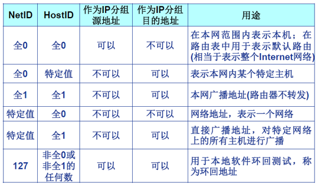
  + 私有地址:在互联网中不使用，仅在局域网中使用的IP地址
    + 10.X.X.X (A类)
    + 172.16.0.0 ~ 172.31.255.255 (B类)
    + 192.168.X.X (C类)
+ **CIDR:无类域间路由** 
  + 无类型域间选路(Classless InterDomain Routing, CIDR)：消除传统的 A 类、B 类和 C 类地址界限
    + 子网为连续地址的地址块
    + 网络前缀可以任意长度（如/23）
    + （子网地址，主机地址）格式: a.b.c.d/x
    + 一个子网对应一段连续的IP地址空间，通过前缀表示
  + 示例:200.23.16.0/23的IP地址范围:200.23.16.0 ~ 200.23.17.255
  + 子网掩码的应用:确定将IP分组转发到哪个子网
    + 路由器保存了每个子网的子网号和子网掩码
    + 将IP分组的目的IP地址与子网掩码按位与运算，提取子网地址（前缀），判断是否匹配
> 示例1:已知 IP 地址是141.14.72.24，子网掩码是255.255.192.0,试求网络地址，IP地址范围。
> 前两段为全一,对于第三段IP地址与子网掩码作与运算:$$ 72 \& 192 $$
> 即: $$\frac{\begin{matrix}  & 01001000 \\ \& & 11000000 \end{matrix}}{\begin{matrix} \quad & 01000000 \end{matrix}}$$
> 网络地址即为最后逐位相与的结果:141.14.64.0/18
> IP地址范围为:141.14.64.0 ~ 141.14.127.255
>   
> 示例2:地址块描述 200.23.16.0/23
> 子网掩码为：255.255.254.0 或 /23
> 网络地址为：200.23.16.0/23 (主机比特全0)
> 可用主机地址为：200.23.16.1 ~ 200.23.17.254
> 广播地址为：200.23.17.255 (主机比特全1)
> 网络地址为地址块第一个地址，广播地址为地址块最后一个地址（这两个地址不能分配给任何主机）
+ **层次划分子网**
  + ISP在获得一段连续地址块之后，可以将一个网络块分成几个部分供多个内部网络使用，但对外部世界仍然像单个网络一样
  + 转发:
    + 把数据报的目的地址与每个子网的掩码进行AND操作，看是否与前缀匹配
    + 如果匹配多个前缀，则选择最长匹配前缀
> 注：若分配的子网不等长，则按照从大到小分配，避免出现ip和掩码做按位与不为子网号的情况
#### 4.3.3. 层次划分子网
+ **概述**：ISP在获得一段连续地址块之后，可以将一个网络块分成几个部分供多个内部网络使用，但对外部世界仍然像单个网络一样
+ **分组转发**：
  + 方法：
    + 把数据报的目的地址与每个子网的掩码进行AND操作，看是否与前缀匹配，如果匹配多个前缀，则选择最长匹配前缀
    + 写出IP范围，判断分组落到那个位置
+ **路由聚合**
  + 概述：将多个连续的子网地址合并成一个较大的网络地址来表示
  + 优点：
    + 减少路由条目
    + 优化路由选择
> 例：若向ISP申请到/16地址块，并把地址块划分为3个子网（128.208.0.0/18，128.208.128.0/17，128.208.96.0/19）
> 目的地址128.208.0.88的分组如何转发
>   
> 与子网掩码1做与：128.208.0.88 $\&$ /18(255.255.192.0),结果为128.208.0.0等于前缀
> 而与子网掩码2，3作与都不等于前缀，所以应该转发到子网1
> 当然也可以写出三个子网的ip范围：128.208.0.0 - 128.208.63.255，128.208.128.0 - 128.208.255.255，128.208.96.0 - 128.208.127.255
> 可以发现128.208.0.88落到了128.208.0.0 - 128.208.63.255中，所以应转发到子网1
>  
> 例：考虑互联3个子网（子网1、子网2和子网3）的一台路由器。假定这3个子网的所有接口要求具有前缀223.1.17/24。还假定子网1要求支持多达60个接口，子网2要求支持多达90个接口，子网3要求支持多达12个接口
>   
> 确定子网大小，需为2的幂：三个子网的大小分别为64，128，16
> 从大小最大的子网开始分配：
> 子网2：233.1.17.0/25
> 子网1：233.1.17.128/26
> 子网3：233.1.17.192/28

#### 4.3.4. DHPC协议
+ IP编址：如何得到一个地址
  + 硬编码：静态配置
  + 动态主机配置协议: 动态地从服务器得到地址（“即插即用”）
+ 概述：
  + 从服务器动态获取： IP地址、子网掩码、默认网关地址、DNS服务器名称与IP地址
+ 特点：
  + 允许地址重用
    + 当主机加入时，从地址池中分配一个任意地址
    + 当主机离开时，地址被回收到地址池
  + 支持在用地址续租 
  + 支持用户动态加入网络 
  + 支持更多主机
+ 过程
  + 主机广播 “DHCP discover” (发现报文) 
  + DHCP服务器利用 “DHCP offer” (提供报文) 进行响应
  + 主机请求IP地址: “DHCP request” (请求报文,封装到UDP数据报中) 
  + DHCP服务器分配IP地址: “DHCP ack” (确认报文，包括分配给客户的IP地址、子网掩码、默认网关、DNS服务器地址) 
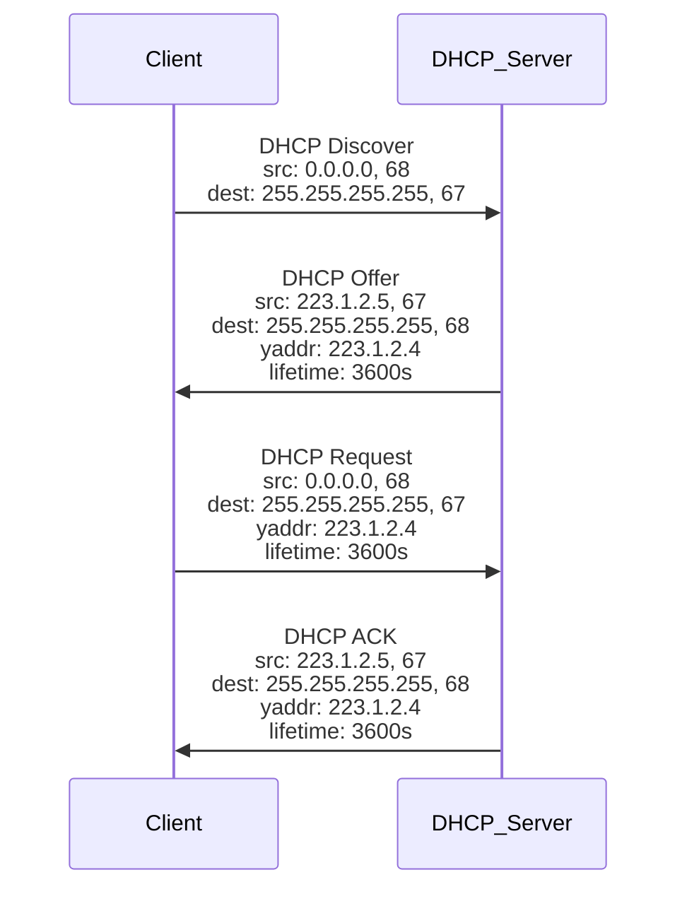
#### 4.3.5. NAT
+ **概述**：
  + 提供内部私有地址与公有地址的转换，支持内网与公网的通信
  + 所有数据报本地离开本地网络具有相同的单一源NAT IP地址与不同的源端口号
+ **过程**
  + 当一台主机想要访问Internet时，它会发出一个数据包，该数据包的目标地址是一个公网地址
  + 数据包首先到达NAT路由器
    + NAT路由器会检查这个数据包的目的地址是否是公网地址
    + 如果是，NAT路由器会把这个数据包的源地址从私有地址转换成公网地址，然后把数据包发送出去。
    + 当数据包到达目的地并得到回复时，这个回复数据包会先到达NAT路由器
      + NAT路由器会检查这个数据包的源地址是否是之前转换过的那个公网地址
      + 如果是的话，那么NAT路由器就会把这个数据包的源地址从公网地址转换成原来的私有地址，然后把数据包发送回去
      + 最终，这个回复数据包会到达最初的那台主机
  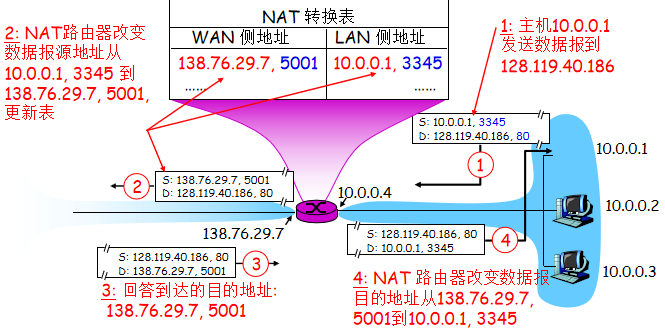
+ **优点**：
  + 解决IPv4地址耗尽问题
  + 本地网络设备IP地址的变更，无需通告外界网络
  + 变更ISP时，无需修改内部网络设备IP地址
  + 内部网络设备对外界不可见，不可直接寻址（安全）
+ **争议**：
  + 路由器应该只处理第三层功能
  + 违反了端到端原则
    + 应用设计者必须要考虑NAT可能性，如 P2P应用程序
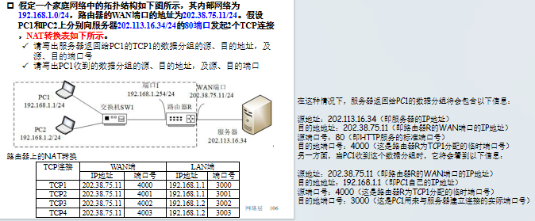  

#### 4.3.6. IPv6
+ **动机**：
  + 初始动机: 32-bit地址空间很快将会被完全分配完
  + 附加的动机:
    + 首部格式帮助速率处理/转发
    + 首部变化以促进QoS 
+ **数据报格式**: 
  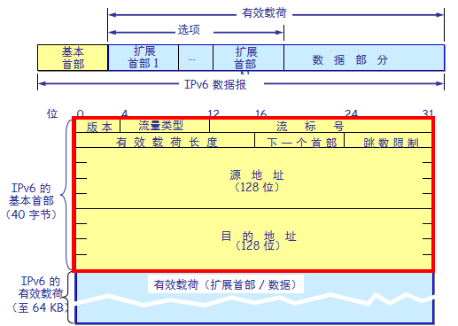
  + 固定长度 40 字节首部，不允许分段
  + 下一个首部：标识下一个选项首部或上层协议首部(如TCP首部) 
  + 流量类型，流标号：提供QoS区分与支持
    + 流量类型：标识数据报的优先级
    + 流标签：标识同一“流”中的数据报
  + 与IPv4相比其他变化：
    + 检查和: 完全去除以减小每跳的处理时间
    + 分片和重组：不允许路由器分片
    + 选项: 允许，但在首部之外，由“下一个首部”字段指示
+ **地址格式**：冒分十六进制
  + 例：1002:003b:456c:678d:890e:0000:0000:56g7；URLs: http://[1002:3b:456c:678d:890e::56g7]:8000 

  
  
  
  
  <table>
    <tbody>
      <tr>
        <td></td>
      </tr>
    </tbody>  
  </table>
