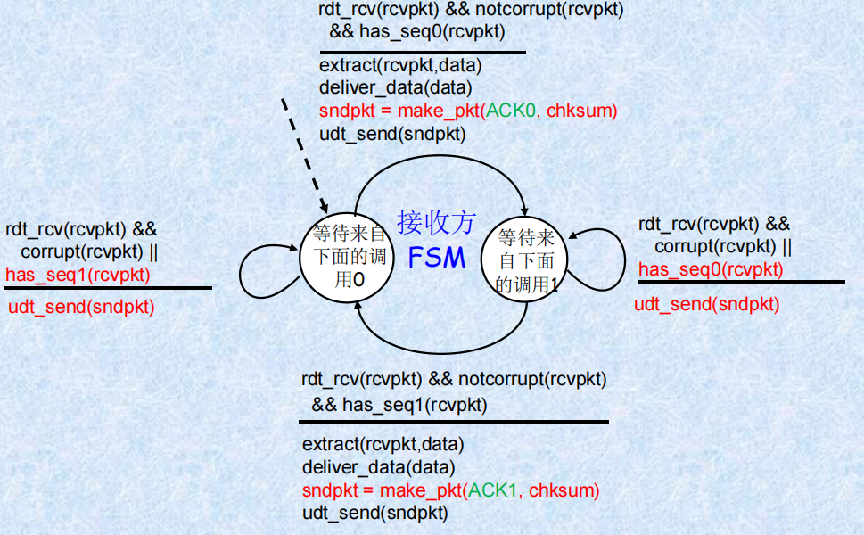

运输层
==========  
---

- [运输层](#运输层)
    - [3.1. 运输层服务](#31-运输层服务)
      - [3.1.1. 运输层概述](#311-运输层概述)
      - [3.1.2. 数据分段与封装](#312-数据分段与封装)
      - [3.1.3. 比较：运输层与网络层](#313-比较运输层与网络层)
      - [3.1.4. 因特网运输层协议](#314-因特网运输层协议)
    - [3.2. 复用与分解](#32-复用与分解)
    - [3.3. 无连接传输（UDP）](#33-无连接传输udp)
    - [3.4. 可靠数据传输原理](#34-可靠数据传输原理)
      - [3.4.1. 概述](#341-概述)
      - [3.4.2. rdt1](#342-rdt1)
      - [3.4.3. rdt2.0](#343-rdt20)
      - [3.4.3. rdt2.1](#343-rdt21)
      - [3.4.4. rdt2.2](#344-rdt22)
      - [3.4.5. rdt3.0](#345-rdt30)
      - [3.4.6. 滑动窗口协议](#346-滑动窗口协议)
    - [3.4. 面向链接的传输：TCP](#34-面向链接的传输tcp)


### 3.1. 运输层服务  
#### 3.1.1. 运输层概述


__基本功能__：向应用层提供通信服务，实现端到端的数据传输  
   + 为相互通信的应用进程提供逻辑通信

__运行位置__：只有主机的协议栈(端系统)才有运输层，运输协议运行在端系统中
 + 发送方：将应用报文划分为段，传向网络层
 + 接收方：将段重新装配为报文，传向应用层


__运输协议__：TCP和UDP（因特网）

**作用范围**：


#### 3.1.2. 数据分段与封装

__数据分段__：传输层将数据划分为多个片段，以便通过网络传输

+ MTU (Maximum Transmission Unit)
  + 指在网络上传输的最大数据单位大小，通常以字节为单位。
  + 确保数据能够在一个网络设备上完整地传输而不被分片。
  + 以太网的标准MTU是1500字节。

TCP具有最大报文长度（MSS），而UDP数据报不会自己进行分段，因此当长度超过了MTU时，会在网络层进行IP分片（UDP报头：源端口和目的端口）

__数据封装过程__：
 + 应用层：应用程序生成的数据被发送到下一层。
 + 传输层：在传输层，数据被分割成多个段（Segment），每个段都加上TCP报头。
   + TCP报头：
     + 源端口和目的端口
     + 排序以供同序处理
     + 数据段接收确认
     + 流量控制和拥堵管理
 + 网络层：每个段在到达网络层时，会被进一步封装为数据包（Packet），并添加IP报头。
     + IP报头包含源IP地址和目标IP地址等信息。
 + 数据链路层：数据包在到达数据链路层时，再次被封装为帧（Frame），并添加以太网帧头和帧尾。
     + 以太网帧头包括目的MAC地址、源MAC地址等信息。
 + 物理层：最终，帧通过物理介质进行传输。


#### 3.1.3. 比较：运输层与网络层
 + 网络层:主机间的逻辑通信 
    - 网络层关注的是如何将数据从一台计算机传输到另一台计算机。它处理的是端点之间的通信，即两台主机之间的数据交换。
 + 运输层:进程间的逻辑通信
    - 运输层则更深入一步，关注的是进程之间的通信。


#### 3.1.4. 因特网运输层协议
**TCP（传输控制协议）**

一种面向连接的、可靠的、基于字节流的传输层协议。它提供了以下几个关键功能：
 + 可靠的、按序的交付：TCP 确保数据从发送端到接收端的准确传输。如果数据在传输过程中丢失，TCP 协议会请求重传。此外，TCP 还保证了数据按照发送顺序被接收
 + 拥塞控制：TCP 具有机制来检测网络拥塞，并调整发送速率以避免拥塞加剧。这种机制有助于保持网络的稳定性和效率。
 + 流量控制：TCP 使用滑动窗口机制来管理发送速率，确保接收端不会被超过其处理能力的数据淹没。
 + 连接建立：在数据传输之前，TCP 要求在客户端和服务器之间建立连接，这个过程被称为三次握手（Three-way Handshake）。

**UDP（用户数据报协议）**

UDP 是一种无连接的、不可靠的传输层协议。它没有 TCP 提供的那些复杂的服务，而是提供了简单的数据报传输服务
 + 不可靠、不按序交付：UDP 不保证数据报的可靠传输，也不保证数据报的顺序。如果数据报在传输过程中丢失，UDP 不会请求重传，也不会重新排序数据报
 + 尽力而为的服务：UDP 提供的是尽力而为的服务，这意味着它尽可能快地发送数据，而不考虑网络拥塞或其他因素

**传输层不可提供的服务**
 + 时延保证：传输层协议不能保证数据报的传输延迟。
    这是因为网络中的许多因素，如路由选择、网络拥塞等，都会影响数据报的传输延迟。
 + 带宽保证：传输层协议也不能保证固定的带宽。
    同样，网络中的各种因素会影响实际可用的带宽。
### 3.2. 复用与分解
__复用__(Multiplexing)

指在一个共享信道上同时传输多个信号或数据流的技术

在发送主机复用：从多个套接字收集数据，用首部封装数据：

在发送端，运输层会从多个应用程序（即套接字）收集数据，并为这些数据添加头部信息进行封装(多路到一路，向下进行)

__分解__ (Demultiplexing)

分解则是指将复用后的信号或数据流重新分离成原始的单个信号或数据流的过程

在接收主机分解：将运输层接收到的报文段交付给正确的套接字

在接收端，运输层会将接收到的数据包解封装，并根据数据包的目的地信息将其传递给相应的应用程序（即套接字）(一路到多路，向上进行)

__分解过程__
1. **协议解析阶段**：通过IP头部识别传输层协议类型（TCP/UDP）
2. **端口处理阶段**：
   - 区分知名端口（0-1023）和动态端口（1024-65535）
   - 知名端口映射系统服务，动态端口对应应用进程
3. **数据分片判断**：
   - 根据MTU（最大传输单元）判断是否需要IP分片
   - UDP数据超过MTU时由网络层分片，TCP通过MSS自动分段
4. **套接字匹配**：
   - 使用五元组（源IP、源端口、目的IP、目的端口、协议类型）
   - 通过哈希表快速查找对应socket结构
5. **数据交付**：
   - 将有效载荷递交给应用层协议处理
   - 维护接收缓冲区处理乱序到达的数据包


__无连接的复用和分解过程__
 + 生成具有端口号的套接字：创建`DatagramSocket`对象，并绑定端口
 + 新建数据报文:创建`DatagramPacket`对象，参数分别为缓冲区，缓冲区长度为，目的IP地址，目的端口号
 + 发送数据:使用`DatagramSocket`中的`send()`方法将数据报文发送出去，参数为`DatagramPacket`对象
 + 接收数据:使用`DatagramSocket`中的`receive()`方法等待接收数据报文，参数为`DatagramPacket`对象
 + UDP套接字由二元组标(目的地IP地址, 目的地端口号)组成的二元组来唯一标识的
 + 当主机接收UDP段时：会在段中检查目的地端口号，并将UDP段定向到具有该端口号的套接字
    ```java
        DatagramSocket mySocket1 = new DatagramSocket(9911);
        DatagramSocket mySocket2 = new DatagramSocket(9922);
        DatagramPacket dp=new DatagramPacket(buf, buf.length, destIA, destPort);
        mySocket1.send(dp);
        mySocket2.receive(dp);
    ```


 + 其中SP为源端口号，DP为目的端口号

__面向链接分解__:

 + TCP套接字标识：（源IP地址，源端口号，目的IP地址，目的端口号）的四元组
    接收主机使用这四个值来将段定向到适当的套接字。
 + 服务器主机可能支持许多并行的TCP套接字：每个套接字由其自己的四元组标识
 + Web服务器对每个连接的客户机具有不同的套接字
    - 连续套接字与进程之间并非一一对应的关系
    - 非持久HTTP将为每个请求具有不同的套接字
    ```java
    ServerSocket welcomeSocket = new ServerSocket(1888);
    Socket socket = welcomeSocket.accept();
    //创建一个监听端口1888的ServerSocket对象，并等待客户端连接
    //当有客户端连接时，accept()方法会返回一个新的Socket对象，代表这个新的连接

    Socket clientSocket = new Socket();
    clientSocket.connect(new InetSocketAddress("localhost", 1888));
    //创建一个Socket对象，并尝试连接到本地主机的1888端口
    ```
### 3.3. 无连接传输（UDP）
__UDP的特点__
 + "没有不必要的","基本要素":
    + 复用/分解: 允许多个应用程序共享同一个网络连接，通过端口号区分不同程序的数据流
    + 差错检测: 提供简单的方式来检查数据是否被损坏，但不保证数据的可靠传输
 + 尽力而为的服务:
     + 丢包: UDP不会重传丢失的数据包，因此可能会出现数据丢失的情况
     + 对应用程序交付失序: UDP不保证数据包的顺序，可能导致数据乱序到达
 + 无连接:
     + 在UDP发送方和接收方之间无握手: UDP不需要建立连接即可开始数据传输，减少了延迟
     + 每个UDP段的处理独立于其他段: UDP不对数据包进行排序或确认，每个数据包独立处理

__优点__

 + 无连接创建: UDP不需要像TCP那样建立连接，减少了开销和延迟。
 + 简单: 发送方和接收方无需维护连接状态，简化了协议设计。
 + 段首部小: UDP头部信息较少，降低了数据传输的额外负担。
 + 无拥塞控制: UDP尽可能快地传输数据，适用于流式多媒体应用（丢包容忍，速率敏感）

__其他UDP应用__：
 + DNS：（域名系统，Domain Name System）
 + 路由表更新
 + SNMP（Simple Network Management Protocol,简单网络管理协议）

__UDP检验和__:
 + 目的:在传输的段中检测出任何可能发生的比特翻转错误
 + 发送方计算检验和的过程:
     + 将段内容处理成一系列16位整数序列。
     + 对所有段内容求和，采用反码加法的方式，求和时溢出的部分回卷。
     + 最终得到的和取反就是该段的检验和，发送方将其放入UDP头的检验和字段中一起发送出去。
 + 接收方验证检验和的过程:
     + 收到数据后，接收方将所有字段和检验和相加
     + 如果计算结果为全一，则认为数据未发生错误；否则，表明发生了差错


### 3.4. 可靠数据传输原理

#### 3.4.1. 概述

在不可靠的IP协议上使用一种可靠的数据协议来实现数据的传输


 + 发送侧 (Sending Side)
     + `rdt_send()`:来自上方（例如，由应用程序调用）,将数据传递到接收方的上层。
     + `udt_send()`:由RDT调用,通过不可靠信道将数据包传输到接收方。
 + 接收侧 (Receiving Side)
     + `rdt_rcv()`:当数据包到达信道的接收端时被调用,处理接收到的数据包。
     + `deliver_data()`:由RDT调用,将数据交付给上层。

**可靠数据传输协议** (RDT)
 + 发送端 (sending side):
     + 使用 `rdt_send()` 函数将数据封装成数据包
     + 通过 `udt_send()` 函数将数据包发送到不可靠信道
 + 接收端 (receiving side):
     + 当数据包到达时，`rdt_rcv()` 函数被调用进行处理
     + 处理后的数据通过 `deliver_data()` 函数交付给上层

#### 3.4.2. rdt1

**经可靠信道的可靠传输**：假设底层信道非常可靠
 + 无比特差错: 底层信道不会出现任何比特级别的错误。
 + 无分组丢失: 所有发送出去的分组都会按顺序到达接收方。

**发送方、接收方的单独FSM**


 + 发送方：等待来自上级的调用，当收到上级的调用时，执行以下操作：
     + 调用 `rdt_send(data)` 函数。
     + `packet = make_pkt(data)`: 将数据打包成一个数据包。
     + `udt_send(packet)`: 将数据包发送到底层信道。
 + 接收方：等待来自下级的调用，当收到下级的调用时，执行以下操作：
     + 调用 rdt_rcv(packet) 函数
     + extract(packet, data): 从数据包中提取出原始数据
     + deliver_data(data): 将数据交付给上层

#### 3.4.3. rdt2.0
**具有比特差错的底层信道**：假设信道传输可能出现比特差错，但无分组丢失，且按序到达
 + 数据出错后处理方式：检错重传
 + rdt2新增加机制（与rdt1比较）：检错，反馈（ACK, NAK），重传

**发送方的FSM**


 + 初始状态: 等待来自上面的调用，当收到数据时，进入下一步
 + 发送数据包：调用`rdt_send(data)`函数。
     + `sndpkt = make_pkt(data, checksum)`: 创建包含数据和校验和的数据包
     + `udt_send(sndpkt)`: 将数据包发送出去。
 + 等待 ACK 或 NAK：进入等待状态
 + 处理响应
   + 如果收到的是ACK，`(rdt_rcv(rcvpkt) && isACK(rcvpkt))`, 则返回到初始状态，等待新的数据发送请求
     + 如果收到的是NAK,`(rdt_rcv(rcvpkt) && isNAK(rcvpkt))`, 则重新发送之前的数据包`(udt_send(sndpkt))`

**接收方的FSM**


 + 初始状态: 等待来自下面的调用，当收到数据包时，进入下一步
 + 检查数据包是否损坏：调用`rdt_rcv(rcvpkt)`函数
   + 如果数据包损坏 `(corrupt(rcvpkt))`, 则调用`udt_send(NAK)`发送一个否定应答并回到初始状态
    + 如果数据包未损坏`(notcorrupt(rcvpkt))`, 则继续处理数据包
         + `extract(rcvpkt, data)`: 从数据包中提取数据
         + `deliver_data(data)`: 将数据交付给上层
         + `udt_send(ACK)`: 发送一个确认 (ACK) 消息

#### 3.4.3. rdt2.1

**rdt2.0的缺陷**

如果ACK或NAK分组发生了比特差错，rdt2.0没有相应的处理措施
 + 发送方不知道接收方的状态，不能判断是否需要重发
 + 如果接收方已经正常的接收到了数据，但是ACK出现了差错，可能导致数据重复


**解决方案**

处理重复（序号机制），即发送方对每个分组增加序列号
 + 给每个发送的数据包添加一个唯一的序列号。
 + 如果ACK/NAK受损，发送方重传当前的分组：当发送方没有收到ACK时，会认为数据包可能没有成功送达，因此选择重传相同的分组
 + 接收方丢弃(不再向上交付)重复的分组：接收方通过比较序列号来识别重复的数据包，并将其丢弃而不提交给上层

**发送方FSM**


**接收方FSM**


#### 3.4.4. rdt2.2
**一种无NAK的协议**

不使用NAK分组，通过给ACK分组加上序号来实现与rdt2.1相同的效果。发送方连续接收到对同一个分组的两个ACK后，就知道接收方没有正确接收到跟在被确认两次的分组后面的分组（重传）

**发送方FSM**


**接收方FSM**



 #### 3.4.5. rdt3.0
 
 **具有差错和丢包的信道**

假设下面的信道也能丢失分组(数据或ACK)，此时检验和、序号、重传将是有帮助的，但不充分

**方法**: 发送方等待ACK一段“合理的”时间
 + 如在这段时间没有收到ACK则重传
 + 如果分组(或ACK)只是延迟(没有丢失)：重传将是冗余的，但序号的使用已经处理了该情况，接收方必须定义被确认的分组序号
 + 倒计时定时器：每次发送1个分组(包括初始分组和重传分组)时，便启动一个定时器
  
**发送方FSM**：


**运行情况示意图**：


**性能**：性能较差，网络协议限制了物理资源的使用
 + 示例：在 $1 Gbps(10^9 bit/s)$链路, $30ms$往返传播时延的情况下
> 发送$1kB$数据所需的时间：
> $$T_{transmit} = \frac{L(packet length in bits)}{R(transmission rate, bps)} =\frac{8kb/pkt}{10^9b/sec} = 8 \mu s$$
> 此时的利用率:
> $$U_{sender} = \frac{L/R}{RTT + L/R} = \frac{0.008}{30 + 0.008} \approx 0.027% $$

注：如果发送方网络和接收方的网络能够对报文重排，那么比特交替协议将不能正确工作

__流水线协议__

发送方允许发送多个、“传输中的”,还没有应答的报文段，有回退N步（Go-Back-N）, 选择性重传（Selective-Repeat）两种形式，此时序号的范围须增加同时发送方和接收方需设有缓冲  


#### 3.4.6. 滑动窗口协议

发送方和接收方都具有一定容量的缓冲区（即窗口），允许发送端连续发送多个分组而不需要等待应答
  
**发送窗口**

发送端允许连续发送的分组的序号表，发送端可以不等待应答而连续发送的最大分组数称为发送窗口的尺寸

**接收窗口**

接收方允许接收的分组的序号表，凡落在接收窗口内的分组，接收方都必须处理，落在接收窗口外的分组被丢弃。接收方每次允许接收的分组数称为接收窗口的尺寸


**Go-Back-N**：
- 发送方：

 
 + “窗口”大小为N, 允许发送N个连续的没有应答分组（位于发送串口内的分组才允许被发送）
     +  基序号（send_base）：最小未确认的分组序号
     +  下一个序号（nextseqnum）：最小未使用的分组序号
     +  分组的序号字段k比特，序号范围$[0,2^{k-1}]$

 + 接收方：窗口大小为1，只有位于接收窗口内的分组才能被接收


 + 窗口滑动：
     + 发送方窗口滑动的条件：收到发送串口内分组序号的确认分组
        超时重传时，需重传未被确认的分组
     + 接收方窗口滑动的条件：收到期望序号的分组
         对失序分组的处理：丢弃，重发，重新确认具有按序的分组

 + 累计ACK(n)：表明已经正确收到序号n（包括n）以前的分组（累积确认：对正确接收的分组总是发送具有最高按序序号的ACK）
    仅仅需要记住期望的序号值，但可能产生冗余的ACKs 
 + 不足：虽然效率明显高于停等协议，但仍有不必要重传的问题
 + 发送方的FSM：

 
 + 接收方的FSM：

 

**选择性重传SR**：发送方有选择性的重传


 + 窗口尺寸：接收方和发送发窗口尺寸均为N;
 + 独立ACK：对每个分组使用单独的确认，需要N个计时器，某个分组超时，只重传单个分组
 + 窗口滑动：
     + 发送方：收到最小未收到应答的分组确认，超时重传时，仅重传超时的单个分组
     + 接收方：收到最低位置的分组，对于失序分组，接收窗口内缓存，接收窗口外丢弃
 + 对于SR协议，发送窗口+接收窗口长度之和小于等于序号空间
### 3.4. 面向链接的传输：TCP
__TCP报文结构__
   + 序号：报文段中第1个数据字节在字节流中的位置编号（初始序号随机选择，不都是0）
   + 确认号：期望从对方收到的下一个字节的序号（累计确认）
   + 失序处理：TCP规范没有说明，由实现者自行选择实现（抛弃/缓存）


__RTT的估计与超时__
   + 估计
     + SampleRTT：从发送报文到接收到ACK的测量时间（忽略重传）
     + 平滑：SampleRTT会变化，需平均最近的测量值，并不仅仅时当前值
     + 计算：
> RTT估计值：
> $$EstimatedRTT = (1 - \alpha) \times EstimatedRTT + \alpha \times SampleRTT$$
> 指数加权移动平均，过去的样本指数衰减来产生影响  
> 典型的：
> $$\alpha = 0.125$$

   + 超时间隔：$EstimatedRTT + $“安全余量”，如果SampleRTT变化较大则需要更大的安全余量
     + 估算差值EstimateRTT和SampleRTT之间的差值 
     + 估算超时值
> 差值：
> $$DveRTT = (1 - \beta) \times DveRTT + \beta \times |SampleRTT -EstimatedRTT|$$
> 典型的：
> $$ \beta = 0.25 $$
> 估算超时值：
> $$TimeoutInterval = EstimatedRTT + 4 \times DveRTT$$ 
> 初始$TimeoutInterval$为$1s$，当出现超时后,$TimeoutInterval$加倍

__可靠数据传输__：TCP在IP不可靠服务的基础上创建可靠数据传输服务
   + 举措：
     + 流水线发送报文段
     + 累计确认
     + 使用单个重传计时器处理超时
   + 重传：超时事件、重复ACK
   + 简化的TCP发送方事件：忽略重复ACK，忽略流量控制，拥塞控制
     + 从应用层接收数据:
        创建报文段：序号是报文段中第一个数据字节的数据流编号
        如果计时器未启动，启动之(考虑计时器用于最早的没有确认的报文段)
        其中：超时间隔:$TimeOutInterval = EstimatedRTT + 4 \times DevRTT$
     + 超时：重传导致超时的报文段，并重新启动计时器
     + 收到确认(累积确认)：如果确认了先前未被确认的报文段，更新SendBase，如果还有未被确认的报文段，重新启动计时器
  
```java
    NextSeqNum = InitialSeqNum
    SendBase = InitialSeqNum
    loop (forever) {
        switch(event)
    
        event: data received from application above
            create TCP segment with sequence number NextSeqNum
            if (timer currently not running)
                start timer
            pass segment to IP layer
            NextSeqNum = NextSeqNum + length(data)
            break;
        event: timer timeout
            retransmit not-yet-acknowledged segment with
                smallest sequence number
            start timer
            break;
        /* 注释: • SendBase-1: 上次累计的已确认字节
        例如: • SendBase - 1 = 71; y = 73, 因此接收方期待73 ; y > SendBase, 因此新数据被确认*/
        event: ACK received, with ACK field value of y
            if (y > SendBase) { /* 累计确认到y */
                SendBase = y
                if (there are currently not-yet-acknowledged segments)
                start timer
            }
        break;
    } /* end of loop forever */
``` 
  
**重传**：


快速重传：在定时器超时之前重传
 + 原因：超时间隔常常相对较长，重传丢失报文段以前有较长时延
 + 方法：通过冗余ACK，检测丢失的报文段。如果对相同数据，发送方收到3个冗余ACK,假定被确认的报文段以后的报文段丢失了
```java
    事件: 收到ACK, ACK 域的值为 y
        if (y > SendBase) {
            SendBase = y
            if (当前还有没有确认的报文段)
                启动定时器
        }
        else {
            值为y的重复确认的次数加1
            if (值为y的重复确认的计数 = 3) {
                重传序号为y的报文段
            }
        }
        break;
```

**TCP ACK的产生**


__流量控制__

原因：TCP连接的接收方有1个接收缓冲区
 + 发送方不能发送太多、太快的数据让接收方缓冲区溢出
 + 匹配速度服务: 发送速率需要匹配接收方应用程序的提取速率
 + 应用进程可能从接收缓冲区读数据缓慢

原理：发送方维护接受窗口（接收方缓冲区的剩余空间）
 + 接收方在报文段的接收窗口字段通告其接收缓冲区的剩余空间
 + 发送方要限制未确认的数据不超过`RcvWindow`
 

> `RcvWindow = RcvBuffer - [LastByteRcvd -LastByteRead]`  
> `LastByteSent-LastByteAcked ≤ RcvWindow`  
> 最后一个已发送的字节编号 - 最后一个被确认的字节编号 = 已经发送还未被确认的数据量

__链接管理__：

建立链接（三次握手）
 + 客户机向服务器发送TCP SYN报文段（指定初始序号，没有数据）
 + 服务器收到SYN报文段, 用SYN ACK报文段回复
    + 服务器为该连接分配缓冲区和变量
    + 指定服务器初始序号
 + 客户机接收到 SYN ACK, 用ACK报文段回复,可能包含数据


释放链接：
 + 客户机向服务器发送TCPFIN控制报文段
 + 服务器收到FIN，用ACK回答。关闭连接，发送FIN
 + 客户机收到FIN, 用ACK答，进入 “超时等待” – 将对接收到的FIN进行确认
 + 服务器接收ACK，连接关闭  


**TCP客户与服务器生命周期**


