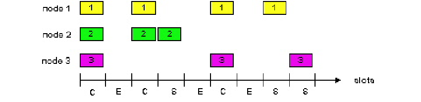

链路层和局域网
=============
---
- [链路层和局域网](#链路层和局域网)
    - [6.1. 概述与服务](#61-概述与服务)
      - [6.1.1. 链路层概述](#611-链路层概述)
      - [6.1.2. 链路层服务](#612-链路层服务)
    - [6.2. 差错检测和纠错](#62-差错检测和纠错)
      - [6.2.1. 差错检测](#621-差错检测)
    - [6.3 多路访问协议](#63-多路访问协议)
      - [6.3.1. 多路访问链路和协议](#631-多路访问链路和协议)
      - [6.3.2. 信道划分Mac协议](#632-信道划分mac协议)
      - [6.3.3. 随机访问协议](#633-随机访问协议)
      - [6.3.4.  “轮流” MAC协议](#634--轮流-mac协议)
    - [6.4. 以太网](#64-以太网)
      - [6.4.1. 概述：](#641-概述)
      - [6.4.2. 以太网帧结构](#642-以太网帧结构)
      - [6.4.3. IP地址和MAC地址](#643-ip地址和mac地址)
      - [6.4.4. ARP: 地址解析协议](#644-arp-地址解析协议)
      - [6.4.5. 交换机](#645-交换机)

### 6.1. 概述与服务
#### 6.1.1. 链路层概述
- **通信路径**：由源主机和目的主机之间的一系列通信链路和路由器组成
- **概述**:
  - 职责：负责将物理层接收到的原始比特流组织成帧，并通过物理介质进行传输
  - 帧是数据链路层的基本传输单位
- **比较：网络层和链路层**
  - 网络层：将传输层报文段从源主机传送到目的主机（端到端的工作）
  - 链路层：将网络层数据报从一个节点传送到下一个节点（单段链路）

- **链路层信道类型**
  - 点对点通信链路：直接链接两个节点的链路，每一端有一个节点
    - 访问控制简单
    - 主要解决问题：如成帧、可靠数据传输、差错检测和流量控制等
    - 常用于两台路由器之间的通信链路，拨号调制解调器与ISP路由器之间的通信链路
  - 广播链路：许多主机被连接到相同的通信信道，需要媒体访问协议（MAC）来协调传输和避免“碰撞”（冲突）
    - 传统的以太网
    - 802.11无线局域网
    - 卫星网

- **相关概念**
  - 节点：主机和路由器是
  - 链路：连接沿通信路径的相邻节点的路径
    - 有线链路
    - 无线链路
  - 第二层的分组叫帧，封装数据报
  - 数据链路层具有经一条链路从一个节点传输数据到相邻节点的能力

#### 6.1.2. 链路层服务
- **基本服务**：将数据报通过单一通信链路从一个节点移动到相邻
  - 成帧，链路访问：
    - 将数据报封装进帧，加上首部和尾部
    - 如果共享媒体，媒体访问控制协议协调多路访问
    - 位于帧首部的“MAC“地址标识源、目的地（不同于IP地址）
  - 相连节点间的可靠交付
    - 在比特差错低的链路很少使用（光纤，某些双绞线）
    - 无线链路：高差错率，差错检测、纠错
  - 流量控制：
    - 相邻发送和接收节点间的步调一致
  - 差错检测：
    - 差错由信号衰减、噪声所致
    - 接收方检测差错的存在，信号发送方负责重传
  - 纠错：
    - 接收方识别和纠正比特差错，而不采取重传
  - 半双工，全双工
- **链路层和运输层服务比较**
 
|   协议   |           运输层协议           |         链路层协议         |
| :------: | :----------------------------: | :------------------------: |
|   范围   | 端到端的基础上 两个进程之间 | 一条链路相连的两个节点之间 |
| 流量控制 |        在端到端的基础上        |     在相邻节点的基础上     |

- **网络适配器实现链路层通信**
  - 在“适配器”（NIC）中实现链路层
    - 以太网卡，802.11卡 
    - 发送侧 
      - 将数据报封装在帧中
      - 增加差错检测比特，可靠数据传输，流量控制等
    - 接受侧
      - 查找差错，可靠数据传输，流量控制等
      - 提取数据报，传递到接收节点
    - 适配器是半自治的（软硬结合）
    - 链路和物理层

### 6.2. 差错检测和纠错
#### 6.2.1. 差错检测
- **基本原理**
  - 发送方：信息数据（D）（帧）＋冗余数据（EDC）（差错检测和纠正比特）
  - 接收方：检查信息数据和冗余数据的关系，发现差错
  - 差错检验并非100%可靠，较大的EDC字段产生更好的检测和纠正
- **奇偶校验**
  - 方法：专门设置一个奇偶校验位，用它使这组代码中“1”的个数为奇数或偶数
  - 单比特奇偶校验：
    - 检测单个比特差错
    - 错误率为50%
  - 二维比特奇偶校验：数据D被划分为i行j列，对每行，每列计算奇偶值，产生i+j+1奇偶比特
    - 可纠正的单比特差错
    - 可纠正同一行/同一列的奇数位错

> 例：假设某分组的信息内容是比特模式 1110 0110 1001 1101
> 在采用二维偶校验的情况下，包含该校验比特的字段值是什么（最小长度）？
> 设$i$行，$j$列，且$i \times j = 16$
> 满足的组合： $1 \times 16, 2 \times 8 ,4 \times 4$
> 对应的校验码长度为：18,11,9,故最小长度为9
> 其校验码为：
> 

- **互联网检验和**
  - 发送方：
    - 将段内容作为16比特整数序列来处理
    - 检查和：段内容相加（补码和）
    - 发送方将检查和的值放入UDP检查和字段
    - 计算步骤：求和，回卷（最高位的进位要回加到结果中），求反
  - 接收方：
    - 计算接收到段的检查和
    - 检查是否各段之和为全1：
      - NO-检测到差错
      - YES-没有检测到差错；尽管如此，还可能有错

> 例：有三个16比特的字：
> <table border="1" ><tr>
> <td colspan="1" rowspan="3">信息字段</td>
> <td colspan="1" rowspan="1"></td>
> <td colspan="1" rowspan="1">0</td>
> <td colspan="1" rowspan="1">1</td>
> <td colspan="1" rowspan="1">1</td>
> <td colspan="1" rowspan="1">0</td>
> <td colspan="1" rowspan="1">0</td>
> <td colspan="1" rowspan="1">1</td>
> <td colspan="1" rowspan="1">1</td>
> <td colspan="1" rowspan="1">0</td>
> <td colspan="1" rowspan="1">0</td>
> <td colspan="1" rowspan="1">1</td>
> <td colspan="1" rowspan="1">1</td>
> <td colspan="1" rowspan="1">0</td>
> <td colspan="1" rowspan="1">0</td>
> <td colspan="1" rowspan="1">0</td>
> <td colspan="1" rowspan="1">0</td>
> <td colspan="1" rowspan="1">0</td>
> </tr><tr>
> <td colspan="1" rowspan="1"></td>
> <td colspan="1" rowspan="1">0</td>
> <td colspan="1" rowspan="1">1</td>
> <td colspan="1" rowspan="1">0</td>
> <td colspan="1" rowspan="1">1</td>
> <td colspan="1" rowspan="1">0</td>
> <td colspan="1" rowspan="1">1</td>
> <td colspan="1" rowspan="1">0</td>
> <td colspan="1" rowspan="1">1</td>
> <td colspan="1" rowspan="1">0</td>
> <td colspan="1" rowspan="1">1</td>
> <td colspan="1" rowspan="1">0</td>
> <td colspan="1" rowspan="1">1</td>
> <td colspan="1" rowspan="1">0</td>
> <td colspan="1" rowspan="1">1</td>
> <td colspan="1" rowspan="1">0</td>
> <td colspan="1" rowspan="1">1</td>
> </tr><tr>
> <td colspan="1" rowspan="1"></td>
> <td colspan="1" rowspan="1">1</td>
> <td colspan="1" rowspan="1">0</td>
> <td colspan="1" rowspan="1">0</td>
> <td colspan="1" rowspan="1">0</td>
> <td colspan="1" rowspan="1">1</td>
> <td colspan="1" rowspan="1">1</td>
> <td colspan="1" rowspan="1">1</td>
> <td colspan="1" rowspan="1">1</td>
> <td colspan="1" rowspan="1">0</td>
> <td colspan="1" rowspan="1">0</td>
> <td colspan="1" rowspan="1">0</td>
> <td colspan="1" rowspan="1">0</td>
> <td colspan="1" rowspan="1">1</td>
> <td colspan="1" rowspan="1">1</td>
> <td colspan="1" rowspan="1">0</td>
> <td colspan="1" rowspan="1">0</td>
> </tr><tr>
> <td colspan="1" rowspan="1">回卷</td>
> <td colspan="1" rowspan="1">1</td>
> <td colspan="1" rowspan="1">0</td>
> <td colspan="1" rowspan="1">1</td>
> <td colspan="1" rowspan="1">0</td>
> <td colspan="1" rowspan="1">0</td>
> <td colspan="1" rowspan="1">1</td>
> <td colspan="1" rowspan="1">0</td>
> <td colspan="1" rowspan="1">1</td>
> <td colspan="1" rowspan="1">0</td>
> <td colspan="1" rowspan="1">1</td>
> <td colspan="1" rowspan="1">1</td>
> <td colspan="1" rowspan="1">0</td>
> <td colspan="1" rowspan="1">0</td>
> <td colspan="1" rowspan="1">0</td>
> <td colspan="1" rowspan="1">0</td>
> <td colspan="1" rowspan="1">0</td>
> <td colspan="2" rowspan="1">1</td>
> </tr><tr>
> <td colspan="1" rowspan="1">和</td>
> <td colspan="1" rowspan="1"></td>
> <td colspan="1" rowspan="1">0</td>
> <td colspan="1" rowspan="1">1</td>
> <td colspan="1" rowspan="1">0</td>
> <td colspan="1" rowspan="1">0</td>
> <td colspan="1" rowspan="1">1</td>
> <td colspan="1" rowspan="1">0</td>
> <td colspan="1" rowspan="1">1</td>
> <td colspan="1" rowspan="1">0</td>
> <td colspan="1" rowspan="1">1</td>
> <td colspan="1" rowspan="1">1</td>
> <td colspan="1" rowspan="1">0</td>
> <td colspan="1" rowspan="1">0</td>
> <td colspan="1" rowspan="1">0</td>
> <td colspan="1" rowspan="1">0</td>
> <td colspan="1" rowspan="1">1</td>
> <td colspan="1" rowspan="1">0</td>
> </tr><tr>
> <td colspan="1" rowspan="1">检查和（取反）</td>
> <td colspan="1" rowspan="1"></td>
> <td colspan="1" rowspan="1">1</td>
> <td colspan="1" rowspan="1">0</td>
> <td colspan="1" rowspan="1">1</td>
> <td colspan="1" rowspan="1">1</td>
> <td colspan="1" rowspan="1">0</td>
> <td colspan="1" rowspan="1">1</td>
> <td colspan="1" rowspan="1">0</td>
> <td colspan="1" rowspan="1">1</td>
> <td colspan="1" rowspan="1">0</td>
> <td colspan="1" rowspan="1">0</td>
> <td colspan="1" rowspan="1">1</td>
> <td colspan="1" rowspan="1">1</td>
> <td colspan="1" rowspan="1">1</td>
> <td colspan="1" rowspan="1">1</td>
> <td colspan="1" rowspan="1">0</td>
> <td colspan="1" rowspan="1">1</td>
> </tr><tr>
> <td colspan="1" rowspan="1">无差错和为</td>
> <td colspan="1" rowspan="1"></td>
> <td colspan="1" rowspan="1">1</td>
> <td colspan="1" rowspan="1">1</td>
> <td colspan="1" rowspan="1">1</td>
> <td colspan="1" rowspan="1">1</td>
> <td colspan="1" rowspan="1">1</td>
> <td colspan="1" rowspan="1">1</td>
> <td colspan="1" rowspan="1">1</td>
> <td colspan="1" rowspan="1">1</td>
> <td colspan="1" rowspan="1">1</td>
> <td colspan="1" rowspan="1">1</td>
> <td colspan="1" rowspan="1">1</td>
> <td colspan="1" rowspan="1">1</td>
> <td colspan="1" rowspan="1">1</td>
> <td colspan="1" rowspan="1">1</td>
> <td colspan="1" rowspan="1">1</td>
> <td colspan="1" rowspan="1">1</td>
> </tr></table>

- **循环冗余码校验**
  - 原理：收发双方约定一个$r+1$比特的生成多项式$G(x)$
    - $G(x)$可以看成系数为 $0$ 或 $1$ 的多项式，最高有效位 (最左边)是$1$
    - 发送方用位串$D$及$G(x)$进行某种运算得到$r$比特的校验和$R$，并在帧的末尾加上校验和，得到带校验和的帧$DR$
    - 接收方收到后，用 $G(x)$ 除$DR$ ，若有余数则传输有错
   
  - 模2运算：加法不进位，减法不借位，即操作数的按位异或 (XOR)
  - $DR$：乘以$2r$再加$R$，即比特模式左移$r$个位置，再异或$R$ ($d+r$比特)
  - $R$的计算：
    - 用$D$左移$r$个位置，得到$D'$（在后面加$r$个$0$）
    - 用$D'$除以$G(x)$，得到余数$R$
> 例：考虑$5$比特生成多项式，$G=10011$，并且假设$D$的值为$1010101010$
> 计算$R$:
> 
> 可得余数为$0100$，则$R$为$0100$，最后传输的数据$DR$为$10101010100100$

### 6.3 多路访问协议
#### 6.3.1. 多路访问链路和协议
- **两类链路**
  - 点对点：由链路一端的单个发送方和链路另一端的单个接收方组成
    - 用于拨号接入的PPP
    - 在以太网交换机和主机之间的点对点链路
  - 广播 (共享线路或媒体)
    - 传统的以太网
    - 802.11无线LAN
    - 卫星网络
- **多路访问协议**
  - 决定节点怎样共享信道的分布式算法，如决定何时节点能够传输
    - 必须基于信道本身，通信信道共享协调信息！ 
    - 无带外信道用于协调 
- **理想的多路访问**：速率$R bps$的广播信道
  - 效率：当一个节点要传输，它能够以速率$R$发送
  - 公平：当$M$节点要传输，每个能以平均速率$R/M$发送
  - 全分散：无特殊节点来协调传输，无同步时钟、时隙
  - 简单
#### 6.3.2. 信道划分Mac协议
- **时分多路访问(TDMA)**
  - 策略：
    - “周期性”访问信道
    - 每个站点在每个周期中获得固定长度时隙(分组传输时间)
    - 不使用的时隙空闲
  - 特点：
    - 避免冲突、公平：每个节点专用速率$R/N b/s$。
    - 节点速率有限：$R/N b/s$；
    - 效率不高：节点必须等待它的传输时隙。
- **频分多路访问(FMDA)** 
  - 策略：
    - 信道频谱划分为频带
    - 每个站点分配固定的频带
    - 频带中未使用的传输时间空闲
  - 特点：
    - 避免冲突、公平：$N$个节点公平划分带宽
    - 节点带宽有限、效率不高：节点带宽为$R/N$

#### 6.3.3. 随机访问协议
- **概述**
  - 策略：当站点有分组要发送时以信道全部速率R传输，没有事先的节点间协调
    - 两个或更多传输节点➜ “碰撞”,
  - 随机访问MAC协议定义了: 
    - 如何检测碰撞
    - 如何从碰撞中恢复 (例如，经延迟的重新传输)
- **ALOHA**
  - 结构：
    - 中心主机通过下行信道向二级主机广播分组；
    - 二级主机通过上行信道向中心主机发送分组（可能会冲突，无线电信道是一个公用信道）
  

- **时隙ALOHA**
  - 假定：
    - 所有帧有相同长度
    - 时间划分为等长时隙，能够传输1个帧
    - 节点仅在时隙开始时传输帧
    - 节点是同步的，每个节点都知道时隙何时开始
  - 操作
    - 当节点获得新帧，将在下一个时隙中传输
    - 无碰撞，节点能够在下一个时隙中发送新帧
    - 如果碰撞，节点在每个后继时隙中以概率p重传帧，直到帧被无碰撞传输出去
  - 优点：
    - 单个活跃节点能够连续地以信道的全速传输
    - 高速分散：仅节点中的时隙需要同步，检测到碰撞之后，独立决定何时重传
    - 简单
  - 缺点：
    - 碰撞，浪费时隙
    - 空闲时隙
    - 时钟同步
  - 节点1在一个时隙中成功发送的概率：$p(1-p)^{N-1}$
  - 任何节点成功发送的概率：$ Np(1-p)^{N-1} $
  - 效率：信道用于有用传输的时间最多是 $ 37 \% $
  
  
- **纯(非时隙)ALOHA**
  - 操作：
    - 当帧首个到达： 立即传输
    - 如果发生碰撞，则以概率$p$重传，或者以$(1-p)$的概率等待一个帧的传输时间
  - 效率：效率仅为时隙的一半
    - 碰撞的概率增加:在$t_{0}$ 发送与在$[t_{0} - 1,t_{0} + 1]$发送的其他帧碰撞
    - 某节点成功传输的概率为：$ Np(1-p)^{2(N-1)}$
  

-  **CSMA(载波侦听多路访问)**
   - 操作：在传输前侦听
     - 如果侦听到信道空闲: 传输整个帧
     - 如果侦听到信道忙, 推迟传输 
   - 碰撞：播时延意味着两个节点也许不能听到其他节点传输
     - 发生碰撞之后不会立刻停止发送，整个分组传输时间被浪费
     - 传播时延越长，载波侦听不能检测到另一个节点已经开始传输的机会就越大
- **CSMA/CD（带碰撞检测的载波侦听多路访问）**
  - 操作：
    - 载波侦听（如同在CSMA）：发送数据之前先侦听信道，空闲时才发送
    - 碰撞检测: 
      - 一旦检测到碰撞，立刻停止传输，减少信道浪费
      - 等待一段随机时间之后，继续侦听
  - 二进制指数后退算法
    - 当传输一个给定帧时，在经历了$n$次$（n<=10）$碰撞之后，节点随机从$\{ 0,1,2,…,2^{n}-1 \} $中选择一个值$K$，并等待$K$个周期（512比特时间）
> 例：CSMA/CD在第5次碰撞之后，选择K=4的概率是多少？结果K=4在10Mbps以太网上对应多少秒时延？
> 对于第$5$次碰撞，$K \in [0, 31] $，则：
> $$p(K = 4) = \frac{1}{32}$$ 
> 在10Mbps以太网上，传输$512K$比特所对应的时间为：$$\frac{512b}{10Mbps} = \frac{512}{10 \times 10^6} = 51.2 \mu s$$
> 则时延为：$$ 4 \times 51.2 = 204.8 \mu s$$

- **传播时延对CSMA/CD的影响**
  - 如果发送方在检测到碰撞（$2 \tau $）之前把帧发送完毕，这一帧将成功发送出去
  - 最小帧长的限制：$$\frac{L_{min}}{R} = 2 \tau = 2 \frac{d_{max}}{V} \Rightarrow L_{min} = \frac{2Rd_{max}}{V}$$
    - $L_{min}$表示最小帧长
    - $R$是数据传输速率
    - $\tau$是单程传播时延
    - $d_{max}$是网络中两个最远节点之间的距离
    - $V$是信号在介质中的传播速度

> 例：在一个采用CSMA/CD协议的网络中，传输介质是一根完整的电缆，传输速率为$1 Gbps$，电缆中的信号传播速度是 $200 000 km/s$。若最小数据帧长度减少$800$比特，则最远的两个站点之间的距离至少需要增加多少？
> 由：$$\frac{L_{min}}{R} = 2 \frac{d_{max}}{V}$$
> 可得：$$\Delta d_{max} = \frac{V · \Delta L_{min}}{2R} = \frac{2 \times 10^5 \times 10^3 \times 800}{2 \times 10^9} = 80m$$

#### 6.3.4.  “轮流” MAC协议
- **轮询协议**: 主节点“邀请”从节点依次传输
  - 关注问题:
    - 轮询开销
    - 轮询延迟
    - 单点故障(主节点)
- **令牌协议**：控制令牌从一个节点顺序地传递到下一个
  - 令牌报文
  - 关注问题:
    - 令牌开销 
    - 时延
    - 单点故障(令牌)

- **MAC小结**
  - 信道划分, 通过时间、频率或编码
    - 时分, 频分，码分
  - 随机划分 (动态的)
    - ALOHA, S-ALOHA, CSMA, CSMA/CD
    - 载波侦听: 在某些技术(有线)中容易，在另一些(无线)中困难
    - CSMA/CD 用在以太网中
  - 轮流
    - 从中心站点轮询，令牌传递

### 6.4. 以太网
#### 6.4.1. 概述：
- **概述**：“占支配性的” 有线LAN技术: 
  - 首先广泛使用的LAN技术
  - 比令牌LAN和ATM更便宜、更简单
  - 跟上了速率的竞赛: $10 Mbps – 10 Gbps$
- **共享式以太网**
  - 网络中所有主机的收发都依赖于同一套物理介质，即共享介质
  - 同一时刻只能有一台主机在发送，各主机通过遵循CSMA/CD规则来保证网络的正常通讯
- **交换式以太网**
  - 存储转发交换机
  - 解决了共享信道“碰撞的问题”
  - 工作在第二层
  

#### 6.4.2. 以太网帧结构
- **数据字段**（46~1500字节）
  - 以太网的MTU是1500字节，如果数据报超过1500字节则被分片
  - 最小长度是46字节（发送46字节的速度$> 2 \tau$ ），才能检测到冲突。 不足46字节，填充
- **前导码**（8字节）
  - 模式为10101010 的7个字节，后跟模式为 10101011 的一个字节
  - 用于同步接收方，发送方时钟速率
- **MAC地址**: 6字节
  - 如果适配器接收具有匹配的目的地址或广播地址的帧, 它将帧中的数据提交给网络层协议
  - 否则, 适配器丢弃帧
- **类型**（2字节）: 指示较高层协议 (大多数为IP但也可以支持其他类型如 Novell IPX和AppleTalk)
- **CRC** （4字节） : 在接收方核对，如果检测到差错，该帧就被丢弃。以太网技术提供的是无连接不可靠的服务。

#### 6.4.3. IP地址和MAC地址
- **网络层地址和链路层地址**：
  - 网络层地址：节点接口在互连网络中动态分配的一个IP地址。用于把分组送到目的IP网络
    - 网络号：指明主机所在网络的编号。
    - 主机号：主机在网络中的编号。
    - IP地址具有层次结构，随主机移动而改变，类似于邮政地址
  - 链路层地址：MAC地址写入网卡。用于把数据帧从一个节点传送到另一个节点(同一网络中)
    - MAC地址：48bit 16进制数表示
    - 扁平结构，不随主机移动而改变，类似于身份证号
  

- **MAC地址**
  - MAC地址（LAN地址、物理地址）：节点“网卡”本身所带的地址（惟一）
  - MAC地址长度通常为6 字节，共248个。
  - 6字节地址用16进制表示，每个字节表示为一个16进制数。
  - “网卡”的MAC地址一般是永久的（生产时固化在其ROM里）。
  - 广播地址 = FF-FF-FF-FF-FF-FF
  
 
#### 6.4.4. ARP: 地址解析协议
- **ARP表**: 对某些LAN节点的IP/MAC地址映射 <IP地址; MAC地址; TTL>
  - LAN上的每个节点（主机/路由器）都有ARP表
  -  TTL (寿命): 地址映射将被删除的时间(通常20分钟)
- **ARP协议**: 为同一个子网上的节点解析IP地址
  - ARP是“即插即用”:节点创建它们的ARP表无需网络管理员干预
  - ARP将保存在高速缓存中的每一映射地址项目都设置生存时间，凡是超过生存时间的项目就从高速缓存中删掉
  - 从IP地址到硬件地址的解析是自动进行的，主机的用户对这种地址解析过程是不知道的
  - ARP 是解决同一个子网中的主机或路由器的 IP 地址和硬件(物理)地址的映射问题。

- **同一子网**：ARP工作过程如下：
  - A广播ARP 查询分组, 包含B的IP地址 
    - 目的地MAC地址 = FF-FF-FF-FF-FF-FF
    - 在LAN上的所有机器接收ARP请求
  - B接收ARP分组，用它的MAC地址回答 A
    - 帧发送到A的MAC地址 (单播)
  - A在它的ARP表中缓存(保存) IP到MAC的地址对，直到超时
  

- **A和B不在同一子网中**：
  - 步骤1：A发送ARP询问获得与路由器IP地址对应的MAC地址
     （若主机A的ARP表没有记录路由器的MAC地址）
  - 步骤2：A发送帧到路由器R（间接交付）
    - 源MAC地址 = A的MAC地址
    - 目的MAC地址 = R的MAC地址
  - 步骤3：路由器获取目的IP地址，查询转发表确定输出端口
  - 步骤4：路由器R发送帧到主机B（直接交付）
    - 源MAC地址 = R的MAC地址
    - 目的MAC地址 = B的MAC地址
  

- **通信时地址转换**：主机名 $\Rightarrow$ IP地址 $\Rightarrow$ MAC地址
  - DNS域名系统：将主机名解析到IP地址
    - DNS为在因特网中任何地方的主机解析主机名
  - ARP地址解析协议：将IP地址解析到MAC地址
    - ARP只为在同一个LAN上的节点解析IP地址。

- **可能的风险**：ARP欺骗，ARP泛洪攻击 

#### 6.4.5. 交换机
- **概述**：交换机的任务是接收入链路层的帧，并将它们转发到出链路
  - 交换机对于子网中的主机和路由器来说是透明的
  - 过滤：决定一个帧是应该转发到某个接口还是丢弃
  - 转发：决定帧应该被导向哪个接口
- **交换机表**：
  - 一个MAC地址（交换机转发分组基于MAC地址而不是IP地址）
  - 通向该MAC地址的交换机接口
  - 表项放置在表中的时间
- **转发/过滤工作过程**：假定目的地址为DD-DD-DD-DD-DD-DD的帧从交换机接口x到达
  - 交换机表中没有DD-DD-DD-DD-DD-DD表项，交换机向除了接口x以外的所有接口广播该帧
  - 交换机表中有DD-DD-DD-DD-DD-DD表项，转发接口为x，则过滤该帧
  - 交换机表中有DD-DD-DD-DD-DD-DD表项，转发接口为y，则向接口y转发该帧
- **自学习**：交换机表是自动、动态和自治建立的，具有自学习能力
  - 交换机表初始为空，对于在每个接口接收到的帧，交换机存储：
    - 该帧源地址字段中的MAC地址
    - 该帧到达的接口
    - 当前时间
  - 如果一段时间后，交换机没有接收到该地址作为源地址的帧，就在表中删除这个地址
- **对比路由器**
  - 两者都是存储转发设备
    - 路由器: 网络层设备(检查网络层首部)
    - 交换机是链路层设备
  - 路由器维护路由表和转发表，实现选路算法
    - 不是即插即用
  - 交换机维护交换机表, 实现过滤/转发、自学习算法
    - 广播风暴

> 例：假设初始状态下S2的转发表为空，S1的转发表有ABEG表项
> 
> 假定C向A发送帧
> - 交换机S2从接口3接收到C发来的帧，同时向接口1，2，4转发该帧
>   - A从接口1收到帧，发送成功
>   - 更新S2的交换机表（将<MAC.C,3,TIEM>加入交换机表）
> - 交换机S1从接口1收到C发来的帧
>   - 因为交换机表中A的转发接口为1，交换机过滤该帧
>   - 更新S1的交换机表将<MAC.C,1,TIEM>加入交换机表）

- **多端口间同时传输**
  - 主机利用独享(dedicated)链路直接连接交换机 
  - 交换机缓存帧 
  - 交换机在每段链路上利用存储/转发帧，无冲突，且可以全双工 
  - 交换(switching): A-A’与B-B’的传输可以同时进行，没有冲突 
  

